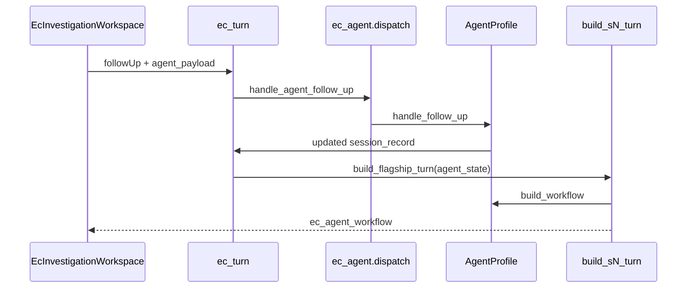

# Experience Center agent workflow template

S4 (`s4_zero_day_no_playbook`) is the **reference** for a governed, multi-phase EC answer:

```text
Plan → Investigate (+ optional HIL) → Findings → Remediation plan → Orchestrate → Verify → Close
```

The UI is driven by a single envelope field: **`ec_agent_workflow`**. Any flagship scenario can adopt the same structure without new frontend code.

## Architecture (two layers)

| Layer | Responsibility | Location |
|-------|----------------|----------|
| **Fixture pack** | Evidence, actions, `_apply()` mutations, analyst copy | `backend/app/demo/fixtures/sN/pack.py` |
| **Agent profile** | Lifecycle FSM, step orchestration, workflow projection | `ec_agent/profiles/sN.py` + scenario modules |

Production `/chat` is never touched. Agent code lives under `app/demo/` only.

## Lifecycle vocabulary (closed set)

Defined in `app/demo/ec_agent/lifecycle.py`:

`PLAN_READY` → `INVESTIGATING` → `INVESTIGATION_NEEDS_APPROVAL` (optional) → `INVESTIGATION_COMPLETE` → `REMEDIATION_PLAN_READY` → `REMEDIATING` → `VERIFYING` → `COMPLETE`

Terminal/alternate: `PARTIAL`, `BLOCKED`, `FAILED`, `CANCELLED`.

## UI contract: `ec_agent_workflow`

Rendered by `frontend/src/components/ec/EcAgentWorkflow.tsx`. Key sections:

| Field | When shown |
|-------|------------|
| `brief`, `action_plan`, `investigation_plan` | `phase === 'plan'` |
| `hil_prompt` | `INVESTIGATION_NEEDS_APPROVAL` |
| `investigation_results`, `investigation_summary`, `investigation_conclusion` | After investigation |
| `next_step_cta` | `INVESTIGATION_COMPLETE` |
| `remediation_plan`, `remediation_results`, `remediation_summary` | Remediation phase |
| `execution_progress` | During investigate/remediate |
| `final_summary`, `verification` | `COMPLETE` / `VERIFYING` |
| `executive_summary` | After `generate_executive_summary` follow-up |

Types: `frontend/src/components/ec/types.ts` → `EcAgentWorkflowPayload`.

## Adding a new agent scenario (checklist)

### 1. Copy the template

```bash
cp -r backend/app/demo/fixtures/_agent_template backend/app/demo/fixtures/sN
```

Implement `agent_config.py`, `investigation_findings.py`, `investigation_state.py`, `remediation_plan.py`.

### 2. Implement orchestration

Either:

- **Extract from S4:** copy patterns from `ec_agent_lifecycle.py` into `fixtures/sN/agent_handler.py`, or
- **Start minimal:** investigation-only lifecycle without HIL/adaptation; add gates incrementally.

Required handler functions (see `AgentProfile` in `ec_agent/types.py`):

- `default_agent_state()` — initial `agent_state` dict with `lifecycle`, selected step ids
- `init_session(session_id, family, scenario_id)`
- `handle_follow_up(...)` — returns updated session record or `None` if not handled
- `build_workflow(agent_state, applied, actions, outcome, …)` — projects `ec_agent_workflow`
- `followups_for_agent_mode(lifecycle, applied)` — conversational chips only (hide orchestration duplicates)

Optional:

- `plan_preread_follow_ups` — auto-applied on turn 0 (e.g. `show_advisory`)
- `finalize_remediation_after_apply` — batch-approve pending `ec_actions` after fixture mints them

### 3. Register the profile

```python
# backend/app/demo/ec_agent/profiles/s5.py
from app.demo.ec_agent.registry import register_agent_profile
from app.demo.ec_agent.types import AgentProfile
# ... import your handlers ...

register_agent_profile(AgentProfile(scenario_id=S5_SCENARIO_ID, ...))
```

Add `from app.demo.ec_agent.profiles import s5 as _s5` to `ec_agent/profiles/__init__.py`.

### 4. Wire the pack

In `build_sN_turn()`:

```python
agent_workflow = build_sN_agent_workflow(
    agent_state=resolved_agent_state,
    applied=applied,
    actions=actions,
    outcome=outcome,
)
use_agent_ui = True
return C.envelope(
    ...,
    chips=agent_chips,
    ec_agent_workflow=agent_workflow,
    ec_agent_lifecycle=str(resolved_agent_state.get("lifecycle")),
    ec_opening_briefing=None if use_agent_ui else opening,
    # suppress legacy panels when use_agent_ui
)
```

`registry.build_flagship_turn` passes `agent_state` automatically for registered profiles.

### 5. Map planner steps to fixture follow-ups

Each investigation/remediation step should declare:

```python
{
    "id": "unique_step_id",
    "follow_up_id": "existing_chip_id",  # or None if bundle_with another step
    "bundle_with": "parent_follow_up_id",  # optional
    "default_selected": True,
    "hil_required": False,
}
```

Compound chips (one UI step → multiple fixture follow-ups) stay in pack `_expand_applied()` — same as S4 `_s4_expand_applied`.

### 6. Findings per step

`finding_for_investigation_step` / `finding_for_remediation_step` return structured objects with:

- `headline_finding`
- `headlines_by_status` — `QUEUED`, `RUNNING`, `COMPLETE` (and `VALIDATED` for plan validation animation)
- `attention_state` — `NORMAL` | `ATTENTION` | `RISK` | …
- `evidence_sources` — drives evidence panel links
- `email_extra` / `ticket_detail` — for `EcRemediationArtifactDialog`

### 7. Tests

Mirror S4:

- `test_sN_zero_day_*.py` — full lifecycle turn sequence
- `test_ec_agent_lifecycle.py` — demo isolation from `/chat`
- Optional polish tests for findings/normalized state

### 8. Frontend

**No scenario id checks required.** If the envelope includes `ec_agent_workflow`, the workspace uses agent mode automatically (`frontend/src/lib/ecAgentWorkflow.ts`).

HIL buttons read `workflow.hil_prompt.approve_follow_up_id` / `skip_follow_up_id` from the payload.

## Dispatch flow



## S4 as reference map

| Concern | S4 module |
|---------|-----------|
| Step definitions | `ec_agent_lifecycle.py` → move to `fixtures/s4/agent_config.py` (future) |
| Orchestration | `handle_s4_agent_follow_up` |
| Workflow projection | `build_s4_agent_workflow` |
| Investigation findings | `fixtures/s4/investigation_findings.py` |
| Normalized spine | `fixtures/s4/investigation_state.py` |
| Remediation artifacts | `fixtures/s4/remediation_plan.py` |
| Profile registration | `ec_agent/profiles/s4.py` |

## Natural next candidates

| Scenario | Why |
|----------|-----|
| **S2** AI prompt injection | Converted — three-question investigation + HIL containment |
| **S7** Conflicting OT evidence | Converted — Splunk vs retired CMDB; no forced incident from Splunk alone |
| **S5** Cisco hardening | Already has phased remediation + HIL actions |
| **S3** Firewall coordination | Email/team coordination maps to artifact dialogs |
| **S1** Splunk investigation | Strong investigation steps; remediation optional |

Start with the smallest lifecycle that proves the pattern (investigation + summary), then add remediation phase.

## Governance reminders

- EC fixtures stay `coe_synthetic_fixture`; no live LLM/MCP on the agent path.
- `execution_eligible=false` on any SPL; actions flow through `ec_actions` HIL.
- Do not add fields to `ExperienceCenterResponse` schema without an explicit plan item.
