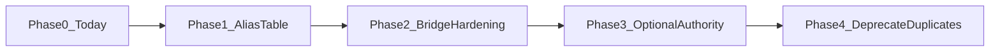

# Stage 3L-S4: Layered Skill Registry Design

**Status:** Design doc only (2026-05-30). **No implementation** in this stage.

## Problem

The AI SOC Assistant currently maintains **three separate vocabularies** that all use the word “skill” but serve different pipeline roles:

| Layer | Example IDs | Canonical source |
|-------|-------------|------------------|
| **Intent** (legacy router) | `attack_discovery`, `spl_generation`, `knowledge_recall`, `alert_summary` | [`backend/app/routing/skills.py`](../backend/app/routing/skills.py) (`SKILL_ENUM`) |
| **Operation** (runtime route plan) | `aggregate_and_rank`, `lookup_correlation`, `threshold_anomaly`, … (10) | [`backend/app/routing/runtime_skill_catalog.py`](../backend/app/routing/runtime_skill_catalog.py) |
| **Stage** (pipeline) | `query_understanding`, `spl_validation`, `context_sufficiency`, `synthesis`, … | [`backend/app/skills/catalog.json`](../backend/app/skills/catalog.json) (`pipeline_stage: true`) |

Early merge would collapse namespaces that today evolve on different lifecycles (router authority vs route-plan validator vs advisory skill chains).

## Why the three layers remain separate today

1. **Different authority** — `/chat` `selected_skill` is intent-only (`route_skill` → `deterministic_router`). Operation `primary_skill` lives on `route_plan_shadow` and promotion gates; stages appear in `selected_skill_chain` for observability only.
2. **ID collision risk** — `catalog.json` uses `spl_generation` as both a routable intent and a pipeline step name in `default_workflow`. Operation IDs (`aggregate_and_rank`) overlap neither namespace cleanly.
3. **Migration in flight** — Stage 3L S3 dual-run keeps legacy router authoritative while operation authority is gated (`route_authority_gate.py`, allowlist, production kill switch).
4. **Closed registries** — Q4 manifest, Q4A promotion, and S6 maps depend on stable operation contracts independent of UI catalog entries (`mitre_mapping`, `investigation_notes` exist in catalog but not in `SKILL_ENUM`).

## Current consumers

### Intent layer

| Consumer | Role |
|----------|------|
| [`deterministic_router.py`](../backend/app/routing/deterministic_router.py) | Keyword rules → `SKILL_ENUM` |
| [`skill_router.py`](../backend/app/routing/skill_router.py) | LLM shadow/assisted routing; governance normalizes to `valid_skill()` |
| [`routes_chat.py`](../backend/app/api/routes_chat.py) | `selected_skill` on response; workflow + SPL gating by intent |
| [`workflow_planner.py`](../backend/app/orchestration/workflow_planner.py) | Blueprints keyed by intent |
| [`output_artifacts.py`](../backend/app/routing/output_artifacts.py) | Intent → artifact tokens |

### Operation layer

| Consumer | Role |
|----------|------|
| [`route_plan_validator.py`](../backend/app/routing/route_plan_validator.py) | Validates `primary_skill`, `operation_type` |
| [`runtime_skill_catalog.py`](../backend/app/routing/runtime_skill_catalog.py) | Per-skill allowlists, slots, preconditions |
| [`intent_to_operation_bridge.py`](../backend/app/routing/intent_to_operation_bridge.py) | Allowed primary skills per legacy intent (shadow) |
| [`manifest_promotion_gates.py`](../backend/app/coverage/manifest_promotion_gates.py) | Promotion checklist vs catalog |
| [`pattern_coverage_v1.json`](../backend/app/coverage/pattern_coverage_v1.json) | Committed `primary_skill` per coverage row |

### Stage layer

| Consumer | Role |
|----------|------|
| [`registry.py`](../backend/app/skills/registry.py) | Loads `catalog.json`; `build_skill_chain()` |
| [`selector.py`](../backend/app/skills/selector.py) | Prepends `query_understanding`, appends `context_sufficiency` |
| [`llm/adapter/schemas.py`](../backend/app/llm/adapter/schemas.py) | Validates `pipeline_stages` against registry |
| Evidence / SPL modules | Named stages in trace and lineage |

## Why early merge is risky

- **Harness and demos** — [`test_harness/harness/interfaces.py`](../test_harness/harness/interfaces.py) duplicates `SKILL_ENUM`; demo scenarios assume four intent routes.
- **Workflow blueprints** — Replacing intent keys with operation IDs breaks `plan_workflow()` without a full replan of Stage 3D steps.
- **False authority** — Merging catalog stages into router skills could imply routable `synthesis` or `answer_guard` before governance allows it.
- **Promotion / coverage** — Q4 rows bind `primary_skill` at operation layer; conflating with intent would blur readiness and SPL policy.

## Proposed future registry shape

Unified registry entries with explicit layering:

```json
{
  "skill_id": "aggregate_and_rank",
  "registry_layer": "operation",
  "display_name": "Aggregate and rank",
  "allowed_operation_types": ["top_n", "aggregate"],
  "routable": false,
  "pipeline_stage": false
}
```

```json
{
  "skill_id": "attack_discovery",
  "registry_layer": "intent",
  "routable": true,
  "legacy_router": true
}
```

```json
{
  "skill_id": "context_sufficiency",
  "registry_layer": "stage",
  "pipeline_stage": true
}
```

A single loader could project views:

- `list_routable_intents()` → today’s `SKILL_ENUM`
- `get_operation_contract(id)` → today’s `RUNTIME_SKILL_CATALOG`
- `list_pipeline_stages()` → today’s `pipeline_stage` entries in `catalog.json`

## Migration approach (phased)



| Phase | Work | `/chat` impact |
|-------|------|----------------|
| 0 | Three registries + S2A bridge + S3 gated authority | None (current) |
| 1 | Generated alias table intent↔operation; CI drift checks | None |
| 2 | Bridge disagreements drive HIL hints only | None |
| 3 | Per-coverage operation authority (allowlist + COE) | `selected_skill` preserved until explicit flip |
| 4 | Retire duplicate IDs in catalog; optional unified loader | Requires COE + harness refresh |

## Backward compatibility

- **`SKILL_ENUM`** remains the compatibility surface for router, harness, and API `selected_skill` until a later stage explicitly replaces it.
- **`valid_skill()` / `validate_skill()`** continue to reject unknown intent strings during LLM-assisted routing.
- **API clients** that send or display four router skills are unchanged through Phase 2.

## `intent_to_operation_bridge`

Today: [`intent_to_operation_bridge.py`](../backend/app/routing/intent_to_operation_bridge.py) evaluates whether a shadow `primary_skill` is allowed for the routed legacy intent. Wired on `route_plan_shadow` only ([S2A design](stage3l_s2_intent_bridge_design.md)). Step 3 authority gate reads bridge status but does not change `selected_skill`.

Future: bridge rules become data-driven from unified registry aliases rather than a static Python map.

## `runtime_skill_catalog.py` as operation authority

Until migration Phase 4:

- All `operation_type` tokens must appear in per-skill allowlists in `runtime_skill_catalog.py`.
- Manifest and Q4A promotion gates reference this catalog as normative.
- No operation ID should be introduced only in `catalog.json` or taxonomy docs without a catalog entry.

## `catalog.json` pipeline preservation

[`build_skill_chain()`](../backend/app/skills/registry.py) behavior must be preserved through migration:

1. Prepend `query_understanding`
2. Append selected routable skill chain from `default_workflow`
3. Append `context_sufficiency`

Stage IDs in `default_workflow` remain **pipeline step names**, not router intents, until workflows are re-keyed deliberately.

## Relationship to Stage 3L neighbors

| Stage | Relationship |
|-------|----------------|
| S5 / S5.2 | Promotion uses operation layer only |
| S6 / S6.2 | 105-Q map links taxonomy pattern → proposed operation; not intent merge |
| S3 Step 3 | Operation authority pilot on allowlisted `coverage_id` only |

## Explicit non-goals (S4)

- **Do not** implement registry merge in this stage
- **Do not** replace `SKILL_ENUM` or change four-skill deterministic router
- **Do not** alter `/chat` `selected_skill` behavior
- **Do not** enable MCP/SPL execution, live LLM synthesis, or Answer Guard via registry unification

## Safety statement

No MCP/SPL execution. No live LLM execution. No route-authority expansion. No `selected_skill` behavior change. Production authority remains disabled by default.
