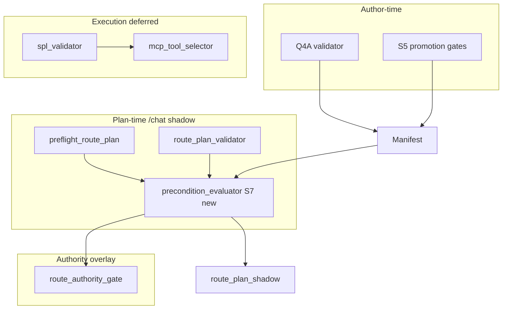

# Stage 3L-S7: Hard Preconditions and Dependency Readiness Design

**Status:** S7 done (2026-05-30). **S7.1** pure evaluator. **S7.2** registry-backed dependency state. **S7.3** shadow + lineage. **S7.4** S5 promotion audit alignment.

**Purpose:** Define how runtime operation `hard_preconditions` and dependency readiness are enforced **before** any future MCP/SPL execution path — without expanding route authority, enabling execution, or changing `/chat` `selected_skill`.

**Normative catalog:** [`backend/app/routing/runtime_skill_catalog.py`](../backend/app/routing/runtime_skill_catalog.py)  
**Prior audit:** [`docs/stage3l_s0_runtime_operation_contract_audit.md`](stage3l_s0_runtime_operation_contract_audit.md) (catalog `hard_preconditions` deferred to S7)

---

## Scope (S7 design vocabulary)

This design uses stable S7 enforcement IDs aligned with catalog intent:

| S7 ID | Meaning |
|-------|---------|
| `template_available` | Approved, non–`sample_only` SPL template resolvable for the route plan / manifest row |
| `evidence_contract_available` | `evidence_contract_ref` exists in closed catalog (or documented blocker when `dependency_missing`) |
| `lookup_available` | Required lookup registry enabled and lookup ref resolvable |
| `lookup_freshness` | IOC registry freshness within policy (not stale/expired) |
| `detection_registered` | Detection family/ref present in detection registry |
| `detection_vetted` | Bound detection has `vetting_status=approved` |
| `source_class_supported` | Requested `source_class` is configured and not marked unavailable |
| `threshold_policy_present` | `threshold_ref` or baseline policy configured when skill/query requires it |
| `time_window_present` | Bounded `time_window` on plan or manifest clarification slots satisfied |
| `primary_fixture_required` | Operation-authoritative migration: standalone primary fixture exists for allowlisted coverage (S3); blocks enrichment-only primaries |

Catalog tokens (e.g. `source_available`, `approved_lookup_available`) remain authoritative in `runtime_skill_catalog.py`; S7 IDs are the **enforcement layer** mapping.

---

## 1. What is already checked today

| S7 ID | Checked today? | Where | Notes |
|-------|----------------|-------|-------|
| `template_available` | **Partial** | Q4A/Q4 promotion gates; template match shadow (render path) | Author-time: unknown/`sample_only` template blocked at promotion. Runtime: `apply_template_match_to_shadow` matches/renders but does not set `cannot_route_missing_template` on preflight. |
| `evidence_contract_available` | **Partial** | `manifest_entry_validator`, Q4A `validator.py`, S5 promotion gates | Manifest/draft only — not re-checked on live `/chat` route plan. |
| `lookup_available` | **Yes** (heuristic + plan) | `route_plan_preflight`, `preflight_ioc_requirements` | Query keywords + `lookup_ref` on plan; registry disabled → `cannot_route_missing_lookup`. |
| `lookup_freshness` | **Yes** | `preflight_ioc_requirements` | Stale/expired registry → `cannot_route_lookup_stale` / `cannot_route_missing_lookup`. |
| `detection_registered` | **Yes** | `preflight_detection_requirements`, `bind_detection` | Unknown family → unbound. |
| `detection_vetted` | **Yes** | `bind_detection`, Q4A validator (`unvetted_detection_ref`) | Runtime preflight uses binder; promotion blocks unvetted refs. |
| `source_class_supported` | **Partial** | `route_plan_preflight._unavailable_required_source` | Keyword→source hints vs `PreflightContext.unavailable_sources`; not full catalog `source_available`. |
| `threshold_policy_present` | **Partial** | Preflight `THRESHOLD_TRIGGERS`; S3 `route_authority_gate` for manifest `clarification_required` | Authority gate checks `threshold_ref` for allowlisted rows only when authority enabled. |
| `time_window_present` | **Partial** | Validator `required_slots`; S3 authority gate `missing_required_time_window` | Slot presence for `route_ready`; authority checks manifest clarification + shadow params. |
| `primary_fixture_required` | **Partial** | `route_authority_gate` | Blocks `entity_context_lookup` / `notable_risk_lookup` as primary; `blocked_detection_dependent` for q007 pattern; not a general fixture catalog yet. |

**Also enforced today (related, not in S7 top-ten list):**

- `route_plan_validator`: `operation_type`, `required_slots`, aggregate/threshold/lookup/detection ref **shapes**, post-enrichment allowlist, sub-invocation composition (S1).
- `route_authority_gate`: allowlist, global kill switch, bridge compatibility, validator blocked statuses, manifest `primary_skill` match.
- `mcp_tool_selector._preflight_review`: legacy intent must be SPL-eligible; `spl_validation.approved` + `normalized_spl` (execution gate — **stays downstream of S7**).

---

## 2. Checked by `route_plan_preflight`

Module: [`backend/app/routing/route_plan_preflight.py`](../backend/app/routing/route_plan_preflight.py)

| S7 ID | Preflight behavior | `route_status` / findings |
|-------|-------------------|---------------------------|
| `lookup_available` | `_required_lookup`, `_preflight_route_plan_lookup_dependency`, `preflight_ioc_requirements` | `cannot_route_missing_lookup`, `missing_slots: [lookup_ref]` |
| `lookup_freshness` | `preflight_ioc_requirements` (staleness) | `cannot_route_missing_lookup`, `cannot_route_lookup_stale` |
| `detection_registered` | `_required_detection`, `_preflight_route_plan_detection_dependency` | `cannot_route_missing_detection` |
| `detection_vetted` | `preflight_detection_requirements` → binder | `cannot_route_missing_detection`, `missing_vetted_detection:*` |
| `source_class_supported` | `_unavailable_required_source` | `cannot_route_missing_source`, `missing_source:*` |
| `threshold_policy_present` | `THRESHOLD_TRIGGERS` when policy flags false in context | `clarification_required`, `missing_threshold_or_baseline_policy` |
| `time_window_present` | Indirect: underspecified suspicious query asks for `time_window` | `clarification_required` |
| Context / entity | `_missing_contextual_slots`, `_missing_entity_specific_slot` | `clarification_required` |
| `template_available` | **Not** | — |
| `evidence_contract_available` | **Not** | — |
| `primary_fixture_required` | **Not** (S3 authority separate) | — |

Preflight is **query- and context-driven**; it does not read catalog `hard_preconditions[]` arrays.

---

## 3. Checked by `route_plan_validator`

Module: [`backend/app/routing/route_plan_validator.py`](../backend/app/routing/route_plan_validator.py)

| S7 ID | Validator behavior | Blocking finding / status |
|-------|-------------------|---------------------------|
| `time_window_present` | `required_slots` includes `time_window` for most skills | `missing_required_slot:time_window` → `blocked_invalid_parameters` |
| `threshold_policy_present` | `threshold_ref` slot presence + `_validate_threshold_parameters` (registry ref shape) | `missing_required_slot:threshold_ref`, `invalid_threshold_ref_structure` |
| `lookup_available` | `lookup_ref` / `match_field` presence + shape | `missing_required_slot:lookup_ref`, `invalid_lookup_ref_structure` |
| `detection_registered` | `detection_ref` presence + shape | `missing_required_slot:detection_ref`, `invalid_detection_ref_structure` |
| `source_class_supported` | `source_class` required slot presence (not env availability) | `missing_required_slot:source_class` |
| Catalog `hard_preconditions` | Field **required** on plan object only | Does **not** evaluate catalog tokens vs runtime state |
| `template_available` | **Not** | Template match is separate (Q1E shadow) |
| `evidence_contract_available` | **Not** | |
| `lookup_freshness` | **Not** | |
| `detection_vetted` | **Not** (shape only) | |
| `primary_fixture_required` | **Not** | |

Validator sets `route_status` to `blocked_invalid_parameters` or `blocked_invalid_composition` when blocking findings exist.

---

## 4. Checked by Q4 / S5 promotion gates

Modules: [`manifest_entry_validator.py`](../backend/app/coverage/manifest_entry_validator.py), [`manifest_promotion_gates.py`](../backend/app/coverage/manifest_promotion_gates.py), [`tools/coverage_authoring/validator.py`](../tools/coverage_authoring/validator.py)

| S7 ID | Promotion / manifest validation | When |
|-------|--------------------------------|------|
| `template_available` | `unknown_template_ref`, `sample_only_template_not_promoted`; gate `template_promotion_policy` / `fixture_template_bound` | Draft + committed manifest audit |
| `evidence_contract_available` | `unknown_evidence_contract_ref`; `dependency_missing` + blockers | Draft + committed |
| `lookup_available` | `unknown_lookup_ref` | Draft |
| `detection_registered` | `unknown_detection_ref` | Draft |
| `detection_vetted` | `unvetted_detection_ref` | Draft |
| `threshold_policy_present` | Indirect via `clarification_required` on manifest row + route plan shape | Committed row integrity |
| `time_window_present` | Indirect via `clarification_required` / route plan fields in entry | Committed row |
| Governance | All execution flags must be false | S5 `governance_flags_false` |

**Not in promotion gates:** live lookup staleness, runtime source availability, primary fixture catalog, catalog `hard_preconditions` cross-walk.

---

## 5. Currently descriptive only

| Item | Location | Risk if left descriptive |
|------|----------|-------------------------|
| Catalog `hard_preconditions[]` per skill | `runtime_skill_catalog.py` | Plan can be `route_ready` while catalog says `vetted_detection_available` but detection registry off |
| `purpose`, `optional_slots`, `examples` | Catalog | Low — documentation |
| Plan field `hard_preconditions: []` | LLM/shadow candidates | Always empty; no sync with catalog |
| `template_available` at route time | — | Sample template could match in shadow while promotion blocked |
| `evidence_contract_available` at route time | — | Manifest ref validated only at author time |
| `source_available` / full source catalog | Catalog token | Preflight only checks keyword hints + unavailable list |
| `primary_fixture_required` (general) | S3 partial blocks | Enrichment-only skills not generalized to precondition engine |
| `cannot_route_missing_template` | `route_authority_gate.BLOCKED_ROUTE_STATUSES` | **Reserved** — status exists in gate list; preflight does not emit it yet |

---

## 6. Future ownership (proposed)



| S7 ID | Future owner module | Phase |
|-------|---------------------|-------|
| `template_available` | `app.routing.precondition_evaluator` + reuse `get_spl_template` / template matcher | S7.1 plan-time |
| `evidence_contract_available` | `precondition_evaluator` + `promotion_registry_snapshot` | S7.1 |
| `lookup_available` | Extend `route_plan_preflight` / delegate to `precondition_evaluator` | S7.1 unify |
| `lookup_freshness` | `app.intel.ioc_lookup` (called from evaluator) | S7.1 |
| `detection_registered` | `app.detections.detection_binder` (called from evaluator) | S7.1 |
| `detection_vetted` | Same binder | S7.1 |
| `source_class_supported` | `precondition_evaluator` + configured source registry (new or extend `PreflightContext`) | S7.2 |
| `threshold_policy_present` | Union: preflight triggers + manifest `clarification_required` + evaluator | S7.1 |
| `time_window_present` | Validator slots + evaluator + authority gate (allowlisted only) | S7.1 |
| `primary_fixture_required` | `route_authority_gate` + coverage manifest metadata (`primary_fixture_status`) | S7.3 with S3 |

**Design rule:** One canonical evaluator (`precondition_evaluator.py`) maps catalog `hard_preconditions[]` → S7 IDs → existing helpers (`preflight_ioc_requirements`, `preflight_detection_requirements`, template registry, evidence catalog). Preflight and validator **call** evaluator results instead of duplicating heuristics long-term.

---

## 7. Fallback / `cannot_route` reasons

### Existing `RouteStatus` values (keep)

From [`route_plan_models.py`](../backend/app/routing/route_plan_models.py):

- `clarification_required`
- `cannot_route_missing_lookup`
- `cannot_route_missing_detection`
- `cannot_route_missing_source`
- `blocked_invalid_parameters`
- `blocked_invalid_composition`

### New S7 precondition findings (proposed)

Emit on `route_plan_shadow` as `route_status` + `blocking_findings` (and mirror in `precondition_evaluation` block):

| S7 ID | Proposed `route_status` | `blocking_findings` token |
|-------|-------------------------|---------------------------|
| `template_available` | `cannot_route_missing_template` | `precondition_template_unavailable`, `sample_only_template` |
| `evidence_contract_available` | `blocked_invalid_parameters` | `precondition_evidence_contract_missing` |
| `lookup_available` | `cannot_route_missing_lookup` | *(existing tokens)* |
| `lookup_freshness` | `cannot_route_missing_lookup` | `cannot_route_lookup_stale`, `lookup_expired` |
| `detection_registered` | `cannot_route_missing_detection` | `missing_configured_detection`, `unknown_family` |
| `detection_vetted` | `cannot_route_missing_detection` | `unvetted_detection_only` |
| `source_class_supported` | `cannot_route_missing_source` | `missing_source:{source_class}` |
| `threshold_policy_present` | `clarification_required` | `missing_threshold_or_baseline_policy`, `missing_required_threshold_ref` |
| `time_window_present` | `clarification_required` or `blocked_invalid_parameters` | `missing_required_slot:time_window`, `missing_required_time_window` |
| `primary_fixture_required` | `blocked_invalid_parameters` | `blocked_primary_fixture_absent`, `blocked_detection_dependent` |

**Authority fallbacks (unchanged, S3):** `global_kill_switch_disabled`, `coverage_id_not_allowlisted`, `bridge_incompatible`, `validator_blocked`, `manifest_primary_skill_mismatch`, etc. — see [`route_authority_gate.py`](../backend/app/routing/route_authority_gate.py).

**Clarification vs cannot_route:** Missing analyst-supplied slots (`threshold_ref`, `time_window`, `notable_id`) → `clarification_required`. Missing platform/registry dependencies → `cannot_route_*`.

---

## 8. Required tests (implementation stage)

| Area | Test module (proposed) | Cases |
|------|------------------------|-------|
| Evaluator matrix | `test_precondition_evaluator_stage3l_s7.py` | Each catalog `hard_precondition` token maps to pass/fail for synthetic plan + context |
| Preflight union | Extend `test_route_plan_stage3k_r1.py`, `test_ioc_lookup_stage3k_q2.py`, `test_detection_binding_stage3k_q3.py` | Stale IOC, disabled registry, unvetted detection → expected `route_status` |
| Validator + preconditions | `test_route_plan_contract_stage3l_s7.py` | `route_ready` impossible when evaluator fails |
| Manifest cross-check | Extend `test_pattern_coverage_pack_stage3k_q4.py` | Promoted row fails evaluator when registry fixture removed |
| Authority interaction | Extend `test_route_authority_gate_stage3l_s3_3a.py` | Authority not applied when precondition failed; `selected_skill` preserved |
| Template | Extend template match / promotion tests | `sample_only` → `cannot_route_missing_template` at plan time |
| No execution | Existing MCP/SPL tests | Preconditions run **before** `mcp_tool_selector`; execution flags still false |
| Regression | Full backend pytest + harness 6/6 | No `/chat` `selected_skill` change |

**CI gate (optional):** `tools/coverage_authoring/check_precondition_catalog.py` — every `hard_preconditions[]` entry in `RUNTIME_SKILL_CATALOG` has a registered S7 evaluator handler.

---

## 9. Deferred to MCP / Splunk execution-readiness

S7 stops at **plan sufficiency** and **dependency readiness** on the shadow/manifest path. The following remain **downstream** (not S7):

| Concern | Owner today | Why deferred |
|---------|-------------|--------------|
| SPL syntax/policy approval | `spl_validator`, `normalized_spl` | Execution-time; requires approved candidate SPL |
| MCP server available | `mcp_tool_selector`, registry status | Connector readiness, not operation precondition |
| MCP tool allowlist / SAIA block | `mcp_tool_selector`, discovery | Tool policy |
| `MCP_GLOBAL_EXECUTION_ENABLED` | Config + HIL | Explicit execution gate |
| Mock/real Splunk search | MCP adapter | No Splunk writes in current stage |
| Index/sourcetype live reachability | Splunk-side | COE environment truth; out of repo validators |
| Lookup **match** at search time | Splunk + IOC table content | S7 only requires registry fresh + ref bound |
| Detection SPL **execution** | Detection binding metadata | S7 requires vetted ref, not running detection |
| Human approval workflow | `human_review` | Post-precondition, pre-execution |
| Renderer / `candidate_spl_visible` | S2B consumers | Out of scope per Track E |

**Ordering (future):**

```text
precondition_evaluator (S7) → route_plan_validator → route_authority_gate (optional)
  → template match / SPL generation → spl_validator → mcp_tool_selector → MCP execute
```

---

## Implementation phases

| Phase | Status | Deliverable |
|-------|--------|-------------|
| **S7.1** | **Done** | [`precondition_evaluator.py`](../backend/app/routing/precondition_evaluator.py) + [`test_precondition_evaluator_stage3l_s7.py`](../backend/app/tests/test_precondition_evaluator_stage3l_s7.py) — explicit `HardPreconditionDependencyState` only; no registry I/O |
| **S7.2** | **Done** | [`precondition_dependency_state.py`](../backend/app/routing/precondition_dependency_state.py) + [`test_precondition_dependency_state_stage3l_s7.py`](../backend/app/tests/test_precondition_dependency_state_stage3l_s7.py) — closed-world registry/manifest snapshots; tests call `evaluate_hard_preconditions()` only |
| **S7.3** | **Done** | [`precondition_evaluation_shadow.py`](../backend/app/routing/precondition_evaluation_shadow.py) + [`test_precondition_evaluation_shadow_stage3l_s7.py`](../backend/app/tests/test_precondition_evaluation_shadow_stage3l_s7.py) — `route_plan_shadow.precondition_evaluation` + lineage `hard_preconditions`; no `selected_skill` / execution change |
| **S7.4** | **Done** | [`manifest_precondition_alignment.py`](../backend/app/coverage/manifest_precondition_alignment.py) — S5 audit embeds `precondition_alignment`; documented gaps for COE sample templates |

S7.1 API: `evaluate_hard_preconditions(route_plan, dependency_state)` → `preconditions_checked`, `preconditions_passed`, `preconditions_failed`, `dependency_readiness`, `route_status`, `blocking_findings`.

S7.2 API: `build_hard_precondition_dependency_state(route_plan, coverage_entry=None, settings=None)` → `HardPreconditionDependencyState` derived from template registry, evidence contracts, IOC registry metadata (incl. staleness), detection registry/vetting, `APPROVED_SOURCE_CLASS_HINTS`, manifest `clarification_required`, and plan slots (`threshold_ref`, `time_window`). No MCP/Splunk reachability, no live LLM.

### Leadership policy — COE sample rows (`q002`, `q017`, `q046`)

**Decision (2026-05-30):** Keep manifest `expected_route_status: route_ready` for COE/demo sample-template rows. Do **not** change to `cannot_route_missing_template` yet.

| Layer | Role |
|-------|------|
| Manifest / Experience Center | Governed sample coverage; demo story stays `route_ready` |
| S7 evaluator | Production dependency truth — `sample_only` template → `cannot_route_missing_template` |
| S7.4 audit | `documented_gap` (`coe_fixture_sample_template_blocks_s7`), **not** `drift` |

When production-ready templates land, update `readiness` and `expected_route_status` together — not before.

---

## Hard boundaries (this stage)

- No MCP/SPL execution.
- No live LLM execution.
- No route-authority expansion (no second allowlist ID; production authority off by default).
- No `selected_skill` behavior change.
- Design doc only — no code changes in S7 design commit.

---

## Safety statement

No MCP/SPL execution. No live LLM execution. No route-authority expansion. No selected_skill behavior change. Production authority remains disabled by default.

---

## Related docs

- [stage3l_s0_runtime_operation_contract_audit.md](stage3l_s0_runtime_operation_contract_audit.md)
- [stage3l_s1_validator_spec.md](stage3l_s1_validator_spec.md)
- [stage3l_s3_step3_coverage_gate_design.md](stage3l_s3_step3_coverage_gate_design.md)
- [stage3l_s5_q4a_promotion_workflow.md](stage3l_s5_q4a_promotion_workflow.md)
- [plans/STAGE_3L_S0_TO_S8_SPINE.md](../plans/STAGE_3L_S0_TO_S8_SPINE.md)
