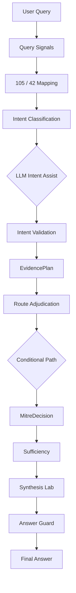
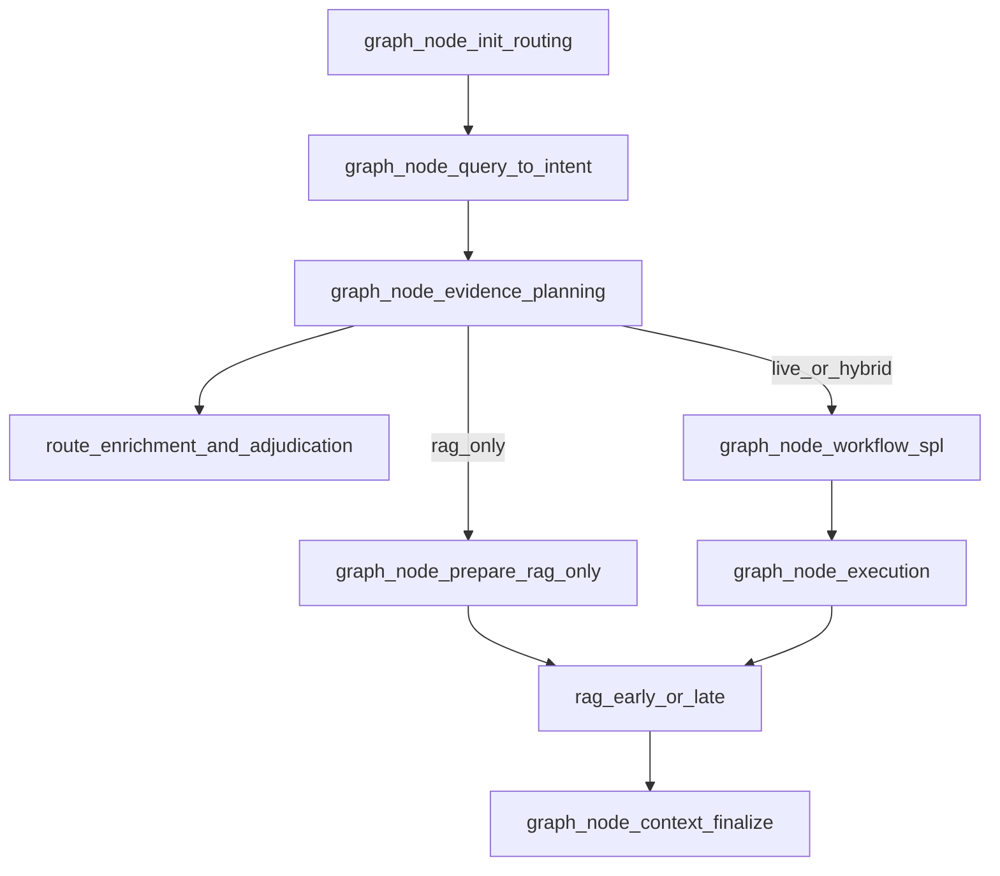

# Chat Control Plane — Master Implementation Plan

**Created:** 2026-06-02  
**Status:** Approved for implementation  
**Canonical for:** COE review, agent execution, commit sequencing  

> **Single plan only.** This file is the **only** implementation spec for the chat control plane. Do not use or extend separate Cursor plans (`control_plane_agent_guide_*.plan.md`, `control_plane_plan_amendments_*.plan.md`, etc.) — all amendments and agent steps live here.

**Related:** [`docs/gap_closure/current_query_to_answer_workflow.md`](../docs/gap_closure/current_query_to_answer_workflow.md), [`plans/STAGE_3K_Q1C_TO_Q4_SPINE.md`](STAGE_3K_Q1C_TO_Q4_SPINE.md)

**Agents:** Read this file end-to-end before coding. One commit per phase unless COE approves bundling. Run verification commands in [§ Verification (phase-scoped)](#verification-phase-scoped) after each commit.

### Table of contents

| § | Section |
|---|---------|
| — | [Agent quick start](#agent-quick-start) |
| 1 | [Objective](#1-objective) |
| 1.1 | [Remaining work (KB, templates, preconditions, MITRE promote, FE trace)](#11-remaining-work-besides-live-mcp--live-llm-synthesis) |
| 1.2 | [Completable in-repo (without live MCP / LLM)](#12-what-we-can-complete-in-repo-without-live-mcp--llm) |
| 1.3 | [Execute now (1B-b + KB + env)](#13-execute-now-user-approved--do-not-wait-for-coe-on-1b-b) |
| 2 | [Implementation status](#2-implementation-status) |
| 2b | [Implementation tracker (all commits)](#implementation-tracker-all-commits) |
| 3 | [Authority hierarchy](#3-authority-hierarchy-mandatory) |
| 4 | [Hard boundaries](#4-hard-boundaries-every-commit) |
| 5 | [Target pipeline](#5-target-pipeline-graph-nodes) |
| 6 | [New file tree](#6-new-file-tree-all-phases) |
| — | [Phases 0–11](#phase-0--freeze-baseline-commit-0) |
| — | [Commit sequence](#commit-sequence) |
| — | [Verification (phase-scoped)](#verification-phase-scoped) |
| — | [Risk register](#risk-register) |
| 3.2 | [Route adjudication tie-breaker](#32-route-adjudication-tie-breaker-resolves-intent-vs-exact-105-conflict) |
| — | [Appendices](#appendix--existing-code-to-reuse-do-not-duplicate) |
| — | [Plan hygiene (rag_only + baseline xfail)](#appendix--plan-hygiene-rag_only-path--baseline-xfail) |

---

## Agent quick start

| Question | Answer |
|----------|--------|
| What is done? | **Commit 1B-a** — MITRE schema, loader, audit, 11 tests ([`mitre_registry_enrichment.py`](../backend/app/threat/mitre_registry_enrichment.py), etc.) |
| What is next? | **Commit 0** — baseline xfail tests **before** Commits 1/1A/2 change `/chat` flow |
| What flag gates rollout? | `CONTROL_PLANE_ENABLED` (add in Commit 1, default `false`) |
| Where is MITRE data? | DRAFT JSONs under [`docs/input/mitre_enrichment/`](../docs/input/mitre_enrichment/) until optional Commit 1B-b |
| What must never happen? | Live MCP, live Foundation-Sec synthesis, execute `candidate_spl`, LLM→MCP, keyword intent overrides after 1A |

**Execution order (mandatory):**

```text
DONE:  1B-a
NEXT:  0  →  1  →  1A  →  1B-b (conditional)  →  2  →  3  →  4  →  5  →  6  →  7  →  8  →  9  →  10  →  11
```

Do **not** start with 1B-b unless COE explicitly prioritizes MITRE runtime merge over baseline.

---

## 1. Objective

Move live `/chat` from:

```text
User query → legacy skill route → SPL/MCP path → late RAG → placeholder/lab answer
```

To:

```text
User query
  → Query signals
  → 105 / 42 candidate mapping
  → Intent classification (+ optional LLM intent assist)
  → Intent validation
  → EvidencePlan
  → Route adjudication
  → Conditional RAG / SPL / MCP / MITRE
  → Sufficiency
  → Synthesis (lab only)
  → Answer Guard (lab only)
  → Final answer
```

**Out of scope until explicitly approved:** live MCP adapter, live Foundation-Sec final synthesis, executing `candidate_spl`, LLM direct MCP tool calling.

### 1.1 Remaining work besides live MCP / live LLM synthesis

Phases **0–11** deliver **control-plane logic** (intent → evidence plan → conditional paths → trace). They do **not** by themselves complete product readiness. Track these **in parallel**; do not block Phase 0–7 code merges on them unless a phase explicitly depends on a gate.

| Area | What “done” means for the control plane | Owner / gate | Plan touchpoint |
|------|----------------------------------------|--------------|-----------------|
| **KB / content completeness** | Escalation/SOP/playbook queries retrieve real policy text; `rag_no_match` is rare for golden policy rows | COE / content: SOC-KB corpus, doc types (`sop`, `runbook`, `escalation_matrix`), embeddings/index | Phase 3 `rag_no_match`; env `SOC_KB_RETRIEVAL_ENABLED` ([`config.py`](../backend/app/config.py)); [`retrieve_soc_kb`](../backend/app/knowledge/soc_kb_retriever.py) |
| **SPL template coverage for slot binding** | Use cases used in hybrid/live golden tests have `default_spl_template` (or registry template) with slots for 24h, exclude service accounts, top N | COE / detection engineering: [`catalog.json`](../backend/app/use_cases/catalog.json), [`template_registry`](../backend/app/spl/template_registry.py) | Phase 6 — validator can only bind constraints **into** templates that exist |
| **Source / precondition readiness** | `precondition_evaluation` in shadow/route plan reflects real lookup/MCP **readiness** (not live execution); failed preconditions block tool selection with clear HIL | COE + connector config: MCP registry status, precondition shadow ([`precondition_evaluation_shadow`](../backend/app/routing/precondition_evaluation_shadow.py), [`precondition_dependency_state`](../backend/app/routing/precondition_dependency_state.py)) | Phase 4–5 adjudication + validator; execution stays gated |
| **Promoted MITRE runtime data** | `mitre_registry` fields live in runtime 105/42 JSON, not only DRAFT paths | **COE sign-off** on DRAFT files + audit exit 0 → Commit **1B-b** script | Phase 1B-b; until then loader reads DRAFT only (1B-a) |
| **Frontend trace polish** | If `control_plane_trace` / new response fields are exposed in UI: types, collapsed “technical trace”, no secret leakage | Frontend when Phase 9 ships | [`frontend/src/types/api.ts`](../frontend/src/types/api.ts), trace components; `npm run build` |

**Agent rule:** Implement phases with **stubs/fixtures/tests** where content is missing; document gap in commit message and Phase 11 docs. Do **not** expand SOC-KB corpus, rewrite all SPL templates, or enable live MCP as a side effect of control-plane commits.

**Golden / demo expectations until dependencies land:**

- Policy golden (#1, #7) may stay `insufficient_evidence` or partial KB until escalation content is indexed — control plane should still enforce `rag_only`, no SPL/MCP, no visible MITRE.
- Hybrid golden (#2, #6) may keep `spl_validation` rejections until templates encode slots — Phase 6 should **fail closed** (reject), not invent SPL.
- MITRE visibility tests use DRAFT loader (1B-a) until 1B-b promote; runtime parity tests wait for COE.

### 1.2 What we can complete in-repo (without live MCP / LLM)

| Area | Completable now? | What the team can do | Still needs COE / prod |
|------|------------------|----------------------|----------------------|
| **KB / content** | **Partial** | Enable `SOC_KB_RETRIEVAL_ENABLED=true` in dev `.env`; fixtures already include `escalation_matrix` + auth SOP entries ([`fixtures/soc_kb_*.json`](../backend/app/knowledge/fixtures/)). **Add 1–2 fixture entries** with `retrieval_hints` / `positive_examples` for policy golden strings (`repeated failed login alerts`, `when should … be escalated`) so Phase 3/10 can pass KB match in CI. | Production KB import, customer corpus, embeddings at scale |
| **SPL templates + slots** | **Partial** | Phase **6** validator + extend [`templates.json`](../backend/app/spl/templates.json): e.g. new `auth_failed_login_top_users_24h` with `render_pattern` slots `{earliest}`, `{latest}`, `{result_limit}`, `{exclude_service_accounts_filter}`; point hybrid golden use case at it in catalog. Reuse patterns from `sample_auth_failed_login_top_users_tstats` (already has `{earliest}` / `{result_limit}`). | SCD field names, index/sourcetype truth for customer Splunk |
| **Source / preconditions** | **Yes (logic)** | Wire existing [`precondition_evaluation_shadow`](../backend/app/routing/precondition_evaluation_shadow.py) into adjudication trace; surface registry MCP `configured` / `available` / blocked tool status in `control_plane_trace` (no live execution). Tests with mock registry. | Real Splunk MCP URL, auth, COE tool allowlist for production |
| **MITRE runtime promote** | **Partial** | **Implement** `scripts/promote_mitre_registry_to_runtime.py` + `--dry-run` (Commit 1B-b code); audit already passes for DRAFT. Dev can keep DRAFT-only loader. | **COE sign-off** before running promote against committed runtime JSON |
| **Frontend trace** | **Yes (with Phase 9)** | Types for `control_plane_trace`, `evidence_plan`, `route_adjudication` in [`api.ts`](../frontend/src/types/api.ts); render nested under existing collapsed “technical trace” (same pattern as `governance_trace`). Redact secrets. | Design review if layout changes |

**Recommended parallel track (can start before Phase 10):**

1. **Dev KB fixtures** — policy escalation hints (small JSON edit + retrieval test).
2. **1B-b script only** — dry-run promote; do not commit runtime JSON until COE approves.
3. **Slot template** — one hybrid-capable template for golden #2 / #6 (Phase 6 dependency).

**Phases 0–11 remain the main line;** items above are additive and do not replace Commit 0 → 1A → …

### 1.3 Execute now (user-approved — do not wait for COE on 1B-b)

**Status:** Spec ready; **implementation blocked in Plan mode** — switch to **Agent mode** and run this checklist.

| Step | Action | Verify |
|------|--------|--------|
| A | Create [`scripts/promote_mitre_registry_to_runtime.py`](../scripts/promote_mitre_registry_to_runtime.py) (promote DRAFT → runtime JSON, `--dry-run`) | `python3 scripts/promote_mitre_registry_to_runtime.py --dry-run` |
| B | Run promote (writes files) | `python3 scripts/promote_mitre_registry_to_runtime.py` → 105/105 questions, 42/42 use cases |
| C | Update [`mitre_registry_enrichment.py`](../backend/app/threat/mitre_registry_enrichment.py): prefer runtime row when `mitre_registry` present, else DRAFT | `pytest app/tests/test_mitre_registry_enrichment.py -q` |
| D | Add KB fixture entry `coe-policy-failed-login-escalation` in [`soc_kb_entries.json`](../backend/app/knowledge/fixtures/soc_kb_entries.json) (hints below) | retrieval test / manual `/chat` |
| E | Dev flags in [`.env`](../.env) (see table) — **do not** set `CONTROL_PLANE_ENABLED=true` until Phases 1–3 wired | `grep SOC_KB .env` |
| F | Document in `.env.example` under “Dev experience / control plane” | — |
| G | Mark tracker row **1B-b** Done after B+C | audit + pytest |

**Promote script behavior:** For each DRAFT `id`, merge `mitre_registry` + normalized `mitre_permitted` / `mitre_candidate` / `mitre_blocked` / visibility into [`question_runtime_map_v1.json`](../backend/app/coverage/question_runtime_map_v1.json) (`question_ref`) and [`catalog.json`](../backend/app/use_cases/catalog.json) (`use_case_id`). Use `normalize_legacy_mitre_fields` from enrichment module.

**Loader precedence after promote:** `registry_mitre_metadata()` → runtime JSON if `entry.mitre_registry` dict exists → else DRAFT paths (current 1B-a).

**KB fixture (copy into `soc_kb_entries.json`):**

```json
{
  "entry_id": "coe-policy-repeated-failed-login-escalation",
  "doc_id": "coe-escalation-auth-v1",
  "doc_version": "1.0",
  "collection_id": "escalation_matrix",
  "title": "Repeated failed login alert escalation",
  "section_id": "ESC-AUTH-002",
  "section_title": "Failed login escalation policy",
  "entry_type": "escalation",
  "source_excerpt": "Escalate repeated failed login alerts when volume, privileged accounts, success-after-failure, or external-source spread exceeds SOC thresholds. Cite escalation matrix before closing as benign.",
  "source_refs": ["coe_escalation_auth_sample.md#ESC-AUTH-002"],
  "citation": "COE Sample Auth Escalation Matrix v1.0 ESC-AUTH-002",
  "retrieval_hints": [
    "escalation policy",
    "repeated failed login alerts",
    "when should repeated failed login alerts be escalated",
    "failed login escalation",
    "brute force escalation"
  ],
  "synonyms": ["login failure escalation", "auth alert escalation"],
  "positive_examples": [
    "What is the escalation policy for repeated failed login alerts?",
    "When should repeated failed login alerts be escalated?"
  ],
  "status": "published",
  "approval_status": "coe_reviewed",
  "retrieval_backend": "deterministic",
  "tags": ["escalation", "policy", "failed_login", "auth"]
}
```

**Dev `.env` flags (enable for unrestricted local dev; production stays gated):**

| Variable | Dev value | Notes |
|----------|-----------|--------|
| `SOC_KB_RETRIEVAL_ENABLED` | `true` | Already set in many dev `.env` files |
| `RAG_MODE` | `mock` | Fixture KB |
| `MCP_GLOBAL_EXECUTION_ENABLED` | `true` | Mock path only |
| `MCP_SERVER_MOCK_EXECUTION_ENABLED` | `true` | Required with global execution |
| `CONTROL_PLANE_ENABLED` | `false` | Set `true` only after Commit 3 lands |
| `AI_SOC_LLM_FINAL_SYNTHESIS_ENABLED` | per lab | Inert for prod path per stage boundaries |

Add to [`config.py`](../backend/app/config.py) when starting Commit 1: `control_plane_enabled: bool = False` (env `CONTROL_PLANE_ENABLED`).

**1B-b COE gate:** Waived for promote **execution** per product owner request; DRAFT content still subject to COE review before production cutover.

---

## 2. Implementation status

| Phase | Commit | Status | Notes |
|-------|--------|--------|-------|
| 0 | Baseline xfail tests | Done | Six `/chat` baseline anchors xfail after schema checks |
| 1 | Control contracts | Done | `EvidencePlan`, `RouteAdjudication`, `ToolPlan`; `CONTROL_PLANE_ENABLED=false` |
| 1A | Query-to-intent engine | **Done** | 12 unit tests |
| **1B-a** | MITRE loader + audit | **Done** | Reads DRAFT JSONs only |
| 1B-b | Promote MITRE to runtime JSON | Pending (conditional) | Script only, after audit green + COE sign-off |
| 2 | Evidence planner | Pending | Consumes `IntentClassification` only |
| 3 | RAG-first branching | Pending | `rag_no_match`, hard gates |
| 4 | Route adjudication | Pending | Intent > registry |
| 5 | LLM plan validator | Pending | Advisory JSON only |
| 6 | SPL slot binding | Pending | User constraint encoding |
| 7 | Runtime MITRE decision | Pending | Wire `pipeline.py` |
| 8 | Synthesis honesty | Pending | `response_mode`, `synthesis_mode` |
| 9 | Unified trace | Pending | `control_plane_trace` |
| 10 | Golden E2E tests | Pending | `CONTROL_PLANE_ENABLED=true` |
| 11 | Docs | Pending | Workflow + spine + baseline |

**Rollout:** `CONTROL_PLANE_ENABLED=false` until Phase 10 golden tests pass with flag on.

### Next commit (after 1B-a)

1. **Commit 0** — [`test_current_chat_runtime_baseline.py`](../backend/app/tests/test_current_chat_runtime_baseline.py): six queries; `chat()` + shape asserts must pass; **xfail only on behavioral snapshot** (see Phase 0); **no behavior fixes**.
2. Then Commit 1 (contracts + flag), then 1A (query-to-intent).

### Implementation tracker (all commits)

Use this checklist in order. Mark **Done** only after that phase’s agent checklist and verification pass.

| Order | Commit | Deliverable | Status |
|-------|--------|-------------|--------|
| — | **1B-a** | MITRE schema, loader, audit, 11 tests, stub `mitre_decision` | **Done** |
| 1 | **0** | `test_current_chat_runtime_baseline.py` (6 xfail, no prod changes) | **Done** |
| 2 | **1** | `chat/contracts/*`, `CONTROL_PLANE_ENABLED`, response stubs | **Done** |
| 3 | **1A** | `query_signals`, `intent_classifier`, 12 tests, `graph_node_query_to_intent` | Done |
| 4 | **1B-b** | `promote_mitre_registry_to_runtime.py` + runtime loader precedence | **Execute per §1.3** (COE sign-off waived for promote) |
| 5 | **2** | `evidence_planner.py`, `graph_node_evidence_planning` | Pending |
| 6 | **3** | RAG-only / hybrid branching, `rag_no_match`, `test_evidence_plan_rag_only_skip.py` | Pending |
| 7 | **4** | `route_adjudication.py`, effective_skill from adjudication | Pending |
| 8 | **5** | `llm_plan_validator.py` | Pending |
| 9 | **6** | `spl_slot_binding_validator.py` | Pending |
| 10 | **7** | Full `mitre_decision` + flag-gated pipeline wire-up | Pending |
| 11 | **8** | `response_mode`, `synthesis_mode` honesty | Pending |
| 12 | **9** | `control_plane_trace.py` | Pending |
| 13 | **10** | `test_chat_control_plane_golden.py` (7 queries, flag on) | Pending |
| 14 | **11** | Docs: workflow, spine, regression baseline | Pending |

**Rollout rule:** Keep `CONTROL_PLANE_ENABLED=false` in production until row **10** (Phase 10) passes with flag on in CI/local golden run.

### Parallel dependencies (not commit numbers — track with COE)

| Dependency | Blocks full “query→answer” quality? | Blocks control-plane merge? |
|------------|-------------------------------------|-----------------------------|
| KB / content completeness | Yes for policy answers | No — merge with `rag_no_match` handling |
| SPL template + slot coverage | Yes for hybrid SPL quality | No — Phase 6 fail-closed |
| Source / precondition readiness | Yes for MCP path clarity | No — mock/registry status sufficient |
| MITRE runtime promote (1B-b) | Trace/registry parity in prod JSON | No — DRAFT loader OK for dev |
| Frontend trace polish | Analyst UX only | No — optional with Phase 9 |

---

## 3. Authority hierarchy (mandatory)

```text
Registry mappings (105 / 42 / keyword router)  →  candidates only
IntentClassification                         →  first authority on user goal
EvidencePlan                                 →  tool path (RAG / SPL / MCP / MITRE)
RouteAdjudication                            →  final effective skill + use_case_id
MitreRegistryMetadata                        →  pre-mapped permitted / candidate / blocked
MitreDecision                                →  runtime visibility + supported/candidate/blocked
```

**MITRE:** Registry rows are **metadata not evidence**. Runtime MITRE in the analyst answer requires `mitre_decision.py` + intent + evidence. Policy questions must not show MITRE even if the 105 row lists `T1110.001`.

**Do not implement one-off fixes** (e.g. only “failed login + policy”). Same rules apply to DGA playbook, phishing escalation, malware SOP, brute-force steps, escalation without the word “policy”.

### 3.1 Anti-patterns (agents must not do this)

| Anti-pattern | Correct approach |
|--------------|------------------|
| Re-parse user text for “failed login”, “policy”, “SOP” in evidence planner | Use `IntentClassification` + `answer_goal` only |
| Re-classify intent in `adjudicate_route()` from keywords | Consume `IntentClassification`, `EvidencePlan`, registry candidates |
| Show registry MITRE on policy questions because row has `T1110.001` | Phase 7: `answer_visible=false` when `mitre_mapping` not in `answer_goal` |
| Replace `resolve_mitre_mappings_for_chat` unconditionally | Flag-gated: legacy path when `CONTROL_PLANE_ENABLED=false` |
| Hand-edit 105/42 JSON for 1B-b | Use `scripts/promote_mitre_registry_to_runtime.py` after COE approval |
| Fix baseline xfail tests by changing routing | Baseline documents wrong behavior; new phases fix under flag |

### 3.2 Route adjudication tie-breaker (resolves intent vs exact-105 conflict)

Implementers must use this **ordered precedence** in `adjudicate_route()` (first matching rule wins; record `authority_source` + `reason`):

| Priority | Condition | `final_skill` / use_case |
|----------|-----------|---------------------------|
| 1 | `intent_classification.requires_clarification` | Clarification / HIL route; no SPL/MCP |
| 2 | `evidence_plan.answer_mode == rag_only` OR `spl_allowed=false` and `mcp_allowed=false` | `knowledge_recall` (or existing SOP skill); ignore analytics template |
| 3 | High-confidence policy intent (`intent_family` in `policy_knowledge`, `sop_or_playbook`, `knowledge_only` AND `confidence_band == high`) | Intent skill over `legacy_skill_hint` and over failed-login 105 row |
| 4 | `candidate_mappings.match_path` in `exact_105_question`, `exact_105_plus_use_case_catalog` AND intent compatible (`live_investigation`, `spl_generation_only`, `hybrid_investigation_plus_policy`, `mitre_mapping`) | Preserve `mapped_question_ref` + catalog `use_case_id` from QU |
| 5 | `EvidencePlan` hybrid/live | Skill from intent + registry candidates, not keyword router alone |
| 6 | Default | Deterministic `route_skill` + shadow corrections via validator |

**Explicit conflict rule:** When priority **3** and **4** both apply (exact 105 failed-login row vs high-confidence policy intent), **priority 3 wins**. Set `authority_source: intent_over_exact_105`. Registry 105/42 remain **candidates** for trace and MITRE metadata, not automatic execution route.

---

## 4. Hard boundaries (every commit)

1. Do not enable live MCP execution adapter.
2. Do not enable live Foundation-Sec final synthesis (`AI_SOC_LLM_FINAL_SYNTHESIS_ENABLED` stays inert for production path).
3. Do not execute `candidate_spl`.
4. Do not let LLM call MCP directly.
5. Do not change Experience Center / demo golden answers unless a phase explicitly requires it.
6. Registry MITRE is not observed evidence.

---

## 5. Target pipeline (graph nodes)

**Today** ([`backend/app/chat/pipeline.py`](../backend/app/chat/pipeline.py)):

```text
init_routing → shadow_enrichment → workflow_spl → execution → context_finalize
                                                              └─ RAG here (late)
```

**Target** (imperative + LangGraph parity in [`chat_workflow.py`](../backend/app/graph/chat_workflow.py)):

```text
init_routing                    # understand_query + route_skill (legacy, for compat)
graph_node_query_to_intent      # Phase 1A
graph_node_evidence_planning    # Phase 2
graph_node_shadow_enrichment    # → route_enrichment_and_adjudication (Phase 4)
conditional:
  rag_only     → prepare_rag_only → rag_early → context_finalize
  live/hybrid  → workflow_spl → execution → [rag pre/post] → context_finalize
context_finalize                # sufficiency, synthesis lab, answer guard, response
```

**Phase 3 `rag_only` branch (detail in Phase 3 §3.1–3.2):**

```text
evidence_planning → prepare_rag_only (workflow_plan + skipped execution) → rag_early → context_finalize
                  (skip workflow_spl and execution nodes)
```



---

## 6. New file tree (all phases)

```text
backend/app/chat/
  contracts/
    __init__.py
    intent_classification.py      # 1A
    evidence_plan.py                # 1
    route_adjudication.py           # 1
    tool_plan.py                    # 1
  query_signals.py                  # 1A
  intent_classifier.py              # 1A
  evidence_planner.py               # 2
  control_plane_trace.py            # 9
backend/app/tests/
  test_query_to_intent.py           # 1A (12 cases)
  test_current_chat_runtime_baseline.py   # 0
  test_mitre_registry_enrichment.py       # 1B-a DONE
  test_mitre_decision_runtime.py          # 7
  test_chat_control_plane_golden.py       # 10
  test_evidence_plan_rag_only_skip.py     # 3

backend/app/routing/
  route_adjudication.py             # 4
  llm_plan_validator.py             # 5

backend/app/safeguards/
  spl_slot_binding_validator.py     # 6

backend/app/threat/
  mitre_registry_schema.py          # 1B-a DONE
  mitre_registry_enrichment.py      # 1B-a DONE
  mitre_decision.py                 # 1B-a stub; 7 full

scripts/
  promote_mitre_registry_to_runtime.py    # 1B-b (create)
  audit_105_42_mitre_coverage.py    # 1B-a DONE

docs/input/mitre_enrichment/
  question_105_for_mitre_enrichment.DRAFT.json   # COE source (105)
  use_case_42_for_mitre_enrichment.DRAFT.json    # COE source (42)
```

---

## Phase 0 — Freeze baseline (Commit 0)

**Goal:** Capture today’s `/chat` behavior as regression anchors before any control-plane wiring.

**Create:** [`backend/app/tests/test_current_chat_runtime_baseline.py`](../backend/app/tests/test_current_chat_runtime_baseline.py)

**Pattern:** Copy invocation style from [`test_intent_hygiene_stage3jc.py`](../backend/app/tests/test_intent_hygiene_stage3jc.py) — import `chat` from API layer, build `ChatRequest(message=..., ...)`.

**Rules:**

- Call live `chat(ChatRequest(...))` with default env (`CONTROL_PLANE_ENABLED` unset or false).
- **Do not** decorate the entire test function with `@pytest.mark.xfail` — pytest will treat **exceptions** as expected failures and hide crashes (see **Xfail strategy** below).
- **Do not** change [`pipeline.py`](../backend/app/chat/pipeline.py), routing, RAG, or MITRE to make tests pass.

| # | Query (exact string — copy into tests) | Document today’s gaps |
|---|--------|------------------------|
| 1 | `What is the escalation policy for repeated failed login alerts?` | Mis-route to analytics; RAG late; MITRE bleed |
| 2 | `Find accounts failing login in the last 24 hours, exclude service accounts, and tell me what analyst action I should take` | SPL/MCP before RAG; no slot binding |
| 3 | `Map 148 failed logins across 12 accounts from external IPs to MITRE` | Clarification vs mapping |
| 4 | `Generate SPL for the top failed-login users in the last 24 hours` | MCP should be skipped |
| 5 | `Explain investigation steps for DGA detection` | Knowledge path |
| 6 | `Show top users with failed login count in the last 24 hours and exclude service accounts` | SPL+MCP; RAG optional |

**Per-test assertion profiles** (snapshot dict per row — do **not** use one generic assert for all queries):

| # | Must not crash | Snapshot fields (behavior may be wrong) |
|---|----------------|----------------------------------------|
| 1 | `chat()` returns response | `selected_skill`, `context_sufficiency.status`, `mitre_mappings` (len), `execution.status`, `source_evidence` RAG collected? |
| 2 | same | + `candidate_spl` present?, `execution.status`, `spl_validation.approved` |
| 3 | same | `human_review.required`, `candidate_spl`, `mitre_mappings` |
| 4 | same | `candidate_spl`, `execution.status` (expect skipped/blocked, not live MCP) |
| 5 | same | `selected_skill`, **no** requirement on `candidate_spl` |
| 6 | same | `candidate_spl`, `execution.status`, `context_sufficiency.status` |

**Xfail strategy (mandatory pattern):**

`@pytest.mark.xfail` on the **whole test** is wrong: pytest marks **any** failure (including `KeyError`, 500s, missing response) as an expected xfail. Baseline must still **catch regressions that break `/chat`**.

1. **Always run (must pass — no xfail):** `response = chat(...)`; assert response is not `None`; assert minimal schema shape (e.g. `response.selected_skill` is a string, `response.context_sufficiency` is a dict, `response.execution` is not `None`).
2. **Only then** compare “today’s wrong behavior” snapshot (skill, sufficiency status, MITRE count, etc.).
3. Apply xfail **only to the behavioral comparison**, not to `chat()`:
   - **Preferred:** helper `assert_baseline_behavior(response, expected_wrong: dict)` wrapped with `pytest.xfail(...)` inside the helper when mismatch, **after** shape asserts passed; or
   - **Alternative:** `with pytest.raises(AssertionError):` is **not** used — use explicit compare + `pytest.xfail("baseline anchor: …")` when snapshot differs from fixture.
4. Optional: `@pytest.mark.xfail(strict=True)` on a **nested subtest** is still discouraged; keep xfail inside the comparison helper only.

```python
def test_baseline_policy_escalation():
    response = chat(ChatRequest(message=POLICY_QUERY))
    assert response is not None
    assert isinstance(response.selected_skill, str)
    assert response.execution is not None
    assert isinstance(response.context_sufficiency, dict)

    mismatch = _diff_baseline_snapshot(response, fixture="policy_escalation.json")
    if mismatch:
        pytest.xfail(f"control plane not enabled; baseline anchor: {mismatch}")
```

- Store fixtures under `backend/app/tests/fixtures/chat_baseline/` or inline `expected_wrong` dicts in the test file.
- **Do not** assert `candidate_spl is not None` on policy/knowledge rows (#1, #5).

**Agent checklist:**

- [ ] New file only; no production code changes
- [ ] Six tests: **crashes and schema-shape asserts always fail the run**; only behavioral snapshot mismatch xfail’s
- [ ] `cd backend && PYTHONPATH=../backend:.. python3 -m pytest app/tests/test_current_chat_runtime_baseline.py -v` runs (xfail counted, not failures)
- [ ] `./scripts/run_stage3_governance_regression.sh` still PASS

**Commit message:** `test: freeze chat runtime baseline before control plane`

---

## Phase 1 — Control contracts (Commit 1)

**Package:** `backend/app/chat/contracts/`

### 1.1 `EvidencePlan`

| Field | Type | Purpose |
|-------|------|---------|
| `answer_mode` | enum | `rag_only`, `live_investigation`, `hybrid`, `clarification` |
| `rag_phase` | enum | `rag_only`, `pre_mcp`, `post_mcp` |
| `needs_rag` / `needs_spl` / `needs_mcp` / `needs_mitre` | bool | Soft planning |
| **`spl_allowed`** | bool | Hard gate — blocks SPL generation path |
| **`mcp_allowed`** | bool | Hard gate — blocks MCP gate |
| **`policy_context_required`** | bool | Answer must cite KB (escalation policy) |
| **`policy_context_recommended`** | bool | Playbook helpful but live results can stand alone |
| `requires_hil` | bool | Human review |
| **`action_mode`** | enum | `recommend_only` (default), `execute_action_not_allowed`, `hil_required` |
| **`rag_no_match_behavior`** | enum/str | `insufficient_policy_context`; optional `general_guidance_allowed` |

**Pure policy example:**

```json
{
  "answer_mode": "rag_only",
  "rag_phase": "rag_only",
  "policy_context_required": true,
  "policy_context_recommended": false,
  "needs_rag": true,
  "needs_spl": false,
  "needs_mcp": false,
  "spl_allowed": false,
  "mcp_allowed": false,
  "action_mode": "recommend_only"
}
```

**Hybrid example:**

```json
{
  "answer_mode": "hybrid",
  "rag_phase": "pre_mcp",
  "policy_context_required": false,
  "policy_context_recommended": true,
  "needs_rag": true,
  "needs_spl": true,
  "needs_mcp": true,
  "spl_allowed": true,
  "mcp_allowed": true,
  "requires_hil": true,
  "action_mode": "recommend_only"
}
```

### 1.2 `RouteAdjudication`

```json
{
  "deterministic_route": "attack_discovery",
  "llm_suggested_route": "knowledge_recall",
  "shadow_plan_status": "accepted_with_corrections",
  "final_route": "knowledge_recall",
  "final_use_case_id": "soc_show_sop",
  "authority_source": "deterministic_plus_shadow_validated",
  "reason": "policy intent overrides failed-login analytics template"
}
```

### 1.3 `ToolPlan`

```json
{
  "tools": [
    { "tool": "rag_policy_search", "phase": "pre_answer", "required": true }
  ],
  "mcp_execution_allowed": false
}
```

Phases: `pre_answer`, `pre_mcp`, `post_mcp`.

### 1.4 Response stubs

On [`PlaceholderResponse`](../backend/app/schemas/responses.py): `evidence_plan`, `route_adjudication`, `tool_plan_structured`, `query_to_intent`, `control_plane_trace` (nested in Phase 9).

Config: `CONTROL_PLANE_ENABLED` default `false` in [`config.py`](../backend/app/config.py).

**Agent checklist (Commit 1):**

- [ ] Create `backend/app/chat/contracts/` with `evidence_plan.py`, `route_adjudication.py`, `tool_plan.py`, `intent_classification.py` (stubs OK for intent until 1A)
- [ ] Add optional fields to `PlaceholderResponse` in [`responses.py`](../backend/app/schemas/responses.py); default `None` when flag off
- [ ] Add `CONTROL_PLANE_ENABLED: bool = False` to settings in [`config.py`](../backend/app/config.py) + `.env.example` comment
- [ ] **Do not** insert new graph nodes yet (1A adds first node)
- [ ] `pytest` + governance regression PASS

---

## Phase 1A — Query-to-Intent Engine (Commit 1A)

### Deliverables

| File | Role |
|------|------|
| `backend/app/chat/query_signals.py` | Extract signals from query + QU |
| `backend/app/chat/intent_classifier.py` | Classify, validate, LLM assist |
| `backend/app/chat/contracts/intent_classification.py` | Pydantic + enums |
| `backend/app/tests/test_query_to_intent.py` | 12 tests |

### `QueryToIntentResult` envelope

```json
{
  "query_signals": {},
  "candidate_mappings": {
    "question_ref": null,
    "use_case_ids": [],
    "match_path": "exact_105_question | use_case_catalog | near_105_question | out_of_registry",
    "legacy_skill_hint": null
  },
  "intent_classification": { },
  "intent_conflicts": [],
  "llm_intent_assist_status": "skipped | attempted | accepted | rejected | corrected"
}
```

### `IntentClassification` (full contract)

```json
{
  "intent_family": "hybrid_investigation_plus_policy",
  "primary_intent": "live_investigation",
  "secondary_intents": ["analyst_action_guidance"],
  "query_type": "investigation_with_guidance",
  "answer_goal": ["live_results", "analyst_action_guidance"],
  "requested_output_type": "SOP",
  "confidence": 0.86,
  "confidence_band": "high",
  "requires_clarification": false,
  "reason": "..."
}
```

#### `intent_family`

`policy_knowledge`, `live_investigation`, `spl_generation_only`, `hybrid_investigation_plus_policy`, `mitre_mapping`, `mitre_explanation`, `knowledge_only`, `clarification_required`, `sop_or_playbook`.

#### `query_type`

`ask_for_policy`, `ask_for_live_results`, `ask_for_query_generation`, `ask_for_mapping`, `ask_for_explanation`, `ask_for_next_action`, `investigation_with_guidance`, `sop_or_playbook`.

#### `answer_goal` (multi-intent — drives final answer sections)

`live_results`, `analyst_action_guidance`, `policy_citation`, `spl_artifact`, `mitre_mapping`, `mitre_explanation`, `procedural_steps`, `clarification`.

#### `confidence_band`

| Band | Score | Routing |
|------|-------|---------|
| `high` | ≥ 0.80 | Deterministic proceed |
| `medium` | 0.55–0.79 | LLM assist / adjudication OK |
| `low` | < 0.55 | Clarification / safe `knowledge_recall` |

### 12 required tests

| # | Query | Expected |
|---|--------|----------|
| 1 | Escalation policy + failed login alerts | `policy_knowledge`, `policy_citation`, not live investigation |
| 2 | Find failed-login users last 24h | `live_investigation`, `live_results` |
| 3 | Generate SPL for failed logins | `spl_generation_only`, `spl_artifact` |
| 4 | Find failed-login + analyst action | `hybrid`, `live_results` + `analyst_action_guidance` |
| 5 | Map this to MITRE | `mitre_mapping`, `requires_clarification` |
| 6 | Explain MITRE T1110 | `mitre_explanation` |
| 7 | Paraphrased 105 | LLM assist accepted OR near_105 deterministic |
| 8 | When should repeated failed login alerts be escalated? | `policy_knowledge` / `sop_or_playbook`, no “policy” word |
| 9 | Investigate repeated failed logins 24h | `live_investigation`, spl+mcp in projected EvidencePlan |
| 10 | What is a DGA domain? | `knowledge_only` |
| 11 | Investigate DGA alerts + playbook next steps | `hybrid`, needs_rag |
| 12 | Block all suspicious IPs from failed login search | `requires_hil`, `action_mode=recommend_only` |

**Pipeline wiring (Commit 1A):**

1. Extend `ChatPipelineState` in [`pipeline.py`](../backend/app/chat/pipeline.py):

```python
query_to_intent: dict[str, Any] | None
intent_classification: dict[str, Any] | None
```

2. Add `graph_node_query_to_intent(state) -> state` — calls `extract_query_signals`, `classify_intent`, attaches `query_to_intent` to state; when `CONTROL_PLANE_ENABLED=false`, node may no-op or populate trace-only stub.

3. In `build_live_chat_response`, insert **after** `graph_node_init_routing`, **before** `graph_node_shadow_enrichment`:

```python
state = graph_node_query_to_intent(state)
```

4. Mirror order in [`chat_workflow.py`](../backend/app/graph/chat_workflow.py) if LangGraph is kept in sync.

**Agent checklist (Commit 1A):**

- [ ] `backend/app/chat/query_signals.py` — signals: policy verbs, live investigation verbs, SPL verbs, MITRE verbs, hybrid markers, action verbs
- [ ] `backend/app/chat/intent_classifier.py` — `classify_intent(signals, qu, candidate_mappings) -> IntentClassification`
- [ ] `backend/app/tests/test_query_to_intent.py` — **all 12 rows** in table above (unit tests, no full `/chat` unless trivial)
- [ ] No keyword checks added to `evidence_planner` or `route_adjudication` in this commit (those files may not exist yet)

---

## Phase 1B — MITRE registry enrichment

### COE enrichment sources (authoritative DRAFT JSON)

Validate:

```bash
python3 -m json.tool docs/input/mitre_enrichment/question_105_for_mitre_enrichment.DRAFT.json > /tmp/105.validated.json
python3 -m json.tool docs/input/mitre_enrichment/use_case_42_for_mitre_enrichment.DRAFT.json > /tmp/42.validated.json
```

| File | Count | ID key |
|------|-------|--------|
| [`docs/input/mitre_enrichment/question_105_for_mitre_enrichment.DRAFT.json`](../docs/input/mitre_enrichment/question_105_for_mitre_enrichment.DRAFT.json) | 105 | `id` → `q0.qNNN` |
| [`docs/input/mitre_enrichment/use_case_42_for_mitre_enrichment.DRAFT.json`](../docs/input/mitre_enrichment/use_case_42_for_mitre_enrichment.DRAFT.json) | 42 | `id` → use_case_id |

**Per-item draft shape:**

- Top-level: `mitre_permitted`, `mitre_candidates` (legacy, keep)
- `mitre_registry`: `permitted`, `candidate`, `blocked`, `requires_evidence`, `requires_alert_context`, `default_visibility`, `answer_visibility_policy`, `blocked_rationale`, `mapping_rationale`
- 105: `kb_references.mitre_runtime_kb_overlap`

**Attack subset** (warnings only, do not expand in 1B-a): [`backend/app/threat/mitre_attack_subset.json`](../backend/app/threat/mitre_attack_subset.json) — T1110, T1110.001, T1110.003, T1078.

---

### Phase 1B-a — DONE

| File | Status |
|------|--------|
| `backend/app/threat/mitre_registry_schema.py` | Done |
| `backend/app/threat/mitre_registry_enrichment.py` | Done |
| `backend/app/threat/mitre_decision.py` | Stub only |
| `scripts/audit_105_42_mitre_coverage.py` | Done |
| `backend/app/tests/test_mitre_registry_enrichment.py` | 11 passed |

**Normalized `MitreRegistryMetadata`:**

```json
{
  "schema_version": "2026-06-control-plane-v1",
  "registry_role": "metadata_not_evidence",
  "mitre_permitted": [],
  "mitre_candidate": [],
  "mitre_blocked": [],
  "mitre_requires_evidence": true,
  "mitre_requires_alert_context": false,
  "mitre_visibility_policy": "trace_only"
}
```

**Merge order:** (1) `mitre_registry` block, (2) legacy `mitre_permitted` / `mitre_candidates`, (3) 105 KB overlap → candidate.

**Unchanged:** `pipeline.py`, `resolve_mitre_mappings_for_chat`, demo paths.

**Regression anchors:**

| Ref | Expected |
|-----|----------|
| `q0.q046` | T1110.001 permitted; blocks T1003, T1078, T1562.001 |
| `auth_failed_login_spike` | T1110.001 mapped; blocks T1003/T1078/T1562.001; no T1078 in permitted/candidate |
| `auth_success_after_failure` | T1078 + T1110.001 allowed (success context) |
| `soc_show_sop` | `trace_only` or `answer_if_requested` |

**Audit:**

- **Hard fail:** blocked∩permitted, blocked∩candidate, failed-login-only permits T1003/T1562.001/T1078 in permitted/candidate, invalid JSON, missing `mitre_registry` on draft item
- **Warn only:** permitted ID not in attack subset; blocked ID not in subset; policy row visibility edge cases

---

### Phase 1B-b — Promote MITRE registry to runtime JSON (Commit 1B-b, **conditional**)

**Do not start** until baseline (0), contracts (1), and query-to-intent (1A) are merged unless COE explicitly reprioritizes.

**Gates (all required):**

- [`scripts/audit_105_42_mitre_coverage.py`](../scripts/audit_105_42_mitre_coverage.py) exits **0** (warnings OK)
- COE sign-off on DRAFT enrichment files
- Promotion via **script only** — no hand-editing 3000+ line JSON

**Create:** `scripts/promote_mitre_registry_to_runtime.py`

| Input | Output |
|-------|--------|
| `docs/input/mitre_enrichment/question_105_for_mitre_enrichment.DRAFT.json` | [`question_runtime_map_v1.json`](../backend/app/coverage/question_runtime_map_v1.json) — merge `mitre_registry` + normalized fields per `id` |
| `docs/input/mitre_enrichment/use_case_42_for_mitre_enrichment.DRAFT.json` | [`catalog.json`](../backend/app/use_cases/catalog.json) — same per use_case `id` |

**Script behavior:**

1. Load DRAFT + existing runtime JSON.
2. For each matching `id`, merge governed fields using same merge order as [`normalize_legacy_mitre_fields`](../backend/app/threat/mitre_registry_enrichment.py).
3. Write JSON with stable formatting; print diff summary (counts updated).
4. Support `--dry-run` (no write).

**Until 1B-b:** [`registry_mitre_metadata()`](../backend/app/threat/mitre_registry_enrichment.py) reads DRAFT paths only (current 1B-a).

**Agent checklist:**

- [ ] Script + dry-run documented in script `--help`
- [ ] Re-run audit after promote
- [ ] 11 MITRE enrichment tests still pass
- [ ] **Still no** `pipeline.py` MITRE wire-up (Phase 7)

---

## Phase 2 — Evidence planner (Commit 2)

`plan_evidence(intent_classification, query_to_intent, routed) -> EvidencePlan`

| `intent_family` | EvidencePlan sketch |
|-----------------|---------------------|
| `policy_knowledge` | `rag_only`, `policy_context_required=true`, `spl_allowed=false`, `mcp_allowed=false` |
| `live_investigation` | `live_investigation`, spl+mcp allowed |
| `spl_generation_only` | `needs_spl`, `mcp_allowed=false` |
| `hybrid_investigation_plus_policy` | hybrid, `policy_context_recommended=true` |
| `knowledge_only` | optional RAG; no SPL/MCP |
| `mitre_mapping` + clarification | skip SPL/MCP; HIL metadata |

Node: `graph_node_evidence_planning` after query-to-intent.

**File:** `backend/app/chat/evidence_planner.py`

**Agent checklist (Commit 2):**

- [ ] `plan_evidence()` reads **only** `intent_classification` (+ optional `query_to_intent.candidate_mappings` for HIL hints)
- [ ] Populate `state["evidence_plan"]` when `CONTROL_PLANE_ENABLED=true`
- [ ] Unit tests: one test per `intent_family` row in table above
- [ ] Flag off: planner not called or not attached to response

---

## Phase 3 — Conditional RAG / SPL / MCP (Commit 3)

| `answer_mode` | Behavior |
|---------------|----------|
| `rag_only` | Skip SPL/MCP **nodes** but populate skipped envelopes (below); RAG once; finalize safe |
| `live_investigation` | SPL → MCP → RAG post-MCP (existing `_context_stage` retrieval) |
| `hybrid` | RAG per `rag_phase` + SPL/MCP when allowed |

### 3.1 `rag_only` — skipped envelopes (avoids finalize KeyError)

**Problem:** [`graph_node_context_finalize`](../backend/app/chat/pipeline.py) reads `state["execution"]` and `state["workflow_plan"]` unconditionally (lines 236–241). Skipping `graph_node_workflow_spl` / `graph_node_execution` without substitutes causes **KeyError**.

**Required (choose one pattern; A preferred):**

**Pattern A — `graph_node_prepare_rag_only` (new node, runs instead of SPL+MCP):**

```python
# Pseudocode — implement in pipeline.py
def graph_node_prepare_rag_only(state):
    skill = _effective_routing_skill(state)
    workflow_plan = plan_workflow(selected_skill=skill, tool_plan=[...], ...)  # RAG-required sources only
    spl_validation = None
    candidate_spl = None
    execution, human_review = _execution_stage(..., spl_validation=None, ...)  # reuses existing "skipped" envelope
    return {**state, "workflow_plan": workflow_plan, "spl_validation": spl_validation,
            "candidate_spl": candidate_spl, "execution": execution, "human_review": human_review}
```

**Pattern B — refactor finalize:** `execution = state.get("execution") or _default_skipped_execution()` and same for `workflow_plan` via minimal planner.

Either way, **never** call finalize without `workflow_plan` and `execution` dicts present.

### 3.2 RAG early — single retrieval, lineage preserved

**Problem:** RAG runs inside [`_context_stage()`](../backend/app/chat/pipeline.py) (line 853). [`resolve_response_evidence_origin`](../backend/app/chat/pipeline.py) is called with `soc_kb_retrieval=None` (line 368), so early retrieval must be **stored on state** and passed through.

**Required refactor (Phase 3 commit):**

1. Add state key: `soc_kb_retrieval: dict | None` (or typed envelope from retriever).
2. **`rag_only` / `rag_phase=pre_answer`:** New `graph_node_rag_early` calls `retrieve_soc_kb(...)` once → sets `state["soc_kb_retrieval"]`.
3. Change `_context_stage(..., soc_kb_retrieval: dict | None = None)`:
   - If `soc_kb_retrieval` provided → **do not** call `retrieve_soc_kb` again.
   - Else → existing behavior (retrieve inside finalize path).
4. In `graph_node_context_finalize`, pass `soc_kb_retrieval=state.get("soc_kb_retrieval")` into `resolve_response_evidence_origin(...)`.
5. `build_source_evidence` / investigation lineage must use the **same** retrieval object (no double RAG, no lost lineage).

**Tests:** assert `retrieve_soc_kb` mock called **once** on `rag_only` path.

### `rag_no_match` (policy + empty KB)

Do **not** invent `insufficient_policy_context` as a sufficiency `status` string without code support.

**Phase 3 approach (pick one, document in commit):**

| Option | Work |
|--------|------|
| **A (preferred)** | Add `INSUFFICIENT_POLICY_CONTEXT = "insufficient_policy_context"` to [`context_sufficiency.py`](../backend/app/evidence/context_sufficiency.py), handle in `_classify`, document in Stage 3J mode list |
| **B (minimal)** | Use existing `insufficient_evidence` with `reasons` containing `policy_context_required` and `rag_no_match` |

`response_mode` trace field may mirror the same label; keep aligned with `context_sufficiency.status`.

```text
No MCP, no SPL
If KB empty and policy_context_required → sufficiency per A or B above
Optional: general_guidance labeled non-KB in analyst message
```

**Defense in depth:** Check `spl_allowed` / `mcp_allowed` in `_candidate_spl_stage` and `_execution_stage`.

LangGraph: conditional edges on `evidence_plan.answer_mode`.

**Tests:** `test_evidence_plan_rag_only_skip.py`.

**No duplicate intent logic:** Branching uses `evidence_plan.answer_mode`, `spl_allowed`, and `mcp_allowed` only. **Do not** re-parse the user query for “failed login”, “policy”, “SOP”, etc.

**Agent checklist (Commit 3):**

- [ ] `graph_node_prepare_rag_only` (or equivalent) sets `workflow_plan` + skipped `execution` before finalize
- [ ] `graph_node_rag_early` + `_context_stage` soc_kb passthrough; **one** retrieval on rag_only
- [ ] `resolve_response_evidence_origin(..., soc_kb_retrieval=state.get(...))`
- [ ] Guard `_candidate_spl_stage` / `_execution_stage` with `spl_allowed` / `mcp_allowed` even if nodes are mistakenly invoked
- [ ] Sufficiency: extend `context_sufficiency.py` (option A) or `insufficient_evidence` + reasons (option B)
- [ ] Three tests in `test_evidence_plan_rag_only_skip.py` including no KeyError on rag_only full pipeline (flag on)

---

## Phase 4 — Route adjudication (Commit 4)

**File:** `backend/app/routing/route_adjudication.py`

```python
adjudicate_route(
  *,
  deterministic_route,
  llm_advisory,
  route_plan_shadow,
  evidence_plan,
  intent_classification,
  query_understanding,
  message,
) -> RouteAdjudication
```

**Rules:** Apply [§3.2 tie-breaker table](#32-route-adjudication-tie-breaker-resolves-intent-vs-exact-105-conflict) — do not paraphrase as conflicting bullets.

Wire `routing_skill_resolution.effective_skill` when `CONTROL_PLANE_ENABLED`.

Rename conceptually: `shadow_enrichment` → `route_enrichment_and_adjudication` (function name may stay for risk).

**No duplicate intent logic:** `adjudicate_route()` must **not** re-classify intent from raw keywords or redetect “failed login” / “playbook” phrases. Inputs: `IntentClassification`, `EvidencePlan`, registry candidates (105/42/shadow), deterministic route — output: `final_skill` / `final_use_case_id`.

**Agent checklist (Commit 4):**

- [ ] `state["route_adjudication"]` on response when flag on
- [ ] `routing_skill_resolution.effective_skill` reflects adjudicated route
- [ ] Tests: policy overrides failed-login template; hybrid preserves live + guidance goals
- [ ] Respect `ROUTE_AUTHORITY_OPERATION_AUTHORITATIVE_ENABLED` allowlist if present in env

---

## Phase 5 — LLM plan validator (Commit 5)

**File:** `backend/app/routing/llm_plan_validator.py`

Invoke when: uncertain deterministic route, near-105, catalog conflict, hybrid intent, assisted routing mode.

**Reject examples:**

- `needs_spl=true, needs_mcp=false` for “find accounts…”
- Unknown skill `"Security Incident Response"`
- MITRE flags inconsistent with clarification policy

Reuse patterns from [`route_plan_validator.py`](../backend/app/routing/route_plan_validator.py). Never grant execution.

**Agent checklist (Commit 5):**

- [ ] Validator returns accept/reject/corrected JSON only; never sets `mcp_execution_allowed=true` alone
- [ ] Reject plans that set `needs_mcp=true` when `evidence_plan.mcp_allowed=false`
- [ ] Wire from shadow / assisted routing path only when `ROUTING_MODE` allows LLM assist
- [ ] Unit tests: at least reject examples in table above

---

## Phase 6 — SPL slot binding (Commit 6)

**File:** `backend/app/safeguards/spl_slot_binding_validator.py`

**Slots:** time window, entity type, group-by, exclude service accounts, limit/top N, index/sourcetype, success/failure event type.

**On failure** — must use fields that exist on [`SplValidationEnvelope`](../backend/app/schemas/responses.py):

```json
{
  "approved": false,
  "normalized_spl": null,
  "reject_reasons": ["user_constraints_not_encoded", "missing_binding:last_24h", "missing_binding:exclude_service_accounts"],
  "warnings": [],
  "enforced_limits": {},
  "policy_version": "..."
}
```

**Schema (Commit 6):** Either (a) append machine-readable tokens to `reject_reasons` as above, **or** (b) extend `SplValidationEnvelope` with optional `slot_binding: dict | None` (`missing_bindings`, `reason`). Do **not** set undeclared top-level keys — Pydantic will drop them.

Integrate in `_candidate_spl_stage` after [`validate_spl`](../backend/app/safeguards/spl_validator.py).

**Agent checklist (Commit 6):**

- [ ] Parse constraints from `query_signals` / user message (24h, exclude service accounts, top N)
- [ ] On missing binding: `approved=false`, `normalized_spl=null`, structured `reject_reasons`
- [ ] Resolve template via use case `default_spl_template` / [`get_spl_template`](../backend/app/spl/template_registry.py) — if no template, reject with clear `reject_reasons` (do not codegen SPL)
- [ ] Golden hybrid query (#2) may **remain rejected** until COE adds template slots (§1.1) — test asserts reject reason, not approved SPL
- [ ] Do not execute SPL; validation only
- [ ] File COE follow-up list in commit or Phase 11 doc: which `use_case_id`s need slot-capable templates

---

## Phase 7 — Runtime MITRE decision (Commit 7)

Implement full [`resolve_mitre_decision()`](../backend/app/threat/mitre_decision.py) (replace stub). Wire in `graph_node_context_finalize` **only when flag on**.

### Pipeline integration (flag-gated)

| `CONTROL_PLANE_ENABLED` | MITRE path in finalize |
|-------------------------|-------------------------|
| `false` (default) | **Unchanged:** [`resolve_mitre_mappings_for_chat`](../backend/app/threat/mitre_permitted.py) — rollback safe |
| `true` | `resolve_mitre_decision(intent, evidence_plan, registry_metadata, ...)`; analyst-facing output from **answer-visible** techniques only; suppressed registry in `control_plane_trace` |

**Do not** delete legacy path. Governance regression must pass with flag `false`.

**Inputs to `resolve_mitre_decision`:**

- `IntentClassification.answer_goal` (suppress MITRE if `mitre_mapping` / `mitre_explanation` absent)
- `MitreRegistryMetadata` from `registry_mitre_metadata(question_ref | use_case_id)`
- Live evidence flags (future); for now registry + intent only

### Example 1 — Policy (intent suppresses registry MITRE)

User: *What is the escalation policy for repeated failed login alerts?*

```json
{
  "mitre_status": "not_answer_visible",
  "registry_candidates": ["T1110.001"],
  "answer_visible": false,
  "reason": "Policy question; MITRE mapping not requested and no live evidence required."
}
```

### Example 2 — Live investigation

User: *Show top users with failed login count in the last 24 hours.*

```json
{
  "mitre_status": "candidate",
  "techniques": ["T1110.001"],
  "answer_visible": true,
  "reason": "Failed login pattern observed, but successful compromise not established."
}
```

### Example 3 — Explicit MITRE map (missing context)

User: *Map 148 failed logins across 12 accounts from external IPs to MITRE.*

Preserve existing clarification safety; allow cautious candidate + `not_claimed: ["T1003","T1078","T1562.001"]`.

### LLM MITRE policy

| Allowed | Forbidden |
|---------|-----------|
| Explain / rank registry-permitted | Invent techniques outside registry ∪ − blocked |
| State insufficient evidence | Override `answer_visible=false` from intent |

**Tests:** `backend/app/tests/test_mitre_decision_runtime.py` — run with `CONTROL_PLANE_ENABLED=true` (pytest fixture or env override). Full suite default: flag off.

**Agent checklist (Commit 7):**

- [ ] Examples 1–3 below covered by tests
- [ ] `mitre_mappings` empty or trace-only when `answer_visible=false`
- [ ] Flag off: zero behavior change vs baseline xfail anchors

---

## Phase 8 — Response / synthesis honesty (Commit 8)

Fields: `response_mode`, `synthesis_mode`.

When synthesis lab completes, do **not** say “Final synthesis is disabled” if lab produced a summary. Use:

> Live Foundation-Sec synthesis is disabled. Deterministic lab summary was generated from mock evidence.

Final builder uses `answer_goal[]` and `mitre_decision.answer_visible`.

**Agent checklist (Commit 8):**

- [ ] Add `response_mode` / `synthesis_mode` to response or trace (not live Foundation-Sec)
- [ ] Lab synthesis path must not emit misleading “synthesis disabled” when lab summary exists
- [ ] Policy `rag_only` answers use KB citation labels when `policy_context_required`

---

## Phase 9 — Unified trace (Commit 9)

**File:** `backend/app/chat/control_plane_trace.py`

```json
{
  "query_to_intent": { "query_signals", "candidate_mappings", "intent_classification", "intent_conflicts", "llm_intent_assist_status" },
  "evidence_plan": {},
  "route_adjudication": {},
  "tool_plan": {},
  "mitre_registry_metadata": {},
  "mitre_decision": {},
  "rag_trace": { "match_status": "no_match" },
  "spl_slot_binding": {},
  "mcp_execution": {},
  "sufficiency": {},
  "synthesis_mode": {},
  "answer_guard": {}
}
```

**Agent checklist (Commit 9):**

- [ ] `build_control_plane_trace(state)` called before response return when flag on
- [ ] Attach as `response.control_plane_trace` (or nested in governance trace per existing UI)
- [ ] Frontend types in [`frontend/src/types/api.ts`](../frontend/src/types/api.ts) if exposed to UI
- [ ] `npm run build` if TS types change

---

## Phase 10 — Golden E2E tests (Commit 10)

**File:** `backend/app/tests/test_chat_control_plane_golden.py`  
**Requires:** `CONTROL_PLANE_ENABLED=true`

| # | Query | Key assertions |
|---|--------|----------------|
| 1 | `What is the escalation policy for repeated failed login alerts?` | `policy_knowledge`, `rag_only`, no SPL/MCP, no visible MITRE |
| 2 | `Find accounts failing login in the last 24 hours, exclude service accounts, and tell me what analyst action I should take` | hybrid, slot bindings, HIL, no invented results |
| 3 | `Map 148 failed logins across 12 accounts from external IPs to MITRE` | clarification, no unsupported techniques |
| 4 | `Generate SPL for the top failed-login users in the last 24 hours` | candidate_spl, MCP skipped |
| 5 | `Explain investigation steps for DGA detection` | knowledge, RAG |
| 6 | `Show top users with failed login count in the last 24 hours and exclude service accounts` | spl+mcp, MCP after validation |
| **7** | `When should repeated failed login alerts be escalated?` | `policy_knowledge` or `sop_or_playbook`; `rag_only`; no SPL; no MCP; **no visible MITRE** (`mitre_decision.answer_visible=false` or empty `mitre_mappings`) |

Row **7** mirrors Phase 1A test **#8** (unit) — E2E proves full pipeline with flag on. Wording intentionally omits the word “policy”.

**Agent checklist (Commit 10):**

- [ ] `pytest` with env `CONTROL_PLANE_ENABLED=true` for golden file only (or per-test monkeypatch)
- [ ] All 7 rows pass **without** xfail
- [ ] Baseline file (`test_current_chat_runtime_baseline.py`) **unchanged** — still xfail under default env
- [ ] Then COE may flip default flag (out of scope unless requested)

---

## Phase 11 — Docs (Commit 11)

- [`docs/gap_closure/current_query_to_answer_workflow.md`](../docs/gap_closure/current_query_to_answer_workflow.md) — document new graph order and authority hierarchy
- [`plans/STAGE_3K_Q1C_TO_Q4_SPINE.md`](STAGE_3K_Q1C_TO_Q4_SPINE.md) — link control plane as prerequisite for Q1C+ routing
- [`docs/evals/regression_baseline.md`](../docs/evals/regression_baseline.md) — note golden suite + flag gating

**Agent checklist (Commit 11):**

- [ ] Docs only; no behavior change
- [ ] Mention `CONTROL_PLANE_ENABLED` and Phase 10 as rollout gate
- [ ] List new pytest modules in baseline doc
- [ ] Document §1.1 parallel dependencies (KB, SPL templates, preconditions, 1B-b COE, FE trace) in [`current_query_to_answer_workflow.md`](../docs/gap_closure/current_query_to_answer_workflow.md) with owners/gates

---

## Commit sequence

| Order | Commit | Scope |
|-------|--------|--------|
| **Next** | **0** | **Baseline xfail — mandatory before 1** |
| | 1 | Contracts + `CONTROL_PLANE_ENABLED` + response stubs |
| | 1A | Query-to-intent + 12 tests + `graph_node_query_to_intent` |
| Done | **1B-a** | MITRE schema, loader, audit, stub decision, 11 tests |
| Conditional | 1B-b | `promote_mitre_registry_to_runtime.py` after audit + COE |
| 2 | `evidence_planner` + graph node |
| 3 | RAG-only / hybrid / `rag_no_match` + LangGraph edges |
| 4 | `route_adjudication` |
| 5 | `llm_plan_validator` |
| 6 | `spl_slot_binding_validator` |
| 7 | Runtime `mitre_decision` + pipeline wire-up |
| 8 | `response_mode` / `synthesis_mode` |
| 9 | `control_plane_trace` |
| 10 | Golden E2E tests |
| 11 | Docs |

---

## Verification (phase-scoped)

**Always (every commit):**

```bash
./scripts/run_stage3_governance_regression.sh
cd backend && PYTHONPATH=../backend:.. python3 -m pytest -q   # full suite must stay green
```

**Run only when the phase exists** (do not invoke not-yet-created tests):

| After commit | Additional commands |
|--------------|---------------------|
| 1B-a (done) | `pytest app/tests/test_mitre_registry_enrichment.py -q` · `python3 scripts/audit_105_42_mitre_coverage.py` |
| 0 | `pytest app/tests/test_current_chat_runtime_baseline.py -v` (expect xfail, zero ERROR) |
| 1, 1A | `pytest app/tests/test_query_to_intent.py -q` (1A only) |
| 1B-b | audit script + enrichment tests |
| 3 | `pytest app/tests/test_evidence_plan_rag_only_skip.py -q` |
| 6 | tests covering slot binding + schema fields |
| 7 | `CONTROL_PLANE_ENABLED=true pytest app/tests/test_mitre_decision_runtime.py -q` |
| 10 | `CONTROL_PLANE_ENABLED=true pytest app/tests/test_chat_control_plane_golden.py -q` |
| 1, 9, 10 (if response types change) | `cd frontend && npm run build` |

```bash
# MITRE DRAFT JSON validity (when touching enrichment)
python3 -m json.tool docs/input/mitre_enrichment/question_105_for_mitre_enrichment.DRAFT.json > /dev/null
python3 -m json.tool docs/input/mitre_enrichment/use_case_42_for_mitre_enrichment.DRAFT.json > /dev/null
```

**LangGraph parity:** extend [`test_langgraph_chat_parity_p1.py`](../backend/app/tests/test_langgraph_chat_parity_p1.py) when graph changes (Phase 3+).

---

## Risk register

| Risk | Mitigation |
|------|------------|
| Policy question shows MITRE | Phase 7 `not_answer_visible` + Phase 10 golden |
| LLM invents T1562.001 | `mitre_blocked` + validator |
| Accidental MCP on policy path | `mcp_allowed=false` at planner + gate |
| Evidence planner duplicates intent | Only read `IntentClassification` from 1A |
| 1B-a vs runtime JSON drift | 1B-b merge; audit script |
| `ROUTE_AUTHORITY_OPERATION_AUTHORITATIVE_ENABLED` | Respect allowlist in adjudication |
| **rag_only KeyError in finalize** | Phase 3 §3.1 skipped envelopes / `prepare_rag_only` node |
| **Double RAG / lost lineage** | Phase 3 §3.2 single `soc_kb_retrieval` on state |
| **Intent vs exact-105 ambiguity** | §3.2 tie-breaker table |
| **Invalid sufficiency status string** | Phase 3 `rag_no_match` option A or B |
| **SplValidation extra fields dropped** | Phase 6 `reject_reasons` or schema extension |
| **Early commit verification fails** | Phase-scoped verification table above |
| **Baseline xfail hides crashes** | Phase 0: xfail **only** inside behavioral compare after `chat()` + shape asserts |
| Policy golden passes logic but empty answer | §1.1 KB completeness + `SOC_KB_RETRIEVAL_ENABLED` |
| Hybrid golden never approves SPL | §1.1 template coverage; Phase 6 fail-closed |
| Preconditions always skipped in shadow | §1.1 source/precondition COE readiness |
| Registry MITRE differs prod vs dev | §1.1 Commit 1B-b after COE sign-off |
| Trace unusable in UI | §1.1 Phase 9 FE types + collapsed trace polish |

---

## Appendix — Existing code to reuse (do not duplicate)

| Module | Use |
|--------|-----|
| [`understand_query`](../backend/app/query_understanding/parser.py) | Input to 1A |
| [`route_skill`](../backend/app/routing/skill_router.py) | Baseline route for adjudication |
| [`governance.requires_context_clarification`](../backend/app/routing/governance.py) | MITRE / alert context |
| [`retrieve_soc_kb`](../backend/app/knowledge/soc_kb_retriever.py) | RAG path |
| [`check_context_sufficiency`](../backend/app/evidence/context_sufficiency.py) | Sufficiency modes |
| [`semantic_intent`](../backend/app/query_understanding/semantic_intent.py) | Advisory only — not authority |

---

## Appendix — `ChatPipelineState` fields (add per phase)

| Phase | New state keys |
|-------|----------------|
| 1A | `query_to_intent`, `intent_classification` |
| 2 | `evidence_plan` |
| 3 | `soc_kb_retrieval` (when RAG runs early; consumed in finalize) |
| 4 | `route_adjudication` |
| 5 | (optional) `llm_plan_validation` in trace only |
| 6 | `spl_slot_binding` |
| 7 | `mitre_decision` (distinct from legacy `mitre_mappings` list) |
| 9 | `control_plane_trace` (aggregates above) |

**Target graph order** (when `CONTROL_PLANE_ENABLED=true`):



---

## Appendix — Frontend touchpoints (when response schema changes)

| File | When |
|------|------|
| [`frontend/src/types/api.ts`](../frontend/src/types/api.ts) | New optional response fields |
| Trace / debug UI components | Phase 9 `control_plane_trace` |
| `npm run build` | Required after TS type changes |

---

## Appendix — Canonical test queries (baseline + golden)

Use **identical strings** in Phase 0 (xfail) and Phase 10 (must pass with flag on) where rows overlap.

| ID | Query string |
|----|----------------|
| policy_explicit | `What is the escalation policy for repeated failed login alerts?` |
| policy_implicit | `When should repeated failed login alerts be escalated?` |
| hybrid_analyst | `Find accounts failing login in the last 24 hours, exclude service accounts, and tell me what analyst action I should take` |
| mitre_map | `Map 148 failed logins across 12 accounts from external IPs to MITRE` |
| spl_only | `Generate SPL for the top failed-login users in the last 24 hours` |
| knowledge_dga | `Explain investigation steps for DGA detection` |
| live_top_users | `Show top users with failed login count in the last 24 hours and exclude service accounts` |

---

## Appendix — Review amendments (merged 2026-06-02)

1. **Phase 0 before 1/1A/2** — baseline xfail even though 1B-a landed early.
2. **1B-b conditional** — script `promote_mitre_registry_to_runtime.py` with `--dry-run`; gates: audit exit 0 + COE.
3. **No duplicate intent** — Phases 3–4 use `EvidencePlan` / `IntentClassification` only (§3.1).
4. **Golden #7** — implicit policy wording (`policy_implicit` row).
5. **Phase 7 flag gate** — legacy MITRE when flag off (Phase 7 table).

## Appendix — Technical review findings (merged 2026-06-02)

| Severity | Finding | Plan section |
|----------|---------|--------------|
| High | `rag_only` skip breaks finalize (`workflow_plan` / `execution` KeyError) | Phase 3 §3.1 |
| High | RAG early underspecified; double retrieval; `soc_kb_retrieval=None` at origin | Phase 3 §3.2 |
| High | Intent vs exact-105 authority conflict | §3.2 tie-breaker |
| Medium | `spl_validation.reason` / `missing_bindings` not on schema | Phase 6 |
| Medium | `insufficient_policy_context` not in sufficiency enum | Phase 3 `rag_no_match` |
| Medium | Verification runs tests before they exist | Verification (phase-scoped) |
| Medium | Baseline assertions too generic / xfail hides crashes | Phase 0 profiles + xfail scope |
| Medium | Whole-test `@pytest.mark.xfail` absorbs exceptions | Phase 0 **Xfail strategy** |
| Medium | Shorthand `rag_only → rag_early` skips `prepare_rag_only` | §5 target pipeline + Phase 3 §3.1 |

## Appendix — Plan hygiene (rag_only path + baseline xfail)

| Issue | Wrong | Correct |
|-------|--------|---------|
| **§5 conditional shorthand** | `rag_only → rag_early → context_finalize` alone | `rag_only → **prepare_rag_only** → rag_early → context_finalize` (skipped `workflow_plan` + `execution` envelopes) |
| **Phase 0 xfail** | `@pytest.mark.xfail(strict=False)` on test so “hard failures still fail” | Whole-test xfail **also** absorbs exceptions; xfail **only** after `chat()` + schema-shape asserts, inside behavioral compare |
| **Mermaid (optional)** | `evp -->|rag_only| rag` without prepare | Add `prep[graph_node_prepare_rag_only]` between `evp` and `rag` on rag_only edge |

## Appendix — Product readiness checklist (post–Phase 11, non-code)

Use with COE before calling control plane “production ready” (in addition to `CONTROL_PLANE_ENABLED` rollout):

- [ ] SOC-KB: escalation / failed-login policy docs indexed; retrieval enabled where intended
- [ ] SPL: slot-capable templates for `auth_failed_login_spike` (and other hybrid golden use cases)
- [ ] Preconditions: shadow evaluation reflects configured sources; HIL messages reviewed
- [ ] MITRE: 1B-b promoted runtime JSON + audit green
- [ ] UI: `control_plane_trace` typed and readable in analyst UI (if exposed)
- [ ] Still separate stage: live MCP adapter, live Foundation-Sec synthesis (§4 hard boundaries)
