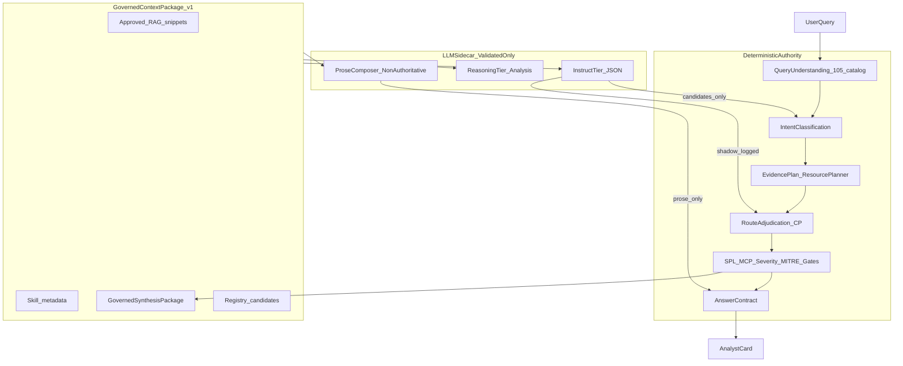

# Plan — Governed LLM Utilization Optimization

**Status:** Active — **Phase 1.5 implemented 2026-06-14** (real sidecar timeout, T0 skip gates, budget enforcement, failover label, timeout→Instruct retry)  
**Date:** 2026-06-13 (post-review + Phase 1.5: 2026-06-14)  
**Owner:** Anurag + implementation agents  
**Cursor working copy:** `/root/.cursor/plans/llm_optimization_strategy_3a311ebc.plan.md` (recreate in Cursor if missing)  
**Related:**

| Plan | Role |
|------|------|
| [`2026-05-30_1845_query-to-answer-live-mcp-llm-readiness.md`](2026-05-30_1845_query-to-answer-live-mcp-llm-readiness.md) | MCP transport + synthesis scaffold (Wall 1–2) — **code complete** |
| [`2026-06-13_spl-generation-audit-completion.md`](2026-06-13_spl-generation-audit-completion.md) | SPL LLM failover + lab-tier exposure (Phase G/H) — **done** |
| [`2026-06-10_0356_skills-llm-mcp-utilization-and-paraphrase-readiness.md`](2026-06-10_0356_skills-llm-mcp-utilization-and-paraphrase-readiness.md) | WS1/WS0/WS3 executable tasks — **in progress** |
| [`2026-06-03_1609_local-llama-instruct-synthesis-client.md`](2026-06-03_1609_local-llama-instruct-synthesis-client.md) | Local endpoint infra — **partially superseded** by `governed_answer_composer` |

---

## Purpose — why this plan exists

The project is **not** aiming to be a deterministic-only SOC answer machine. Deterministic policy must keep **authority** (severity, MITRE status, SPL execution, MCP gates, route adjudication). LLM must operate **inside that envelope** wherever semantic flexibility adds analyst value:

- Paraphrase and out-of-registry intake
- SPL candidates for uncatalogued hunts (already shipped)
- Readable analyst prose from governed facts
- Missing-evidence and limitation explanations
- Adaptive broaden proposals (already shipped, advisory → validate → HIL)
- Shadow routing and resource-plan proposals before promotion

This plan is the **single forward roadmap for LLM utilization**. Do not reopen SPL audit Phase G/H or query→answer Steps 0–3 unless a regression is found.

---

## Executive summary (2026-06-14)

| Area | Verdict |
|------|---------|
| **Plan direction** | ✅ Correct for “LLM where required, deterministic authority” |
| **SPL LLM path** | ✅ Done — `llm_fallback.py` + lab-tier exposure |
| **Qwen primary (`AI_SOC_LLM_LOCAL_*`)** | ✅ Wired — narration, sidecars, resource-plan bridge |
| **Foundation-Sec Instruct failover** | 🟡 Fast errors only (conn refused, HTTP) — **not** slow/hung primary (see I3) |
| **Answer narration** | 🟡 Two paths (CP composer vs lab_runner) — both use failover client |
| **Intent advisor** | ✅ T0 skip on exact-105; off in `.env.splunk-live.example` until staging smoke |
| **Sidecar timeouts** | ✅ Real wall-clock bound (persistent executor, no blocking join) |
| **Missing-evidence reasoner** | ✅ I8 skip on clarification / missing_evidence_review HIL |
| **Turn budget** | ✅ Session-scoped in graph state; enforced at intent/reasoner/narration |
| **Failover observability** | ✅ `answered_label` on `ChatResult`; timeout→Instruct retry (I3) |
| **Prod enablement** | Staging smoke with Qwen reachability, then re-enable intent advisor |

**Fail-closed rule:** If `AI_SOC_LLM_LOCAL_*` is down and `AI_SOC_LLM_FOUNDATION_SEC_INSTRUCT_*` is also unset, sidecars skip (`no_provider_configured`) and narration falls back to **deterministic prose** — same as before Qwen.

**COE gate (updated):** Do **not** set `AI_SOC_LLM_INTENT_ADVISOR_ENABLED=true` or flip synthesis flags in production until **C1** (real timeout) and **C2** (exact-105 / T0 skip) ship. Architecture fits the goal; the gap is **latency safety + measurement**, not routing design.

---

## Critical corrections (bugs in the 2026-06-13 audit)

### 1. Dual narration paths — do not disable CP to “enable LLM”

Two mutually exclusive narration implementations exist:

| Path | When it runs | Module |
|------|----------------|--------|
| **Legacy lab narration** | `AI_SOC_LLM_LIVE_SYNTHESIS_ENABLED` + **`CONTROL_PLANE_ENABLED=false`** | `synthesis/lab_runner.py` → `narrate_analyst_summary` |
| **CP governed composer** | `AI_SOC_LLM_LIVE_SYNTHESIS_ENABLED` + **`CONTROL_PLANE_ENABLED=true`** + `AI_SOC_LLM_FINAL_SYNTHESIS_ENABLED` | `synthesis/governed_answer_composer.py` → `compose_governed_answer` |

Live SOC posture (`.env.splunk-live.example`) uses **`CONTROL_PLANE_ENABLED=true`**. LLM prose is enabled by flipping synthesis flags and configuring `AI_SOC_LLM_LOCAL_*` — **not** by turning CP off.

**Action for Phase 2:** Document both paths in `details.html`; add parity tests; eventually consolidate prompt/guard logic so one implementation owns narration.

### 2. `.env.splunk-live.example` keeps synthesis off

Even with CP composer available, the live overlay sets:

```env
AI_SOC_LLM_FINAL_SYNTHESIS_ENABLED=false
AI_SOC_LLM_LIVE_SYNTHESIS_ENABLED=false
```

That is the real production blocker for LLM prose, not CP itself.

### 3. Intent advisor timeout — **NOT FIXED (C1) — value bumped only**

Role-specific timeouts exist in `app/llm/sidecar_clients.py` (intent: 30s; missing evidence: 45s), but `run_sidecar_llm_with_timeout` (`sidecar_governance.py:138`) uses `with ThreadPoolExecutor()` — on `future.result(timeout)` timeout, `__exit__` calls `shutdown(wait=True)` and **blocks until the worker finishes**. Reproduced: `timeout=1.0s`, work `5.0s` → elapsed **5.0s**, `timed_out=True`.

**Impact:** Hung or slow Qwen blocks the request for the full primary socket timeout (sidecar local mode: `min(configured, 45)` = **45s**), serially across intent + reasoner + narration — same class as the documented PowerGrid latency incident. Bumping 1.5s → 30s did not fix the mechanism.

**Fix (Phase 1.5):** Non-blocking cancel (daemon worker + abandon on timeout), persistent executor without blocking join, or move sidecars async/off the blocking graph path. Optionally cap sidecar socket timeout below wrapper budget so timeout can trigger failover (I3).

### 4. Per-turn LLM stacking — **TRACE ONLY (I4)**

`llm_turn_budget` on control-plane trace records sidecar + narration calls, but:

- `TurnLlmBudget` is created at **finalize** while intent advisor runs earlier at `graph_node_query_to_intent` — cannot gate cross-node.
- `sidecar_budget_exhausted()`, `narration_budget_exhausted()`, `record_narration()` are **never called**; pipeline inlines narration records (drift risk).
- Plan rule “max 2 sidecar + 1 narration; skip T1/T2 on exact-105” is **unenforced**.

**Fix (Phase 1.5):** Session-scoped budget in graph state; enforce before each sidecar; use `record_narration()` consistently.

### 5. Lineage placeholders — **partial (composer only)**

Composer trace sets `llm_raw_output_placeholder` on successful narration. Does not record **which endpoint answered** (I6) — Phase 5 fallback rate is uncomputable until fixed.

### 6. `details.html` §13 — **pending** (§9 remains resource_decisions JSON)

### 7. Intent advisor on blocking path every turn (C2)

`generate_llm_intent_advisory` is called unconditionally at `graph_node_query_to_intent` (`pipeline.py:304`) — including exact-105 deterministic matches. `.env.splunk-live.example` enables it live (`AI_SOC_LLM_INTENT_ADVISOR_ENABLED=true` + `AI_SOC_LLM_ENABLED=true` + `MODE=local` + `LOCAL_BASE_URL` set).

This **violates** plan tier **T0** (“exact-105 → no LLM call”) and budget rule “skip T1/T2 on exact-105.” The plan correctly moved `llm_plan_bridge` **off** the blocking live path after the PowerGrid latency incident — wiring intent advisor back **on** that path is an unacknowledged contradiction.

**Fix (Phase 1.5):** Skip intent advisor when `deterministic_match_path` is exact/near-exact (or registry confidence above threshold); alternatively shadow-only / async queue. Keep paraphrase intake for weak-match paths only.

---

## Post-implementation review (2026-06-14) — verified against code

Independent review of Phase 1 landing. Items marked **aligned** were reproduced in code or by runtime test.

### Critical — block production enablement

| ID | Finding | Aligned? | Evidence | Fix |
|----|---------|----------|----------|-----|
| **C1** | “Hard timeout” is illusory — hung LLM blocks full worker duration | ✅ **100%** | `run_sidecar_llm_with_timeout` + `ThreadPoolExecutor` blocking join; repro 1s timeout / 5s work → 5.0s elapsed | Phase 1.5: non-blocking timeout or off-path sidecars |
| **C2** | Intent advisor ON blocking live path every turn, all match paths | ✅ **100%** | `pipeline.py:304` unconditional; `.env.splunk-live.example` enables live | Phase 1.5: T0 skip gate for exact-105 |

### Important — measurement / safety gaps

| ID | Finding | Aligned? | Evidence | Notes / fix |
|----|---------|----------|----------|-------------|
| **I3** | Failover never covers slow-Qwen case | ✅ **100%** | `FailoverChatClient` only chains on raised `LocalChatError`; sidecar timeout returns `timed_out=True` without trying Instruct; socket timeout (45s sidecar) ≥ wrapper budget | On timeout, optionally attempt failover with shorter per-hop socket cap; fix C1 first |
| **I4** | Per-turn budget unenforced + dead code | ✅ **100%** | Budget at finalize; intent earlier; `sidecar_budget_exhausted` / `record_narration` never called | Session-scoped budget + enforce before calls |
| **I5** | Production bypasses registry governance | 🟡 **Partial** | Roles **are** in `ROLE_DEFAULTS` (review overstated “absent”); real gap is `build_failover_client_for_role` ignores `role_status.enabled` (`pass` after resolve) | Honor `resolve_sidecar_role_status`; keep global failover only when role blank |
| **I6** | `provider_label` always reports primary | ✅ **100%** | `invoke_sidecar_role` sets `chain[0][0]` before call; failover success label discarded; double client build | Return `answered_label` from `FailoverChatClient.generate` |
| **I7** | `GovernedContextPackage` v1 is stub vs plan spec | ✅ **100%** | Actual: query + question/use-case ids + match_path + routed_skill; no SOC-KB, resource_decisions, AnswerContract, truncation | Phase 2 context pack expansion |
| **I8** | `missing_evidence_reasoner` on clarification + T0 turns | ✅ **100%** | `hil_status=="clarification_required"` triggers; no exact-105 guard | Skip on T0 + clarification_required per tier rules |

### Suggestions — incorporated

| Item | Action |
|------|--------|
| `record_narration` unused vs inline trace | Phase 1.5: single path via `TurnLlmBudget.record_narration()` |
| Phase 2 step 1 “wire missing-evidence” | **Already done** (`pipeline.py:1303-1308`) — reconcile plan steps |
| Exec summary “timeout FIXED ✅” | **Downgraded** in this revision |

### Risks if enabling live flags before Phase 1.5

1. **Latency regression:** Every exact-105 question may wait up to ~45s×N sidecars + narration under slow Qwen (C1+C2).
2. **False confidence:** Trace shows `timed_out=True` but request still blocked — operators may think timeout worked.
3. **Failover blind spot:** Instruct never tried on slow primary — only on fast connection errors (I3).
4. **Scorecard garbage:** Fallback rate and per-role metrics wrong without `answered_label` (I6).
5. **Tier rule violation:** LLM calls on T0 deterministic answers (C2, I8) — undermines “deterministic authority” story.

### Alternatives considered

| Approach | Pros | Cons |
|----------|------|------|
| **A. Fix C1+C2 first (recommended)** | Restores latency safety; matches plan T0/T1 tiers | Small code change before prod flip |
| **B. Disable intent advisor in `.env.splunk-live.example` until fixed** | Immediate risk reduction | Loses paraphrase intake in staging |
| **C. Shadow-only intent advisor (log, no blocking)** | Zero latency on live path | No paraphrase promotion until async worker |
| **D. Lower sidecar socket to 15s without fixing C1** | Shorter hangs | Still blocks on join; may truncate valid slow completions |

**Recommendation:** Ship **Phase 1.5** (C1 real timeout + C2 T0 skip + I6 label + I8 guards) before any production synthesis or intent-advisor enablement.

---

## Audit summary (code vs original plan claims)

| Claim | Actual state (2026-06-14) | Verdict |
|-------|---------------------------|---------|
| Registry has 12 roles | **14** roles in `ROLE_DEFAULTS` | Wrong count — use 14 |
| A2 synthesis “never called” | `run_governed_synthesis_lab` + `compose_governed_answer` wired in `pipeline.py` | Outdated |
| CP blocks all live LLM | CP **enables** `governed_answer_composer`; blocks only `lab_runner` narration | **Bug in prior audit — fixed here** |
| A1 advisor “no provider wired” | Production hook in `sidecar_clients.py` + failover | **Fixed** — but runs on every turn when enabled (C2) |
| `missing_evidence_reasoner` registered only | Wired in `pipeline.py` finalize + Limitations merge | **Fixed** — over-broad triggers (I8) |
| `GovernedContextPackage` | `governed_context_package.py` v1 — **stub** vs plan spec | **Partial (I7)** — not “Fixed Phase 1” |
| SPL LLM failover | `llm_fallback.py` uses `build_synthesis_client_from_settings` | **Done** |
| `llm_plan_bridge` on live path | **Not** on blocking live path (by design after latency incident) | Accurate — shadow only |
| Experience Center isolation | Demo early-return must never call live providers | Maintained — all new roles must respect |

---

## Strategic frame: deterministic authority vs LLM flexibility

| Layer | What changes without playbook redeploy | Owner |
|-------|----------------------------------------|-------|
| **Policy / rules** | 105 registry, catalog, severity/MITRE preconditions, SPL allowlists, MCP gates, CP flags | Deterministic code + config |
| **Semantic layer** | Paraphrase intake, investigation narrative, missing-evidence prose, resource-plan proposals | LLM **sidecar** — validated, overridden, or dropped |
| **Execution** | Splunk MCP, SPL run, HIL | **Never** LLM |



---

**Fail-closed:** Unconfigured or unreachable Qwen **and** missing Instruct fallback → deterministic-only answers (unchanged pre-Qwen behavior).

---

## Model routing — Qwen flag + existing LOCAL / Instruct vars

| Workload | Default (flag off) | COE (flag on + QWEN_*) |
|----------|-------------------|------------------------|
| Sidecars / narration | `LOCAL_*` → Instruct failover | Qwen → `LOCAL_*` → Instruct |
| Unreachable endpoints | Deterministic prose | Instruct failover |

```env
AI_SOC_LLM_QWEN_PRIMARY_ENABLED=false
AI_SOC_LLM_QWEN_BASE_URL=http://10.52.1.13:8000/v1   # COE only
AI_SOC_LLM_QWEN_MODEL=./qwen72b
AI_SOC_LLM_LOCAL_BASE_URL=http://host.docker.internal:8081/v1   # dev Instruct
```

Code: `endpoint_resolver.py`, `failover_client.py`, `sidecar_clients.py`. Details: `docs/architecture/llm_endpoint_wiring.md`.

---

## Multi-LLM tier model

Registry: **14 roles** in [`backend/app/llm/registry_settings.py`](../backend/app/llm/registry_settings.py).

| Tier | Provider role | Use when | Must NOT |
|------|---------------|----------|----------|
| **T0 — None** | — | Exact-105, unsafe block, HIL-required, blocked sufficiency | Any LLM call |
| **T1 — Fast instruct** | `foundation_sec_instruct` / `local` | Intent advisory, route-plan shadow, template assist, SPL failover | Change final route, approve SPL, call MCP |
| **T2 — Reasoning** | `foundation_sec_reasoning` / `local` | Missing-evidence analysis, MITRE/risk rationale prose, resource-plan propose | Set MITRE status, severity, execution flags |
| **T3 — General (optional)** | Future `general_reasoning` | Long-form “why this matters” for non-security phrasing | Authority fields; air-gap blocks cloud |

**Routing rule:** `ROUTE_PLAN_REASONING_MODEL_ALLOWED = False` stays false.

**Per-turn budget:** max **2 sidecar** + **1 narration**; count SPL failover as sidecar. Skip T1/T2 on exact-105, `unsafe_blocked`, `requires_clarification`.

**Implementation status (2026-06-14):** Rule documented only — **not enforced** (I4). Intent advisor violates T0 skip (C2). Reasoner violates clarification skip (I8).

---

## Context packaging — `GovernedContextPackage`

Build before any sidecar call (shared helper in `app/llm/governed_context_package.py`):

**Plan spec — include:**

- Top-N semantic 105 candidates, allowed use-case IDs, skill `answer_sections` metadata
- Redacted SOC-KB snippets already in `SourceEvidence` (never raw MCP rows)
- `resource_decisions`, `path_type`, limitations from evidence plan
- `AnswerContract` allowed/candidate/blocked findings, `not_claimed`, evidence status
- `GovernedSynthesisPackage` aggregates when present

**Exclude:** credentials, executable SPL authority, MCP tool schemas that enable direct execution.

**Reject or truncate** when over role `max_input_tokens`; log `context_truncation`.

**v1 shipped (2026-06-14) — stub only (I7):** `raw_query`, registry question/use-case candidates, `match_path`, `routed_skill`. `limitations` field exists but is not populated by builder. **Phase 2** expands to full spec above.

---

## Use-case matrix — where LLM adds value

### Tier A — High ROI (implement first)

#### A1. Paraphrase / weak intake (branch 3D)

| | |
|--|--|
| **Code** | [`llm_intent_advisor.py`](../backend/app/chat/llm_intent_advisor.py), `apply_advisory_promotion` |
| **Model** | T1 instruct (JSON) |
| **Gates** | Registry validation, confidence ≥ 0.75, semantic tier agree, no clarification/HIL |
| **Audit** | `llm_intent_advisory`, `query_to_intent.llm_intent_assist_status` |
| **Gap** | Wire production provider ✅; **T0 skip gate + real timeout pending (C1/C2)**; expand context pack (I7) |

#### A2. Governed answer prose (finalize)

| | |
|--|--|
| **Code** | [`governed_answer_composer.py`](../backend/app/synthesis/governed_answer_composer.py) (CP on), [`lab_runner.py`](../backend/app/synthesis/lab_runner.py) (CP off) |
| **Model** | T1/T2 via `build_synthesis_client_from_settings` |
| **Gates** | Synthesis flags + provider configured + composer guards + `final_answer_validator` |
| **Gap** | Extend eligible answer modes (WS3 T3.2); populate lineage; unify dual paths |

#### A3. Missing-evidence reasoning

| | |
|--|--|
| **Code** | [`missing_evidence_reasoner.py`](../backend/app/llm/missing_evidence_reasoner.py) — wired in `pipeline.py` finalize |
| **Model** | T2 reasoning (optional Reasoning endpoint → Qwen → Instruct) |
| **Gates** | Review-only bullets; cite `AnswerContract.evidence_status`; fail-closed validator |
| **Gap** | **T0 / clarification skip guards (I8)**; expand context for reasoner prompts |

### Tier B — Medium ROI (after scorecard HEALTHY)

| ID | Role | Notes |
|----|------|-------|
| **B1** | `mitre_reasoner`, `risk_rationale_reasoner` | Prose from fixed MITRE decision objects only |
| **B2** | Resource plan LLM propose → validate | [`llm_plan_bridge.py`](../backend/app/planner/llm_plan_bridge.py) shadow only today |
| **B3** | Route-plan shadow | Already testable; keep shadow-only |

### Tier C — Explicit non-goals

- LLM inside route adjudication (breaks precedence)
- LLM **executes** MCP or **selects** the executed tool (it may *describe* available MCP tools as context and *propose* an evidence need; execution stays deterministic + HIL-gated)
- LLM **sets authority** — severity, MITRE status, SPL approval, `execution_eligible`
- Re-wire synthesis scaffold (already done)

> **Revised 2026-06-14 (owner direction):** "LLM-authored out-of-catalog body" is **no longer a non-goal** — it is a core differentiator vs fixed SOAR (Cisco). On-the-fly answer composition for out-of-catalog / weak / failover cases is **Phase 2.5**. The out-of-catalog *guarantee* is narrowed to what it always should have meant: **the honest out-of-catalog notice stays, the body cites only retrieved skills/RAG/governed facts, and authority + execution stay deterministic.** LLM composes and proposes; it never fabricates catalog membership or authority.

---

## Reckless-call prevention checklist (every new LLM hook)

1. Role registry entry with `execution_eligible: false`
2. Sidecar timeout + fail-closed drop reasons ([`sidecar_governance.py`](../backend/app/llm/sidecar_governance.py))
3. JSON adapter or prose guard ([`app/llm/adapter/`](../backend/app/llm/adapter/))
4. Deterministic validator before merging into response
5. Trace in [`control_plane_trace`](../backend/app/chat/control_plane_trace.py) / `llm_advisory_trace`
6. **`TurnLlmBudget` accounting** — trace shipped; **enforce in Phase 1.5** (I4)
7. Telemetry sample for WS3 scorecard
8. Flag default off until scorecard `HEALTHY`
9. Experience Center path isolation — no live provider on demo early-return
10. MCP summaries only — sanitized envelopes, never raw rows (Phase A2 ✅)

---

## Phased delivery

### Execution rules for agents (read once, no need to ask)

- **One phase at a time, in order.** Do not start a phase until the previous phase's **Stop/Go gate** is fully green. Within a phase, do tasks in the listed order (Phase 1.5 has a hard order: C1 → C2/I8 → I6 → I5 → I4 → I3).
- **One commit per task** (Phase 1.5) or **one commit per phase** (Phases 2–5). Use the commit message printed in the phase. Branch off `master`; do not commit to `master` directly.
- **Flags stay default-off.** Never edit `.env` enable flags as part of code work except the explicit Phase 1.5 stopgap line. No new flags (per project memory `flag-posture-all-on-no-new-flags`).
- **Authority is invariant.** No LLM hook may set or change `severity_label`, `mitre_status`, `execution_eligible`/`revalidation_approved`, route adjudication, or call MCP. Tests must assert these unchanged when the LLM disagrees.
- **EC isolation is sacred.** The `coe_synthetic_fixture` demo early-return must never reach a live provider. Add/keep a test that fails if it does.
- **Test-first discipline:** write the phase's test files, run the phase test block, then the full backend suite, then governance regression. If any is red, fix inside the current phase — never advance with red.
- **When genuinely blocked** (a referenced field/function does not exist, or a test cannot be made to pass without changing authority): stop and surface it; do not invent a workaround that weakens governance. Otherwise proceed without asking (per project memory `execution-mode-dont-ask`).
- **Save plan updates** to this file and mirror status in `CLAUDE.md` §Plans after each phase.

### Phase 0 — Document + measure (docs PR)

- [x] This file is canonical (2026-06-14)
- [x] `details.html` §13 — Qwen flag + LOCAL/Instruct (no profiles)
- [x] `.env.splunk-live.example` — `QWEN_PRIMARY_ENABLED=false`, LOCAL=Instruct

### Phase 1 — Wire paraphrase intake + failover chain (code) — **PARTIAL 2026-06-14**

**Shipped:** `endpoint_resolver.py`, `failover_client.py`, `sidecar_clients.py`, `governed_context_package.py` (stub), `turn_llm_budget.py` (trace only), intent advisor provider, missing-evidence reasoner + Limitations merge, composer lineage placeholder.

**Not done / overstated:** real wall-clock timeout (C1), T0 skip (C2), full context pack (I7), budget enforcement (I4), failover label (I6).

**Commit message:** `feat: wire Qwen local primary with Foundation-Sec instruct failover`

### Phase 1.5 — Latency safety + tier gates — **DONE 2026-06-14**

Post-ship review fixes (same phase):
- I3 timeout retry uses **Instruct-only** hop (not full `chain[1:]`)
- Failover chain **dedupes duplicate base URLs** (LOCAL = Instruct same host)
- Governance status exposes `qwen_primary_enabled` + `qwen_*_configured`
- Intent sidecar trace outcome: `dropped` vs `timed_out` vs `completed`
- Composer trace adds `llm_answered_label` (Phase 2 lineage prep)

### Phase 2 — Reasoning + narration closure (code) — **IN PROGRESS**

**Must ship before** `AI_SOC_LLM_INTENT_ADVISOR_ENABLED=true` or synthesis flags in `.env.splunk-live.example`.

**Immediate stopgap (do first, separate 1-line commit):** set `AI_SOC_LLM_INTENT_ADVISOR_ENABLED=false` in `.env.splunk-live.example` (line 78). Removes C1/C2/I3 blocking exposure on live path now. Cost: paraphrase intake off (advisory-only, deterministic QU unaffected). Commit: `chore: disable live intent advisor until latency safety lands`.

Execute tasks **in this order** (each is one commit; run its test block before the next).

> **Why this is the hardest phase:** C1 is a concurrency bug (thread-pool semantics), I4 threads mutable state across two orchestration paths (sequential runner **and** a compiled LangGraph `StateGraph`), and every task touches the live blocking path. Read the engineering notes below before writing code.

#### Phase 1.5 — engineering notes (read before C1 / I4)

**C1 — thread-pool gotchas (the part that bites):**
- The bug is *not* `future.result(timeout)` — that raises correctly. It is the `with ThreadPoolExecutor()` block: `__exit__` → `shutdown(wait=True)` joins the still-running worker. Removing the `with` (module-level executor) is the actual fix.
- **Orphan-worker accounting:** on timeout the worker keeps running until its own socket timeout. With `max_workers=4`, four simultaneous hung turns starve the pool — the 5th `submit` queues and blocks. Size the pool for expected concurrency **and** keep the client socket timeout low (≤45s) so orphans drain. Document: `max_workers` ≥ peak concurrent chat turns that may call a sidecar (intent + reasoner can both be in flight across turns). Start at `8`; make it `int(os.getenv("AI_SOC_SIDECAR_MAX_WORKERS", "8"))` — **this is a tuning knob, not a feature flag**, so it does not violate the no-new-flags posture.
- `future.cancel()` returns `False` for an already-running task (cannot interrupt a blocking `urlopen`). That is expected — we orphan, not cancel. Do not assert cancel succeeded.
- Do **not** use `signal.alarm` — it is main-thread only and breaks under uvicorn workers.
- Keep `SIDECAR_ASSIST_TIMEOUT_SECONDS` default (1.5s) for any legacy caller that does not pass `timeout_seconds`; only the new role-aware callers pass 30/45s.

**I4 — dual orchestration parity (the part that silently diverges):**
- Two runners share `ChatPipelineState` (TypedDict) and the same `graph_node_*` functions: the **sequential** runner (`pipeline.py:207+`) and the compiled **LangGraph** `StateGraph` (`app/graph/chat_workflow.py:30`, gated by `langgraph_orchestration_enabled`).
- Put the budget where **both** paths run it: inside `graph_node_init_routing` (`pipeline.py:238`) — the first node in both runners — **not** the dict literal at line 207 (sequential-only). Set `state["llm_turn_budget"] = TurnLlmBudget()` there.
- Every later node reads `state.get("llm_turn_budget")` and must tolerate `None` (defensive: `budget = state.get("llm_turn_budget") or TurnLlmBudget()`), so a node invoked in isolation in a unit test does not crash.
- LangGraph merges node return dicts into state; returning `{**state, "llm_turn_budget": budget}` is safe because it is the same object reference — record mutations persist. Confirm the budget object is **not** deep-copied between nodes (LangGraph keeps the reference for non-channel values; if a reducer is added later, switch to an explicit annotated channel).
- **Parity test is mandatory** (L8): run the same exact-105 turn through both `langgraph_orchestration_enabled=false` and `=true` and assert identical `control_plane_trace.llm_turn_budget` counts.

---

#### Task C1 — Real wall-clock sidecar timeout

**Problem:** `run_sidecar_llm_with_timeout` (`backend/app/llm/sidecar_governance.py:131`) wraps the call in `with ThreadPoolExecutor()`. `__exit__` → `shutdown(wait=True)` blocks until the worker finishes, so `future.result(timeout)` raising does **not** bound wall-clock. Proven: timeout 1s + 5s work = 5.0s elapsed.

**Fix:** use a module-level persistent executor and do **not** join on timeout (orphan the worker; its own socket timeout reaps it).

```python
# backend/app/llm/sidecar_governance.py
from concurrent.futures import ThreadPoolExecutor, TimeoutError as FuturesTimeoutError

# module-level, created once; daemon threads so a hung worker never blocks shutdown
_SIDECAR_EXECUTOR = ThreadPoolExecutor(max_workers=4, thread_name_prefix="sidecar-llm")

def run_sidecar_llm_with_timeout(
    llm_raw_output_provider: Callable[[], str],
    *,
    timeout_seconds: float = SIDECAR_ASSIST_TIMEOUT_SECONDS,
) -> SidecarLlmCallResult:
    future = _SIDECAR_EXECUTOR.submit(llm_raw_output_provider)
    try:
        raw_output = future.result(timeout=timeout_seconds)
        return SidecarLlmCallResult(raw_output=raw_output, timed_out=False, notes=[])
    except FuturesTimeoutError:
        # Do NOT wait on the future. Orphan worker is bounded by the client socket
        # timeout (LocalChatClient.timeout_seconds). Never block the request thread.
        future.cancel()
        return SidecarLlmCallResult(raw_output=None, timed_out=True, notes=[NOTE_LLM_ASSIST_TIMED_OUT])
    except Exception:  # noqa: BLE001 — provider already maps transport errors; never propagate
        return SidecarLlmCallResult(raw_output=None, timed_out=True, notes=[NOTE_LLM_ASSIST_TIMED_OUT])
```

**Constraint:** the per-client socket timeout (`LocalChatClient.timeout_seconds`) must be **≤** the role wrapper timeout so the orphan thread can't outlive the wrapper budget by much. In `endpoint_resolver._timeout_for_mode`, sidecar local timeout is already `min(configured, 45)`. Set role wrapper timeouts (`sidecar_clients._ROLE_TIMEOUT_SECONDS`) **≥** that floor or lower the socket floor; document the relationship in a comment.

**Tests** — `backend/app/tests/test_sidecar_timeout_hard.py` (new):
- `test_slow_provider_returns_within_budget`: provider sleeps 5s, `timeout_seconds=1.0` → result returns in **< 1.5s** wall clock and `timed_out is True`. (assert with `time.monotonic()`)
- `test_fast_provider_passthrough`: provider returns "ok" immediately → `raw_output == "ok"`, `timed_out is False`.
- `test_provider_raises_is_timed_out_not_propagated`: provider raises `RuntimeError` → returns `timed_out=True`, no exception escapes.

```bash
cd backend && PYTHONPATH=../backend:.. python3 -m pytest app/tests/test_sidecar_timeout_hard.py -q
```

---

#### Task C2 + I8 — Shared T0 / clarification skip predicate

**Problem:** intent advisor (`pipeline.py:304`) and `run_missing_evidence_reasoner` both fire on deterministic T0 answers; reasoner also fires on `clarification_required`. Plan T0 rule = zero LLM on exact-105 / blocked / HIL.

**Fix:** one predicate, two call sites (avoids drifting skip-lists).

New file `backend/app/llm/sidecar_skip_policy.py`:

> **Verified field values (do not guess — these were wrong in the first draft):**
> - `AnswerContract.answer_mode` ∈ `{clarification, guided_investigation, rag_only, live_investigation, hybrid}` — **NOT** the seven sufficiency-gate modes. The clarification turn is `answer_mode == "clarification"`.
> - `AnswerContract.hil_status` is `Literal["not_required","required","missing_evidence_review","clarification_required"]` — there is **no** `intent_clarification` value.
> - `AnswerContract` has **no** `match_path` field. The reasoner cannot key off match_path; the exact-105 skip is owned by the **intent node** (C2), which reads `candidate_mappings["match_path"]` from `QueryUnderstandingResult.deterministic_match_path`.
> - The **sufficiency-gate** seven modes (`blocked_by_policy`, `insufficient_evidence`, …) live on the evidence-plan/sufficiency payload, available at the intent/evidence stage — a different namespace from `AnswerContract.answer_mode`. The predicate accepts both via `sufficiency_mode`.

```python
"""Single source of truth for when a turn must make NO sidecar LLM call (Tier T0)."""
from __future__ import annotations

# Deterministic intake already won — no semantic value in an advisory.
# Confirm exact strings against QueryUnderstandingResult.deterministic_match_path at wire time.
_DETERMINISTIC_MATCH_PATHS = frozenset({"exact", "near_exact", "exact_105", "alias_exact"})
# Sufficiency-gate modes (evidence stage) where policy/authority is fixed.
_T0_SUFFICIENCY_MODES = frozenset({"blocked_by_policy", "insufficient_evidence"})
# AnswerContract.answer_mode value for a clarification turn.
_T0_ANSWER_MODES = frozenset({"clarification"})
# AnswerContract.hil_status values that must not trigger a sidecar.
_SKIP_HIL_STATUSES = frozenset({"clarification_required", "missing_evidence_review"})

def should_skip_sidecar(
    *,
    match_path: str | None = None,        # intent node: candidate_mappings["match_path"]
    sufficiency_mode: str | None = None,  # intent/evidence node: sufficiency answer_mode
    answer_mode: str | None = None,       # reasoner: AnswerContract.answer_mode
    hil_status: str | None = None,        # reasoner: AnswerContract.hil_status
) -> tuple[bool, str | None]:
    if match_path and match_path.strip().lower() in _DETERMINISTIC_MATCH_PATHS:
        return True, "deterministic_exact_match_t0"
    if sufficiency_mode and sufficiency_mode.strip().lower() in _T0_SUFFICIENCY_MODES:
        return True, f"t0_sufficiency_mode:{sufficiency_mode.strip().lower()}"
    if answer_mode and answer_mode.strip().lower() in _T0_ANSWER_MODES:
        return True, f"t0_answer_mode:{answer_mode.strip().lower()}"
    if hil_status and hil_status.strip().lower() in _SKIP_HIL_STATUSES:
        return True, f"hil_skip:{hil_status.strip().lower()}"
    return False, None
```

> **Reasoner note (I8):** the existing run-condition gates on `contract.missing_evidence` being present. After adding the predicate, a `missing_evidence_review` HIL turn would be skipped by the predicate — that is intended (review-only turns get deterministic limitations, no LLM). Keep the reasoner running only for `answer_mode` values that are *not* in the skip set **and** that carry real missing evidence.

**Wire C2** in `pipeline.py` `graph_node_query_to_intent` (around line 304), before `generate_llm_intent_advisory`:

```python
from app.llm.sidecar_skip_policy import should_skip_sidecar
skip_advisory, skip_reason = should_skip_sidecar(
    match_path=candidate_mappings.get("match_path"),
)
if skip_advisory:
    llm_advisory = LLMIntentAdvisory(dropped_reasons=[skip_reason])
else:
    llm_advisory = generate_llm_intent_advisory(query_text, ...)
```

**Wire I8** at the top of `run_missing_evidence_reasoner` (`missing_evidence_reasoner.py:42`), after the `llm_disabled` check:

```python
# AnswerContract has no match_path; key off answer_mode + hil_status only.
skip, reason = should_skip_sidecar(
    answer_mode=contract.answer_mode,
    hil_status=contract.hil_status,
)
if skip:
    return MissingEvidenceReasonerResult(skipped_reason=reason)
```

Then **remove** the `clarification_required` branch from the reasoner's own run condition (it now skips via the predicate). The exact-105 / sufficiency-T0 skip already happened upstream at the intent node (C2), so the reasoner only needs `answer_mode` + `hil_status`.

**Tests** — `backend/app/tests/test_sidecar_skip_policy.py` (new):
- `test_exact_match_skips` / `test_near_exact_skips` → `(True, "deterministic_exact_match_t0")`
- `test_blocked_mode_skips` → reason starts `t0_answer_mode:`
- `test_clarification_skips` → reason starts `hil_skip:`
- `test_out_of_registry_does_not_skip` → `(False, None)`

`backend/app/tests/test_intent_advisor_t0_skip.py` (new) — integration:
- exact-105 query through `graph_node_query_to_intent` with `AI_SOC_LLM_INTENT_ADVISOR_ENABLED=true` + a **fake provider that raises if called** → no provider call; `llm_intent_advisory.dropped_reasons == ["deterministic_exact_match_t0"]`.

```bash
cd backend && PYTHONPATH=../backend:.. python3 -m pytest app/tests/test_sidecar_skip_policy.py app/tests/test_intent_advisor_t0_skip.py -q
```

---

#### Task I6 — Failover reports the endpoint that actually answered

**Problem:** `invoke_sidecar_role` returns `chain[0][0]` (always primary). `FailoverChatClient.generate` discards which label won → Phase 5 fallback-rate uncomputable.

**Fix:** add `answered_label: str = ""` to `ChatResult` (`local_chat_client.py:39`). In `FailoverChatClient.generate` (`failover_client.py`), set it to `label` on the successful hop. In `invoke_sidecar_role` (`sidecar_clients.py:106-112`), drop the second client build; capture the label from the call. Because the wrapped provider returns only `str`, have `build_sidecar_raw_provider`'s `_call` stash the last `answered_label` on a mutable holder (closure list) and read it after `run_sidecar_llm_with_timeout` returns; if timed out, label is `None`.

**Tests** — extend `backend/app/tests/test_llm_failover_client.py`:
- `test_answered_label_primary`: primary succeeds → `result.answered_label == "local_primary"`.
- `test_answered_label_fallback`: primary raises `LocalChatError`, fallback succeeds → `answered_label == "foundation_sec_instruct_fallback"`.

```bash
cd backend && PYTHONPATH=../backend:.. python3 -m pytest app/tests/test_llm_failover_client.py -q
```

---

#### Task I5 — Honor governance `enabled`; stop the assist override

**Problem:** `resolve_sidecar_role_status` (`sidecar_governance.py:106-113`) returns `enabled=True` for a role whose governance entry has `enabled=False` whenever `assist_invoked=True`. `build_failover_client_for_role` (`sidecar_clients.py:42-45`) passes `assist_invoked=True` **and** ignores the result with `pass`. Net: the governance `enabled` flag is dead. Both roles are already in `role_mappings` (14) — registry entries are fine; **the override is the bug.**

**Fix:**
1. In `build_failover_client_for_role`, stop forcing the override: call `resolve_sidecar_role_status(role, ..., assist_invoked=False)` and **return `None` when `not role_status.enabled and role_status.role_configured`** (role exists but operator disabled it). Only when `role_configured is False` (no mapping) fall through to the global failover chain.
2. Leave the `assist_invoked=True` branch in `resolve_sidecar_role_status` for legacy callers, but add a docstring note that production sidecars must pass `assist_invoked=False`.

**Tests** — `backend/app/tests/test_sidecar_role_enablement.py` (new):
- `test_disabled_role_returns_no_client`: governance mapping `enabled=false` for `intent_shadow_classifier` → `build_failover_client_for_role(...)` is `None`.
- `test_unconfigured_role_uses_global_chain`: role absent from mappings → client built from global Qwen→Instruct chain.
- `test_enabled_role_builds_client`: `enabled=true` → non-None client.

```bash
cd backend && PYTHONPATH=../backend:.. python3 -m pytest app/tests/test_sidecar_role_enablement.py -q
```

---

#### Task I4 — Session-scoped turn budget with enforcement

**Problem:** `TurnLlmBudget` is created at finalize (`pipeline.py:1288`) but the intent advisor fired earlier at a different node → can't cap cross-node. `sidecar_budget_exhausted()` / `narration_budget_exhausted()` / `record_narration()` are never called.

**Fix:** put one budget in graph state at pipeline start; record + check at every call site. **Placement is parity-critical** — see engineering notes.
1. In `graph_node_init_routing` (`pipeline.py:238`, first node in **both** runners) set `state["llm_turn_budget"] = TurnLlmBudget()`. Do **not** set it in the line-207 dict literal (sequential-only).
2. Every consumer reads defensively: `budget = state.get("llm_turn_budget") or TurnLlmBudget()`.
3. Intent node (`graph_node_query_to_intent`): after the C2 skip check, if `budget.sidecar_budget_exhausted()` → skip with `LLMIntentAdvisory(dropped_reasons=["turn_budget_exhausted"])`; else call, then `budget.record_sidecar(role="intent_shadow_classifier", provider_label=<real answered_label from I6>, outcome=...)`.
4. Reasoner call site (finalize, `pipeline.py:1296`): same exhaustion check before `run_missing_evidence_reasoner`; record with the reasoner's `answered_label`.
5. Composer narration (`pipeline.py:1362`): skip if `budget.narration_budget_exhausted()`; else replace the inline dict build with `budget.record_narration(provider_label=composer_result.llm_provider_label, outcome="completed")`.
6. `llm_turn_budget_trace = (state.get("llm_turn_budget") or TurnLlmBudget()).to_trace_dict()` once at finalize → into `control_plane_trace["llm_turn_budget"]`.

**Tests** — `backend/app/tests/test_turn_llm_budget_enforced.py` (new):
- `test_third_sidecar_skipped`: record 2 sidecars → `sidecar_budget_exhausted()` True; a third call site short-circuits with `turn_budget_exhausted`.
- `test_narration_budget`: one narration recorded → `narration_budget_exhausted()` True.
- `test_budget_present_in_both_runners`: same exact-105 turn through `langgraph_orchestration_enabled=false` and `=true` → identical `control_plane_trace.llm_turn_budget` counts (L8 parity).
- integration: a single turn that would invoke intent + reasoner + narration records exactly `sidecar_calls <= 2`, `narration_calls <= 1`.

```bash
cd backend && PYTHONPATH=../backend:.. python3 -m pytest app/tests/test_turn_llm_budget_enforced.py -q
```

---

#### Task I3 — Instruct retry on primary timeout (depends on C1)

**Problem:** failover only triggers on raised `LocalChatError`. A slow primary times out at the wrapper (now real, post-C1) and Instruct is never tried.

**Fix (only after C1 merges):** in `invoke_sidecar_role`, if the call timed out **and** the chain has a fallback hop, retry once against the fallback-only client with a short hop timeout (`min(role_timeout, 20s)`). Record both attempts in the budget (`outcome="timed_out"` then `outcome="completed"`/`"timed_out"`). Keep total turn budget intact (the retry counts as the same sidecar slot, not a new one).

**Tests** — `backend/app/tests/test_sidecar_timeout_failover.py` (new):
- `test_primary_timeout_falls_to_instruct`: primary provider sleeps past timeout, Instruct returns fast → final `raw_output` from Instruct, `answered_label == "foundation_sec_instruct_fallback"`, wall clock < primary socket timeout.
- `test_both_timeout_returns_deterministic`: both slow → `timed_out=True`, caller falls back to deterministic prose.

```bash
cd backend && PYTHONPATH=../backend:.. python3 -m pytest app/tests/test_sidecar_timeout_failover.py -q
```

---

#### Phase 1.5 — Stop/Go gate (run before Phase 2)

All must be green:

```bash
cd backend && PYTHONPATH=../backend:.. python3 -m pytest \
  app/tests/test_sidecar_timeout_hard.py \
  app/tests/test_sidecar_skip_policy.py \
  app/tests/test_intent_advisor_t0_skip.py \
  app/tests/test_llm_failover_client.py \
  app/tests/test_sidecar_role_enablement.py \
  app/tests/test_turn_llm_budget_enforced.py \
  app/tests/test_sidecar_timeout_failover.py -q
# full backend suite must stay green (no regressions in existing sidecar/intent tests)
cd backend && PYTHONPATH=../backend:.. python3 -m pytest -q
# governance regression
cd /var/www/ai-soc-assistant && ./scripts/run_stage3_governance_regression.sh
```

**Exit criteria (all true → proceed to Phase 2; any false → fix in this phase, do not advance):**
- Slow-mock (5s work / 1s budget) returns in < 1.5s with `timed_out=True`.
- Exact-105 turn with advisor enabled makes **zero** sidecar HTTP calls (fake provider raises if called).
- `control_plane_trace.llm_turn_budget` shows `sidecar_calls <= 2`, `narration_calls <= 1`.
- Failover trace carries the real `answered_label`.
- Governance-disabled role yields no client.
- Governance regression PASS, harness 6/6, full backend suite 0 failures.

**Commit:** `fix: real sidecar timeouts, T0 skip gates, budget enforcement, failover label`

### Phase 2 — Reasoning + narration closure (code) — **CORE DONE 2026-06-14**

**Steps:**

1. ~~Wire `missing_evidence_reasoner` into Limitations section~~ **Done Phase 1** — I8 guards added Phase 1.5.
2. WS3 T3.2 — extend composer eligibility to `knowledge_only_answer` + out-of-catalog modes — **DEFERRED (COE decision, see below).**
3. ~~Populate lineage with **actual** endpoint label~~ **Done** — composer sets `llm_provider_label` / `llm_answered_label` from `result.answered_label` (`governed_answer_composer.py:426`), `llm_raw_output_placeholder` from redacted prose. Output hash optional, not added.
4. ~~Document and test **both** narration paths~~ **Done** — `test_narration_paths_parity.py` (composer gating vs lab_runner ownership + fallback) and `test_ec_isolation.py` (demo path raises if it reaches a live provider).
5. ~~Expand `GovernedContextPackage` to plan spec (I7)~~ **Done** — `build_governed_context_package_for_contract` adds contract findings (missing/required evidence, candidate + not-claimed MITRE, do-not-claim, limitations), `resource_decisions` (keys only), redacted `soc_kb_snippets`, with priority-ordered char-budget truncation emitting `context_truncation`. Reasoner now builds its prompt from this package. **Note:** intent-node `v1` package stays thin by design (no contract/evidence exist yet at that stage).
6. Optional: extract shared prompt/guard module to reduce lab_runner vs composer drift — **not done** (low ROI; documented as L7).

**⚠️ Step 2 deferred — conflicts with Tier C non-goal.** Extending the composer to author prose for `out-of-catalog` answers collides with the Tier C guarantee "LLM-authored guided rescue body destroys the out-of-catalog guarantee." `knowledge_only` narration is lower-risk (prose from governed RAG facts) but currently `_is_knowledge_profile` deliberately returns the deterministic governed RAG summary. **COE decision required** before relaxing either skip. Until then composer eligibility is unchanged. Tracked as **L11**.

**Shipped tests (all green):**
- `app/tests/test_governed_context_package_full.py` — findings included, secrets/raw-rows excluded, truncation emits `context_truncation`, v1 stays thin.
- `app/tests/test_narration_paths_parity.py` — composer gating, no-client fallback, lab_runner path present.
- `app/tests/test_ec_isolation.py` — demo scenario renders with live entry points patched to raise.

```bash
cd backend && PYTHONPATH=../backend:.. python3 -m pytest \
  app/tests/test_governed_context_package_full.py \
  app/tests/test_narration_paths_parity.py \
  app/tests/test_ec_isolation.py \
  app/tests/test_missing_evidence_reasoner.py \
  app/tests/test_live_synthesis_narration.py -q
cd /var/www/ai-soc-assistant && ./scripts/run_stage3_governance_regression.sh
```
**Result 2026-06-14:** Phase 2 tests green; full backend suite **2110 passed / 1 skipped / 6 xfailed**; governance regression **PASS**. EC demo path makes 0 live calls. **Exit criteria met except Step 2 → superseded by Phase 2.5.**

### Phase 2.5 — On-the-fly out-of-catalog / weak-case composition (the SOAR differentiator)

**Owner direction (2026-06-14):** out-of-catalog, weak-match, and failover cases must use **skills + RAG + MCP-tool knowledge + LLM + HIL** to generate a working answer on the fly. We will not always succeed on weak cases — that is acceptable; attempting beats a fixed deterministic dead-end. This is the advantage over fixed SOAR.

**Hard invariants (LLM composes the body; never gains authority):**
1. **Out-of-catalog notice preserved** — composed body must keep the honest "not a vetted catalog detection / validate against local telemetry & policy" notice. Guard rejects prose that drops it.
2. **Cite-only-retrieved grounding** — body may reference only: retrieved skill metadata, retrieved RAG snippets, MCP tool *names/descriptions* in context, and governed contract facts. New guard `validate_grounding()` rejects invented IOCs, source/index names, SPL, hostnames, or technique IDs not present in the context package or contract.
3. **Execution + authority deterministic** — `execution_eligible=false`, MCP stays HIL-gated (LLM may *propose* an evidence need, never execute/select), severity + MITRE status stay deterministic ("not assigned from this question alone"). Existing composer guards already enforce severity/MITRE/exec; grounding guard adds IOC/source/SPL.

**HIL posture — threshold-based (owner decision):**
- Compute a composition confidence from match strength + RAG/skill relevance.
- `confidence >= COMPOSE_HIL_THRESHOLD` → answer flows on the fly (notice + caveats stay).
- `confidence < threshold` → attach `analyst_review_required` HIL gate but **still render the best-effort body** (review-gated, not suppressed).
- Any proposed MCP search/action always carries the HIL gate regardless of confidence.

**Context (owner decision):** add to `GovernedContextPackage` for these cases — redacted RAG snippets **+ skill metadata** (`answer_sections`, checklists, playbook refs) **+ MCP tool info** (tool name + one-line capability, never execution schema/credentials). Prompt instructs: *"Use only this context; if a snippet/skill is irrelevant or your confidence is very low, ignore it and say what is missing rather than inventing."* LLM may disregard low-relevance RAG/skills.

**Steps:**
1. ~~`GovernedContextPackage`: add `skill_sections`, `mcp_tool_hints` fields + render~~ **DONE** (`governed_context_package.py`; priority-4 sections; descriptions only). Builder-side population from skill/MCP registries pending step 4 wiring.
2. ~~`validate_grounding(text, corpus)` in composer~~ **DONE** — IPv4, hex hashes, `index=`/`sourcetype=`/`source=` names, runnable SPL pipe commands must appear in corpus (prompt + contract). Low false-positive (no generic-word matching). Wired into `compose_governed_answer` after `validate_composed_prose`.
3. ~~`out_of_catalog_notice_preserved(text, contract)`~~ **DONE** — rejects prose dropping the notice when `contract.out_of_catalog_notice` is set.
4. ~~**REMAINING (live-path behavior change):** `should_skip_llm_composer` + `compose_governed_answer` — allow `guided_investigation` / out-of-catalog / `knowledge_only` (keep skipping `unsafe_blocked`, explicit-run-SPL, MITRE-threshold). Thread skill/RAG/MCP context into the composer prompt for these modes.~~ **DONE** — `qualifies_for_weak_case_composition`, context package wired in `pipeline.py` finalize, `build_composer_prompt` renders GOVERNED CONTEXT + out-of-catalog notice.
5. ~~**REMAINING:** threshold HIL helper `composition_confidence()` + gate attach in pipeline finalize (render best-effort body + `analyst_review_required` when below threshold; always gate when an MCP search/action is proposed).~~ **DONE** — `composition_confidence.py` + `AI_SOC_LLM_COMPOSE_HIL_THRESHOLD`; pipeline attaches HIL without suppressing composed body.
6. ~~Prompt: "ignore low-relevance context / declare missing"~~ **DONE** (`_SYSTEM_PROMPT`).

**Status 2026-06-14:** Safety primitives + context fields + prompt + **live-path flip (steps 4–5)** shipped. Steps 4–5 change production out-of-catalog answers from deterministic guidance to LLM-composed body when synthesis flags are on; guarded by grounding + notice guards and threshold HIL. Verified via `test_out_of_catalog_composition.py` + Phase 2.5 test gate.

**Test gate (green before Phase 3):**
- `app/tests/test_grounding_guard.py`: invented IP/domain/`index=`/`T1059`/SPL not in context → guard rejects → deterministic fallback; grounded prose passes.
- `app/tests/test_out_of_catalog_composition.py`: out-of-catalog turn with provider mock → body composed, **notice present**, `execution_eligible=false`, severity not upgraded; low-confidence variant → HIL gate attached but body still rendered.
- `app/tests/test_context_skill_mcp.py`: package renders skill sections + MCP tool hints; excludes execution schema/credentials.
- `app/tests/test_ec_isolation.py` still green (demo path untouched).
```bash
cd backend && PYTHONPATH=../backend:.. python3 -m pytest \
  app/tests/test_grounding_guard.py \
  app/tests/test_out_of_catalog_composition.py \
  app/tests/test_context_skill_mcp.py \
  app/tests/test_ec_isolation.py \
  app/tests/test_governed_llm_answer_composer_phase9.py -q
cd /var/www/ai-soc-assistant && ./scripts/run_stage3_governance_regression.sh
```
**Exit criteria:** grounding guard blocks fabrication; out-of-catalog body renders with notice + non-authority + threshold HIL; governance regression PASS; EC path 0 live calls.

**Commit:** `feat: wire missing-evidence reasoner and extend CP composer coverage`

### Phase 3 — Rationale prose + resource plan shadow (code)

- MITRE/risk rationale from decision dumps only (fixed decision object in → prose out; never sets status/severity)
- LLM resource-plan propose → deterministic validate in composer (shadow flag, no live promotion)

**Test gate (green before Phase 4):**
- New `app/tests/test_mitre_risk_rationale.py`: rationale prose generated from a fixed MITRE/severity decision dump; authority fields (`mitre_status`, `severity_label`, `execution_eligible`) **unchanged** vs deterministic; on guard reject → deterministic rationale.
- New `app/tests/test_resource_plan_shadow.py`: LLM resource-plan proposal is validated against deterministic registries, logged shadow-only, and **never** alters the live `ResourcePlan` or route.
```bash
cd backend && PYTHONPATH=../backend:.. python3 -m pytest \
  app/tests/test_mitre_risk_rationale.py app/tests/test_resource_plan_shadow.py \
  app/tests/test_llm_plan_bridge.py -q
cd /var/www/ai-soc-assistant && ./scripts/run_stage3_governance_regression.sh
```
**Exit criteria:** authority fields invariant under LLM disagreement; resource-plan stays shadow; governance regression PASS.

### Phase 4 — Optional general reasoning provider (T3)

- Register `general_reasoning`; narration roles only; air-gap enforced

**Test gate (green before Phase 5):**
- New `app/tests/test_general_reasoning_airgap.py`: with air-gap on, `general_reasoning` cloud assignment is blocked (no client); role usable only for narration roles; never bound to authority fields.
```bash
cd backend && PYTHONPATH=../backend:.. python3 -m pytest app/tests/test_general_reasoning_airgap.py -q
cd /var/www/ai-soc-assistant && ./scripts/run_stage3_governance_regression.sh
```
**Exit criteria:** air-gap blocks cloud T3; governance regression PASS.

### Phase 5 — Scorecard-driven promotion (WS3 T3.1)

**Files:** new `scripts/build_llm_role_scorecard.py`, `docs/evals/llm_role_scorecard.json`

Per role: invocation count, agreement vs deterministic, **fallback rate (from I6 `answered_label`)**, guard disagreement ids.

Verdict: `HEALTHY` (fallback < 10%, agreement ≥ 70%, n ≥ 20) / `DEGRADED` / `INSUFFICIENT_DATA`.

**COE rule:** No production flag flip for a role until scorecard `HEALTHY`.

**Test gate:**
- New `app/tests/test_llm_role_scorecard.py`: scorecard computes fallback rate from `answered_label` (depends on I6); seeded telemetry → correct `HEALTHY`/`DEGRADED`/`INSUFFICIENT_DATA` verdict; `--check` exits non-zero on `INSUFFICIENT_DATA`.
```bash
cd backend && PYTHONPATH=../backend:.. python3 -m pytest app/tests/test_llm_role_scorecard.py -q
PYTHONPATH=backend:. python3 scripts/build_llm_role_scorecard.py --check
```
**Exit criteria:** scorecard runs, verdicts correct, `--check` wired into CI gate.

---

## Known bugs and gaps — tracker

| ID | Severity | Issue | Fix phase |
|----|----------|-------|-----------|
| **L1** | P0 | Prior audit said CP blocks all LLM | Document dual paths (this plan §Critical corrections) |
| **L2** | P0 | Intent advisor `SKIP_NO_PROVIDER_CONFIGURED` | ✅ Fixed (provider wired) |
| **L3** | P0 | Sidecar timeout | ✅ Fixed Phase 1.5 (C1) |
| **L4** | P1 | No per-turn LLM budget | ✅ Fixed Phase 1.5 (I4) |
| **L5** | P1 | Lineage empty on live success | 🟡 Placeholder + `answered_label` (I6 partial) |
| **L6** | P1 | `missing_evidence_reasoner` unwired | ✅ Fixed + I8 guards |
| **C1** | P0 | Blocking join on timeout | ✅ Fixed Phase 1.5 |
| **C2** | P0 | Intent advisor on every turn incl. exact-105 | ✅ Fixed Phase 1.5 |
| **I3** | P1 | Failover skips slow-primary case | ✅ Fixed Phase 1.5 |
| **I5** | P1 | Production ignores role `enabled` | ✅ Fixed Phase 1.5 |
| **I6** | P1 | `provider_label` not actual endpoint | ✅ Fixed Phase 1.5 |
| **I8** | P1 | Reasoner on clarification / T0 | ✅ Fixed Phase 1.5 |
| **I7** | P2 | Context pack stub vs spec | ✅ Fixed Phase 2 (`build_governed_context_package_for_contract` + truncation) |
| **I3-race** | P2 | I3 fallback reused primary `answered_label` holder (orphan clobber) | ✅ Fixed Phase 2 review (fresh holder) |
| **L11** | P2 | Composer eligibility for `knowledge_only` / out-of-catalog conflicts with Tier C guarantee | Deferred — COE decision |
| **L7** | P2 | Dual narration implementations may drift | Phase 2 consolidation (deferred, low ROI) |
| **L8** | P2 | LangGraph path parity for new hooks | Each phase + `langgraph_orchestration_enabled` test |
| **L9** | P2 | Two guard layers (`answer_guard_lab` vs `final_answer_validator` vs composer regex guards) | Document in §13; do not conflate in tests |
| **L10** | P3 | `llm_plan_bridge` not on live path | Intentional — shadow until scorecard green |

---

## Readiness assessment — will this plan make the project LLM-ready?

| Goal | Plan covers it? | Current gap |
|------|-----------------|-------------|
| LLM SPL for uncatalogued hunts | ✅ Done (Phase G) | Enable `AI_SOC_LLM_SPL_FALLBACK_ENABLED` in prod |
| LLM-readable analyst answers | 🟡 Failover client + composer | Blocked until C1; then flip synthesis flags |
| LLM paraphrase / out-of-set intake | 🟡 Provider wired | Blocked until C1+C2; weak-match only |
| LLM reasoning for partial evidence | 🟡 Reasoner wired | I8 guards + context (I7) |
| LLM adaptive search broaden | ✅ Done (O5c-core) | Already advisory → validate → HIL |
| Safe promotion (not reckless enable) | ✅ Plan Phase 5 | Build scorecard; needs I6 labels |
| Not a deterministic-only product | 🟡 Architecture ready | **Prod blocked** until Phase 1.5 |

**Verdict:** The plan direction is **fit for purpose**. Phase 1 proved Qwen + Instruct failover wiring. **Do not treat Phase 1 as production-ready** — C1 is the issue that breaks the system under a slow model. Fix C1 + C2 before flipping live synthesis or intent-advisor flags.

**Do not:** Disable CP to “turn LLM on.” Enable synthesis flags and configure the local provider under CP.

---

## Verification

```bash
# After every phase
./scripts/run_stage3_governance_regression.sh
cd backend && PYTHONPATH=../backend:.. python3 -m pytest -q
PYTHONPATH=backend:. python3 scripts/eval_sentinel.py --check

# Phase 1.5+ (after C1/C2 fix)
cd backend && PYTHONPATH=../backend:.. python3 -m pytest app/tests/test_llm_intent_advisor_phase2.py app/tests/test_llm_failover_client.py -q
# Manual: exact-105 query with INTENT_ADVISOR_ENABLED=true → llm_intent_advisory.llm_called=false
# Manual: slow mock sidecar → wall clock ≤ timeout_seconds + small slack (not full worker duration)

# Phase 2+
cd backend && PYTHONPATH=../backend:.. python3 -m pytest app/tests/test_live_synthesis_narration.py -q

# Phase 5
PYTHONPATH=backend:. python3 scripts/build_llm_role_scorecard.py --check
```

**Assert:**

- No LLM module imports MCP execute path
- `route_adjudication.authority_source` unchanged when LLM disagrees
- EC demo path never calls live provider
- With CP on + synthesis flags on + provider configured → `llm_composer_used=true` in trace
- With CP off + synthesis flags on → lab narration path used
- Failure → deterministic prose unchanged (byte-identical or contract-equivalent)

---

## Execution order (single sequence)

```text
Phase 0 (docs) → Phase 1 (failover + sidecar wiring) — PARTIAL
  → Phase 1.5 (C1 timeout + C2 T0 skip + I4/I6/I8) — **REQUIRED before prod flags**
  → Phase 2 (context pack + narration coverage + lineage)
  → Phase 5 (scorecard — start telemetry during 1.5 staging)
  → Phase 3 (shadow rationale + resource plan)
  → Phase 4 (optional T3)
```

Parallel ops track (no code): MCP credentials via `.env.splunk-live.example`, llama bind for Docker. **Do not** enable `AI_SOC_LLM_INTENT_ADVISOR_ENABLED` or synthesis flags until Phase 1.5 passes staging smoke.

---

## Plan housekeeping

- Keep this file in sync with Cursor copy at `/root/.cursor/plans/llm_optimization_strategy_3a311ebc.plan.md`
- Cross-link from [`plans/AI_SOC_MASTER_PLAN.md`](AI_SOC_MASTER_PLAN.md) WS3 section when updating master roadmap
- Do not duplicate query→answer B2 transport work here
- One commit per phase concern (per CLAUDE.md)
