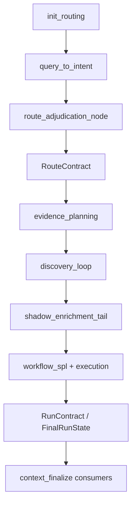

# Canonical RunContract / FinalRunState implementation plan

## Problem statement

Live `/chat` currently emits **competing truths** across pipeline stages T0–T5 ([`backend/app/chat/pipeline.py`](backend/app/chat/pipeline.py)):

- `evidence_planning` runs **before** `shadow_enrichment` / route adjudication (lines 329–332), freezing `needs_mcp`, `mcp_allowed`, and `planning_decision.hil_required` from pre-adjudication intent.
- Finalize builds `source_evidence`, `answer_contract`, `lineage`, `governance_trace`, `action_capability`, and `message` from **different** authority fields.
- Known contradictions: `action_capability.hil_required=false` ([`backend/app/actions/capability_policy.py`](backend/app/actions/capability_policy.py) line 27) vs `resolve_effective_hil_required()`; lineage `source_evidence: complete` with `len(source_evidence)` ([`backend/app/lineage/builder.py`](backend/app/lineage/builder.py) line 72) vs `insufficient_evidence`; `answer_preview` from raw `message` ([`backend/app/quality/store.py`](backend/app/quality/store.py) line 111).

**Constraint:** No narrow renderer patches. All final/debug/user-visible surfaces must consume one contract.

**Scope decision (confirmed):** Build **FinalRunState for every live `/chat` turn**. `CONTROL_PLANE_ENABLED` only toggles upstream capabilities (adjudication inputs, MCP loop, etc.), not whether the final state object exists.

---

## Target architecture



### Two-contract model

| Contract | When built | Purpose |
|----------|------------|---------|
| **RouteContract** | After route adjudication + `effective_skill` known | Canonical route for evidence planning, workflow skill, discovery loop gates |
| **RunContract** (alias **FinalRunState**) | After SPL + execution status known, **start of `context_finalize`** | Single truth for preview, HIL, evidence buckets, render flags, SPL lifecycle, lineage |

---

## New modules

### 1. [`backend/app/chat/contracts/run_contract.py`](backend/app/chat/contracts/run_contract.py) (new)

Pydantic models (match existing [`contracts/`](backend/app/chat/contracts/) style):

- `RouteContract` — routing slice:
  - `canonical_skill`, `legacy_skill`, `legacy_authoritative`, `authority_holder`
  - `path_type`, `intent_family` (from intent + planning_decision)
  - `live_data_request`, `guidance_request` (from `query_signals`)
  - `route_source` / `adjudication_authority_source`

- `RunContract` — full final state (user field list + extensions):
  - All fields from your spec (`execution_needed_for_answer`, `mcp_needed_for_live_answer`, `spl_*` lifecycle, `allow_*` render flags, etc.)
  - `routing: RouteContract` nested (or flat + `routing_contract` export for wire)
  - `candidate_artifact_refs`, `governance_refs` (IDs only; populated in Phase 3)

- `SourceEvidenceSummary` — wire helper for bundle tests:
  - `status`, `evidence_count`, `collected_evidence_count`, `produced_answer_sections`

Export `AUTHORITY_HOLDER = "canonical_run_contract"`.

### 2. [`backend/app/chat/run_contract_builder.py`](backend/app/chat/run_contract_builder.py) (new)

Pure functions, no side effects:

```python
build_route_contract(state: ChatPipelineState) -> RouteContract
build_run_contract(state: ChatPipelineState, *, route: RouteContract) -> RunContract
build_answer_preview(contract: RunContract) -> str
```

**RouteContract resolution rules:**
- `canonical_skill` = `route_adjudication.final_route` if present, else `routing_skill_resolution.effective_skill`, else `routed.skill`
- `legacy_skill` = initial `routed.skill` when `!= canonical_skill`, else `None`
- `legacy_authoritative` = `False`; `authority_holder` = `"canonical_run_contract"`
- Signals from `_query_signals_from_state(state)` ([`pipeline.py`](backend/app/chat/pipeline.py) ~3573)

**RunContract resolution rules (live-data + execution skipped):**

| Field | Rule |
|-------|------|
| `execution_needed_for_answer` | `live_data_request` and `canonical_skill in {spl_generation, attack_discovery}` |
| `mcp_needed_for_live_answer` | same as above |
| `execution_status` | `execution.status` or `"skipped"` |
| `execution_authorized` | status in executed set |
| `mcp_allowed` | from evidence_plan **allowed** flag (not `needs_mcp`) |
| `collected_evidence_count` | count `source_evidence` where `collection_status == "collected"` (compute from raw execution+RAG inputs in builder, not post-packaging list) |
| `source_evidence_available` | `collected_evidence_count > 0` |
| `effective_hil_required` | delegate to existing [`resolve_effective_hil_required()`](backend/app/chat/hil_resolution.py) with contract inputs |
| `allow_live_result_language` | `execution_authorized and collected_evidence_count > 0` |
| `allow_results_table` | same |
| `allow_mitre_mapping` | `needs_mitre` from plan AND collected evidence OR policy-backed in-catalog use case |
| `allow_severity_assessment` | false for analytics/live-data-without-evidence; preserve policy-backed alert paths |

**SPL lifecycle (Phase 1 populate; Phase 4 wire UI):**
- `spl_candidate_present` — non-empty `candidate_spl` or `spl_draft_preview.draft_spl`
- `spl_candidate_renderable` — present AND passes display policy (strong family draft > LLM plan-compiler; binding-missing → not renderable)
- `spl_validated` — `spl_validation.approved`
- `spl_normalized` — `normalized_spl` non-null
- `spl_execution_eligible` — always `false` (governance)
- `spl_status` / `spl_block_reason` — derived from validation + HIL reason (no `spl_present=true` + `generation=blocked` combo)

---

## Pipeline reorder (required for RouteContract authority)

**Current order** ([`pipeline.py`](backend/app/chat/pipeline.py) 328–348): `evidence_planning` → `discovery_loop` → `shadow_enrichment` → SPL.

**New order:**

1. `init_routing`
2. `query_to_intent`
3. **`graph_node_route_adjudication`** (extracted from `graph_node_shadow_enrichment`)
4. **`graph_node_route_contract`** — `build_route_contract`, patch `state["routed"]["skill"]`, store `route_contract`
5. `evidence_planning` — receives patched `routed` with canonical skill
6. `discovery_loop`
7. **`graph_node_shadow_enrichment`** (trimmed) — skill chain, shadow panels, LLM plan validation; **no longer** the first place adjudication runs
8. SPL / execution path (unchanged predicates)
9. `context_finalize` — build `RunContract` first, then all consumers

### Adjudication without pre-built evidence_plan

[`adjudicate_route()`](backend/app/routing/route_adjudication.py) accepts `evidence_plan=None`; the `evidence_plan_live_or_hybrid` branch (line 167) only fires when a plan exists. For cases that need it:

- Pass **provisional** `plan_evidence(intent)` inside `graph_node_route_adjudication` (intent-only, not enriched) solely for adjudication tie-break.
- Final `evidence_plan` is still built **after** RouteContract with canonical `routed.skill` passed into [`plan_evidence()`](backend/app/chat/evidence_planner.py) via `routed` param (line 77: `routed_skill`).

### Evidence-plan semantic overlay (Phase 3)

Extend evidence plan **display/export** with RunContract-derived fields without breaking existing gates:

- Add `execution_needed_for_answer`, `mcp_needed_for_live_answer` on evidence_plan dict at finalize (or on RunContract only; do not change `needs_mcp` boolean semantics for MCP gate code until tests pass).

---

## Phased implementation

### Phase 1 — Builders (read-only, no consumer changes)

**Files:**
- Add `run_contract.py`, `run_contract_builder.py`
- Unit tests: [`backend/app/tests/test_run_contract_builder.py`](backend/app/tests/test_run_contract_builder.py) — pure builder cases for substation, guidance, VPN generic

**Verify:** builders return expected values for three canonical queries with mocked state fixtures (no pipeline behavior change yet).

---

### Phase 2 — Pipeline hook + debug exposure (still read-only for consumers)

**Files:**
- [`backend/app/chat/pipeline.py`](backend/app/chat/pipeline.py) — pipeline reorder + `graph_node_route_contract`; at top of `graph_node_context_finalize`, call `build_run_contract`
- [`backend/app/chat/pipeline.py`](backend/app/chat/pipeline.py) `ChatPipelineState` — add `route_contract`, `run_contract`
- [`backend/app/schemas/responses.py`](backend/app/schemas/responses.py) — add optional `run_contract: dict | None`, `routing_contract: dict | None`
- [`backend/app/chat/pipeline.py`](backend/app/chat/pipeline.py) `PlaceholderResponse` construction (~2684) — attach both contracts
- [`backend/app/quality/store.py`](backend/app/quality/store.py) — merge `run_contract` into telemetry metadata (do **not** change `answer_preview` yet)
- [`backend/app/connectors/telemetry/read_store.py`](backend/app/connectors/telemetry/read_store.py) — surface `run_contract` in debug bundle if present

**Acceptance:** Live substation query shows correct `run_contract` in response JSON and debug bundle; existing analyst-visible behavior unchanged.

---

### Phase 3 — Wire highest-risk consumers

#### 3a. `metadata.answer_preview`

- New: `build_answer_preview(run_contract)` in builder module
- [`backend/app/quality/store.py`](backend/app/quality/store.py) `_link_trace_to_turn` — use contract preview, not `_preview(message)`
- Rules:
  - `execution_status != executed` + `canonical_skill == spl_generation` → fixed review-only SPL string
  - Else → `"Review-only response — no live telemetry was collected."`
  - Forbidden phrases unless `allow_live_result_language`: Guided investigation, Detected, Observed, Found, Currently showing, Mapped to

#### 3b. `action_capability.hil_required`

- [`backend/app/actions/capability_policy.py`](backend/app/actions/capability_policy.py) — add `action_capability_for(..., hil_required: bool | None = None)` or `from_run_contract(contract)`
- [`backend/app/chat/pipeline.py`](backend/app/chat/pipeline.py) `graph_node_context_finalize` (~1646) — pass `run_contract.effective_hil_required`
- Remove late-only patch as sole source of truth; contract is authoritative

#### 3c. `source_evidence` + lineage evidence count

- Refactor [`backend/app/evidence/source_evidence.py`](backend/app/evidence/source_evidence.py):
  - `build_source_evidence_refs(...)` — live/RAG/MCP **collected** rows only
  - `build_candidate_artifact_refs(...)` — SPL validation, candidate SPL, severity (metadata)
- When `run_contract.execution_status != executed`:
  - `source_evidence` list = RAG collected only (if any); **no** `splunk_mcp` skipped placeholder row
  - Export `source_evidence_summary` on RunContract / response
- [`backend/app/lineage/builder.py`](backend/app/lineage/builder.py):
  - `source_evidence` stage status = `skipped` or `metadata_only` when `collected_evidence_count == 0`
  - Remove unconditional `produced_answer_sections: ["splunk_results_table"]`
  - `mode_source` = `"live"` only when `execution_authorized`; else `"review_only"`

#### 3d. Final render gates

- [`backend/app/chat/final_answer_readability.py`](backend/app/chat/final_answer_readability.py) — `_apply_no_collected_evidence_render_gate` reads `RunContract.allow_*` passed via `AnswerContract` extension or direct param; remove duplicate inference from `spl_present` / `intent_family`
- [`backend/app/chat/analyst_response_builder.py`](backend/app/chat/analyst_response_builder.py) — suppress `splunk_results_table` when `not allow_results_table`

**Tests:** [`backend/app/tests/test_run_contract_bundle.py`](backend/app/tests/test_run_contract_bundle.py) tests A, B, E (partial).

---

### Phase 4 — SPL lifecycle + answer contract alignment

**Files:**
- [`backend/app/chat/contracts/answer_contract.py`](backend/app/chat/contracts/answer_contract.py):
  - Add mirrored fields: `spl_candidate_present`, `spl_candidate_renderable`, `spl_validated`, `spl_normalized`, `spl_execution_eligible`, `spl_block_reason`
  - Build from `RunContract` in `build_answer_contract()` (contract is input, not re-derived)
  - Deprecate contradictory `spl_present` for draft-only paths: `spl_present` = `spl_normalized`; render uses `spl_candidate_renderable`
- [`backend/app/chat/analyst_response_builder.py`](backend/app/chat/analyst_response_builder.py):
  - Single SPL surface: if `spl_candidate_renderable` → `draft_spl_code`; elif `spl_normalized` → `spl_code`; else binding clarification message (no artifact)
  - Remove ad-hoc LLM-vs-draft precedence patches (superseded by contract)
- [`backend/app/chat/t2_answer_surfacing.py`](backend/app/chat/t2_answer_surfacing.py) — message merge respects `allow_live_result_language`

**Tests:** Bundle tests A, C, D + existing [`test_spl_draft_preview.py`](backend/app/tests/test_spl_draft_preview.py) spot checks.

---

### Phase 5 — Debug / legacy route cleanup

**Files:**
- [`backend/app/chat/pipeline.py`](backend/app/chat/pipeline.py) — `selected_skill` on response = `run_contract.canonical_skill` always
- [`backend/app/governance/trace_panels.py`](backend/app/governance/trace_panels.py) — `skills_operations` panel reads `routing_contract`; label legacy as non-authoritative
- [`backend/app/lineage/builder.py`](backend/app/lineage/builder.py) — skill_chain stage uses `canonical_skill`
- [`backend/app/chat/pipeline.py`](backend/app/chat/pipeline.py) `_chat_message()` — generate from `build_answer_preview` + contract-driven checklist; remove T2 hunt/guided branch when `live_data_request and spl_review`
- Document in [`docs/observability/debugging.md`](docs/observability/debugging.md): `run_contract` / `routing_contract` field glossary

**Rule:** After Phase 5, no user-facing or contract-facing code reads `routed.skill`, `routing_provenance.skill`, or early `message` for authority.

---

## Required bundle-level tests

New file: [`backend/app/tests/test_run_contract_bundle.py`](backend/app/tests/test_run_contract_bundle.py)

Helper:

```python
def run_chat(query: str) -> dict:
    from app.chat.pipeline import build_live_chat_response
    from app.schemas.requests import ChatRequest
    return build_live_chat_response(ChatRequest(message=query)).model_dump(mode="json")
```

| ID | Query | Key assertions |
|----|-------|----------------|
| A | Substation live-data | `run_contract.canonical_skill == spl_generation`, `live_data_request`, `execution_needed_for_answer`, `mcp_needed_for_live_answer`, `collected_evidence_count == 0`, `effective_hil_required`, preview forbidden phrases, `action_capability.hil_required`, no `splunk_results_table` |
| B | OT guidance | `guidance_request`, `canonical_skill == guided_investigation`, `live_data_request == false` |
| C | VPN generic | `canonical_skill == spl_generation`, `detection_family == unmapped_live_data_request`, no `esp_it_to_ot_connection` in JSON |
| D | Substation strong family | `template_match_strength == strong` → `esp_it_to_ot_connection` |
| E | No evidence claims | full JSON lowercased: no `detected ot/protocol signals`, `currently showing`, `confirmed compromise`; no results table in rendered sections |

---

## Regression gate (must pass before complete)

```bash
cd backend && PYTHONPATH=../backend:.. python3 -m pytest \
  app/tests/test_run_contract_builder.py \
  app/tests/test_run_contract_bundle.py \
  app/tests/test_live_data_request_routing.py \
  app/tests/test_hil_resolution.py \
  app/tests/test_final_answer_readability.py \
  app/tests/test_105_path_honoring.py \
  app/tests/test_evidence_planner.py \
  app/tests/test_route_adjudication.py -q

./scripts/run_stage3_governance_regression.sh
```

**Manual debug bundles** (after Phase 2+): capture via `/debug/traces/{id}/bundle` for:
1. Substation live-data query
2. Privileged VPN live-data query
3. OT guidance query

Compare against Phase 3–5 acceptance table.

---

## Risk mitigations

| Risk | Mitigation |
|------|------------|
| Pipeline reorder breaks 105-path / LangGraph parity | Run `test_105_path_honoring.py` + `test_langgraph_dual_parity_phase13.py` each phase; keep imperative twin and graph dispatch predicates unchanged |
| `adjudicate_route` without evidence_plan changes exact-105 hybrid routes | Provisional `plan_evidence(intent)` only for adjudication; add adjudication unit tests for hybrid intent families |
| RAG-only paths lose source_evidence rows | RunContract distinguishes `evidence_origin=rag` vs `none`; RAG collected rows still allowed when `collection_status=collected` |
| Severity policy regression on alert paths | Bundle tests + existing severity policy tests; `allow_severity_assessment` preserves use-case policy when `use_case_id` + alert context |
| Removing skipped splunk_mcp row breaks sufficiency | `check_context_sufficiency` already treats non-collected as insufficient; aligns with contract |

---

## Out of scope (explicit deferrals)

- Experience Center fixture path (`routes_scenarios.py`) — isolated; optional parity later
- Changing global MCP execution flags or SPL executability governance
- Frontend TypeScript types until backend contract stable (add `run_contract` to [`frontend/src/types/api.ts`](frontend/src/types/api.ts) in Phase 2 if debug UI should display it)

---

## Completion criteria

- `run_contract` present on **every** live `/chat` response
- All five bundle tests green
- Governance regression green
- Three manual debug bundles show consistent canonical route, zero collected evidence when execution skipped, matching HIL across governance + action_capability + preview
- No forbidden preview phrases without executed telemetry
