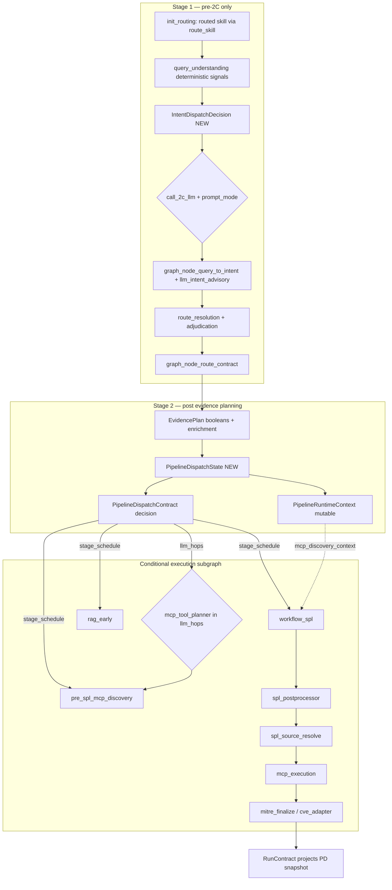
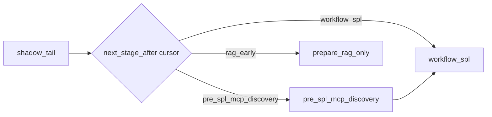

# Conditional pipeline + canonical dispatch plan (REV 4 — consistency pass)

## Problem (why details keep getting missed)

The accepted architecture (2C intake, Node 4 deterministic need, optional 4.5 MCP order, Node 6 SPL, 6.5 postprocessor, CVE/MITRE/knowledge branches) is sound, but **downstream nodes read different sources**:

| Concern | Authoritative today | What downstream actually reads |
|---------|---------------------|------------------------------|
| Slots | `build_user_constraint_bindings` (accepts `llm_intent_advisory`) | [`evidence_planner._attach_canonical_handoff_summaries`](backend/app/chat/evidence_planner.py) **does not pass** `llm_intent_advisory` into that call (~545) |
| Graph routing | `evidence_plan` booleans | LangGraph [`_after_*`](backend/app/graph/chat_workflow.py) + imperative [`pipeline.py`](backend/app/chat/pipeline.py) duplicate predicates |
| MCP need | `mcp_allowed` + gates | `spl_generation_only` conflates discovery-need vs execution-need (`needs_mcp=true`, `mcp_allowed=false`); reason `live_data_request_mcp_needed_but_not_allowed` already emitted ([`evidence_planner.py`](backend/app/chat/evidence_planner.py) ~348–361) — fix is semantic split, not missing reason text |
| SPL path | failover chain | `explicit_spl_authoring` early-return to lab draft **before** LLM ([`pipeline.py`](backend/app/chat/pipeline.py) ~4886–4919) |
| Postprocessor | universal utility only | T2 failover / generic lab draft skip [`normalize_review_only_spl`](backend/app/spl/review_only_spl_postprocessor.py); [`_candidate_from_llm_fallback`](backend/app/chat/pipeline.py) (~5866) never calls it |
| LLM SPL input | slot handoff + MCP discovery + 2C advisory | [`generate_llm_spl_via_plan`](backend/app/spl/llm_plan_compiler.py) takes only `user_query`; bare call at pipeline.py:5952 — slots/advisory/context lost going in |
| LLM SPL output | compiled SPL + plan authority | `compile_plan_to_spl(plan)` discards plan; [`LlmSplFallbackResult`](backend/app/spl/llm_fallback.py) has no `detection_plan`; source_resolve/MITRE/narration re-guess |
| SPL hop telemetry | LLM turn budget / record_llm_call | `spl_plan_compiler` success silent; only failure step `llm_spl_producer_failed` (~5959) |
| MCP before SPL | playbook describes it | [`run_mcp_source_discovery`](backend/app/spl/mcp_source_discovery.py) runs in Node 7 **after** SPL exists |
| Dispatch shape | ad-hoc booleans | 11 parallel `run_*` / `call_*` flags drift independently; no single schedule surface |

### Verified code gaps (plan must close)

| Gap | Code anchor | Plan fix |
|-----|-------------|----------|
| **A — Input** | `generate_llm_spl_via_plan(*, user_query, ...)` only; `_plan_user_prompt(user_query)` at llm_plan_compiler.py:164–165; call site pipeline.py:5952 | Phase 4A: extend signature + thread `slot_handoff`, `mcp_discovery_context`, optional `llm_intent_advisory` into prompt |
| **B — Output** | Plan parsed then compiled; `detection_plan` not on `LlmSplFallbackResult` | Phase 4B: `detection_plan` on `LlmSplFallbackResult` |
| **B2 — Persist** | Compiler has no `state`; `_candidate_from_llm_fallback` returns tuple only | `SplCandidateStageResult` + `persist_llm_spl_plan` in `graph_node_workflow_spl` |
| **C — Telemetry** | `record_llm_call` alone invisible in `control_plane_trace.llm_calls` | Dual: `record_llm_call` + `llm_turn_budget.record_sidecar` |
| **D — CP-off** | `evidence_planning` returns before `plan_evidence` when CP off (~1078) | CP-off dispatch fallback (Phase 2B) |
| **E — Budget thread** | `_candidate_spl_stage` already receives `llm_turn_budget` (~1635) but `_candidate_from_llm_fallback` does not (~5073) | Phase 4D: pass budget into fallback + `record_sidecar` |
| **F — llm_context** | `llm_intent_advisory` on state (~1645) not copied into `llm_context` for failover (~5081) | Phase 4A: include in `llm_context` or direct compiler arg |

RunContract ([`plans/2026-06-24_run-contract-canonical-state.md`](plans/2026-06-24_run-contract-canonical-state.md)) fixed **finalize** authority; this plan fixes **mid-pipeline** authority the same way — with **two stages** so 2C does not circularly depend on evidence planning.

---

## Target: two-stage dispatch spine



**Diagram note:** execution arrows show logical dataflow; **routing authority** after Phase 6 is `next_stage_after` + `dispatch_cursor`, not `stage in schedule` membership.

**Actual LangGraph order** ([`chat_workflow.py`](backend/app/graph/chat_workflow.py)): `init_routing` → `query_to_intent` (2C) → `route_resolution` → `route_contract` → `evidence_planning`. `RouteContract` and adjudicated skill **do not exist** when 2C fires.

**Rules:**

1. **Stage 1 (`IntentDispatchDecision`)** is built from **`state["routed"]`** (deterministic skill from `route_skill` in `init_routing`) + **`query_understanding`** deterministic signals only — at the top of `graph_node_query_to_intent`, **before** the 2C LLM call. It owns `call_2c_llm` and `prompt_mode` only. **Do not** read `RouteContract`, `route_adjudication`, or adjudicated skill (those nodes run **after** 2C).
2. **Stage 2 (`PipelineDispatchState`)** is built at `evidence_planning` from `RouteContract` + adjudicated `QueryToIntentResult` + `EvidencePlan`. It owns `stage_schedule` and post-evidence `llm_hops`.
3. After `evidence_planning`, **no node chooses branches from raw `query_signals`, `routed.skill`, or ad-hoc `if` chains**. It reads `state["pipeline_dispatch"]` (or fails closed to legacy path when flag off).
4. Legacy `run_*` / `call_*` booleans are **never written as authority** — only derived via `project_dispatch_flags(decision)` for backward-compatible consumers.

---

## Timing note: 2C circularity (REV 3 fix)

**Prior anti-pattern (REV 1–2):** placing `call_2c_llm` on `PipelineDispatchContract` built **after** Node 4 (evidence planning) creates a chicken-and-egg problem — Node 2C must run **before** evidence planning to populate `llm_intent_advisory` for slot handoff, but dispatch said whether to call 2C only **after** evidence planning.

**REV 3 resolution:** split dispatch into two contracts:

| Contract | When built | Owns 2C? | Owns stage schedule? |
|----------|------------|----------|----------------------|
| `IntentDispatchDecision` | After `init_routing`, **inside** `graph_node_query_to_intent` before 2C LLM call | Yes: `call_2c_llm`, `prompt_mode` | No |
| `PipelineDispatchContract` | After `plan_evidence` in `graph_node_evidence_planning` (post `route_contract`) | No | Yes: `stage_schedule`, `llm_hops` |

Node 2C reads **`state["intent_dispatch"]`** only. Node 4+ reads **`state["pipeline_dispatch"].decision`**. Never schedule 2C from post-evidence dispatch.

---

## IntentDispatchDecision (Stage 1 — pre-2C)

**Add** [`backend/app/chat/contracts/intent_dispatch.py`](backend/app/chat/contracts/intent_dispatch.py)

```python
class IntentPromptMode(str, Enum):
    skip = "skip"
    spl_slot_extraction = "spl_slot_extraction"
    catalogue_promotion = "catalogue_promotion"
    clarification = "clarification"

class IntentDispatchDecision(BaseModel):
    schema_version: Literal["v1"] = "v1"
    call_2c_llm: bool = False
    prompt_mode: IntentPromptMode = IntentPromptMode.skip
    skip_reasons: list[str] = Field(default_factory=list)
    dispatch_reasons: list[str] = Field(default_factory=list)
    authority_holder: str = "intent_dispatch_v1"
```

**Builder:** `build_intent_dispatch(state_slice) -> IntentDispatchDecision`

Inputs (only — **pre-adjudication, pre-RouteContract**):
- `state["routed"]` — deterministic skill from `route_skill` (`init_routing`); use `routed["skill"]` and `routing_provenance` (match path, catalogue hit, use_case_id)
- `query_understanding` — deterministic signals (`explicit_spl_authoring`, catalogue confidence, `soc_investigation_shaped`, unsafe-action guard, `mapped_use_case_ids`)
- `candidate_mappings` from deterministic intent build (same inputs 2C already receives today)
- Settings: `ai_soc_llm_intent_advisor_enabled`

**Not available pre-2C (do not read):** `RouteContract`, `route_adjudication`, adjudicated/final skill, `EvidencePlan`, `pipeline_dispatch`.

**Wire:** set `state["intent_dispatch"]` at the **top of** `graph_node_query_to_intent` before `generate_llm_intent_advisory`.

**2C is NOT an `LlmHop`** — it lives exclusively on `IntentDispatchDecision`. Post-evidence `llm_hops` covers only `mcp_tool_planner`, `spl_plan_compiler`, and `narration`.

---


## SlotHandoffSummary (Phase 0 — define before contracts)

**Today:** [`EvidencePlan.normalized_slot_summary`](backend/app/chat/contracts/evidence_plan.py) is a **dict** produced in [`_attach_canonical_handoff_summaries`](backend/app/chat/evidence_planner.py) (~556). The plan references `SlotHandoffSummary` but it does not exist in the repo yet.

**Add** [`backend/app/chat/contracts/slot_handoff.py`](backend/app/chat/contracts/slot_handoff.py):

```python
class SlotHandoffSummary(BaseModel):
    schema_version: Literal["v1"] = "v1"
    normalized_slots: dict[str, str] = Field(default_factory=dict)
    slot_sources: dict[str, str] = Field(default_factory=dict)
    validation_status: dict[str, str] = Field(default_factory=dict)
    unbound_constraints: list[dict[str, Any]] = Field(default_factory=list)
    planning_snapshot: bool = True
    built_at_stage: str = "evidence_planning"

def slot_handoff_from_normalized_summary(raw: dict[str, Any] | None) -> SlotHandoffSummary:
    """Coerce legacy dict-shaped normalized_slot_summary into the contract."""
```

- `build_pipeline_dispatch` reads `SlotHandoffSummary` via `slot_handoff_from_normalized_summary(evidence_plan.get("normalized_slot_summary"))`.
- Wire coercion in Phase 0 stub; full LLM slot merge in Phase 0 handoff fix.

---

## PipelineDispatchContract (Stage 2 — slim decision)


**Add** [`backend/app/chat/contracts/pipeline_dispatch.py`](backend/app/chat/contracts/pipeline_dispatch.py)

```python
class PipelineStage(str, Enum):
    rag_early = "rag_early"
    pre_spl_mcp_discovery = "pre_spl_mcp_discovery"
    workflow_spl = "workflow_spl"
    spl_postprocessor = "spl_postprocessor"
    spl_source_resolve = "spl_source_resolve"
    mcp_execution = "mcp_execution"
    mitre_finalize = "mitre_finalize"
    cve_adapter = "cve_adapter"

class LlmHop(str, Enum):
    mcp_tool_planner = "mcp_tool_planner"
    spl_plan_compiler = "spl_plan_compiler"
    narration = "narration"

class PipelineDispatchContract(BaseModel):
    schema_version: Literal["v1"] = "v1"
    request_mode: Literal[
        "spl_authoring", "spl_and_run", "live_investigation",
        "knowledge", "mitre_knowledge", "cve_review",
        "hybrid", "clarification", "utility_spl",
    ]
    # Sole routing authority — ordered execution schedule
    stage_schedule: list[PipelineStage] = Field(default_factory=list)
    # Post-evidence LLM hops only (2C excluded — see IntentDispatchDecision)
    llm_hops: list[LlmHop] = Field(default_factory=list)
    # Slot handoff (planning-time snapshot — downstream MUST prefer this)
    slot_handoff: SlotHandoffSummary
    dispatch_reasons: list[str] = Field(default_factory=list)
    authority_holder: str = "pipeline_dispatch_v1"
```

**No parallel `run_*` / `call_*` booleans on the contract.** Consumers that still need booleans call:

```python
def project_dispatch_flags(decision: PipelineDispatchContract) -> dict[str, bool]:
    stages = set(decision.stage_schedule)
    hops = set(decision.llm_hops)
    return {
        "run_rag_early": PipelineStage.rag_early in stages,
        "run_pre_spl_mcp_discovery": PipelineStage.pre_spl_mcp_discovery in stages,
        "run_workflow_spl": PipelineStage.workflow_spl in stages,
        "run_spl_postprocessor": PipelineStage.spl_postprocessor in stages,
        "run_spl_source_resolve": PipelineStage.spl_source_resolve in stages,
        "run_mcp_execution": PipelineStage.mcp_execution in stages,
        "run_mitre_finalize": PipelineStage.mitre_finalize in stages,
        "run_cve_adapter": PipelineStage.cve_adapter in stages,
        "call_mcp_tool_planner": LlmHop.mcp_tool_planner in hops,
        "call_spl_llm": LlmHop.spl_plan_compiler in hops,
        "call_narration_llm": LlmHop.narration in hops,
        # call_2c_llm is NEVER projected here — use intent_dispatch
    }
```

---

## PipelineRuntimeContext (mutable post-planning state)

**Add** to same module:

```python
class McpDiscoveryContext(BaseModel):
    indexes: list[str] = Field(default_factory=list)
    sourcetypes: list[str] = Field(default_factory=list)
    field_hints: dict[str, str] = Field(default_factory=dict)
    discovery_hops: list[dict[str, Any]] = Field(default_factory=list)
    populated_at_stage: str | None = None

class LlmSplPlanSnapshot(BaseModel):
    """Redacted detection plan the LLM chose before compile — advisory, not execution authority."""
    index: str | None = None
    sourcetype: str | None = None
    data_domain: str | None = None
    required_fields: list[str] = Field(default_factory=list)
    filters: list[str] = Field(default_factory=list)
    threshold: dict[str, Any] | None = None
    detection_family: str | None = None
    consumed_by: list[str] = Field(default_factory=list)
    scheduling_trace: dict[str, Any] = Field(default_factory=dict)

class PipelineRuntimeContext(BaseModel):
    mcp_discovery_context: McpDiscoveryContext | None = None
    llm_spl_plan: LlmSplPlanSnapshot | None = None
    dispatch_cursor: PipelineStage | None = None  # last completed stage; None = not started (Phase 2A)
    mcp_phase: Literal["pre_spl", "post_spl", "none"] = "none"
    scheduling_trace: dict[str, Any] = Field(default_factory=dict)

class PipelineDispatchState(BaseModel):
    decision: PipelineDispatchContract
    runtime_context: PipelineRuntimeContext = Field(default_factory=PipelineRuntimeContext)
```

**Wire into state** in [`graph_node_evidence_planning`](backend/app/chat/pipeline.py): after `plan_evidence` + `_attach_canonical_handoff_summaries`, call `build_pipeline_dispatch(...)` and set `state["pipeline_dispatch"]`.

**CP-off dispatch fallback (required):** Today when `CONTROL_PLANE_ENABLED=false`, [`graph_node_evidence_planning`](backend/app/chat/pipeline.py) returns early (~1078) with `evidence_plan: None` and **never calls `plan_evidence`**. Dispatch cannot be built only from post-`plan_evidence` state. Phase 2A/2B must add one of:
- **Option A (preferred):** CP-off lightweight `plan_evidence` + handoff path (same slot summary, no cyclic hub) so `build_pipeline_dispatch` always has inputs when `AI_SOC_PIPELINE_DISPATCH_V2_ENABLED=true`; or
- **Option B:** `build_pipeline_dispatch_cp_off_fallback(state)` from `routed` + `query_to_intent` + `intent_classification` + `planning_decision` without full `EvidencePlan`.

**Rollout claim narrowed:** dispatch authority is **CP-on complete first**; CP-off parity is explicit Phase 2B deliverable — do not claim "works CP on/off" until fallback lands.

Pre-SPL MCP discovery **updates `runtime_context.mcp_discovery_context`** (immutable decision copy + version bump on context only).

**LLM SPL plan output (Phase 4B):** `generate_llm_spl_via_plan` is a **pure function** (no `state`). It returns `detection_plan` on [`LlmSplFallbackResult`](backend/app/spl/llm_fallback.py) only. **Caller persistence is mandatory** via [`SplCandidateStageResult`](backend/app/chat/contracts/spl_candidate.py) (defined once in Phase 0 stub, implemented Phase 4):

- `_candidate_from_llm_fallback(...) -> SplCandidateStageResult | None` — **replaces** bare `(candidate_payload, validation_payload)` tuple.
- `graph_node_workflow_spl` / `_candidate_spl_stage`: on non-None result, call `persist_llm_spl_plan(state, result.detection_plan)` then merge payloads into state — **before** `spl_source_resolve`, MCP execution, `mitre_finalize`, narration.
- Do **not** pass `state` into `_candidate_from_llm_fallback` for side effects; persistence stays in the workflow node only.

Downstream must **prefer `llm_spl_plan` over re-parsing query** when present (fill blanks only; COE slots still win on conflict). Stamp `consumed_by: ["spl_source_resolve", "mcp_execution", "mitre_finalize", "narration"]`.

**Project into RunContract** in [`run_contract_builder.py`](backend/app/chat/run_contract_builder.py): add `pipeline_dispatch: dict | None` on `RunContract` (read-only mirror of `decision` for debug/UI/bundle tests).

---

## `stage_schedule` + `llm_hops` design

### Stage ordering conventions

`stage_schedule` is an **ordered list** — graph executor and imperative pipeline iterate in order. Typical subgraphs:

| Subgraph | `stage_schedule` (ordered) | `llm_hops` |
|----------|---------------------------|------------|
| Knowledge only | `[rag_early]` | `[]` |
| MITRE knowledge | `[rag_early, mitre_finalize]` | `[]` |
| CVE review | `[rag_early, cve_adapter]` | `[]` |
| SPL authoring (slots known) | `[workflow_spl, spl_postprocessor, spl_source_resolve]` | `[spl_plan_compiler]` when LLM path |
| SPL + run | `[pre_spl_mcp_discovery, workflow_spl, spl_postprocessor, spl_source_resolve, mcp_execution]` | `[mcp_tool_planner]` if ambiguous index; `[spl_plan_compiler]` if LLM SPL |
| Hybrid alert | `[rag_early, workflow_spl, spl_postprocessor, spl_source_resolve, mitre_finalize]` | `[spl_plan_compiler]` optional |
| Live investigation | `[pre_spl_mcp_discovery, workflow_spl, spl_postprocessor, spl_source_resolve, mcp_execution, mitre_finalize]` | as needed |


### Schedule cursor (Phase 6 — not membership-only)

`stage_schedule` is ordered, but **membership checks alone are insufficient** — current LangGraph uses fixed predicates ([`_after_shadow_tail`](backend/app/graph/chat_workflow.py):185) with no cursor, so stages can run out of order or skip scheduled later nodes.

**Add** helper (field already on `PipelineRuntimeContext` above — Phase 2A must create it):

```python
def next_stage_after(schedule: list[PipelineStage], current: PipelineStage | None) -> PipelineStage | None:
    """Return the next scheduled stage after current, or first when current is None."""
```

- LangGraph conditional edges and imperative executor advance **cursor → next_stage_after**; never branch on `stage in schedule` without position.
- Parity tests assert **exact stage order** (e.g. `[pre_spl_mcp_discovery, workflow_spl, spl_postprocessor, spl_source_resolve]`), not just set equality.

**Invariant:** when `workflow_spl` is in schedule, `spl_postprocessor` **must** follow immediately after SPL generation (before `spl_source_resolve`).

### Postprocessor: inline (Phases 3–4) vs graph node (Phase 6)

| Phase | Where `finalize_review_only_spl` runs |
|-------|--------------------------------------|
| 3 | Inline in lab draft, governed template, utility paths inside existing candidate builders |
| 4C | Inline inside `_candidate_from_llm_fallback` before building `SplCandidateStageResult` |
| 6 | Extract to `graph_node_spl_postprocessor` when `AI_SOC_PIPELINE_DISPATCH_V2_ENABLED=true`; cursor advances through `spl_postprocessor` stage; `workflow_spl` emits **raw** candidate only |

Until Phase 6, `PipelineStage.spl_postprocessor` in `stage_schedule` is **planning metadata** + cursor target; hook still runs inline in `workflow_spl`. Phase 6 parity tests assert the dedicated node owns the hook when flag on.

### `llm_hops` rules

- Populated only on `PipelineDispatchContract` (post evidence planning).
- `spl_plan_compiler` requires `ai_soc_llm_spl_fallback_enabled` + family eligibility.
- `mcp_tool_planner` requires `MCP_DISCOVERY_ENABLED` + ambiguous slot handoff.
- `narration` requires `AI_SOC_LLM_FINAL_SYNTHESIS_ENABLED` + `AI_SOC_LLM_LIVE_SYNTHESIS_ENABLED` (advisory only; deterministic wins).

---

## Intent prompt modes (Phase 1A — table-driven)

**Replace** monolithic [`build_intent_advisory_prompt`](backend/app/llm/sidecar_clients.py) with mode-specific builders:

| `prompt_mode` | When selected | Max slot keys in JSON schema | Schema focus |
|---------------|---------------|------------------------------|--------------|
| `skip` | High-confidence deterministic route; explicit SPL-meta; unsafe-action guard | — (no LLM call) | N/A |
| `spl_slot_extraction` | `spl_authoring`, `utility_spl`, out-of-catalog SPL meta | `index`, `indexes`, `sourcetype`, `host`, `user`, `src_ip`, `dest_ip`, `event_code`, `time_window`, `threshold`, `lookup` | `entity_slots_candidate`, `entity_slot_confidence`, `spl_authoring_request` |
| `catalogue_promotion` | Near-catalogue paraphrase; low-confidence family | `index`, `sourcetype`, `host`, `user`, `event_code` | `intent_family_candidate`, `question_ref_candidate`, `use_case_id_candidate`, `paraphrase_detected` |
| `clarification` | Ambiguous investigation; missing alert context | `host`, `user`, `event_id` (optional anchors only) | `ambiguity_reasons`, `clarification_draft`, `confidence_metadata` |

**Per-mode JSON schemas** live in [`backend/app/llm/intent_prompt_modes.py`](backend/app/llm/intent_prompt_modes.py) (new). Each mode exports `build_prompt(query, context_block) -> str` and `response_schema() -> dict`.

**Do not** add MCP tool list or RAG playbook IDs to any 2C schema (8B scorecard: intent role DEGRADED; keep schemas small).

Record `scheduling_trace.consumed_by` on advisory: `["evidence_plan_handoff", "spl_plan_compiler", "postprocessor"]`.

---

## `request_mode` mapping table

`build_pipeline_dispatch` (Phase 2B) must read the **pinned source field** per row — mixing `intent_family` and `answer_mode` silently misses rows (e.g. `spl_utility_authoring` is an **`answer_mode`**, not `intent_family`; set only when `intent_family == spl_generation_only` in [`evidence_planner.py`](backend/app/chat/evidence_planner.py) ~315–321).

| Source field | Value(s) | `request_mode` | Typical `stage_schedule` |
|--------------|----------|----------------|--------------------------|
| `intent_family` | `knowledge_only` | `knowledge` | `[rag_early]` |
| `intent_family` | `mitre_mapping`, `mitre_explanation` | `mitre_knowledge` | `[rag_early, mitre_finalize]` |
| `intent_family` | `cve_investigation` | `cve_review` | `[rag_early, cve_adapter]` |
| `intent_family` | `spl_generation_only` + `answer_mode` | `spl_utility_authoring` → `utility_spl`; else → `spl_authoring` | SPL subgraph; `pre_spl_mcp_discovery` if slots missing |
| `intent_family` | `spl_generation_and_run` | `spl_and_run` | pre-MCP + SPL + execution |
| `intent_family` | `hybrid_investigation_plus_policy`, `hybrid_alert_review` | `hybrid` | RAG + SPL + MITRE per plan |
| `intent_family` | `clarification_required` | `clarification` | `[]` or `[rag_early]` only |
| `intent_family` | `guided_investigation`, `github_investigation` | `clarification` / `live_investigation` | per existing `EvidencePlan` branch |
| `answer_mode` (fallback) | `live_investigation` | `live_investigation` | SPL + optional MCP |
| `answer_mode` | `rag_only` | `knowledge` | `[rag_early]` |

---

## Phase 0 — Canonical handoff fix (blocking; no behavior change yet)

**Repo delta (2026-06-29):** `graph_node_query_to_intent` already preserves typed `LLMIntentAdvisory` on `state["llm_intent_advisory"]` ([`pipeline.py:1005`](backend/app/chat/pipeline.py)). The **remaining handoff bug** is evidence planning: `_attach_canonical_handoff_summaries` does not pass it into `build_user_constraint_bindings` ([`evidence_planner.py:545`](backend/app/chat/evidence_planner.py)).

**Fix the root slot drift:** [`build_user_constraint_bindings`](backend/app/spl/user_constraint_bindings.py) already accepts `llm_intent_advisory`; wire the call in [`_attach_canonical_handoff_summaries`](backend/app/chat/evidence_planner.py) to pass `llm_intent_advisory` from `query_to_intent` / planner inputs (same as [`_spl_user_constraint_bindings`](backend/app/chat/pipeline.py)).

**Add** contract stubs:
- `IntentDispatchDecision` + `build_intent_dispatch` (returns `skip` by default)
- `SlotHandoffSummary` + `slot_handoff_from_normalized_summary` (Phase 0)
- `PipelineDispatchContract` + `PipelineDispatchState` + `build_pipeline_dispatch` (returns empty schedule by default)
- `project_dispatch_flags()` legacy projection
- `SplCandidateStageResult` stub in [`backend/app/chat/contracts/spl_candidate.py`](backend/app/chat/contracts/spl_candidate.py)

**Add** `test_evidence_plan_includes_llm_slots_in_handoff` — 2C slots appear in `normalized_slot_summary` with `slot_sources.llm`.

**Add** `test_pipeline_dispatch_authority_read_sweep` (pattern from RunContract Phase 5): grep-based or explicit registry test that downstream modules imported for SPL/MCP/RAG do not read `extract_query_signals` for dispatch when `pipeline_dispatch` exists.

**Flag:** `AI_SOC_PIPELINE_DISPATCH_V2_ENABLED` (default `false` in [`config.py`](backend/app/config.py); document in [`.env.example`](.env.example); set `true` in [`.env`](.env) when testing dispatch from Phase 2A onward).

---

## Phase 1A — Intent dispatch + table-driven 2C prompts

**Files:** [`llm/intent_prompt_modes.py`](backend/app/llm/intent_prompt_modes.py) (new), [`llm/sidecar_clients.py`](backend/app/llm/sidecar_clients.py), [`chat/pipeline.py`](backend/app/chat/pipeline.py) (`graph_node_query_to_intent`), [`chat/llm_intent_advisor.py`](backend/app/chat/llm_intent_advisor.py)

1. Implement `build_intent_dispatch` from `state["routed"]` + `query_understanding` only (no `RouteContract` / adjudication).
2. Wire `state["intent_dispatch"]` before 2C call; gate LLM on `call_2c_llm` only (not post-evidence dispatch).
3. Route to per-mode prompt builder via `prompt_mode`.
4. Extend `should_skip_sidecar` to honor `IntentDispatchDecision.call_2c_llm=false`.

**Tests:** extend [`test_intent_advisor_scheduling.py`](backend/app/tests/test_intent_advisor_scheduling.py); outbound-spike fixture asserts 2C skipped when `explicit_spl_authoring` + high confidence.

---

## Phase 2A — Dispatch shell (models + projection + wiring stub)

**Files:** [`pipeline_dispatch_builder.py`](backend/app/chat/pipeline_dispatch_builder.py) (new), [`graph_node_evidence_planning`](backend/app/chat/pipeline.py)

1. Implement `PipelineStage`, `LlmHop`, `PipelineDispatchContract`, `PipelineRuntimeContext` (incl. `dispatch_cursor`), `PipelineDispatchState`, `next_stage_after()`.
2. Implement `project_dispatch_flags()` — sole source of legacy booleans.
3. Stub `build_pipeline_dispatch` returning minimal `request_mode` + empty schedules (flag on only).
4. Wire `state["pipeline_dispatch"]` after evidence planning (CP-on path); stub CP-off fallback builder when `evidence_plan` is None (~1078).

**Tests:** unit tests for `project_dispatch_flags` round-trip; flag-off path unchanged.

**Implementation note (2026-06-29):** repo state already had the Phase 2A shell in
[`chat/contracts/pipeline_dispatch.py`](backend/app/chat/contracts/pipeline_dispatch.py)
from Phase 0, so Phase 2A extended that existing contract surface instead of
adding a parallel `pipeline_dispatch_builder.py`.

---

## Phase 3 — Mandatory Node 6.5 postprocessor (all SPL sources)

**Add** `finalize_review_only_spl(...)` in [`backend/app/spl/review_only_spl_postprocessor.py`](backend/app/spl/review_only_spl_postprocessor.py) (extend existing module; thin wrapper over `normalize_review_only_spl` + hash trace):

`finalize_review_only_spl(raw_spl, *, query, family, slot_handoff, llm_generated, mcp_discovery_context) -> NormalizedSplResult`

Generalize [`build_utility_postprocessor_context`](backend/app/spl/utility_spl_authoring.py) for non-universal families (network, auth, scada catalogue rows).

**Call sites in Phase 3 (non-LLM paths only):**
- [`_candidate_from_lab_draft`](backend/app/chat/pipeline.py)
- [`candidate_from_universal_utility_authoring`](backend/app/spl/utility_spl_authoring.py) — refactor to shared helper
- Governed template path: no-op pass via trace (see invariant below)

**Deferred to Phase 4C:** [`_candidate_from_llm_fallback`](backend/app/chat/pipeline.py) (requires `SplCandidateStageResult` return shape + budget thread)

**Trace invariant (REV 3):**

```python
# Every SPL candidate path MUST emit:
trace["postprocessor_evaluated"] = True  # always
trace["raw_spl_hash"] = sha256(raw_spl)[:16]  # provable before/after
trace["normalized_spl_hash"] = sha256(normalized_spl)[:16]
trace["changes"] = [...]  # e.g. ["index_placeholder_hygiene", "time_bound_injected"]
if not changes_applied:
    trace["postprocessor_applied"] = False
    trace["no_op_reason"] = "template_already_normalized"  # required when applied=false
    assert raw_spl == normalized_spl  # governed-template byte-identity
else:
    trace["postprocessor_applied"] = True

# spl_plan_compiler dual telemetry: DEFERRED to Phase 4 (requires llm_turn_budget threaded through
# _candidate_spl_stage → _candidate_from_llm_fallback — not available at Phase 3). Phase 3 only: postprocessor hashes.
```

`postprocessor_evaluated=true` is **unconditional** whenever SPL is surfaced for review. `postprocessor_applied=false` is allowed **only** with a documented `no_op_reason` (e.g. governed template already normalized).

**Governed-template byte-identity (governance baseline):** when postprocessor runs on a governed-template candidate, assert **zero mutation** of SPL text — output bytes identical to template input. Trace may record `postprocessor_evaluated=true`, `postprocessor_applied=false`, `no_op_reason=template_already_normalized`, but the hook must not silently rewrite template SPL. Add regression alongside in-catalogue 105/50 byte-identical bypass checks.

**Tests:** extend [`test_review_only_spl_postprocessor.py`](backend/app/tests/test_review_only_spl_postprocessor.py) + live outbound-spike regression (generic lab draft gets COE index hygiene); `test_governed_template_postprocessor_byte_identity`; `test_postprocessor_trace_hashes_prove_diff`. (`test_spl_plan_compiler_success_telemetry` moves to Phase 4.)

---

## Phase 4 — Node 6 SPL path: input/output preservation + postprocessor

**Files:** [`pipeline.py`](backend/app/chat/pipeline.py) (`graph_node_workflow_spl` → `_candidate_spl_stage` → `_candidate_from_llm_fallback`), [`contracts/spl_candidate.py`](backend/app/chat/contracts/spl_candidate.py), [`llm_plan_compiler.py`](backend/app/spl/llm_plan_compiler.py), [`llm_fallback.py`](backend/app/spl/llm_fallback.py)

**Phase-order note:** Phase 4 lands **before** Phase 2B.

**Within Phase 4 implementation order:** 4.0 short-circuit removal → 4A compiler inputs → 4B types (`LlmSplFallbackResult.detection_plan`, `SplCandidateStageResult`, `persist_llm_spl_plan`) → 4C postprocessor + failover + change `_candidate_from_llm_fallback` return → 4D budget + dual telemetry → update `_candidate_spl_stage` to unwrap `SplCandidateStageResult` from fallback while non-LLM paths may still return `(candidate, validation)` tuple until Phase 6 extraction (document in tests). Phase 2A stubs empty `llm_hops`, so **do not** gate Phase 4 LLM precedence solely on `pipeline_dispatch.decision.llm_hops` until 2B ships.

### 4.0 — Remove short-circuit

Remove unconditional `explicit_spl_authoring` → `_candidate_from_lab_draft` return **before** failover (keep universal utility branch).

### 4A — Input preservation (mandatory signature change)

**Today:** `generate_llm_spl_via_plan(*, user_query, client, seed)` — slots/advisory/MCP context never reach the model ([`llm_plan_compiler.py:201`](backend/app/spl/llm_plan_compiler.py), call at [`pipeline.py:5952`](backend/app/chat/pipeline.py)).

**Change signatures** (not prompt-only):

```python
def generate_llm_spl_via_plan(
    *,
    user_query: str,
    slot_handoff: SlotHandoffSummary | dict[str, Any] | None = None,
    mcp_discovery_context: McpDiscoveryContext | dict[str, Any] | None = None,
    llm_intent_advisory: dict[str, Any] | None = None,
    client: LocalChatClient | None = None,
    seed: int = SPL_PLAN_SEED,
    ...
) -> LlmSplFallbackResult | None:
```

- Extend `get_detection_plan` / `_plan_user_prompt` to accept structured context blocks (redacted slots, discovery indexes/sourcetypes/field_hints, 2C `entity_slots_candidate`).
- **`_candidate_from_llm_fallback` must thread** handoff from `llm_context` / `normalized_slot_summary` / `pipeline_dispatch.decision.slot_handoff` — replace bare `generate_llm_spl_via_plan(user_query=user_query)`.
- Precedence gate (**Phase 4**): `ai_soc_llm_spl_fallback_enabled` + family eligibility; **after 2B** + `AI_SOC_PIPELINE_DISPATCH_V2_ENABLED`, `LlmHop.spl_plan_compiler` in `llm_hops` becomes authoritative.

### 4B — Output preservation (LLM plan → runtime_context → downstream)

**Today:** `compile_plan_to_spl(plan)` produces SPL but the plan is **discarded**. `generate_llm_spl_via_plan` has no `state` parameter; `_candidate_from_llm_fallback` returns only `(candidate_payload, validation_payload)` — plan cannot reach later nodes as written.

**Single return contract:** [`SplCandidateStageResult`](backend/app/chat/contracts/spl_candidate.py) — no tuple extension, no state side-effect in fallback.

1. Add `detection_plan: dict[str, Any] | None` to [`LlmSplFallbackResult`](backend/app/spl/llm_fallback.py) (redacted: no raw query echo). Populate inside `generate_llm_spl_via_plan` after successful parse — **return only, do not write state inside compiler**.
2. Change `_candidate_from_llm_fallback` to return `SplCandidateStageResult | None` (carries `detection_plan` + `compiler_telemetry` from plan compiler path).
3. Add `persist_llm_spl_plan(state, detection_plan) -> ChatPipelineState` in [`pipeline.py`](backend/app/chat/pipeline.py) — maps to [`LlmSplPlanSnapshot`](backend/app/chat/contracts/pipeline_dispatch.py) on `state["llm_spl_plan"]` + `pipeline_dispatch.runtime_context.llm_spl_plan`.
4. **Caller wiring (mandatory):** `graph_node_workflow_spl` calls `_candidate_spl_stage` → receives `SplCandidateStageResult | None` (postprocessor already applied in 4C); calls `persist_llm_spl_plan(state, result.detection_plan)` when present; merges payloads into state — **before** `spl_source_resolve`.
5. Stamp `scheduling_trace.consumed_by: ["spl_source_resolve", "mcp_execution", "mitre_finalize", "narration"]` on the snapshot.
6. **Downstream readers** (Phase 4B + Phase 5/6):
   - `graph_node_spl_source_resolve` — prefer plan index/sourcetype when COE slots blank
   - MCP execution / discovery adapters — field_hints from plan
   - `mitre_finalize` — detection_family / data_domain hints
   - narration prompt blocks — plan assumptions (redacted)

Plan-only `consumed_by` on 2C advisory slots is **insufficient** — the compiled detection plan is separate authority and must be **caller-persisted**.

### 4C — Postprocessor + failover chain

1. **LLM SPL never bypasses `finalize_review_only_spl`** — wire hook inside `_candidate_from_llm_fallback` after plan compiler **and** free-form `generate_llm_spl_fallback` (today only utility_spl_authoring + draft_preview call `normalize_review_only_spl`).
2. Failover order when gate passes:
   - catalogue template (if matched)
   - else `generate_llm_spl_via_plan` (4A inputs + 4B output capture)
   - else family lab draft
   - else clarification
3. Read slots from canonical handoff — not re-parse query ad hoc.
4. Return `SplCandidateStageResult` with **postprocessed** `candidate_payload` / `validation_payload` + `detection_plan` + `compiler_telemetry`.

### 4D — SPL plan compiler dual telemetry + budget threading

**Note:** `_candidate_spl_stage` already passes `llm_turn_budget` from `graph_node_workflow_spl` (~1635); gap is `_candidate_from_llm_fallback` (~5866) not receiving it (~5073).

- Thread `llm_turn_budget: TurnLlmBudget` into `_candidate_from_llm_fallback` signature from `_candidate_spl_stage`.
- On plan-compiler success/failure, write **both**:
  1. `telemetry.record_llm_call(trace_id, kind="sidecar", role="spl_plan_compiler", ...)`
  2. `budget.record_sidecar(role="spl_plan_compiler", provider_label=..., outcome=..., latency_ms=..., model=...)`
- Return hop metadata on `SplCandidateStageResult.compiler_telemetry` for tests.
- See `pipeline_visibility._llm_calls_summary` (budget-only) and `control_plane_trace["llm_calls"]` (~3444).
- Phase 8 / debug: assert `spl_plan_compiler` in `llm_turn_budget.records` AND `/debug` `debug_summary.llm.live_roles`.

**Flags:** `ai_soc_llm_spl_fallback_enabled` (Phase 4 authority); `AI_SOC_PIPELINE_DISPATCH_V2_ENABLED` + `llm_hops` (Phase 2B+ authority).

**Tests:** `test_llm_spl_plan_persisted_by_workflow_spl_not_compiler`; `test_spl_plan_compiler_success_telemetry`; `test_spl_plan_compiler_in_llm_turn_budget_and_debug_summary`; `test_out_of_catalog_spl_meta_uses_llm_before_generic_skeleton` (gated on `ai_soc_llm_spl_fallback_enabled`); `test_llm_spl_plan_compiler_receives_slot_handoff`; `test_detection_plan_written_to_runtime_context`; `test_spl_source_resolve_consumes_llm_spl_plan`; assert `postprocessor_evaluated=true` + hash diff on LLM path; governance regression unchanged when flags off.

---

## Phase 2B — Full dispatch authority (builder completion)

**Files:** [`evidence_planner.py`](backend/app/chat/evidence_planner.py), [`pipeline_dispatch_builder.py`](backend/app/chat/pipeline_dispatch_builder.py)

1. Complete `build_pipeline_dispatch` from `RouteContract` + `EvidencePlan` + adjudicated `QueryToIntentResult` + `query_understanding`.
2. Populate `stage_schedule` and `llm_hops` per `request_mode` table (not parallel booleans).
3. Fix `spl_generation_only` MCP semantics: **split discovery-need from execution-need** (`needs_pre_spl_mcp_discovery` vs `needs_mcp_execution`). Reason text `live_data_request_mcp_needed_but_not_allowed` already exists (~348–361); do not treat missing reason as the bug — fix the conflation so dispatch can schedule `pre_spl_mcp_discovery` without implying `mcp_execution`.
4. Populate `mitre_finalize` / `cve_adapter` stages from existing families — **no new LLM**.
5. RAG collection choice stays in [`select_rag_collections`](backend/app/knowledge/rag_collection_selector.py) — dispatch only schedules `rag_early`.
6. **CP-off parity:** implement `build_pipeline_dispatch_cp_off_fallback` or lightweight CP-off `plan_evidence` so dispatch authority works when `CONTROL_PLANE_ENABLED=false` and `AI_SOC_PIPELINE_DISPATCH_V2_ENABLED=true`.

**Tests:** [`test_evidence_planner.py`](backend/app/tests/test_evidence_planner.py) matrix for each family; [`test_evidence_plan_handoff_drift.py`](backend/app/tests/test_evidence_plan_handoff_drift.py) unchanged behavior when flag off; authority read sweep green.

---

## Phase 5 — Pre-SPL MCP discovery subgraph

**New node** `graph_node_pre_spl_mcp_discovery` in [`pipeline.py`](backend/app/chat/pipeline.py):

- Runs when `next_stage_after(stage_schedule, dispatch_cursor) == PipelineStage.pre_spl_mcp_discovery` (cursor-driven — not membership-only)
- Uses [`run_mcp_source_discovery`](backend/app/spl/mcp_source_discovery.py) + optional extra hop [`splunk_get_index_info`](backend/app/connectors/mcp/mcp_tool_playbook.json) when target index known
- Optional LLM: [`plan_tool_chronology`](backend/app/connectors/mcp/mcp_tool_planner.py) only when `LlmHop.mcp_tool_planner` in `decision.llm_hops` (membership OK for hops; **stages** use cursor only)
- Writes **`mcp_discovery_context`** into `pipeline_dispatch.runtime_context` (decision immutable)
- Bounded by `MAX_MCP_HOPS` / discovery-only tools (never `splunk_run_query` here)

**LangGraph** ([`chat_workflow.py`](backend/app/graph/chat_workflow.py)):



**Imperative path:** mirror via [`executor.py`](backend/app/planner/executor.py) — advance `dispatch_cursor` via `next_stage_after` when flag on (same semantics as Phase 6).

**Governance:** requires `MCP_DISCOVERY_ENABLED`; live I/O still needs global execution gate per [`mcp_loop_discovery.py`](backend/app/spl/mcp_loop_discovery.py).

---

## Phase 6 — LangGraph + executor parity (cursor-driven, not membership)

1. Add `graph_node_spl_postprocessor` (extract from inline Phase 3–4 hooks when flag on); replace [`_after_shadow_tail`](backend/app/graph/chat_workflow.py), `_after_workflow_spl`, `_after_rag_early` with **`next_stage_after(stage_schedule, dispatch_cursor)`** routing (flag on) — not `stage in schedule` membership checks.
2. Advance `pipeline_dispatch.runtime_context.dispatch_cursor` after each completed stage; skip unscheduled stages entirely.
3. CP-on hub ([`_hub_route`](backend/app/graph/chat_workflow.py)): distinguish **pre-SPL discovery loop** vs **post-SPL execution loop** using `runtime_context.mcp_phase` (`pre_spl | post_spl | none`).
4. [`test_langgraph_shadow_phase12.py`](backend/app/tests/test_langgraph_shadow_phase12.py) + [`test_planner_executor.py`](backend/app/tests/test_planner_executor.py): parity imperative vs LangGraph for 6 representative `request_mode` paths; **assert exact stage order** via cursor trace.

---

## Phase 7 — Catalogue SCADA/Cisco; retire T2 native early return

1. Promote `scada_perf` / `cisco_asa` to catalogue/template or governed draft families ([`draft_preview.py`](backend/app/spl/draft_preview.py) / [`templates.json`](backend/app/spl/templates.json) as appropriate).
2. Remove `_candidate_from_t2_spl_native` early return in [`_candidate_spl_stage`](backend/app/chat/pipeline.py) when catalogue hit; keep [`runtime_source_profiles.py`](backend/app/spl/runtime_source_profiles.py) for validator profiles only.
3. Dispatch sets `LlmHop.spl_plan_compiler` for out-of-catalog; catalogue hits omit it from `llm_hops`.

**Template promotion ritual (required — avoids eval-green / live-red drift):**
- Follow [`spl-template-add` skill](.claude/skills/spl-template-add/SKILL.md): regen `spl_template_review_sheet`, restore nine timestamp-only sibling templates, avoid regex alternation in template `match()` patterns.
- Align `SPL_ALLOWED_INDEXES` / `SPL_ALLOWED_SOURCETYPES` in deployment `.env` with template placeholders — eval bypass can stay green while live validator rejects if env drifts.
- Run `scripts/llm_template_audit.py` + catalogue eval before removing T2 native early return.

**Tests:** existing [`test_t1_spl_native_routing.py`](backend/app/tests/test_t1_spl_native_routing.py) updated to catalogue-first expectations; template byte-identity in governance regression.

---

## Phase 8 — Bundle regression + CVE/MITRE/knowledge coverage

Extend [`test_run_contract_bundle.py`](backend/app/tests/test_run_contract_bundle.py) with **Tests F–J**:

| Test | Query class | Assert on `pipeline_dispatch` + RunContract |
|------|-------------|---------------------------------------------|
| F | MITRE explain (`T1021`) | `request_mode=mitre_knowledge`, no SPL stages, `mitre_finalize` in schedule |
| G | CVE investigation | `request_mode=cve_review`, `cve_adapter` in schedule, honest vuln degrade |
| H | SOP/playbook | `request_mode=knowledge`, `[rag_early]` only |
| I | Outbound spike SPL meta | `spl_plan_compiler` in `llm_hops` (post-2B) or flag-on path; `detection_plan` / `llm_spl_plan` present; `consumed_by` includes `spl_source_resolve`; postprocessor hashes prove diff; spl_plan_compiler success on trace spine; slots in handoff |
| J | Hybrid alert | SPL + MITRE stages both scheduled |

Add [`scripts/eval_pipeline_dispatch_matrix.py`](scripts/eval_pipeline_dispatch_matrix.py) `--check` (non-gating in governance script first).

**Remove or wire** `evidence_need_hints` — either consume in `build_pipeline_dispatch` (map to `pre_spl_mcp_discovery` stage) or drop from 2C prompt to save tokens.

---

## Rollout and flags

| Flag | Code default (`config.py`) | Scope |
|------|---------------------------|-------|
| `AI_SOC_PIPELINE_DISPATCH_V2_ENABLED` | `false` | Master switch for dispatch authority + graph branches |
| `AI_SOC_LLM_INTENT_ADVISOR_ENABLED` (`ai_soc_llm_intent_advisor_enabled`) | existing | 2C gated by `IntentDispatchDecision` |
| `AI_SOC_LLM_SPL_FALLBACK_ENABLED` (`ai_soc_llm_spl_fallback_enabled`) | existing | Node 6 LLM (`spl_plan_compiler` hop) |
| `MCP_DISCOVERY_ENABLED` (`mcp_discovery_enabled`, default `true` in config) / `MCP_GLOBAL_EXECUTION_ENABLED` | existing | Pre-SPL vs run_query (execution stays off unless COE approves) |
| `CONTROL_PLANE_ENABLED` | existing | CP hub loop; full dispatch requires CP-on OR Phase 2B CP-off fallback |
| `AI_SOC_DEBUG_API_ENABLED` | existing | Debug bundle / final_output surfaces (Phase 0.5 / 2C) |

### Dev/staging `.env` posture (operator rule)

**Code defaults stay `false`** so governance regression and flag-off pytest paths remain byte-identical (105/50 baseline). **Any flag required to exercise plan behavior on this host must be `true` in [`.env`](.env)** (not only documented in [`.env.example`](.env.example)).

When a phase introduces or depends on a flag:

1. Add the env key to [`config.py`](backend/app/config.py) + [`.env.example`](.env.example) with a one-line comment.
2. Set **`true` in `.env`** on the dev/staging host before manual `/chat` probes or phase sign-off.
3. **Never commit `.env`** (gitignored). Commit `.env.example` only.
4. After `docker compose up -d` / backend restart, verify via `GET /health` or settings status that the flag is active.

**Required `.env` values for this plan (COE dev host — keep on while implementing/testing):**

```bash
# Already expected on this host (.env.example posture):
CONTROL_PLANE_ENABLED=true
AI_SOC_LLM_INTENT_ADVISOR_ENABLED=true
AI_SOC_LLM_SPL_FALLBACK_ENABLED=true
AI_SOC_DEBUG_API_ENABLED=true

# Add when flag lands (Phase 0 config stub; turn on in .env from Phase 2A for dispatch shell probes):
AI_SOC_PIPELINE_DISPATCH_V2_ENABLED=true   # after Phase 2B for full authority; true earlier only for targeted dispatch tests

# Pre-SPL discovery probes (Phase 5+) — discovery on, execution off unless COE:
MCP_DISCOVERY_ENABLED=true
MCP_GLOBAL_EXECUTION_ENABLED=false
```

| Phase | Flip `true` in `.env` when testing |
|-------|-------------------------------------|
| 0 / 0.5 | handoff + debug need no new master flag |
| 1A | `AI_SOC_LLM_INTENT_ADVISOR_ENABLED=true` (if not already) |
| 2A+ | `AI_SOC_PIPELINE_DISPATCH_V2_ENABLED=true` for dispatch shell |
| 3–4 | above + `AI_SOC_LLM_SPL_FALLBACK_ENABLED=true` for SPL plan/postprocessor path |
| 2B+ | `AI_SOC_PIPELINE_DISPATCH_V2_ENABLED=true` + `CONTROL_PLANE_ENABLED=true` |
| 5+ | + `MCP_DISCOVERY_ENABLED=true` for pre-SPL discovery (execution flag stays false) |

**Production default-on** for `AI_SOC_PIPELINE_DISPATCH_V2_ENABLED` remains COE sign-off after Phase 8 — do not change code default to `true` until then.

**Phase order (REV 4):** 0 → 0.5 → 1A → 2A → 3 → 4 → 2B → 2C → 5 → 6 → 7 → 8

Rationale: handoff fix and postprocessor (0, 3) unblock SPL quality; SPL path (4) proves postprocessor hook using `ai_soc_llm_spl_fallback_enabled` directly (not empty `llm_hops` from 2A stub); full dispatch builder (2B) then makes `llm_hops` authoritative; debug trace completeness (2C) can land with 2B; graph wiring (5–6) last among execution changes.

**Phase 0.5 / 2C — debug trace completeness:** see addendum section at end of this plan (final analyst-visible output in `/debug/bundle`, enriched `debug_summary`, fix misleading `answer_preview`).

---

## Validation gates (every PR)

```bash
# Targeted
cd backend && PYTHONPATH=../backend:.. python3 -m pytest \
  app/tests/test_evidence_plan_handoff_drift.py \
  app/tests/test_canonical_binding_handoff.py \
  app/tests/test_intent_dispatch*.py \
  app/tests/test_pipeline_dispatch*.py \
  app/tests/test_review_only_spl_postprocessor.py \
  app/tests/test_langgraph_shadow_phase12.py \
  app/tests/test_planner_executor.py

# Full (flag-off baseline — do not set AI_SOC_PIPELINE_DISPATCH_V2_ENABLED in pytest env)
./scripts/run_stage3_governance_regression.sh

# On-host manual probe (after flipping .env flags per Rollout table)
# docker compose restart backend && exercise /chat + /debug/traces/{id}/bundle
```

---

## Anti-patterns to forbid (code review checklist)

- **Node 2C scheduling depends on `PipelineDispatchContract` built after Node 4** — use `IntentDispatchDecision` only
- **`IntentDispatchDecision` reads `RouteContract` or adjudicated skill** — those run after 2C; use `routed` + `query_understanding` only
- **Phase 4 gates LLM SPL only on empty `llm_hops` before Phase 2B** — use `ai_soc_llm_spl_fallback_enabled` until 2B fills schedules
- Downstream node reads `extract_query_signals()` for routing when `pipeline_dispatch` present
- Writing `run_*` / `call_*` booleans as authority on any contract — use `stage_schedule` + `llm_hops`; project for legacy only
- SPL candidate returned without `postprocessor_evaluated=true` in trace
- `postprocessor_applied=false` without `no_op_reason`
- LLM SPL path that skips `finalize_review_only_spl`
- **`generate_llm_spl_via_plan` called without `slot_handoff` when handoff present** (bare `user_query=` only)
- **Detection plan discarded after compile** — must flow `LlmSplFallbackResult.detection_plan` → `SplCandidateStageResult` → `persist_llm_spl_plan`
- **Ambiguous failover return** (tuple extension OR state side-effect) — use `SplCandidateStageResult` only
- **Double postprocessor** (inline in `workflow_spl` AND `graph_node_spl_postprocessor` when flag on) — Phase 6 must remove inline hook when dedicated node runs
- **`spl_plan_compiler` success hop not on trace spine** (failure-only telemetry today)
- Postprocessor trace without `raw_spl_hash` / `normalized_spl_hash` when `postprocessor_applied=true`
- **`generate_llm_spl_via_plan` writing `state` / `runtime_context` directly** — caller must persist
- **`spl_plan_compiler` budget telemetry in Phase 3** — requires `llm_turn_budget` threading; implement in Phase 4D only
- **`spl_plan_compiler` telemetry via `record_llm_call` only** — must also `llm_turn_budget.record_sidecar`
- **`stage_schedule` routing via membership without `dispatch_cursor`**
- **`build_pipeline_dispatch` only on CP-on `plan_evidence` path** without CP-off fallback
- **`SlotHandoffSummary` used without `slot_handoff_from_normalized_summary` coercion**
- `build_user_constraint_bindings` in SPL stage ignores `pipeline_dispatch.decision.slot_handoff`
- New LLM hop without `consumed_by` trace field and bundle test
- Parallel truth: adding booleans to `evidence_plan` without updating `build_pipeline_dispatch`
- Placing `call_2c_llm` on `PipelineDispatchContract` or projecting it from post-evidence dispatch
- **New plan flag documented only in `.env.example` but left `false` in `.env`** when phase acceptance requires it on-host

---

## Autonomous loop protocol

Each iteration (one phase = one PR-sized commit):

1. Read this plan. Pick first todo with `status: pending` (array order IS phase order: 0 → 0.5 → 1A → 2A → 3 → 4 → 2B → 2C → 5 → 6 → 7 → 8).
2. Implement ONLY that phase. No scope bleed into later phases.
3. Run validation gates (see **Validation gates** section). With `AI_SOC_PIPELINE_DISPATCH_V2_ENABLED=false` the flag-off path MUST stay byte-identical (105/50 governance baseline).
4. If green: commit (one scoped commit), set the todo `status: done` in frontmatter, update the CLAUDE.md plans table.
5. If red: fix within phase scope. If blocked, ambiguous, or a decision is needed → STOP and report.
6. Stop the loop when all todos are `done`, OR a gate fails twice on the same phase, OR a decision is required.

**Hard rules:**

- Code default for `AI_SOC_PIPELINE_DISPATCH_V2_ENABLED` stays `false` until Phase 8 is green (governance byte-identity). **Operator `.env` may set it `true` earlier** for manual probes per table above — never commit `.env`.
- Each phase that adds a flag: update `.env.example` + set the flag `true` in local `.env` before claiming the phase works on-host.
- Never combine phases in one commit (CLAUDE.md: one commit per class).
- The **Anti-patterns to forbid** checklist is a pre-commit gate every iteration.
- Cost control: run targeted pytest per phase; run the full `run_stage3_governance_regression.sh` only on Phase 8 (and any phase that changes a flag-off path).
- Keep `AI_SOC_TESTS_ALLOW_LIVE_LLM` unset so the suite uses the live-LLM guard, not the real llama-server.

---


## REV 4 consistency checklist (pre-implementation)

| Topic | Resolved decision |
|-------|-------------------|
| 2C scheduling | `IntentDispatchDecision` from `routed` + `query_understanding` only; never `RouteContract` pre-2C |
| Slot handoff | `SlotHandoffSummary` + coercion; wire existing `llm_intent_advisory` param on `build_user_constraint_bindings` |
| LLM plan in | Phase 4A signature + `llm_context` / handoff thread |
| LLM plan out | `LlmSplFallbackResult.detection_plan` → `SplCandidateStageResult` → `persist_llm_spl_plan` in `graph_node_workflow_spl` |
| Failover return | `SplCandidateStageResult` only — no tuple, no state side-effect in fallback |
| Postprocessor | Phase 3 non-LLM inline; Phase 4C LLM inline; Phase 6 `graph_node_spl_postprocessor` extraction |
| spl_plan_compiler telemetry | Phase 4D only; dual `record_llm_call` + `budget.record_sidecar` |
| Budget thread | `_candidate_spl_stage` has budget (~1635); pass through to `_candidate_from_llm_fallback` (~5073) |
| Stage routing | `next_stage_after` + `dispatch_cursor`; `llm_hops` membership OK |
| CP-off dispatch | Phase 2B fallback required before claiming CP-on/off parity |
| Code default vs `.env` | Code default `false` for dispatch v2; operator `.env` `true` for on-host probes |
| Governance | Flag-off pytest byte-identical; full regression Phase 8 |

## Out of scope (explicit deferrals)

- Global MCP execution default-on (COE)
- LLM resource plan bridge inline on `/chat` ([`llm_plan_bridge.py`](backend/app/planner/llm_plan_bridge.py) stays deferred)
- `splunk_get_kv_store_collections` in playbook (COE decision)
- Live narration default-on (8B DEGRADED per scorecard)
- Frontend graph visualization (backend contract only; UI can read `pipeline_dispatch` from response later)
- Migrating all legacy boolean consumers in one PR (use `project_dispatch_flags` incrementally)

---

## Phase 0.5 / 2C — Debug trace completeness + final output

**Problem:** Debug bundles expose routing/SPL/MCP explainability but not the analyst-visible answer. `answer_preview` often shows generic `build_answer_preview` strings, not `message`. Quality ledger stores `final_message` but trace metadata does not.

**Phase 0.5 (with Phase 0):**
- Add [`backend/app/chat/final_output_trace.py`](backend/app/chat/final_output_trace.py) — `build_final_output_trace(payload)` (redacted `message`, `analyst_summary`, headline, severity, HIL summary, guard status)
- Merge `final_output` in [`_link_trace_to_turn`](backend/app/quality/store.py); fix `answer_preview` to prefer real `message`/`analyst_summary` over canned preview
- Expose `explainability.final_output` in [`fetch_trace_bundle`](backend/app/connectors/telemetry/read_store.py)

**Phase 2C (after 2A/2B):**
- Extend [`build_debug_summary`](backend/app/chat/debug_summary.py): `output`, `intent` (2C), `dispatch` (`stage_schedule`, `llm_hops`), `spl.postprocessor_evaluated` / `no_op_reason` / hash diff; redacted `detection_plan` in bundle
- Project `intent_dispatch` + `pipeline_dispatch.decision` into [`build_control_plane_trace`](backend/app/chat/control_plane_trace.py); update [`_slim_control_plane_trace`](backend/app/connectors/telemetry/db.py) keep list
- `record_step(..., "node.finalize_response", ...)` with output summary
- [`DebugPage.tsx`](frontend/src/pages/DebugPage.tsx): show full final answer from `final_output`
- Update [`docs/observability/debugging.md`](docs/observability/debugging.md)
