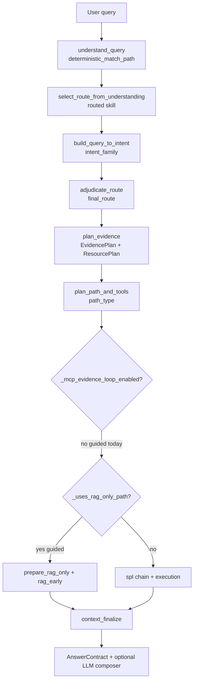
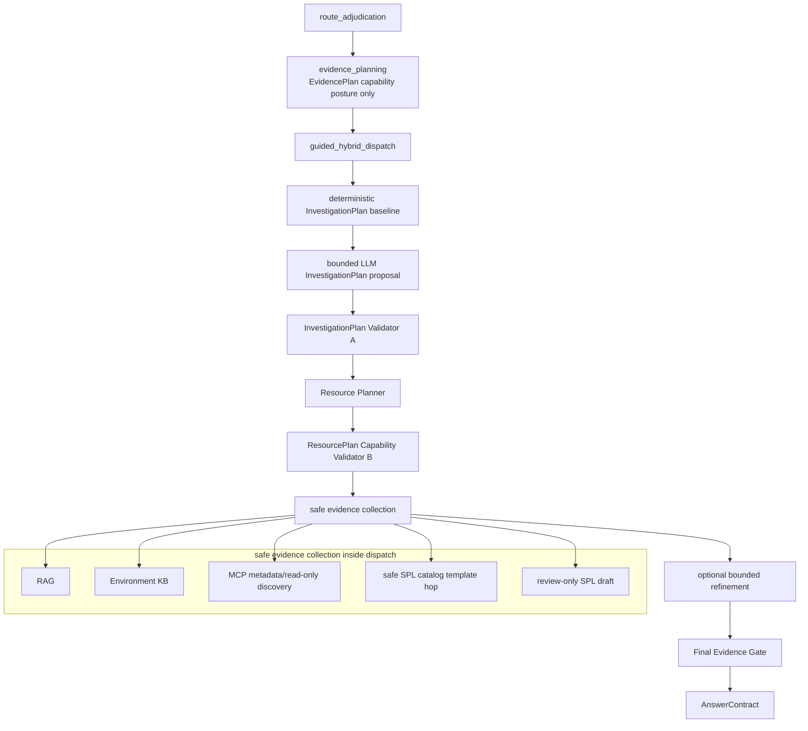

# Guided Hybrid Investigation Orchestrator

> **Revision map:** **REV3** = target architecture (§1–§13). **REV4** = phased implementation — **batch 1** = phases 1–8 below (handoff safety); batch 2 = LLM propose, evidence collection, safe SPL catalog execution, governance docs. Filename retained for git continuity. Loop runner: [`plans/LOOP_RUNNER_guided-hybrid-investigation.md`](LOOP_RUNNER_guided-hybrid-investigation.md).

## 1. Current flow (repository trace)

### 1.1 End-to-end spine



**Key files:** [`backend/app/query_understanding/parser.py`](../backend/app/query_understanding/parser.py), [`backend/app/routing/select_route_from_understanding.py`](../backend/app/routing/select_route_from_understanding.py), [`backend/app/chat/intent_classifier.py`](../backend/app/chat/intent_classifier.py), [`backend/app/routing/route_adjudication.py`](../backend/app/routing/route_adjudication.py), [`backend/app/chat/evidence_planner.py`](../backend/app/chat/evidence_planner.py), [`backend/app/chat/planning_decision.py`](../backend/app/chat/planning_decision.py), [`backend/app/chat/pipeline.py`](../backend/app/chat/pipeline.py), [`backend/app/planner/composer.py`](../backend/app/planner/composer.py), [`backend/app/evidence/final_evidence_gate.py`](../backend/app/evidence/final_evidence_gate.py), [`backend/app/chat/contracts/answer_contract.py`](../backend/app/chat/contracts/answer_contract.py).

### 1.2 Sample query trace (verified in repo)

**Query:** `How should I investigate unusual outbound traffic from an OT host overnight?`

| Field | Value (CP on, flag off) |
|-------|-------------------------|
| `deterministic_match_path` | `out_of_registry` |
| `routed_skill` | `guided_investigation` |
| `intent_family` | `guided_investigation` |
| `final_route` | `guided_investigation` |
| `answer_mode` | `guided_investigation` |
| `path_type` | `guided_investigation` |
| `needs_rag` | `true` |
| `needs_spl` | `false` |
| `needs_mcp` | `false` |
| `mcp_allowed` | `false` |
| `spl_allowed` | `false` |
| `requires_hil` | `true` |
| `spl_execution_eligible` (contract) | `false` (default; no execution path) |
| `_uses_rag_only_path` | **`true`** |
| `_mcp_evidence_loop_enabled` | **`false`** |
| `mcp_allowed_normalized` (CP on) | `allowed: false`, `reason: explicit_false` |
| **Dispatch branch** | **rag-only:** `prepare_rag_only` → `rag_early` (no `graph_node_execution`) |
| **Resource Planner steps** | `rag` → `evidence` → `sufficiency` → `narration` (all `planned`) |
| **MCP discovery** | **No** — loop never initializes; `needs_mcp=false`, no `mcp` step in composed plan |
| **SPL** | Optional **review-only draft preview** in `prepare_rag_only` only; `spl_allowed=false` on plan |
| **Execution** | **No** — rag-only dispatch skips `graph_node_execution` |
| **resource_decisions.mcp** | `needed: false`, `allowed: false`; `planned_discovery` lists 3 tool names (metadata shadow only) |

**Trace command (repro):**

```bash
cd backend && CONTROL_PLANE_ENABLED=true PYTHONPATH=../backend:.. python3 -c "
# ... see plan drift log 2026-07-01 REV3 trace script in agent transcript
"
```

**CP off note:** When `CONTROL_PLANE_ENABLED=false`, `_mcp_evidence_loop_enabled` is always false and `_mcp_allowed_decision_from_plan` returns legacy bypass — hybrid feature must no-op (unchanged behavior).

### 1.3 Where Resource Planner participates today

- [`evidence_planner._attach_resource_plan`](../backend/app/chat/evidence_planner.py) calls [`compose_resource_plan`](../backend/app/planner/composer.py).
- For guided: composer emits **rag + evidence + sufficiency + narration** steps; **no `mcp` step** because `needs_mcp=false`.
- `resource_decisions` in provenance (via `build_guided_investigation_resource_decisions`) is **metadata shadow** — lists discovery tools with `needed=false`, `allowed=false`; **does not drive dispatch or loop**.
- LLM plan bridge ([`llm_plan_bridge.py`](../backend/app/planner/llm_plan_bridge.py)) is **deferred off the blocking path** (`llm_bridge=deferred_not_inline`).

### 1.4 Why guided feels like `knowledge_recall`

| Layer | `knowledge_recall` | `guided_investigation` (today) |
|-------|-------------------|-------------------------------|
| Route skill | `knowledge_recall` | `guided_investigation` (pinned at adjudication) |
| Dispatch rail | `_uses_rag_only_path` → rag only | **Same rail** |
| SPL | None | Optional draft preview only |
| MCP | Off | Off |
| Answer | Playbook/policy body | Deterministic hunt checklist + optional LLM composer |
| HIL | Context-dependent | Always required |

Same dispatch rail ≠ same skill, but **shared non-executing rail** prevents investigation orchestration.

---

## 2. Problems

1. **Safety through starvation:** `_uses_rag_only_path` blocks Stage-4B discovery and any structured evidence collection beyond RAG.
2. **Resource Planner underpowered:** Composed plan ignores investigation evidence needs; MCP discovery exists only in shadow `resource_decisions`.
3. **SPL conflation:** Single `spl_allowed` boolean cannot express review-only vs safe-catalog execution vs free-form execution.
4. **No InvestigationPlan layer:** Objectives/hypotheses/evidence needs are prose templates, not a validated plan object feeding the planner.
5. **MCP tool model flat:** Playbook has `read_only` / `execution_gated` but no **capability class** for validator enforcement.
6. **LLM role unclear:** Composer narrates prose on other routes; guided needs a **first-class inline InvestigationPlan planner** (stronger LLM utilization than catalog skills) with deterministic validation before tools — not shadow-only, not route selection.
7. **Redundancy:** Out-of-registry vague queries still hit weak `knowledge_recall`; hunt-shaped queries get guided wording but not guided **capabilities**.

---

## 3. Target architecture

**Definition:** `guided_investigation` = **controlled hybrid investigation orchestrator** for `out_of_registry` SOC questions.

### 3.1 Final canonical flow (REV3 target)

**Critical:** Guided hybrid **must not** use the existing global pre-dispatch MCP evidence loop ([`_run_discovery_loop_imperative`](backend/app/chat/pipeline.py) at `evidence_planning` → `discovery_loop`) as the primary discovery mechanism. That loop runs **before** dispatch today and has no validated InvestigationPlan or ResourcePlan.

For `guided_hybrid`, safe discovery and safe SPL catalog collection happen **only inside** `_run_guided_hybrid_dispatch`, **after** both validation stages approve resources.



**Ordered steps:**

1. `route_adjudication`
2. `evidence_planning` — sets EvidencePlan capability posture only; **does not** run global pre-dispatch discovery for guided+flag on
3. `guided_hybrid_dispatch` entry (replaces rag-only rail when flag on)
4. Deterministic InvestigationPlan baseline (merge anchor for validation)
5. **First-class bounded LLM InvestigationPlan proposal** (flag on — not optional; fallback to baseline only on failure/timeout)
6. **InvestigationPlan Validator (A)**
7. Resource Planner maps evidence needs → approved resources
8. **ResourcePlan Capability Validator (B)**
9. Safe evidence collection (RAG, Environment KB, MCP metadata/read-only, safe SPL catalog, review-only SPL draft)
10. Optional bounded refinement (max 2–3 rounds)
11. Final Evidence Gate
12. AnswerContract

**Principle:** Coarse deterministic route places query safely → **LLM proposes investigation plan (first-class on guided only)** → Resource Planner maps → **two-stage deterministic validation** → policy-controlled collection → final contract enforces.

**Authority split (REV3):**

| Stage | Authority |
|-------|-----------|
| Skill / route selection | **Deterministic** — registry matches, unsafe/action requests, non-SOC guards stay on router; LLM does **not** pick among the five skills |
| Investigation planning (guided only) | **LLM first-class proposer** — objectives, hypotheses, evidence strategy; output is **advisory** until Validator A |
| Resource mapping | **Deterministic** Resource Planner from validated InvestigationPlan |
| Tool / catalog execution | **Deterministic** Validator B + policy gates; LLM never approves execution |

### 3.2 Global pre-dispatch loop — guided exclusion

| Path | Global `_run_discovery_loop_imperative` |
|------|----------------------------------------|
| `hybrid_investigation` / `spl_review` (existing) | Unchanged — may use Stage-4B pre-dispatch loop when `mcp_allowed` |
| `guided_investigation` + flag **off** | Unchanged (no loop today) |
| `guided_investigation` + flag **on** | **Skipped** — `_mcp_evidence_loop_enabled` returns false for guided; discovery runs inside hybrid dispatch only |

Reuse Stage-4B hop machinery (`execute_loop_discovery_hop`, `record_hop`, `append_mcp_loop_source_evidence`) **inside** guided dispatch, driven by validated ResourcePlan steps — not by chronology initialized at `evidence_planning`.

### Non-goals (hard)

- Auto-promote to `spl_generation` / `attack_discovery`
- Collapse `final_route` to `knowledge_recall`
- Free-form LLM SPL execution
- Arbitrary `splunk_run_query` without safe-catalog binding
- MCP action/remediation tools
- LLM sets `final_route`, `execution_eligible`, severity, or `mcp_allowed`

---

## 4. Capability model (EvidencePlan)

**Master flag:** `AI_SOC_GUIDED_HYBRID_INVESTIGATION_ENABLED=false` (replaces REV1 `AI_SOC_GUIDED_MCP_DISCOVERY_ENABLED` if present — **one flag only**).

**Requires:** `CONTROL_PLANE_ENABLED=true` for loop/dispatch changes; otherwise **no-op**.

Add fields (all default `false`; **do not emit on wire when false** — use `model_dump(exclude_defaults=True)` or conditional serialization at [`evidence_planner` dump sites](../backend/app/chat/evidence_planner.py)):

| Field | Guided + flag on | Meaning |
|-------|------------------|---------|
| `discovery_allowed` | `true` | MCP metadata/read-only discovery lane |
| `investigation_planning_enabled` | `true` | InvestigationPlan + bounded LLM propose |
| `spl_review_allowed` | `true` | Review-only SPL draft artifact |
| `safe_spl_execution_allowed` | `true` | **Only** approved safe-catalog template IDs |
| `freeform_spl_execution_allowed` | `false` | Always false for guided |
| `mcp_allowed` | `false` | Free-form MCP query execution |
| `mcp_action_allowed` | `false` | Action/remediation tools |
| `needs_mcp` | `false` | Execution need unchanged; discovery ≠ needs_mcp |

**Runtime eligibility fields** (set during validation/collection — not EvidencePlan defaults; emit in trace/contract when true):

| Field | When true | Meaning |
|-------|-----------|---------|
| `safe_catalog_spl_execution_eligible` | After template + source-profile + validator pass | This specific catalog template hop may run |
| `freeform_spl_execution_eligible` | **Never** on guided | Free-form SPL/MCP query path |

**Target posture (flag on, after validators):**

```
final_route = guided_investigation
answer_mode = guided_investigation
investigation_planning_enabled = true
discovery_allowed = true
mcp_allowed = false
mcp_action_allowed = false
spl_review_allowed = true
safe_spl_execution_allowed = true          # posture: catalog path permitted in principle
freeform_spl_execution_allowed = false
freeform_spl_execution_eligible = false    # always
safe_catalog_spl_execution_eligible = true # only per approved template hop after validator B
human_review_required = true
spl_execution_eligible = false             # do NOT surface safe catalog as generic execution
freeform_spl_execution_eligible = false
```

**AnswerContract rule:** Safe catalog results must be labeled **safe catalog evidence collection under guided investigation controls** — not generic `execution_eligible` / live-investigation language. Use dedicated fields (e.g. `safe_catalog_evidence`, `guided_collection_posture`) rather than reusing `spl_execution_eligible=true`.

**Do not** set ambiguous `spl_allowed=true` without audit — use explicit fields above.

---

## 5. Safe SPL catalog model

Three SPL concepts (orthogonal):

| Concept | Field | Guided posture |
|---------|-------|----------------|
| Review-only artifact | `spl_review_allowed` | Draft preview / lab family; no execution |
| Safe catalog execution | `safe_spl_execution_allowed` | Template ID from allowlist only |
| Free-form execution | `freeform_spl_execution_allowed` | **Always false** |

### 5.1 Catalog source (repo fact)

- Governed templates live in [`backend/app/spl/templates.json`](../backend/app/spl/templates.json) (~10 `enabled: true` production templates).
- Templates use placeholders (`<index>`, sourcetype tokens) resolved via source-profile / Environment KB chain.
- **Gap:** No `guided_safe_spl_catalog.json` allowlist yet — **must be created** (subset of templates.json IDs) with per-template: max lookback, max rows, allowed commands, required source-profile binding.

### 5.2 Safe catalog examples (candidate IDs — COE to sign)

- Index/sourcetype availability / metadata checks (via MCP discovery, not SPL)
- Event volume summary, top hosts/users/src/dest aggregations
- Failed login summary, network flow summary, DNS summary (e.g. `dns_beaconing_candidate_review` pattern)
- IOC lookup match templates where enabled
- Basic time-bounded stats templates with `validator_profile` + `validation_rules`

### 5.3 Safe catalog must NOT include

- Arbitrary LLM-generated SPL
- Wildcard index searches
- `output`, `collect`, `outputlookup`, `delete`, `sendemail`, etc.
- Searches without source-profile constraints
- Uncapped lookback / unbounded `head`

### 5.4 Safe catalog hop (template-bound read-only query)

Safe catalog execution is a **separate template-bound read-only query capability**. It is **not**:

- generic SPL execution (`graph_node_execution` + `candidate_spl`)
- generic MCP execution (`mcp_allowed` / free-form `splunk_run_query`)
- `spl_execution_eligible` in the AnswerContract sense

Implementation: `graph_node_safe_spl_catalog_hop` — binds `template_id` from [`guided_safe_spl_catalog.json`](../backend/app/spl/guided_safe_spl_catalog.json) + validated params + source-resolve → existing SPL validator → bounded MCP submit using **rendered template SPL only**. Sets `safe_catalog_spl_execution_eligible=true` on that hop only after ResourcePlan Capability Validator (B) approves.

Evidence rows carry `provenance: guided_safe_catalog`, `tool_category: safe_catalog_query`, `collection_status` per gate rules — distinct from `splunk_mcp` execution rows.

---

## 6. MCP capability split

Add `capability_class` to each tool in [`mcp_tool_playbook.json`](../backend/app/connectors/mcp/mcp_tool_playbook.json) and mirror in [`resource_registry_v1.json`](../backend/app/planner/resource_registry_v1.json):

| Class | Guided flag-on | Examples |
|-------|----------------|----------|
| `metadata_discovery` | Allowed | `splunk_get_info`, `splunk_get_indexes`, `splunk_get_metadata`, `splunk_get_index_info`, `splunk_get_knowledge_objects` |
| `read_only_lookup` | Allowed if approved | Future read-only lookups |
| `safe_query_execution` | Allowed **only** via safe SPL catalog binding | Not raw `splunk_run_query` with LLM SPL |
| `freeform_query_execution` | **Blocked** | `splunk_run_query` without catalog binding |
| `action_execution` | **Blocked** | Remediation / active-response tools |

**Validator rule:** Guided InvestigationPlan / ResourcePlan may only reference tools whose `capability_class` ∈ `{metadata_discovery, read_only_lookup}` plus safe-catalog SPL template IDs (not MCP tool names for free-form query).

---

## 7. LLM role and guardrails

### 7.0 Intentionally stronger LLM on guided (REV3 target — batch 2)

**Guided is the exception:** LLM utilization inside `guided_investigation` is **intentionally stronger** than on governed catalog skills (`alert_summary`, `spl_generation`, `attack_discovery`, `knowledge_recall`). Those routes keep deterministic authority for evidence needs and tool selection; LLM remains narrate-only or shadow elsewhere.

**Deterministic router still protects skill authority:**

- Governed registry matches stay on their catalog skill — LLM does not reroute
- Unsafe / action / remediation requests stay blocked at route guards
- `out_of_registry` + investigation-shaped queries enter `guided_investigation` via deterministic cascade only

**Once inside guided (flag on):** the LLM becomes a **first-class investigation planner**. It does **not** approve execution, select MCP tools directly, or change `final_route`. It **proposes** the InvestigationPlan that Validator A and the Resource Planner consume.

**Canonical model:**

```
coarse deterministic route → guided_investigation
  → LLM InvestigationPlan (first-class propose)
  → deterministic validation (A)
  → Resource Planner
  → ResourcePlan validation (B)
  → safe evidence collection
  → final answer
```

The LLM makes `guided_investigation` **useful** after routing has safely placed the query — it is not a sixth skill or a free skill picker.

### 7.1 What the LLM helps decide (advisory propose only)

When flag on, the bounded LLM propose step should inform (subject to Validator A):

| Decision area | LLM may propose | Validator / planner enforces |
|---------------|-----------------|------------------------------|
| Investigation objective | Yes | Drop if unsafe / route-changing |
| Hypotheses | Yes | Cap count; drop invented entities |
| Evidence needed | Yes | Map to registry resources only |
| Relevant data categories | Yes | No invented index/sourcetype |
| RAG sufficient alone? | Yes (`rag_sufficient`) | Resource Planner may still add KB if baseline requires |
| Environment KB useful? | Yes (`env_kb_needed`) | Only registered Env KB slots |
| MCP metadata/read-only discovery useful? | Yes (`discovery_needed` + tool IDs) | Validator B + capability_class |
| Safe SPL catalog templates useful? | Yes (catalog template IDs) | Validator B + allowlist |
| Review-only SPL artifact? | Yes (`spl_review_requested`) | `spl_review_allowed` posture only |
| Clarification needed? | Yes (`clarification_needed` + questions) | May surface HIL card; no route change |
| Second investigation round useful? | Yes (`refinement_recommended`) | Hard cap `MAX_GUIDED_INVESTIGATION_ROUNDS` |

**LLM must not propose:** raw SPL, free-form `splunk_run_query`, execution flags, severity, `final_route`, action/remediation, invented tools/indexes/sourcetypes.

### 7.2 InvestigationPlan contract (new)

**File:** `backend/app/chat/contracts/investigation_plan.py`

Suggested fields:

- `investigation_objective`, `hypotheses`, `evidence_needed`, `data_categories`
- `rag_sufficient`, `env_kb_needed`, `discovery_needed`
- `environment_constraints`, `candidate_sources`
- `read_only_tool_requests` (registry tool IDs only)
- `safe_spl_template_requests` (catalog template IDs only)
- `spl_review_requested`, `spl_review_reason`
- `clarification_needed`, `clarification_questions`
- `refinement_recommended`, `refinement_rationale`
- `blocked_capabilities`, `human_review_required`
- `plan_source`: `deterministic_only` | `llm_proposed_validated` | `llm_failed_baseline_only`
- `validation_warnings`, `llm_budget_used`, `refinement_round`

### 7.3 LLM propose JSON (bounded, first-class when flag on)

```json
{
  "objectives": [],
  "hypotheses": [],
  "evidence_needed": [],
  "data_categories": [],
  "rag_sufficient": false,
  "env_kb_needed": false,
  "discovery_needed": false,
  "read_only_tools": [],
  "safe_spl_templates": [],
  "spl_review_requested": false,
  "clarification_needed": false,
  "clarification_questions": [],
  "refinement_recommended": false,
  "rationale": ""
}
```

**Invocation policy (flag on):** Always call `propose_investigation_plan_llm` on the blocking guided path (budget ≤15s, `llm_turn_budget`). This is **not** shadow-only and **not** optional when the endpoint is configured and LLM mode permits advisory planning. On timeout/unavailable/malformed JSON → `plan_source=llm_failed_baseline_only` and continue with deterministic baseline through Validator A.

**Rules:** No raw SPL, no invented tools/indexes/sourcetypes, no execution flags, no severity, no route change, no action/remediation.

### 7.4 Flow (inside guided hybrid dispatch only)

1. Deterministic baseline from [`build_guided_investigation_guidance`](../backend/app/chat/guidance_templates.py) + [`build_guided_hunt_grounding`](../backend/app/chat/guided_hunt_grounding.py) (validation anchor).
2. **First-class** bounded inline LLM propose — merges with baseline before Validator A.
3. **InvestigationPlan Validator (A)** — see §8.1.
4. Resource Planner maps validated InvestigationPlan → ResourcePlan.
5. **ResourcePlan Capability Validator (B)** — see §8.2.
6. Safe evidence collection executes **only** approved ResourcePlan steps.
7. On LLM failure at step 2 → baseline only through step 6; trace `plan_source=llm_failed_baseline_only`.

### 7.5 Negative tests (required)

Hostile LLM output must drop invalid items and record `validation_warnings` without changing `final_route`, `mcp_allowed`, `freeform_spl_execution_allowed`, `freeform_spl_execution_eligible`, or HIL posture. See checklist item **17**.

---

## 8. Two validation stages + Resource Planner placement

**InvestigationPlan does not invoke tools directly.**

```
coarse deterministic route → guided_investigation
  → LLM InvestigationPlan (first-class propose)
  → Validator A → Resource Planner → Validator B
  → safe evidence collection → refinement → Final Evidence Gate → AnswerContract
```

| Layer | Responsibility |
|-------|----------------|
| **EvidencePlan** | Route posture, capability booleans, HIL |
| **InvestigationPlan** | What to investigate (objectives, hypotheses, evidence needs) |
| **Resource Planner** | Maps to `rag`, Env KB slots, MCP discovery tools, safe SPL template IDs, review-only SPL artifact step |
| **Final Evidence Gate** | Honest `collected_evidence_count`; planned hops excluded |
| **AnswerContract** | Analyst-safe surfacing; HIL required; **no generic execution eligibility for safe catalog** |

### 8.1 InvestigationPlan Validator (A)

Runs on merged baseline + LLM proposal **before** Resource Planner.

- Drops invented tools / template IDs
- Drops invented index/sourcetype names
- Blocks raw SPL text in any field
- Blocks severity, route, `execution_eligible`, `mcp_allowed`, action/remediation requests
- **Deterministic baseline wins on conflict**
- Emits `validation_warnings` + `plan_source`

**Module:** `validate_investigation_plan()` in `guided_investigation_planner.py` (adapt [`llm_plan_bridge.py`](../backend/app/planner/llm_plan_bridge.py) patterns).

### 8.2 ResourcePlan Capability Validator (B)

Runs on composed ResourcePlan **before** any evidence collection hop.

- Validates final selected resources only (not LLM prose)
- Allows MCP tools with `capability_class` ∈ `{metadata_discovery, read_only_lookup}` only
- Allows safe SPL template IDs present in `guided_safe_spl_catalog.json` only
- Blocks free-form `splunk_run_query` / `mcp_execution` steps
- Blocks action/remediation tools and resource IDs
- Enforces source-profile binding, lookback caps, result limits per template/tool
- Sets per-hop `safe_catalog_spl_execution_eligible` only when a catalog step passes all checks
- Records validation warnings in `control_plane_trace.guided_capability_validation`

**Module:** `backend/app/chat/guided_capability_validator.py` — separate from Validator A.

### 8.3 Guided-internal evidence collection loop

Inside `_run_guided_hybrid_dispatch` after Validator B:

- Walk approved ResourcePlan steps in order
- MCP metadata hops: reuse `execute_loop_discovery_hop` + `record_hop` (not global pre-dispatch `assess_loop` chronology from `evidence_planning`)
- Safe catalog hops: `graph_node_safe_spl_catalog_hop` only
- Bounded hop counter shared (`MAX_MCP_HOPS` or guided-specific cap)
- Assessor equivalent: if a step would imply free-form execution → **capability gap / finalize**, never execute

**Repo change:** Extend [`skill:guided_investigation`](../backend/app/planner/resource_registry_v1.json) capabilities beyond `governed_rag` to include `metadata_discovery`, `spl_review_only`, `safe_spl_catalog` (blocked: `mcp_execution`, `remediation`, `write`).

---

## 9. Iterative investigation loop

All rounds after step 3 occur **inside** `guided_hybrid_dispatch`.

| Round | Action |
|-------|--------|
| 0 | Registry match → `out_of_registry` → route guided |
| 1 | `evidence_planning` — capability posture only |
| 2 | Enter `guided_hybrid_dispatch` |
| 3 | Deterministic InvestigationPlan baseline |
| 4 | **First-class** bounded LLM InvestigationPlan propose (flag on) |
| 5 | InvestigationPlan Validator (A) |
| 6 | Resource Planner map |
| 7 | ResourcePlan Capability Validator (B) |
| 8 | Safe evidence collection (RAG, Env KB, MCP read-only, safe catalog, SPL review draft) |
| 9 | Optional refinement (hypotheses / next evidence) — **max 2–3 rounds total** |
| 10 | Final Evidence Gate → AnswerContract |

**Hard limits:**

- `MAX_GUIDED_INVESTIGATION_ROUNDS = 3` (refinement only; planning is round 0 of dispatch)
- Guided-internal hop cap for MCP discovery + safe catalog combined
- LLM planning budget capped per turn
- Lookback/result limits per safe template
- No action tools; no free-form SPL

---

## 10. Dispatch design

**Do not** globally weaken `_uses_rag_only_path` without auditing callers ([`pipeline.py`](../backend/app/chat/pipeline.py), [`executor.py`](../backend/app/planner/executor.py), dispatch v2).

**Preferred pattern (flag on only):**

```python
if _uses_guided_hybrid_dispatch(state):
    return _run_guided_hybrid_dispatch(state)
elif _uses_rag_only_path(state):
    return _run_legacy_rag_only_dispatch(state)
```

`_uses_guided_hybrid_dispatch` = `path_type == "guided_investigation"` AND `AI_SOC_GUIDED_HYBRID_INVESTIGATION_ENABLED` AND `CONTROL_PLANE_ENABLED`.

### 10.1 `_run_guided_hybrid_dispatch` schedule

**No** `graph_node_execution`. **No** global pre-dispatch `_run_discovery_loop_imperative`.

| Step | Node / action |
|------|----------------|
| 1 | `graph_node_guided_hybrid_setup` — workflow plan, guided skill, execution stub `mcp_allowed=False` |
| 2 | `graph_node_guided_investigation_plan_baseline` — deterministic InvestigationPlan |
| 3 | `graph_node_guided_investigation_plan_llm` — **first-class** bounded LLM propose (always invoked flag on; baseline fallback on failure) |
| 4 | `graph_node_investigation_plan_validate` — **Validator A** |
| 5 | `graph_node_guided_resource_plan_compose` — Resource Planner from validated InvestigationPlan |
| 6 | `graph_node_resource_plan_validate` — **Validator B** |
| 7 | `graph_node_guided_safe_evidence_collect` — RAG, Env KB grounding, MCP metadata hops, safe catalog hops, SPL review draft per approved plan |
| 8 | `graph_node_guided_refinement` — optional bounded refinement (re-enter 4–7 at most 2×) |
| 9 | Return to `context_finalize` |

RAG may run at step 7 (not before InvestigationPlan) unless deterministic baseline requires early KB pointers only (Env KB slots in grounding assembly at step 2 is allowed; **collection** follows Validator B).

### 10.2 Skip global pre-dispatch loop for guided

In [`_run_live_chat_pipeline`](../backend/app/chat/pipeline.py):

- When `_uses_guided_hybrid_dispatch(state)` after `evidence_planning`: **skip** `_timed_node(state, "discovery_loop", _run_discovery_loop_imperative)` OR ensure `_mcp_evidence_loop_enabled` is false for guided+flag on so `mcp_chronology` is never initialized pre-dispatch.
- Hybrid/spl paths keep existing pre-dispatch loop behavior unchanged.

### 10.3 Execution authority (unchanged)

- **Do not** widen [`_mcp_allowed_decision_from_plan`](../backend/app/chat/pipeline.py) for discovery.
- `mcp_allowed` stays false on guided EvidencePlan.
- Safe catalog uses `safe_catalog_spl_execution_eligible` per hop, not `mcp_allowed`.

### 10.4 Guided-internal assessor guard

When executing approved ResourcePlan steps inside step 7:

- Never invoke free-form `splunk_run_query`
- Never `ROUTE_BROADEN` / action escalation
- Safe catalog steps must carry `template_id` + validator stamp; otherwise skip with warning

---

## 11. Repo facts that conflict or need new work

| Fact | Impact |
|------|--------|
| No `InvestigationPlan` schema | New contract + tests (item 5) |
| No `capability_class` on MCP tools | Playbook + registry extension (item 8) |
| `skill:guided_investigation` only `governed_rag` | Registry update required (item 7) |
| Safe SPL catalog allowlist does not exist | New `guided_safe_spl_catalog.json` + COE sign-off (item 9) |
| Templates are tenant-specific (`pgcil_soc`) | Source-profile resolution mandatory; no invented indexes |
| `count_collected_evidence` uses `collection_status` on raw `mcp_evidence` but hops use `outcome` | Verify via `source_evidence` path (item 14); may need alignment |
| `llm_plan_bridge` deferred off live path | Guided uses **new** `guided_investigation_planner.py` on blocking path — stronger than other routes; do not reuse deferred shadow bridge for guided |
| OT templates often `enabled=false` | Safe catalog must be honest; OT hunts stay review-only until COE enables templates |
| `planned_discovery` in shadow shows 3 tools not 5 | `plan_splunk_discovery_calls` filtering — document actual tool set in tests |

---

## 12. Risks

1. **Pre-dispatch loop misuse** — Running global `_run_discovery_loop_imperative` before InvestigationPlan/ResourcePlan validates → **rejected**; guided skips pre-dispatch loop (§3.2, item 10).
2. **Widening `_mcp_allowed`** for discovery → leaks into execution staging — **rejected**.
3. **Safe catalog surfaced as `spl_execution_eligible`** → analysts misread as free-form execution — **rejected**; dedicated contract fields (item 15).
4. **Removing guided from `_uses_rag_only_path` globally** without branch audit → accidental path bleed.
5. **Flag-off wire drift** from new default fields — breaks byte-identity gate.
6. **Safe SPL catalog scope creep** — COE must sign template allowlist.
7. **Latency** — bounded inline LLM + in-dispatch collection; enforce budgets.
8. **False collected evidence** — safe catalog rows must not imply remediation or uncapped live access.

---

## 13. Out of scope

- Auto route promotion to `spl_generation`
- Free-form SPL execution on guided path
- MCP action/remediation tools
- LLM as **route/skill authority** (picking among five skills, overriding registry match, approving execution)
- Experience Center fixture path (unless explicitly needed later)
- Replacing deterministic `select_route_from_understanding` with LLM for routing

## 14. REV4 phased implementation — batch 1 (phases 1–8)

**Accepted audit finding (2026-07-01):** The main handoff problem is **timing and inputs**. Today `compose_resource_plan()` runs during `evidence_planning` from EvidencePlan booleans only. There is no InvestigationPlan node and no Capability Validator. Resource Planner cannot safely consume investigation objective, hypotheses, evidence needs, validated read-only tools, or safe SPL template requests.

**REV4 batch 1 principle:** For `guided_hybrid` only, ResourcePlan composition **moves behind validated InvestigationPlan**. Do not rewrite Resource Planner globally. Do not change other skills.

### Batch 1 hard rules

- Resource Planner is **mapper only**; Validator B is **enforcement layer**
- EvidencePlan owns **capability posture**; InvestigationPlan owns **investigation intent**
- Resource Planner cannot widen authority, read raw LLM output, invent tool IDs, create raw SPL, or mutate `final_route`
- Do **not** widen `mcp_allowed`; `freeform_spl_execution_allowed` stays false on guided
- Do **not** use shadow `resource_decisions` as step authority
- `graph_node_execution` never runs for `guided_hybrid`
- `final_route` remains `guided_investigation`; HIL remains required

### Batch 1 flow (implement phases 1–8)

```
evidence_planning (capability posture only; no guided compose)
  → guided_hybrid_dispatch (flag on)
  → build InvestigationPlan baseline
  → Validator A
  → compose_guided_resource_plan(EvidencePlan, validated InvestigationPlan)
  → Validator B
  → trace spine (guided_handoff)
  → gated review-only SPL preview (shared helper or inside dispatch — not legacy rag-only only)
  → context_finalize (no graph_node_execution; no MCP/safe-SPL hop execution in batch 1)
```

### Batch 2 deferrals (do not implement in batch 1)

| Deferred | Notes |
|----------|-------|
| Bounded LLM InvestigationPlan propose | Validator A wired for baseline only in batch 1; `investigation_plan_raw_llm` trace slot empty |
| Safe SPL catalog **execution** | Validator B may validate catalog step **shape**; no live catalog hop |
| MCP read-only **collection** | No discovery hop execution; metadata steps may appear in validated plan as `planned` only |
| Bounded refinement rounds | Max rounds deferred |
| AnswerContract safe-catalog surfacing | After collection exists |
| HIL promotion offer | Batch 2 |
| `guided_safe_spl_catalog.json` COE sign-off | Batch 2 |
| Full governance docs refresh | Batch 2 (run regression after batch 1) |

### P1 implementation package (ready — apply in agent mode)

**Config** — after `ai_soc_pipeline_dispatch_v2_enabled` in [`config.py`](../backend/app/config.py):

```python
ai_soc_guided_hybrid_investigation_enabled: bool = False
```

**`.env.example`** — after `AI_SOC_PIPELINE_DISPATCH_V2_ENABLED`:

```
AI_SOC_GUIDED_HYBRID_INVESTIGATION_ENABLED=false
```

**Test file:** `backend/app/tests/test_guided_hybrid_trace_baseline.py` — frozen snapshot verified 2026-07-01:

| Field | Value |
|-------|-------|
| `dispatch_schedule` | `["prepare_rag_only", "rag_early"]` |
| `dispatch_source` | `resource_plan_step_walk` |
| `resource_step_ids` | `rag, evidence, sufficiency, narration` |
| `has_mcp_chronology` | false |
| `execution_status` | skipped |

**Verify command:**

```bash
cd backend && PYTHONPATH=../backend:.. python3 -m pytest app/tests/test_guided_hybrid_trace_baseline.py -q
```

### Phase dependency order

`P1 → P2 → P3 → P4 → P5 → P6 → P8 → P7` (P7 after P8 — hybrid rail must exist before SPL preview gate)

### Batch 1 stop condition

Phases **P1–P8** checked with evidence, flag-off byte-identical on sample query, no authority widening — **or** same gate fails twice — **or** COE decision needed.

**Execution pacing:** Start with **P1 only**; review evidence before P2–P4. Phase-by-phase is required for this handoff change.

### P4 split fallback (if implementation becomes risky)

Keep P4 as one checklist item unless Cursor fails or scope drifts. Then split without changing dependencies:

| Sub-phase | Scope |
|-----------|--------|
| **P4a** | EvidencePlan capability fields + flag-on guided posture + `exclude_defaults` serialization |
| **P4b** | Skip early `compose_resource_plan` in `_attach_resource_plan` when guided + flag on |
| **P4c** | `compose_guided_resource_plan(evidence_plan, validated_investigation_plan)` |

Verify after each sub-phase; P4c depends on P4a + P4b.

---

## Checklist (REV4 batch 1 — phases 1–8)

Sample probe query (all phases):

`How should I investigate unusual outbound traffic from an OT host overnight?`

- [x] **P1** — Flag and baseline safety
  - **Do:** Add `AI_SOC_GUIDED_HYBRID_INVESTIGATION_ENABLED=false` to [`config.py`](../backend/app/config.py) + [`.env.example`](../.env.example); document requires `CONTROL_PLANE_ENABLED=true`; add `test_guided_hybrid_trace_baseline.py` encoding §1.2 flag-off table.
  - **Verify:** `pytest app/tests/test_guided_hybrid_trace_baseline.py -q`; flag-off probe: `final_route=guided_investigation`, `path_type=guided_investigation`, `needs_rag=true`, `needs_spl=false`, `needs_mcp=false`, `mcp_allowed=false`, `spl_allowed=false`, dispatch `prepare_rag_only→rag_early`, no `graph_node_execution`, no MCP loop, byte-identical vs baseline capture.
  - **Depends on:** none
  - **Evidence:** `cd backend && PYTHONPATH=../backend:.. python3 -m pytest app/tests/test_guided_hybrid_trace_baseline.py -q` → **6 passed in 0.77s**. Flag `ai_soc_guided_hybrid_investigation_enabled` defaults false in `config.py`; `.env.example` documents `AI_SOC_GUIDED_HYBRID_INVESTIGATION_ENABLED=false`. Frozen snapshot matches plan §14.1 table (`dispatch_schedule`, `resource_step_ids`, `execution_status=skipped`, no `guided_handoff`).

- [x] **P2** — InvestigationPlan contract + deterministic baseline
  - **Do:** Create [`investigation_plan.py`](../backend/app/chat/contracts/investigation_plan.py) with fields: `investigation_objective`, `hypotheses`, `evidence_needed`, `environment_constraints`, `candidate_sources`, `read_only_tool_requests`, `safe_spl_template_requests`, `spl_review_requested`, `spl_review_reason`, `blocked_capabilities`, `human_review_required`, `plan_source`, `validation_warnings`, `llm_budget_used`, `refinement_round`. Add `build_deterministic_investigation_plan()` using [`guidance_templates`](../backend/app/chat/guidance_templates.py) + [`guided_hunt_grounding`](../backend/app/chat/guided_hunt_grounding.py). **No tool calls.**
  - **Verify:** `pytest app/tests/test_investigation_plan.py -q`; sample guided query → baseline created, `plan_source=deterministic_only`, `human_review_required=true`, no execution-flag fields on contract.
  - **Depends on:** P1
  - **Evidence:** `pytest app/tests/test_investigation_plan.py -q` → **4 passed in 0.23s**. Contract at `contracts/investigation_plan.py`; builder at `investigation_plan_builder.py`. Sample query yields `plan_source=deterministic_only`, `human_review_required=true`, empty tool/template requests, no execution-flag model fields.

- [x] **P3** — Validator A (deterministic baseline only)
  - **Do:** Create `backend/app/chat/guided_investigation_planner.py` with `validate_investigation_plan(baseline, proposal=None)`; drops invented tools/indexes/sourcetypes, blocks raw SPL, route changes, severity, execution flags; deterministic baseline wins on conflict; emits `validation_warnings`. **No LLM call in batch 1.**
  - **Verify:** `pytest app/tests/test_guided_investigation_validator_a.py -q`; hostile raw SPL dropped; invented tool/index dropped; `final_route` / `execution_eligible` / `mcp_allowed` cannot be set via plan; HIL remains required.
  - **Depends on:** P2
  - **Evidence:** `pytest app/tests/test_guided_investigation_validator_a.py -q` → **5 passed in 0.28s** (with P2: 9 total). `validate_investigation_plan` drops raw SPL, unknown tools/templates, forbidden authority keys; baseline retains objective/booleans; `human_review_required` forced true.

- [x] **P4** — Move guided ResourcePlan composition behind Validator A
  - **Do:** Add `compose_guided_resource_plan(evidence_plan, validated_investigation_plan)` in [`composer.py`](../backend/app/planner/composer.py) (guided-only; do not change `compose_resource_plan` for other skills). In [`evidence_planner.py`](../backend/app/chat/evidence_planner.py) `_attach_resource_plan`: **skip** `compose_resource_plan` when guided + flag on. Add EvidencePlan capability fields (`discovery_allowed`, `investigation_planning_enabled`, `spl_review_allowed`, `safe_spl_execution_allowed`, `freeform_spl_execution_allowed`, `mcp_action_allowed`; default false; `exclude_defaults` on wire). Wire guided branch posture when flag on. Map validated InvestigationPlan needs → steps only; never read shadow `resource_decisions`; never invent tool IDs or raw SPL; never mutate `final_route`.
  - **Split fallback:** If risky, use P4a → P4b → P4c (see §14 split table) without changing verify intent.
  - **Verify:** `pytest app/tests/test_compose_guided_resource_plan.py -q`; flag on trace shows compose **after** Validator A; `knowledge_recall` / `spl_generation` / `attack_discovery` / `alert_summary` still use legacy `compose_resource_plan` at evidence_planning.
  - **Depends on:** P1, P3
  - **Evidence:** `pytest app/tests/test_compose_guided_resource_plan.py -q` → **4 passed** (with P1–P3: 19 total). `compose_guided_resource_plan` in `composer.py`; hybrid flag-on defers `_attach_resource_plan`; capability fields on `EvidencePlan` (unset when flag off); legacy `compose_resource_plan` unchanged for catalog skills.

- [x] **P5** — Validator B (ResourcePlan Capability Validator)
  - **Do:** Create `backend/app/chat/guided_capability_validator.py`; input EvidencePlan capabilities + ResourcePlan + registry capability classes + source-profile constraints (+ catalog allowlist stub if needed). Output `validated_resource_plan` + `blocked_resources[{resource_id, reason_code}]`. Enforce: no MCP metadata unless `discovery_allowed`; no review SPL unless `spl_review_allowed`; no safe catalog unless `safe_spl_execution_allowed`; no free-form SPL; no action tools; no wildcard index; no invented sourcetype; lookback/result caps on catalog-shaped steps.
  - **Verify:** `pytest app/tests/test_guided_capability_validator.py -q`; planner cannot widen `mcp_allowed` / `freeform_spl_execution_allowed`; cannot emit action tools; cannot emit safe/review/discovery steps when respective capability false; stable reason codes on blocked resources.
  - **Depends on:** P4
  - **Evidence:** `pytest app/tests/test_guided_capability_validator.py -q` → **4 passed**. `validate_guided_resource_plan` emits stable `reason_code` values (`discovery_not_allowed`, `spl_review_not_allowed`, `safe_catalog_not_allowed`, `freeform_query_blocked`).

- [x] **P6** — Trace spine `guided_handoff`
  - **Do:** Add `control_plane_trace.guided_handoff` with: `investigation_plan_validated`, `resource_plan_pre_validation`, `resource_plan_validated`, `blocked_resources`, `safe_spl_template_ids`, `mcp_tool_ids`, `evidence_planned`, `evidence_collected` (empty OK batch 1), answer evidence refs. Reserve `investigation_plan_raw_llm` (null until batch 2).
  - **Verify:** flag-on sample query trace contains all batch-1 segments; `blocked_resources` populated when steps dropped; no shadow-only discovery listed as collected.
  - **Depends on:** P5
  - **Evidence:** `guided_handoff_trace.py` + wired in `pipeline.py` finalize; `test_guided_hybrid_dispatch.py::test_guided_handoff_trace_segments` + live flag-on trace includes `guided_handoff` with `evidence_collected=0`.

- [x] **P7** — Gate review-only SPL preview
  - **Do:** Gate review-only SPL draft in a **shared SPL preview helper** and/or inside `_run_guided_hybrid_dispatch` **after Validator B** — not only in `graph_node_prepare_rag_only`. When guided hybrid flag is on, dispatch **bypasses** legacy rag-only; patching `prepare_rag_only` alone is insufficient. Gate requires `spl_review_allowed=true` **and** `validated_investigation_plan.spl_review_requested=true`. Remove unconditional guided draft side channel on any path that still runs for flag-on guided.
  - **Verify:** `pytest app/tests/test_guided_spl_review_gate.py -q`; flag-on guided path uses hybrid gate (not legacy rail only); `spl_review_allowed=false` → no draft; `spl_review_requested=false` → no draft; both true → draft review-only only.
  - **Depends on:** P4, P5, P8 (dispatch rail must exist for hybrid-path test)
  - **Evidence:** `guided_spl_review_gate.py`; hybrid dispatch calls gate after Validator B; `prepare_rag_only` skips draft when hybrid active; `test_guided_spl_review_gate.py` → **1 passed**.

- [x] **P8** — Guided hybrid dispatch branch
  - **Do:** `_uses_guided_hybrid_dispatch` + `_run_guided_hybrid_dispatch` in [`pipeline.py`](../backend/app/chat/pipeline.py) **before** rag-only branch; mirror in [`executor.py`](../backend/app/planner/executor.py). Schedule: baseline → Validator A → compose → Validator B → trace → finalize path. Skip global pre-dispatch discovery loop for guided+flag on. **No** `graph_node_execution`. Do not globally remove guided from `_uses_rag_only_path` without caller audit — branch instead.
  - **Batch 1 collection ban:** `_run_guided_hybrid_dispatch` must **not** execute MCP discovery or safe SPL catalog hops in batch 1. It may only compose and validate planned steps (status `planned`), record trace, then finalize. No `execute_loop_discovery_hop`, no catalog hop, no `splunk_run_query`.
  - **Verify:** `pytest app/tests/test_guided_hybrid_dispatch.py -q`; guided schedule includes InvestigationPlan + both validators; excludes `graph_node_execution`; no collection hops invoked; catalog skills unchanged; flag-off identical to P1 baseline.
  - **Depends on:** P4, P5, P6
  - **Evidence:** `pytest app/tests/test_guided_hybrid_dispatch.py -q` → **4 passed**; full batch suite **28 passed**. Flag-on `dispatch_source=guided_hybrid_dispatch`; flag-off byte-identical to P1 baseline; executor schedule mirror added; discovery loop skipped for hybrid.

---

## Checklist (REV4 batch 2 — phases P9–P14)

Sample probe query (all phases):

`How should I investigate unusual outbound traffic from an OT host overnight?`

- [x] **P9** — Bounded LLM InvestigationPlan propose (blocking path)
  - **Do:** Add `guided_investigation_plan_llm.propose_investigation_plan_llm()`; wire into `_run_guided_hybrid_dispatch` before Validator A; populate `guided_handoff.investigation_plan_raw_llm`; budget ≤15s; fallback `plan_source=llm_failed_baseline_only` on failure.
  - **Verify:** `pytest app/tests/test_guided_investigation_plan_llm.py -q`; mock LLM merges hypotheses; timeout → baseline only + `llm_failed_baseline_only`; flag-off unchanged.
  - **Depends on:** P1–P8 (merged)
  - **Evidence:** `pytest app/tests/test_guided_investigation_plan_llm.py app/tests/test_guided_hybrid_dispatch.py app/tests/test_guided_hybrid_trace_baseline.py -q` → **30 passed**; `guided_investigation_plan_llm.py` wired in `_run_guided_hybrid_dispatch`; role `guided_investigation_plan_proposer` @ 15s timeout.

- [ ] **P10** — `guided_safe_spl_catalog.json` allowlist + COE stub
  - **Do:** Create allowlist JSON with per-template caps; Validator B reads allowlist; no execution hop yet.
  - **Verify:** `pytest app/tests -k guided_safe_spl_catalog -q`; unknown template ID blocked with stable reason code.
  - **Depends on:** P9
  - **Evidence:** _(filled when done)_

- [ ] **P11** — MCP capability classes in playbook + registry
  - **Do:** Add `capability_class` to `mcp_tool_playbook.json`; mirror in `resource_registry_v1.json`; Validator B enforces class allowlist.
  - **Verify:** `pytest app/tests/test_guided_capability_validator.py -q` extended; freeform/action tools blocked on guided plan.
  - **Depends on:** P10
  - **Evidence:** _(filled when done)_

- [ ] **P12** — Safe evidence collection inside hybrid dispatch
  - **Do:** Execute approved `mcp_discovery` + `safe_catalog_query` steps only when capabilities allow; update `evidence_collected` in `guided_handoff`; still no `graph_node_execution` / freeform `run_query`.
  - **Verify:** `pytest app/tests/test_guided_hybrid_dispatch.py -q` collection cases; `evidence_collected` increments only for collected hops.
  - **Depends on:** P10, P11
  - **Evidence:** _(filled when done)_

- [ ] **P13** — Refinement round + AnswerContract safe-catalog surfacing
  - **Do:** Honor `refinement_recommended` with `MAX_GUIDED_INVESTIGATION_ROUNDS`; surface safe-catalog + discovery metadata on AnswerContract.
  - **Verify:** refinement cap test; AnswerContract fields present flag-on only.
  - **Depends on:** P12
  - **Evidence:** _(filled when done)_

- [ ] **P14** — Governance + flag-off byte-identity
  - **Do:** Run targeted suite + `./scripts/run_stage3_governance_regression.sh`; sync docs.
  - **Verify:** governance PASS or document known-unrelated drift; flag-off guided hybrid byte-identical.
  - **Depends on:** P13
  - **Evidence:** _(filled when done)_

### Batch 2 dependency order

`P9 → P10 → P11 → P12 → P13 → P14`

---

## Dependency order (batch 1)

`P1 → P2 → P3 → P4 → P5 → P6 → P8 → P7`

(P7 after P8 so SPL preview gate is tested on the hybrid rail, not legacy rag-only only.)

---

## Drift log

- **2026-07-01 REV1:** Narrow MCP discovery lane plan created.
- **2026-07-01 REV2:** Hybrid orchestrator scope drafted (cursor plan).
- **2026-07-01 REV3:** Full architecture rewrite from repo trace + user spec: safe SPL catalog triple, MCP capability classes, InvestigationPlan → Resource Planner → Validator, explicit dispatch branch, sample query trace verified with CP on/off; LLM first-class on guided (target, not skill picker).
- **2026-07-01 REV4:** Handoff audit accepted — ResourcePlan composition moves behind validated InvestigationPlan (guided only). **Batch 1** = phases P1–P8 (flag, InvestigationPlan, Validator A/B, deferred compose, trace, SPL preview gate, dispatch). **Batch 2** = LLM propose, MCP/safe-SPL collection, refinement, AnswerContract, docs.
- **2026-07-01 REV4.1:** Pre-coding clarifications — P7 gate on hybrid path/shared helper (not legacy rag-only only); P8 explicit no collection in batch 1; P4 split fallback P4a/P4c; phase-by-phase pacing (P1 first, review before P2–P4); dependency P8 before P7.
- **2026-07-01 REV4.2:** Post-review fixes tightened Batch 1 boundaries: guided trace labels remain out of the generic executor schedule, guided hybrid dispatch now requires the EvidencePlan `investigation_planning_enabled` capability, and safe SPL collection remains deferred to Batch 2 while review-only SPL stays gated.

---

## Appendix A — Guided read-only MCP discovery lane (shipped 2026-07-01)

Separate default-off flag `AI_SOC_GUIDED_MCP_DISCOVERY_ENABLED` (legacy guided path only; hybrid batch 1 uses `AI_SOC_GUIDED_HYBRID_INVESTIGATION_ENABLED`). Items **1–9** complete — see commit after `1d19eb3`. Flag-off byte-identical; discovery loop enters when `discovery_allowed=true` and `mcp_allowed=false`; HIL promotion offer on knowledge-object hits; no `splunk_run_query`.

**Verify:** `pytest app/tests/test_guided_mcp_discovery_lane.py app/tests/test_guided_hybrid_trace_baseline.py -q`

