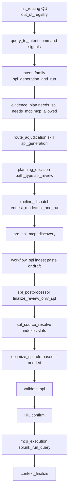

# Danger-tiered MCP execution (not a 6th skill)

## Coordination with hybrid intent plan

This plan owns **command-shaped MCP/SPL execution intent**. It can run in parallel with [`2026-07-04_1730_hybrid-intent-deterministic-llm-coordination.md`](2026-07-04_1730_hybrid-intent-deterministic-llm-coordination.md) if both plans preserve this boundary:

- This plan owns `run_spl`, `optimize_spl`, `run_saved_search`, `discovery_ask`, MCP danger tiers, HIL skip for read-only discovery, and validated SPL HIL before `splunk_run_query`.
- The hybrid plan owns source-health, OT/process-aware, containment decision-support, and LLM advisory rescue for non-command hybrid investigations.
- Command modes short-circuit before guided rescue. Hybrid advisory shapes may rescue before generic SPL only when command modes are absent.
- LLM remains advisory in both plans and cannot authorize MCP execution.

Shared precedence:

1. Destructive/write/admin command or direct containment action -> block or HIL.
2. Explicit MCP/SPL command modes -> this plan's command spine, not guided rescue.
3. Containment decision-support asks -> hybrid guided advisory, not execution.
4. Regulatory / policy / knowledge-only asks -> knowledge recall.
5. Source-health and OT/process-aware hybrid asks -> guided/hybrid evidence planning before generic SPL.
6. Generic live-data searches -> `spl_generation`.
7. Generic novel investigation -> `guided_investigation`.

## Recommendation (unchanged spine)

**Do not add a new route skill.** **Do not put run/optimize/saved-search primarily in `guided_investigation`.**

Skills stay investigation modes. MCP stays a **mediated execution layer**. Free-form “call any tool by name” stays forbidden — AI-SOC maps user intent to an allowlisted tool class, then the gate runs it.

**New posture:** allow execution when it is **not dangerous**. Example: unrestricted, validator-approved SPL may run via `splunk_run_query` (with one-click HIL). Read-only discovery tools may auto-execute.

**HIL decision (confirmed):** auto-execute read-only discovery; **one-click HIL only** for `splunk_run_query` and `splunk_run_saved_search`.

## Query traversal (canonical path — critical)

Command-shaped messages (pasted SPL, “run this”, “optimize this”, “list indexes”, “run saved search X”) are almost always **`match_path=out_of_registry`**. That is correct and must stay honest — they are not 105/catalog rows.

**They must not fall through to `guided_investigation`.** Today’s out-of-registry floors in [`select_route_from_understanding._route_out_of_registry`](../backend/app/routing/select_route_from_understanding.py) often rescue to guided (T2 answer-shape, investigation-request, soc_investigation_shaped). Command modes must **short-circuit before those floors**, same pattern as `run_execution` already partially does.

### Bug today (why explicit run is weak)

| Layer | What happens for “Run this SPL…” | Problem |
|---|---|---|
| QU | `out_of_registry` | OK |
| Intent | `clarification_required` / `human_review` / `requires_hil` | Marks HIL but wrong family for dispatch |
| Adjudication | `spl_generation` via `explicit_run_spl_hil_gate` | Skill OK |
| Planning | `path_type=spl_review` | Path OK |
| **Dispatch** | `intent_family=clarification_required` → **`request_mode=clarification`** | **SPL chain never scheduled** — only clarification/rag-early |
| Finalize | Refusal / HIL guidance | Never reaches postprocessor → source_resolve → gate |

So the fix is not “add guided capability”; it is **land command modes on the existing SPL subgraph** with the right `intent_family` / `request_mode` / evidence-plan grants.

### Target authority table (per command mode)

| Command mode | `match_path` | Skill (adjudicated) | `intent_family` | `path_type` | `request_mode` | MCP intent |
|---|---|---|---|---|---|---|
| `run_spl` | `out_of_registry` (or catalog if it happens to match) | `spl_generation` | **`spl_generation_and_run`** | `spl_review` | **`spl_and_run`** | `spl_search` |
| `optimize_spl` | same | `spl_generation` | **`spl_generation_only`** | `spl_review` | **`spl_authoring`** (or `utility_spl` if utility-shaped) | none (unless also run) |
| `run_saved_search` | same | `spl_generation` | **`spl_generation_and_run`** | `spl_review` | **`spl_and_run`** | `saved_search_execution` |
| `discovery_ask` | same | keep deterministic skill **or** `attack_discovery` if live-shaped; **never guided solely because OOR** | live/hybrid family as appropriate | not `guided_investigation` | `live_investigation` or hybrid with **`discovery_allowed`** | `metadata_discovery` / `identity_lookup` |

`intent_family` values already map in [`_resolve_request_mode`](../backend/app/chat/pipeline_dispatch_builder.py):

- `spl_generation_and_run` → `spl_and_run` → **force** `pre_spl_mcp_discovery` + `_SPL_CHAIN` + `mcp_execution` when `needs_mcp && mcp_allowed`
- `spl_generation_only` → `spl_authoring` → `_SPL_CHAIN` (postprocessor + source_resolve; MCP only if plan grants)

### Canonical node walk — `run_spl` (pasted or “run this”)

Must use the **same nodes** as any other SPL-and-run turn (dispatch v2 schedule or legacy plan_dispatch equivalent). No side door.



Stage schedule for `spl_and_run` (already defined):

```
pre_spl_mcp_discovery → workflow_spl → spl_postprocessor → spl_source_resolve → mcp_execution
```

(`_SPL_CHAIN` in [`pipeline_dispatch_builder.py`](../backend/app/chat/pipeline_dispatch_builder.py))

### What each node does for command SPL

1. **`pre_spl_mcp_discovery`** — when index/sourcetype missing or ambiguous, auto-run read-only discovery (`get_indexes` / `get_metadata`) to feed slot handoff. No HIL (danger tier).
2. **`workflow_spl`** — if message contains extractable SPL, **ingest as candidate** (`generation_mode` e.g. `user_provided_spl`); do **not** invent a template/lab draft that discards the paste. If no paste (e.g. “run the failed-login search”), use existing template/LLM-plan compiler path.
3. **`spl_postprocessor`** — mandatory [`finalize_review_only_spl`](../backend/app/spl/review_only_spl_postprocessor.py): polish shape, apply slot_handoff, fold MCP discovery context (indexes/details). Same node as catalogue/authoring turns.
4. **`spl_source_resolve`** — fill `<index>` / placeholders from COE env KB → session pins → MCP discovery → HIL clarification if still unbound ([`graph_node_spl_source_resolve`](../backend/app/chat/pipeline.py)). **No execution with unresolved security-sensitive slots.**
5. **Optimize** — call existing [`optimize_spl()`](../backend/app/splunk/spl_services.py) / `simplify_spl_safe` after resolve (or inside postprocessor when `optimize_spl` command / always-safe simplify). Re-validate after optimize.
6. **`validate_spl`** — allowlist indexes/sourcetypes, blocked commands, time bounds, result cap. Fail → honest revise, no MCP.
7. **`mcp_execution`** — HIL confirm → `splunk_run_query` with `normalized_spl` only.

### Short-circuit rules (must implement)

At **route selection** (`_route_out_of_registry`) and **intent classification**:

- If `run_spl` / `run_saved_search` / `optimize_spl` / `discovery_ask` signals fire **and** not `block_or_contain`:
  - **Do not** call `_route_guided_investigation_rescue`
  - **Do not** set `intent_family=clarification_required` solely for HIL (HIL is a **gate** concern, not a **dispatch** family)
  - Set family/skill/path per table above
  - Evidence plan: `needs_spl=True` for run/optimize; `needs_mcp=True` + `mcp_allowed=True` for run/saved-search when control plane / execution flags allow eligibility (execution still gated downstream)

Non-command hybrid advisory signals (`source_health`, `process_aware_ot`, containment **decision-support**) are intentionally out of scope for this plan except for one invariant: they must not override command modes above. They are owned by the hybrid intent coordination plan.

Adjudication authority sources (rename from refuse-oriented wording):

- `command_intent_run_spl` (was `explicit_run_spl_hil_gate` reason text “live execution is blocked” → “HIL required before execution”)
- `command_intent_optimize_spl`
- `command_intent_saved_search`
- `command_intent_discovery`

### Discovery-only commands (not guided)

“List indexes”, “show knowledge objects”, “Splunk version” stay **out_of_registry** but:

- Set `discovery_allowed=True` on evidence plan
- Schedule metadata MCP hops (auto-execute, no HIL)
- Skill may be `attack_discovery` / `knowledge_recall` / `spl_generation` depending on wording — **not** forced to `guided_investigation`
- Guided may still *also* run discovery when on the guided path for hunts; command discovery does not require guided

### Optimize-only

`request_mode=spl_authoring` → full `_SPL_CHAIN` (postprocessor + source_resolve + optimize) → return optimized candidate. **No** `mcp_execution` unless user also asked to run.

### Governance on the canonical path

- Same RunContract / RouteContract / pipeline_dispatch authority as other SPL turns
- No parallel “command executor” module that skips nodes
- Flag-off defaults: MCP execution flags still default off; when off, path still produces postprocessed validated SPL + honest “execution not enabled” / HIL card — never fake rows
- In-catalogue 105/50 byte-identity unchanged when command signals are absent

## Confirmed Splunk MCP surface → policy

Classification already lives in [`backend/app/connectors/mcp/discovery.py`](../backend/app/connectors/mcp/discovery.py) (`SPLUNK_TOOL_CLASSIFICATIONS`). Registry rows exist in [`backend/app/planner/resource_registry_v1.json`](../backend/app/planner/resource_registry_v1.json). The gap is the **selector/gate only honor `execution_intent=spl_search`**, so discovery tools never run through the main path even though they are classified safe.

| Tool | Tier | Policy |
|---|---|---|
| `splunk_get_info` | read_only_discovery | **Auto-execute** when global + server MCP execution enabled |
| `splunk_get_indexes` | read_only_discovery | **Auto-execute** |
| `splunk_get_index_info` | read_only_discovery | **Auto-execute** (requires index arg from intent/slots) |
| `splunk_get_metadata` | read_only_discovery | **Auto-execute** (index/time window from intent/slots) |
| `splunk_get_knowledge_objects` | read_only_discovery | **Auto-execute** (type filter from intent) |
| `splunk_get_kv_store_collections` | read_only_discovery | **Auto-execute** (already classified `discovery_context`; wire into mock + live transport if missing) |
| `splunk_get_user_info` | read_only_rbac | **Auto-execute** if RBAC allows (self identity only; already `rbac_gated`) |
| `splunk_get_user_list` | sensitive | **Stay blocked** (`admin_or_sensitive_tool`) — enumerates all users |
| `splunk_run_query` | validated_search | **Allow when `validate_spl` approves** (allowlisted indexes/sourcetypes, no blocked commands, time bounds, result cap, no injection). **HIL confirm** then execute. Refuse only when validation fails. |
| `splunk_run_saved_search` | validated_search (beta) | **Flag-gated** (`splunk_allow_run_saved_search`, default false) + **HIL** + named binding. Not free-form. |

SAIA tools (if present) stay blocked for execution; AI-SOC owns generate/optimize fallbacks.

## Why this is not a new skill

- Execution authority stays in [`evaluate_mcp_execution`](../backend/app/orchestration/mcp_execution_gate.py) + [`select_mcp_tool`](../backend/app/orchestration/mcp_tool_selector.py).
- Explicit run-SPL already adjudicates to `spl_generation` (`explicit_run_spl_hil_gate`).
- Discovery can attach to any skill that has `discovery_allowed` (including guided), without making guided an MCP console for freeform SPL.

## Root gap today

[`mcp_tool_selector._preflight_review`](../backend/app/orchestration/mcp_tool_selector.py) requires `execution_intent == "spl_search"` and approved SPL for **all** selections. `_tool_matches_intent` only matches `capability == "spl_search"`. So:

- Read-only tools are classified **not blocked**, but **never selected** on the main gate path.
- Explicit run-SPL often becomes refusal/HIL guidance ([`explicit_run_spl_hil.py`](../backend/app/chat/explicit_run_spl_hil.py)) instead of validate → confirm → `splunk_run_query`.

## What to build

### 1. Danger tiers (selector + gate)

Extend execution intents beyond `spl_search`:

- `metadata_discovery` → tools with capability `metadata_lookup` / `knowledge_object_discovery`
- `identity_lookup` → `splunk_get_user_info` only (not `user_list`)
- `spl_search` → `splunk_run_query` (requires approved `normalized_spl`)
- `saved_search_execution` → `splunk_run_saved_search` (flag + name)

Gate rules:

- **read_only_discovery / identity_lookup:** no SPL validation; **no HIL**; still require `MCP_GLOBAL_EXECUTION_ENABLED` + per-server execution + tool not blocked + RBAC.
- **spl_search:** require `spl_validation.approved` and non-null `normalized_spl`; **HIL confirm** (live and mock when confirmation flag on); on approve → `splunk_run_query`.
- **saved_search:** require flag + name binding; **HIL**; never auto.

“Not restricted” for SPL means existing `validate_spl` pass — not a second policy. Restricted SPL (wrong index, blocked command, unbounded time, no result cap) stays **not executable**.

### 2. Command-intent signals ([`query_signals.py`](../backend/app/chat/query_signals.py))

Closed modes (not free tool names):

- `run_spl` — run/execute this search; pasted SPL; live results
- `optimize_spl` — optimize/simplify (local `optimize_spl()`, no MCP unless also run)
- `run_saved_search` — run saved search by name
- `discovery_ask` — list indexes / metadata / knowledge objects / instance info / KV store stats

Map modes → intents above. Keep `block_or_contain` as hard override.

### 3. Run SPL path (stop refusing unrestricted SPL)

1. Extract SPL (fenced block or inline).
2. `validate_spl` (+ source-slot resolve if placeholders).
3. If **not approved** → clarification / revise (honest refuse).
4. If **approved** → HIL card with `normalized_spl` + Approve / Cancel (reuse confirmation review builders in the gate).
5. On approve → `splunk_run_query` only.

Change vs today: explicit run is **eligible execution**, not `explicit_run_spl_blocked` / permanent refusal.

### 4. Optimize (no SAIA)

Use existing [`optimize_spl()`](../backend/app/splunk/spl_services.py) rule-based path. Return optimized candidate + revalidation. If user also asked to run, feed approved optimized SPL into the run path (HIL).

### 5. Saved search

Wire chat name binding into gate args (already partially implemented). Keep default-off until COE sets `splunk_allow_run_saved_search=true`. Always HIL.

### 6. Guided’s role

Guided may **auto-run read-only discovery** when `discovery_allowed` (already partially designed via guided capability validator). Freeform `splunk_run_query` stays **not** a guided default — that stays `spl_generation` / live investigation skills with validation + HIL. Optional safe-catalog templates remain flag-gated as today.

## Governance invariants

- No LLM→MCP direct calls.
- Lab/candidate SPL never executes; only approved `normalized_spl` or allowlisted saved-search binding.
- `splunk_get_user_list` stays blocked.
- SAIA tools stay blocked for execution.
- Global/per-server MCP execution flags still default off (operator must enable for any live call).
- Read-only auto-execute does **not** bypass MCP execution flags — only bypasses per-call HIL.

## Implementation order

If executed in parallel with the hybrid intent plan, complete item 1's command-mode detection contract before either agent changes shared route precedence. The hybrid plan may add advisory signals at the same time only if command-mode tests remain authoritative.

1. **Tool tiers** — selector intents + gate HIL skip for read-only; unit tests per tool in the table.
2. **Discovery auto** — evidence/command path can request `metadata_discovery` and get live/mock results when flags on.
3. **Command signals** — run / optimize / saved search / discovery_ask.
4. **Run SPL loop** — paste → validate → HIL → execute (unrestricted only).
5. **Optimize path** — local fallback.
6. **Saved search** — flag + HIL binding.
7. **Probes** — command-shaped tests; restricted SPL still blocked; `user_list` still blocked.

## Decision summary

| Option | Verdict |
|---|---|
| New skill | **No** |
| Guided owns all MCP execution | **No** — discovery only |
| Danger-tiered allow on existing gate | **Yes** |
| Read-only discovery auto-execute | **Yes** (when MCP flags on) |
| Validated unrestricted SPL | **Yes, with HIL confirm** |
| `splunk_get_user_list` | **Stay blocked** |
| Saved search | **Flag + HIL** |

## Stop conditions

- All checklist items checked with recorded evidence, **or**
- Same verification gate fails twice on one item, **or**
- Decision needed (tradeoff / COE deferral) — stop and ask

## Dependency order

`1 → 2 → 3 → 4 → 5 → 6 → 7 → 8 → 9`

## Checklist

- [x] **1** — Command signals + OOR short-circuit (not guided)
  - **Do:** Add `run_spl`, `optimize_spl`, `run_saved_search`, `discovery_ask` in [`query_signals.py`](../backend/app/chat/query_signals.py). In `_route_out_of_registry`, when any command mode fires and not `block_or_contain`, **never** call `_route_guided_investigation_rescue`; route to `spl_generation` (run/optimize/saved-search) or non-guided discovery skill. Keep `match_path=out_of_registry` honest.
  - **Verify:** `pytest app/tests/test_explicit_run_spl_routing.py app/tests/test_route_adjudication.py -q`; new tests: OOR + “run this SPL …” → skill `spl_generation`, **not** `guided_investigation`; OOR + “list indexes” → not guided solely due to OOR; hybrid advisory probes from `2026-07-04_1730_hybrid-intent-deterministic-llm-coordination.md` do not override command modes
  - **Depends on:** none
  - **Evidence:** Added command-mode signals (`run_spl`, `optimize_spl`, `run_saved_search`, `discovery_ask`) and command authority routing (`command_intent_*`) without guided rescue. `cd backend && PYTHONPATH=../backend:.. python3 -m pytest app/tests/test_explicit_run_spl_routing.py app/tests/test_route_adjudication.py -q` → 17 passed.

- [x] **2** — Intent family + request_mode on canonical dispatch
  - **Do:** Stop classifying command run as `clarification_required` for dispatch purposes. Set `intent_family=spl_generation_and_run` (run/saved-search) or `spl_generation_only` (optimize). Evidence plan: `needs_spl` / `needs_mcp` / `mcp_allowed` / `discovery_allowed` per mode. Adjudication authority `command_intent_*`. Ensure `build_pipeline_dispatch` yields `request_mode=spl_and_run` or `spl_authoring` (not `clarification`).
  - **Verify:** Unit test: command run query → `pipeline_dispatch.decision.request_mode == "spl_and_run"` and `stage_schedule` contains `workflow_spl`, `spl_postprocessor`, `spl_source_resolve`, `mcp_execution` (when mcp grants on). Optimize → `spl_authoring`, no `mcp_execution`
  - **Depends on:** 1
  - **Evidence:** Explicit/deferred run command intent now classifies as `spl_generation_and_run` and dispatches to `spl_and_run` with pre-SPL discovery, SPL chain, and MCP execution stages. `cd backend && PYTHONPATH=../backend:.. python3 -m pytest app/tests/test_explicit_run_spl_routing.py app/tests/test_route_adjudication.py -q` → 18 passed.

- [x] **3** — Danger tiers in selector
  - **Do:** Extend `select_mcp_tool` / `_preflight_review` / `_tool_matches_intent` for intents `metadata_discovery`, `identity_lookup`, `spl_search`, `saved_search_execution`. Read-only intents must not require SPL validation. Keep `splunk_get_user_list` blocked.
  - **Verify:** `cd backend && PYTHONPATH=../backend:.. python3 -m pytest app/tests/test_mcp_tool_selector.py app/tests/test_airgapped_splunk_tool_surface.py app/tests/test_mcp_tool_chronology.py -q`
  - **Depends on:** none
  - **Evidence:** Extended selector intents for `metadata_discovery`, `identity_lookup`, `spl_search`, and `saved_search_execution`; read-only intents no longer require SPL validation, and `splunk_get_user_list` remains blocked/sensitive. `cd backend && PYTHONPATH=../backend:.. python3 -m pytest app/tests/test_mcp_execution_gate.py app/tests/test_airgapped_splunk_tool_surface.py app/tests/test_mcp_tool_chronology.py -q` → 32 passed.

- [x] **4** — Gate HIL skip for read-only
  - **Do:** In [`mcp_execution_gate.py`](../backend/app/orchestration/mcp_execution_gate.py), skip per-call confirmation for `metadata_discovery` / `identity_lookup`; keep HIL for `splunk_run_query` and `splunk_run_saved_search`. Still require MCP global + server execution flags. Wire args for discovery tools.
  - **Verify:** `pytest app/tests/test_mcp_execution_gate.py -q`; discovery auto-executes under mock flags; run_query still `requires_human_review` until confirm
  - **Depends on:** 3
  - **Evidence:** `evaluate_mcp_execution(..., execution_intent="metadata_discovery")` now auto-executes read-only discovery when global/server MCP flags are enabled and returns `review.required=false`; `spl_search` still requires validation/HIL. Same selector/gate pytest slice → 32 passed.

- [x] **5** — Pasted SPL ingest on `workflow_spl` (canonical node)
  - **Do:** In `graph_node_workflow_spl` / `_candidate_spl_stage`, if extractable SPL in message, set candidate from paste (`generation_mode=user_provided_spl`); do not replace with unrelated template/lab draft. Still flow into postprocessor + source_resolve.
  - **Verify:** Pasted `search index=…` command turn: `candidate_spl` contains user SPL (normalized), `review_only_spl_postprocessor_trace.postprocessor_evaluated=true`, source_resolve ran when placeholders present
  - **Depends on:** 2
  - **Evidence:** Added user-provided SPL extraction in `_candidate_spl_stage`; pasted SPL becomes `generation_mode=user_provided_spl`, flows through review-only postprocessor/validation, and keeps `execution_eligible=false`. `cd backend && PYTHONPATH=../backend:.. python3 -m pytest app/tests/test_explicit_run_spl_routing.py app/tests/test_route_adjudication.py -q` → 19 passed.

- [x] **6** — Preprocessor chain: postprocessor + source_resolve + optimize + validate
  - **Do:** Command SPL must pass existing nodes only: `finalize_review_only_spl` (indexes/details from slot_handoff + MCP discovery context), `graph_node_spl_source_resolve`, `optimize_spl()` / `simplify_spl_safe` when optimize command or safe simplify applies, then `validate_spl`. No parallel preprocessor. Restricted SPL fails closed.
  - **Verify:** Trace asserts stage order; optimize command applies rule-based optimize when SAIA unavailable; missing index triggers pre_spl discovery or source_resolve tiers; blocked command never reaches executed status
  - **Depends on:** 2, 5
  - **Evidence:** User-provided SPL command path now applies review-only postprocessor, validate_spl, optional rule-based optimization/revalidation for optimize commands, and remains compatible with source-resolve tests. `cd backend && PYTHONPATH=../backend:.. python3 -m pytest app/tests/test_explicit_run_spl_routing.py app/tests/test_spl_optimization_stage3jk0.py app/tests/test_spl_source_resolve.py -q` → 25 passed.

- [x] **7** — Validated SPL → HIL → `splunk_run_query`
  - **Do:** After approved validation, HIL confirm then gate. Stop permanent refuse in `explicit_run_spl_hil.py` / finalize for unrestricted SPL. Restricted → revise message only.
  - **Verify:** `pytest app/tests/test_explicit_run_spl_routing.py app/tests/test_mcp_execution_gate.py -k 'run_spl or explicit_run or confirmation' -q`
  - **Depends on:** 4, 6
  - **Evidence:** Explicit run-SPL HIL helper now preserves MCP gate pending-confirmation payloads instead of overwriting them with a permanent refusal. `cd backend && PYTHONPATH=../backend:.. python3 -m pytest app/tests/test_explicit_run_spl_routing.py app/tests/test_explicit_run_spl_hil.py app/tests/test_mcp_execution_gate.py -q` → 26 passed.

- [x] **8** — Saved search binding
  - **Do:** Chat name binding into gate `splunk_run_saved_search` args; require `splunk_allow_run_saved_search` + HIL; default-off unchanged. Same `spl_and_run` schedule without inventing freeform SPL.
  - **Verify:** `pytest app/tests/test_saved_search_mock_connector.py app/tests/test_mcp_execution_gate.py -k saved_search -q`
  - **Depends on:** 2, 4
  - **Evidence:** Added saved-search selector/gate handling with RBAC allowlist, default-off flag enforcement, pending confirmation, and confirm-to-execute mock path. `cd backend && PYTHONPATH=../backend:.. python3 -m pytest app/tests/test_saved_search_mock_connector.py app/tests/test_mcp_execution_gate.py -q` → 21 passed.

- [x] **9** — Regression: NL hunts still guided; flag-off safe
  - **Do:** Network/NL out_of_registry hunts without command signals still may use guided rescue. Command modes never force guided. MCP flags default off → no live calls, no fake rows.
  - **Verify:** Existing guided/OOR hunt tests green; command-path tests assert `request_mode` and stage schedule; flag-off no MCP calls
  - **Depends on:** 1, 7, 8
  - **Evidence:** Command/hybrid boundary and flag-off/regression slices are green: `cd backend && PYTHONPATH=../backend:.. python3 -m pytest app/tests/test_105_path_regression_sample.py app/tests/test_explicit_run_spl_routing.py app/tests/test_route_adjudication.py app/tests/test_explicit_run_spl_hil.py app/tests/test_mcp_execution_gate.py app/tests/test_saved_search_mock_connector.py app/tests/test_airgapped_splunk_tool_surface.py app/tests/test_mcp_tool_chronology.py app/tests/test_splunk_stage3h.py app/tests/test_hybrid_intent_advisory_signals.py app/tests/test_hybrid_llm_advisory_rescue.py app/tests/test_live_data_request_routing.py -q` → 140 passed. Full `./scripts/run_stage3_governance_regression.sh` re-run 2026-07-04 found a real regression the unit-test slice above missed: `test_guided_investigation_route.py::test_unsafe_mixed_intent_never_selects_guided_investigation["Strange OT traffic, run SPL and hunt for suspicious activity"]` — `_resolve_path_type` (`planning_decision.py`) had no branch for the new `spl_generation_and_run`/`spl_generation_only` intent families in the `evidence_plan=None` trace-only path (the actual default when `CONTROL_PLANE_ENABLED=false`); item 2's own unit test only passed because it force-supplied `{"needs_spl": True}` instead of exercising the real default pipeline. End-to-end command-shaped SPL asks fell through to `generic_soc_guidance` instead of `spl_review`. Fixed by adding a command-signal short-circuit (`run_spl`/`optimize_spl`/`run_saved_search`, minus `block_or_contain`) in `_resolve_path_type` before the family cascade. Also updated the stale assertion in `test_guided_investigation_route.py` that hardcoded `primary_intent == "human_review"` — command-shaped SPL asks now correctly classify `primary_intent=spl_generation` with HIL enforced downstream (by design, per this plan's `command_intent_run_spl` reclassification); safety invariants (`hil_required`, `human_review.required`, `execution_enabled=false`, never `executed`) all still hold and are asserted separately. `./scripts/run_stage3_governance_regression.sh` → PASS (3968 pytest, harness, clean-answer, SPL audit, Cisco-50 gate, dispatch matrix all green).
