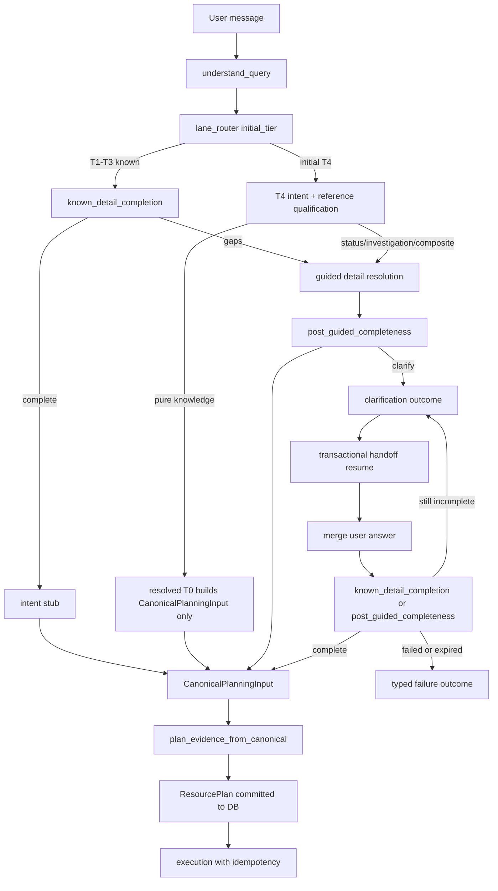

# Guided detail tools — canonical planning architecture (rev 9)

## Architecture objective

One consistent agentic flow — **always on**, no feature flags or legacy fallbacks:

- **T1–T3** — deterministic catalogue match → `processing_lane=known`
- **No T1–T3 match** → initial **T4** `processing_lane=guided`
- **T0** — resolved tier only after T4 qualification (`reference_knowledge` / `knowledge_only`)
- **`knowledge_recall`** — reusable read-only DetailTool
- **Gap-resolution planner** — `GapResolutionResult` only; never creates `ResourcePlan`
- **Final planner** — `plan_evidence_from_canonical` is the **sole** `ResourcePlan` creator/committer
- **Execution** — only from committed `ResourcePlan`; guided hybrid dispatch projects `InvestigationPlan`, never composes plans
- **Persistence** — PostgreSQL for handoffs, planning events, execution idempotency (`0004_canonical_handoffs.sql`)
- **Non-planned outcomes** — clarification, policy block, planning failure via typed `CanonicalPlanningOutcome`; downstream branches on `status`, not on partial `EvidencePlan` dicts

## Completion criteria (all must be true before marking Done)

- [ ] Canonical planning is always active; no flags or shadow paths remain
- [ ] No legacy planning path can execute on live `/chat`
- [ ] Runtime handoffs use PostgreSQL only (no live memory or file fallback)
- [ ] Migrations are applied by a deploy step (not by runtime DDL) and verified in `schema_migrations`
- [ ] Handoff/idempotency writes run inside one transaction on one connection (unit-of-work)
- [ ] All persisted planning events contain required correlation fields (`session_id`, `decision_id`, `handoff_id`, etc.) as typed columns — verified non-null
- [ ] Experience Center path emits zero canonical planning events, handoff rows, and plan commits
- [ ] Handoff + planning-event retention/purge is enforced (no unbounded SOC-content growth)
- [ ] Containerised live `/chat` smoke passes for all six canonical paths
- [ ] Response and terminal request events are complete (`response.validated`, `response.generated`, `request.completed` / `request.failed`)
- [ ] Guided dispatch cannot create or modify `ResourcePlan`
- [ ] Plan and execution idempotency are transactionally enforced
- [ ] Full backend pytest passes (0 failed)
- [ ] Stage 3 governance regression passes
- [ ] Sentinel clarification evaluation passes

## Stop conditions

- All checklist items checked with evidence, **or**
- Same Verify fails twice on one item, **or**
- Decision needed — stop and ask

## Dependency order

Phase 1: `1 → 2 → 3 → 4 → 5 → 6 → 7 → 8 → 9`

Phase 2 (execution order — rev 9; item numbers unchanged, new items suffixed):

`12 → 13 → 14 → 15 → 16 → 17 → 18a → 19a → 10 → 21a → 18 → 19 → 21b → 20 → 21 → 22 → 23 → 24 → 25 → 26 → 26a → 28 → 11 → 29 → 27`

**Gate rules:**
- Do not start item 15 until item 14 (sentinel) passes.
- **18a blocks 18, 19a, 24** — no fail-closed persistence before migrations have a deploy path.
- **19a blocks 19, 20, 24** — no multi-statement transaction work before the unit-of-work exists.
- **10 + 21a precede 18** — items 18/19/20 emit durable telemetry, so the telemetry foundation and typed correlation columns are prerequisites, not successors.
- **21b blocks 20 and final telemetry acceptance (21, 22)** — the audit-critical vs diagnostic split decides where execution fails closed.
- Item 20 uses repository/unit tests first; item 24 validates concurrency with real PostgreSQL.
- Item 11 is an intermediate regression gate (not an early implementation step).
- **29 runs after 24, 21, 22, 26a** — live smoke is the last functional gate before item 27.

## Target flow



## Tier and lane table (authority)

| `deterministic_match_path` | Initial tier | `processing_lane` (initial) | Intent hop |
|----------------------------|--------------|----------------------------|------------|
| `exact_105_question`, `exact_105_plus_use_case_catalog` | T1 | known | stub only if complete |
| `use_case_catalog` | T2 | known | stub only if complete |
| `near_105_question`, `semantic_105_question`, `fuzzy_alias_catalog` | T3 | known | stub only if complete |
| `out_of_registry`, `query_understanding_weak`, `qu_unavailable`, empty | T4 | guided | full classifier |
| **Resolved T0** (post-T4 only) | T0 | knowledge_short_circuit | classifier → qualification |

## Locked decisions (rev 8)

1. T0 is **resolved tier only** after T4 qualification — never from parser.
2. CVE/MITRE/ATLAS id alone does **not** assign T0; use `ReferenceQueryQualification`.
3. `processing_lane` and `answer_goal` are independent.
4. Single planner-facing contract: `CanonicalPlanningInput`.
5. Gap-resolution planner outputs `GapResolutionResult`; final planner is sole `ResourcePlan` creator.
6. `knowledge_recall` DetailTool is read-only with typed `KnowledgeRecallResult`.
7. **Dual-runtime parity:** imperative pipeline and RP graph are **entry points into the same canonical orchestration service**. They must not contain separate copies of routing, planning, or handoff logic.
8. **T0 knowledge execution:** T0 qualification does **not** execute `knowledge_recall` before the final planner. T0 creates `CanonicalPlanningInput`; the final planner places `knowledge_recall` into the committed `ResourcePlan`. For T4 guided resolution, `knowledge_recall` may run before final planning **only** when resolving a planning gap (not for T0 short-circuit).
9. **No feature flags** for canonical planning — `is_canonical_authoritative()` always true.
10. **No live memory/file handoff fallback** — DB unavailable → `persistence_failed` outcome.
11. **Non-planned outcomes:** downstream pipeline branches on `CanonicalPlanningOutcome.status` — never on a partially constructed `EvidencePlan`. Clarification and failure paths do **not** require `EvidencePlan`.
12. **Telemetry failure policy (refined rev 9 — see item 21b):** persistence classes are not uniform.
    - **State persistence** (handoff, `ResourcePlan` commit, execution idempotency) failure → **fail closed**, always.
    - **Audit-critical telemetry** (`handoff.persisted`, `resource_plan.created`, `execution.started`, `execution_step.started`, `execution_step.completed`, `request.failed`) failure **before side-effecting execution** → **fail closed**.
    - **Diagnostic telemetry** (the remaining events) failure → controlled degraded outcome: logged at WARNING with `error_category`, surfaced in the trace, **never silently dropped**, **never** blocking a read-only response.
    - This preserves the shipped COE invariant that diagnostic observability is best-effort and never breaks chat, while making the audit spine non-optional. Document the exact per-event class in `canonical_telemetry_coverage.md`.
13. **Migration policy:** If `0004_canonical_handoffs.sql` is already applied in any environment, **do not edit it**. Add `0005_canonical_planning_cutover_constraints.sql` for any missing: unique ResourcePlan commit constraint, event deduplication key, execution-idempotency uniqueness, lease fields/indexes, clarification-resumption indexes.
14. **Migrations are a deploy step, never runtime DDL.** Runtime code must not execute `.sql` files. Schema readiness is verified by reading `schema_migrations`, and a missing migration is a startup/readiness failure, not a lazy `CREATE TABLE IF NOT EXISTS` on the request path.
15. **One canonical data layer.** Canonical persistence uses a single pooled connection source and a unit-of-work; repository methods accept a connection/transaction handle rather than opening their own. No new third data-access pattern beyond SQLAlchemy (`app/db/session.py`) and the telemetry asyncpg connector.
16. **Correlation fields are typed columns, not payload keys.** `minimize()` deletes any key containing `session_id` (it is in `_SECRET_KEY_PARTS`). Correlation values are read from the unminimized source and bound to columns; `minimize()` applies only to the free-form payload.
17. **Experience Center purity.** The EC fixture path (`routes_scenarios.py`) creates no handoff rows, commits no `ResourcePlan`, and emits no canonical planning events. Removing runtime trace fields must not silently invalidate `app/demo/captures/*.json` or golden fixtures — fixture migration is explicit work, not a side effect.
18. **Rollback posture.** No flags by design, so the only runtime mitigation is `git revert` of the cutover commit(s). Migrations `0004`/`0005` are additive and forward-compatible; a revert requires no down-migration. State this in the completion report.

---

## Phase 1 — Contracts and wiring (items 1–9) — DONE

- [x] **1** — Core contracts
  - **Do:** `canonical_planning_input.py`, `reference_qualification.py`, `gap_resolution.py`, `knowledge_recall.py`; extend `DecisionRecord.payload`
  - **Verify:** `pytest app/tests/test_canonical_planning_architecture.py app/tests/test_decision_record.py -q`
  - **Depends on:** none
  - **Evidence:** 16 passed (contracts + DecisionRecord payload roundtrip)

- [x] **2** — Lane router + intent defaults
  - **Do:** `lane_router.py`, `intent_family_defaults.py`
  - **Verify:** `pytest app/tests/test_canonical_planning_architecture.py -k lane -q`
  - **Depends on:** 1
  - **Evidence:** `test_lane_router_t1_t3_known`, `test_no_match_initial_t4`

- [x] **3** — Present-key projection
  - **Do:** Extend entity projection for bare user/host tokens
  - **Verify:** `pytest app/tests/test_canonical_planning_architecture.py -k present_key -q`
  - **Depends on:** none
  - **Evidence:** `test_present_key_projection_bare_user_host` green

- [x] **4** — Known completeness gate
  - **Do:** `known_detail_completion.py`
  - **Verify:** `pytest app/tests/test_canonical_planning_architecture.py -k known_incomplete -q`
  - **Depends on:** 2, 3
  - **Evidence:** divert + complete-path tests green

- [x] **5** — Reference qualification + T0 resolution
  - **Do:** `reference_qualification.py`; T4 → T0 when knowledge-only scopes
  - **Verify:** `pytest app/tests/test_canonical_planning_architecture.py -k t0 -q`
  - **Depends on:** 1, 2
  - **Evidence:** `test_t0_only_after_qualification`, `test_cve_status_stays_t4`, `test_t4_resolves_to_t0_knowledge_plan`

- [x] **6** — DetailTools: knowledge_recall + select + merge
  - **Do:** `detail_tools/knowledge_recall_tool.py`, `select_detail_tools.py`, `detail_merge.py`
  - **Verify:** `pytest app/tests/test_canonical_handoff_invariants.py -k tool -q`
  - **Depends on:** 1, 5
  - **Evidence:** tool selection + failure tests green

- [x] **7** — Gap-resolution planner
  - **Do:** `guided_detail_resolution.py`, `post_guided_completeness.py`
  - **Verify:** `pytest app/tests/test_canonical_handoff_invariants.py -q`
  - **Depends on:** 4, 6
  - **Evidence:** gap planner + post-guided completeness tests green

- [x] **8** — Canonical handoff builder + final planner adapter
  - **Do:** `canonical_handoff_builder.py`, `plan_evidence_from_canonical.py`; `resource_plan_authority.py` guard
  - **Verify:** `pytest app/tests/test_canonical_planning_architecture.py -k planner -q`
  - **Depends on:** 1, 7
  - **Evidence:** `test_final_planner_consumes_answer_goal`; authority guard in composer

- [x] **9** — Pipeline + RP graph wiring (always-on)
  - **Do:** Canonical nodes unconditional in `pipeline.py`; `guided_hybrid_dispatch.py` / `guided_hybrid_executor.py` execute from committed plan only; flags removed from `config.py`
  - **Verify:** `pytest app/tests/test_dual_runtime_lane_parity.py -q`; `grep -r 'plan_dispatch_fallback' backend/app/chat/pipeline.py` → no live fallback
  - **Depends on:** 8
  - **Evidence:** 3 parity cases; legacy `graph_node_evidence_planning` fallback removed from live path; migration `0004_canonical_handoffs.sql` added

---

## Phase 2 — Always-on cutover (items 10–27)

Maps 1:1 to user spec §1–§14, plus rev 9 architecture-review items (18a, 19a, 21a, 21b, 26a, 28, 29).

**Implementation status (rev 9, verified):** Phase 2 is not started **except** a partial item 10 — `durable_planning_telemetry.py`, `planning_telemetry.py`, and `response_validation.py` exist, and `validate_final_response` is already called on the live path at `pipeline.py:4253`. Rev 8's "nothing implemented" claim was wrong. Item 10 must be finished (unit-of-work, correlation, policy), not started from zero.

### Root cause — sentinel / clarification (Gate 1 blocker) — spec §1


**Confirmed bugs (not fixed):**
- `canonical_planning_orchestrator.py` ~396–402 inserts partial `evidence_plan` dict on clarification
- `response_validation.py` always requires `resource_plan` — fails clarification paths
- Resume checks `status == "clarification_required"` but store saves `awaiting_clarification`
- `canonical_handoff_repository.py` falls back to `_TEST_STORE` when DB disabled or write fails

**Outcome rules (items 12–13) — branch on `CanonicalPlanningOutcome.status`, not on `EvidencePlan` presence:**

| `status` | `EvidencePlan` | `ResourcePlan` | Required |
|----------|----------------|----------------|----------|
| `planned` | **Required** (valid typed) | **Committed and required** | `canonical_input` |
| `clarification_required` | **Absent** | **Absent** | clarification + unresolved fields + persisted handoff |
| `policy_blocked` | Optional only for non-executing response | **Absent** | policy metadata |
| `resolution_failed` / `planning_failed` / `unsupported` / `execution_failed` / `persistence_failed` | **Absent** | **Absent** | typed `failure` |

Do **not** insert placeholder or structurally invalid `EvidencePlan` values. Do **not** require `EvidencePlan` for clarification — that recreates the sentinel failure.

---

- [ ] **12** — `CanonicalPlanningOutcome` contract — spec §1
  - **Do:** Add `backend/app/chat/contracts/canonical_planning_outcome.py` with statuses: `planned`, `clarification_required`, `resolution_failed`, `planning_failed`, `policy_blocked`, `unsupported`, `execution_failed`, `persistence_failed`. Fields: `canonical_input`, `evidence_plan` (only when `planned` or optional `policy_blocked`), `resource_plan` (only when `planned`), `clarification`, `failure`. Factory helpers per outcome rules table above — **no `EvidencePlan` for clarification or failure statuses**.
  - **Do:** Add `backend/app/tests/test_canonical_planning_outcomes.py` with **one named test per status** (minimum 8): `test_outcome_planned`, `test_outcome_clarification_required`, `test_outcome_resolution_failed`, `test_outcome_planning_failed`, `test_outcome_policy_blocked`, `test_outcome_unsupported`, `test_outcome_execution_failed`, `test_outcome_persistence_failed`.
  - **Verify:** `pytest app/tests/test_canonical_planning_outcomes.py -q` → 8+ passed
  - **Depends on:** none
  - **Evidence:** _(filled at check-off)_

- [ ] **13** — Refactor all canonical exit paths — spec §1
  - **Do:** Audit every orchestrator exit where no executable plan is produced. Set `canonical_planning_outcome` on state; **do not** set `evidence_plan` on clarification or failure paths.
  - **Do:** Fix resume status to `normalized_status() == "awaiting_clarification"`. On clarification answer: transactional resume → merge answer → re-run `known_detail_completion` or `post_guided_completeness` (user answer is **not** automatically sufficient for `CanonicalPlanningInput`).
  - **Do:** Update downstream nodes to branch on `canonical_planning_outcome.status` only — never `EvidencePlan.model_validate` on non-`planned` outcomes.
  - **Verify:** `pytest app/tests/test_canonical_planning_outcomes.py app/tests/test_canonical_architecture_complete.py -q`
  - **Depends on:** 12
  - **Evidence:** _(filled at check-off)_

- [ ] **14** — Gate 1: clarification + sentinel — spec §1, §12
  - **Do:** Run targeted clarification tests + sentinel immediately after items 12–13; do not proceed to item 15 until pass.
  - **Verify:**
    ```bash
    cd backend && PYTHONPATH=../backend:.. python3 -m pytest \
      app/tests/test_canonical_planning_outcomes.py \
      app/tests/test_canonical_architecture_complete.py -k clarification -q
    PYTHONPATH=backend:. python3 scripts/eval_sentinel.py --check
    ```
  - **Depends on:** 13
  - **Stop:** Sentinel fails twice → stop and report
  - **Evidence:** _(filled at check-off)_

- [ ] **15** — Pytest failure inventory — spec §2
  - **Do:** Run full pytest once; capture to `docs/evals/canonical_phase2_failure_inventory.md` with columns: test file, test name, failure category, old assumption, new canonical expectation, code fix or test fix.
  - **Do:** Categorize using **exact** spec labels:
    - **A** — tests assuming canonical planning can be disabled
    - **B** — tests expecting legacy `query_to_intent` or `evidence_planning`
    - **C** — tests expecting live `/chat` to attach `ResourcePlan` through old planner
    - **D** — tests expecting legacy dispatch fallback
    - **E** — clarification `EvidencePlan` contract failures
    - **F** — configuration tests referencing removed flags
    - **G** — genuine regressions unrelated to test assumptions
  - **Do:** Do not patch tests blindly; do not skip/xfail/weaken governance tests; do not add global compatibility shims.
  - **Verify:** Inventory row count matches pytest failure summary
  - **Depends on:** 14
  - **Evidence:** _(filled at check-off)_

- [ ] **16** — Canonical test helper — spec §2
  - **Do:** Add `backend/app/tests/support/canonical_flow.py`: `run_canonical_flow(query, *, handoff_resume=None, session_id=...)` through production flow:
    ```text
    understand_query → canonical orchestration → CanonicalPlanningInput
    → plan_evidence_from_canonical → committed ResourcePlan or typed non-executable outcome
    ```
    Must not bypass runtime contracts.
  - **Verify:** Helper used in ≥3 updated tests; `pytest app/tests/test_canonical_flow_helper.py -q`
  - **Depends on:** 12
  - **Evidence:** _(filled at check-off)_

- [ ] **17** — Eliminate all pytest failures — spec §2
  - **Do:** Fix per inventory order: **F** → **E** → **A/B/C/D** → **G**. Remove `_attach_resource_plan` from production runtime; isolate test composition in `backend/app/tests/support/compose_resource_plan_testutil.py` under explicit `TEST_AUTHORITY` only. Search all callers before removal. Do not make `_attach_resource_plan` silently restore old live behaviour.
  - **Verify:** `cd backend && PYTHONPATH=../backend:.. python3 -m pytest -q` → **0 failed**
  - **Depends on:** 15, 16
  - **Evidence:** _(filled at check-off)_

- [ ] **18a** — Migration deployment and readiness — rev 9 (blocks 18, 19a, 24)
  - **Context:** `canonical_handoff_repository.py::_ensure_schema` executes `0004_canonical_handoffs.sql` from the live request path on first use, and `backend/scripts/migrate_ai_soc_db.py` currently has **zero callers** (not in `docker-compose.yml`, no entrypoint, not in CI). Schema exists today only as a side effect of runtime DDL. Fail-closed persistence (item 18) on top of that = live `/chat` hard-failure in any environment whose migrations were never run, and `0005` constraints (item 18) would never be applied because the runtime path is hardcoded to `0004`.
  - **Do:** Delete `_ensure_schema` / `_SCHEMA_READY` / `_MIGRATION_PATH` from `canonical_handoff_repository.py`. No runtime module may read or execute a `.sql` file (locked decision 14).
  - **Do:** Wire `backend/scripts/migrate_ai_soc_db.py` into the deploy path (backend container entrypoint or an explicit documented ops step in `docs/`), idempotent and safe to re-run. Preserve `schema_migrations` bookkeeping; the runner currently applies every file unconditionally — make it skip versions already recorded.
  - **Do:** Add a readiness check (startup log + `/health` detail or `readiness` field) asserting `schema_migrations` contains `0001`–`0005`. Missing migration = loud readiness failure with the exact remediation command, not a silent lazy create.
  - **Do:** Record in the completion report which environments (dev container, VPS prod) had migrations applied and when.
  - **Verify:** `rg -n '\.sql' backend/app --glob '!**/migrations/**'` → no runtime reads; `docker compose exec backend python scripts/migrate_ai_soc_db.py` twice → second run is a no-op; `pytest app/tests/test_migration_readiness.py -q`
  - **Depends on:** none
  - **Evidence:** _(filled at check-off)_

- [ ] **19a** — Canonical DB unit-of-work and pool — rev 9 (blocks 19, 20, 24)
  - **Context:** `canonical_handoff_repository.py` opens a fresh `asyncpg.connect()` inside its own `asyncio.run()` per method (`_run`, `_with_conn`), and `durable_planning_telemetry.py` does the same per event. Two consequences: (a) item 19's `load … FOR UPDATE` → merge → create version → supersede → commit **cannot** be one transaction, because each repository call is a different connection and the row lock is released before the merge; (b) ~35 fresh TCP+auth connections per turn, serially, inside the SSE executor thread (`routes_chat_stream.py::_sse_event_stream` runs the pipeline via `run_in_executor`, so `asyncio.run` is legal but each call pays full connect cost).
  - **Do:** Add `backend/app/chat/canonical_db.py`: a single lazily-created `asyncpg` pool + `canonical_unit_of_work()` context manager yielding one connection inside `async with conn.transaction()`. Bridge sync callers through one `asyncio.run` per unit-of-work, not per statement.
  - **Do:** Refactor repository + idempotency + telemetry writers to accept an injected connection/transaction handle. A caller composing several operations gets one transaction; a standalone call opens its own.
  - **Do:** Do not introduce a fourth data-access pattern (locked decision 15). Document the boundary vs SQLAlchemy `app/db/session.py` and `app/connectors/telemetry/db.py` in the completion report.
  - **Do:** Bound connection churn: per-turn planning events buffer and flush in one transaction (audit-critical events flush immediately per item 21b). Record measured connections-per-turn and added p50 latency.
  - **Verify:** `pytest app/tests/test_canonical_db_unit_of_work.py -q` (rollback discards all writes in the unit; two operations in one unit share one connection; pool reused across turns); connections-per-turn ≤ 5 measured on a live smoke turn
  - **Depends on:** 18a
  - **Evidence:** _(filled at check-off)_

- [ ] **10** — Durable telemetry foundation — *(moved ahead of 18/19/20 in rev 9)*
  - **Do:** `durable_planning_telemetry.py` persists to `canonical_planning_events` through the item-19a unit-of-work; `planning_telemetry.py` delegates; wire interim events until item 21 completes the full catalog. Apply the refined telemetry failure policy (locked decision 12 / item 21b).
  - **Do:** Remove the live-path memory leak: the `except` branch of `persist_planning_event` currently appends to the global `_TEST_EVENTS` list on production paths — unbounded growth plus prod code writing a test store. Test capture is fixture-injected only (`use_test_event_store()`), same rule as item 18 applies to handoffs.
  - **Do:** Reconcile with the existing sink config. `durable_planning_telemetry` ignores `ai_soc_telemetry_sink` / `telemetry_mode` and keys only off `database_url`. Define and implement the interaction explicitly: diagnostic events honour the sink; audit-critical events are not sink-optional (a configuration that would drop them is rejected at startup).
  - **Verify:** `pytest app/tests/test_canonical_planning_architecture.py -k t4_resolves -q`; `rg -n '_TEST_EVENTS' backend/app/chat/durable_planning_telemetry.py` → no writes outside fixture-injected capture
  - **Depends on:** 17, 19a
  - **Evidence:** _(foundation partial; full catalog = item 21)_

- [ ] **21a** — Typed telemetry correlation outside `minimize` — rev 9 (part of telemetry foundation)
  - **Context (verified):** `minimize()` **deletes** any key containing `session_id` — it is in `_SECRET_KEY_PARTS` in `app/connectors/telemetry/redaction.py`. Proven:
    ```text
    minimize({'session_id':'abc','trace_id':'t1','handoff_id':'h','user_query':'…'})
    → {'trace_id': 't1', 'handoff_id': 'h', 'user_query': '…'}
    ```
    `persist_planning_event` minimizes **first**, then reads `sanitized.get("session_id")` for the column — so `canonical_planning_events.session_id` is always NULL. That breaks the completion criterion "all persisted planning events contain required correlation fields" and item 21's multi-worker correlation. `_sanitize_payload` in `canonical_handoff_repository.py` has the same shape.
  - **Do:** Bind correlation columns (`trace_id`, `session_id`, `turn_id`, `decision_id`, `parent_decision_id`, `handoff_id`, `handoff_version`, `resource_plan_id`, `node_name`, `status`, `duration_ms`, `error_category`) from the **unminimized** source, mirroring the existing `app/connectors/telemetry/db.py` pattern. Apply `minimize()` only to the free-form `payload` jsonb.
  - **Do:** Confirm SOC content policy for the jsonb payload — `user_query` / `original_query` survive `minimize()` by design. Either keep them (documented, covered by item 28 retention) or truncate/hash; state the decision.
  - **Verify:** `pytest app/tests/test_canonical_telemetry_correlation.py -q` — asserts non-null `session_id` and `handoff_id` on a persisted event, and that a secret-bearing payload is still redacted
  - **Depends on:** 10
  - **Evidence:** _(filled at check-off)_

- [ ] **18** — Remove live memory handoff fallback — spec §4
  - **Do:** Refactor `canonical_handoff_repository.py`: `_TEST_STORE` only via `use_in_memory_store_for_tests()` fixture injection; **never** on live path (including `_disabled()` and write-failure catch). On DB unavailable: `PersistenceError` → `persistence_failed` outcome → `request.failed` telemetry → no in-memory continuation.
  - **Do:** If `0004_canonical_handoffs.sql` already applied, add `backend/app/db/migrations/0005_canonical_planning_cutover_constraints.sql` (do **not** edit `0004`) for missing handoff/commit unique constraints and clarification-resumption indexes.
  - **Do:** Add `backend/app/tests/test_canonical_handoff_persistence_failclosed.py` covering: DB unavailable during clarification persistence; DB unavailable during handoff resumption; DB unavailable during ResourcePlan commit → no execution. (Process restart and second-worker cases validated in item 24.)
  - **Verify:** `pytest app/tests/test_canonical_handoff_persistence_failclosed.py -q`
  - **Depends on:** 12, 18a, 19a, 10, 21a
  - **Evidence:** _(filled at check-off)_

- [ ] **19** — Transactional clarification resumption — spec §5
  - **Do:** On clarification response: `load pending handoff WITH LOCK` → validate session ownership → validate handoff status → validate `handoff_version` → merge answer → create next version → mark prior superseded/resumed → commit transaction → continue from saved stage.
  - **Do:** Repository methods: `load_pending_for_update`, `supersede_version`, `merge_clarification_answer` (`SELECT … FOR UPDATE`, unique `(handoff_id, handoff_version)`). Controls: one answer advances version once; duplicate answers return existing next version; two workers cannot create two versions; completed/failed/expired cannot resume; wrong pending handoff rejected; multiple pending handoffs disambiguated deterministically; material goal change supersedes with linked new handoff.
  - **Do:** Preserve across versions: `original_skill`, `original_use_case_id`, `original_answer_goal`, `initial_tier`, `resolved_tier`, prior tool results, field provenance, conflicts, unresolved fields.
  - **Do:** All five steps run inside **one** `canonical_unit_of_work()` from item 19a — a lock acquired on one connection and released before the merge is not a control.
  - **Verify:** `pytest app/tests/test_canonical_handoff_clarification_integration.py -q` (Postgres — item 24)
  - **Depends on:** 18, 19a
  - **Evidence:** _(filled at check-off)_

- [ ] **21b** — Audit-critical vs diagnostic persistence policy — rev 9 (blocks 20 and final telemetry acceptance)
  - **Context:** Locked decision 12 (rev 8) said "telemetry persistence failure before side-effecting execution → fail closed" for **all** telemetry. That contradicts the shipped COE invariant recorded in `CLAUDE.md` — trace telemetry is "redacted, best-effort, **never breaks chat**" — and contradicts supported configurations `AI_SOC_TELEMETRY_SINK=db|file|none` and `TELEMETRY_MODE=none` (the governance regression harness runs with `TELEMETRY_MODE=none`). Left unresolved, item 21 would either break the regression harness or quietly abandon fail-closed.
  - **Do:** Classify all 28 events in `docs/architecture/canonical_telemetry_coverage.md` as **audit-critical** or **diagnostic**. Audit-critical (proposed, confirm at execution): `handoff.persisted`, `handoff.resumed`, `resource_plan.created`, `execution.started`, `execution_step.started`, `execution_step.completed`, `execution_step.failed`, `request.failed`. Everything else diagnostic.
  - **Do:** Implement the split: audit-critical write failure before a side-effecting step → `persistence_failed` outcome, no execution; diagnostic write failure → WARNING log with `error_category`, surfaced in the trace, chat proceeds. Never a silent drop in either class.
  - **Do:** Define sink interaction: diagnostic events honour `ai_soc_telemetry_sink`; a configuration that would discard audit-critical events (`sink=none` with execution enabled) is rejected at startup with an explicit message. Confirm the governance regression harness path stays green under `TELEMETRY_MODE=none`.
  - **Do:** Update the `CLAUDE.md` COE observability bullet so the "never breaks chat" statement is scoped to diagnostic telemetry.
  - **Verify:** `pytest app/tests/test_telemetry_persistence_policy.py -q` (audit-critical failure blocks execution; diagnostic failure does not block a read-only response; neither is silently dropped); `TELEMETRY_MODE=none PYTHONPATH=backend:. python3 -m test_harness.harness.runner --json` → 6/6
  - **Depends on:** 10, 21a
  - **Evidence:** _(filled at check-off)_

- [ ] **20** — Execution idempotency implementation — spec §3
  - **Do:** Add `backend/app/chat/canonical_execution_idempotency.py` using `canonical_execution_idempotency` table. Add lease/index constraints via `0005` migration if not in `0004`. Integrate into `planner/executor.py` `execute_plan_dispatch` **and every execution path** including guided hybrid.
  - **Do:** Idempotency key = `resource_plan_id` + `handoff_id` + `handoff_version` + `step_id` + **operation identity**. Lifecycle: `pending` → `running` → `completed` | `failed_retryable` | `failed_terminal`.
  - **Do:** Per-step transaction flow: (1) start txn, (2) acquire/create record, (3) if `completed` return stored result, (4) if `running` under valid lease do not execute concurrently, (5) recover stale lease per documented policy, (6) mark `running` before tool invoke, (7) persist result + terminal status atomically. Separate read-only (retryable) vs side-effecting (no replay unless tool contract + stable key supports idempotency).
  - **Do:** Invariant: **a committed ResourcePlan step can produce at most one side effect.**
  - **Do:** Add `backend/app/tests/test_execution_idempotency.py` with **repository/unit tests first** (named tests): duplicate dispatch; concurrent dispatch two workers; worker crash after `running`; replay after completion; retryable read-only failure; side-effecting step timeout; same plan different step IDs; mismatched handoff version.
  - **Do:** Per-step transactions use `canonical_unit_of_work()` (item 19a) — acquire/lease/mark-running/persist-result must not span separate connections.
  - **Verify:** `pytest app/tests/test_execution_idempotency.py -q`
  - **Depends on:** 18, 19a, 21b
  - **Evidence:** _(filled at check-off)_

- [ ] **21** — Complete durable telemetry catalog — spec §6
  - **Do:** Wire **all 28 events** from real emitting nodes (not merely helpers):
    ```text
    query_understanding.completed, lane_router.decided, known_completeness.evaluated,
    guided_resolution.started, guided_intent.resolved, tier.resolved,
    detail_tool.selected, detail_tool.started, detail_tool.completed, detail_tool.failed,
    detail_merge.completed, post_guided_completeness.evaluated, clarification.requested,
    handoff.persisted, handoff.resumed, planner_handoff.created, planner_handoff.consumed,
    resource_plan.created, resource_plan.commit_reused,
    execution.started, execution_step.started, execution_step.completed, execution_step.failed,
    execution.completed, response.validated, response.generated,
    request.completed, request.failed
    ```
  - **Do:** Add `docs/architecture/canonical_telemetry_coverage.md`: per event — emitting node, success condition, failure condition, required payload, persistence confirmation.
  - **Do:** Persisted events carry where applicable: `trace_id`, `session_id`, `turn_id`, `decision_id`, `parent_decision_id`, `handoff_id`, `handoff_version`, `resource_plan_id`, `node_name`, `node_version`, `contract_version`, `initial_tier`, `resolved_tier`, `processing_lane`, `answer_goal`, `primary_skill`, `original_skill`, `status`, `duration_ms`, `error_category`. Redact secrets/raw SOC content.
  - **Do:** Terminal consistency: success → exactly one `request.completed`; terminal failure → exactly one `request.failed`; clarification → `clarification.requested` without false `request.completed`. Events survive restart; multi-worker correlation; ordering reconstructable; duplicate events have stable IDs or dedup keys.
  - **Do:** Correlation fields are bound as typed columns per item 21a — do **not** read them back out of a `minimize()`d dict.
  - **Do:** Telemetry failure policy per item 21b classification: audit-critical failure fails closed before side-effecting execution; diagnostic failure degrades loudly. Never silently drop either class.
  - **Verify:** `pytest app/tests/test_canonical_telemetry_coverage.py -q` (one test per canonical functional path)
  - **Depends on:** 10, 21a, 21b, 13, 20
  - **Evidence:** _(filled at check-off)_

- [ ] **22** — Response validation semantics — spec §7
  - **Do:** Rewrite `response_validation.py` outcome-aware. Before `response.validated`, check: canonical outcome status; `resource_plan_id` when executable; execution terminal state; required step completion; required evidence availability; explicit limitations; tool failures surfaced; `answer_goal` satisfied; citations retained; no claim of unexecuted action; policy restrictions respected.
  - **Do:** Rules: no `response.generated` on assembly failure; no `request.completed` before response generation succeeds; `clarification_required` validates unresolved fields/questions from `CanonicalPlanningOutcome.clarification` (no `EvidencePlan` required); failures identify typed failure without masquerading as success; no action-performed claims without completed execution step.
  - **Do:** Add `backend/app/tests/test_response_validation_canonical.py` negative tests: missing required evidence; failed execution step; unexecuted remediation claim; missing knowledge citation; wrong `answer_goal`; `resource_plan` mismatch; response assembly failure.
  - **Verify:** `pytest app/tests/test_response_validation_canonical.py -q`
  - **Depends on:** 13, 21
  - **Evidence:** _(filled at check-off)_

- [ ] **23** — ResourcePlan authority audit — spec §10
  - **Do:** Search `ResourcePlan(`, `compose_resource_plan`, `compose_guided_resource_plan`, `commit_resource_plan`, `resource_plan =`. Classify each: `approved_final_planner` | `deserialization` | `test_fixture` | `validation` | `execution_read` | `violation`.
  - **Do:** Approved runtime authority only: `plan_evidence_from_canonical` → `resource_plan_authority` → `compose_resource_plan` → `commit_resource_plan`. Guided hybrid, executor, response composer, telemetry must never create/modify committed plan.
  - **Do:** Strengthen `test_resource_plan_authority.py` as static guard against future violations.
  - **Verify:** `pytest app/tests/test_resource_plan_authority.py -q`; classification table in completion report §11
  - **Depends on:** 17
  - **Evidence:** _(filled at check-off)_

- [ ] **24** — Postgres integration tests — spec §11
  - **Do:** Add `backend/app/tests/integration/conftest.py` using project Postgres (`DATABASE_URL`). **Do not mock** transactional behaviour under test.
  - **Do:** Cover: handoff creation; unique handoff version; concurrent version creation; ResourcePlan commit race; execution-idempotency race; clarification resume race; telemetry persistence; process restart simulation; expired handoff; transaction rollback; database unavailable. Verify unique constraints and locking under concurrency.
  - **Do:** Clarification integration (item 19): cross-process restart; cross-worker resume; duplicate answer; concurrent duplicate answer; expired handoff; completed handoff; multiple pending handoffs; material goal change. Process restart and second-worker handoff cases from item 18.
  - **Do:** **Local skip policy:** tests may skip when Postgres is unavailable in an unsupported local environment. **Completion gate:** final CI verification job **must** provision PostgreSQL and pass the complete integration suite **without skips** — plan cannot be marked Done if integration tests were skipped in CI.
  - **Verify:** `pytest app/tests/integration/ -q` (0 skipped in CI completion job)
  - **Depends on:** 18, 19, 20, 21
  - **Evidence:** _(filled at check-off)_

- [ ] **25** — Remove obsolete configuration — spec §8
  - **Scope split (rev 9):** this item removes the **environment/config keys only**. The runtime *trace field* `control_plane_enabled` (`pipeline.py:4190`, `synthesis/governed_answer_composer.py:189`, four eval harnesses, 11 `app/demo/captures/*.json`) is a response-contract change and is handled in items 26 + 26a. Removing the env var and removing the trace field are not the same change; do not conflate them.
  - **Do:** Rewrite the `CLAUDE.md` statement "Chat control plane … is implemented, gated by `CONTROL_PLANE_ENABLED` (default `false`)" — canonical planning is unconditional, so that sentence becomes false at cutover. Also reconcile `plans/2026-06-02_chat-control-plane-master.md` (runtime references only; do not rewrite its history).
  - **Do:** Note that `AI_SOC_CANONICAL_PLANNING_ENABLED`, `AI_SOC_HANDOFF_STORE_BACKEND`, `AI_SOC_HANDOFF_STORE_FILE_DIR` are already retired-with-warning at `config.py:522-531`; this item removes the warning shim, not just the keys.
  - **Do:** Remove `CONTROL_PLANE_ENABLED`, `AI_SOC_CANONICAL_PLANNING_ENABLED`, `AI_SOC_HANDOFF_STORE_BACKEND`, `AI_SOC_HANDOFF_STORE_FILE_DIR` from: `.env`, `.env.example`, `.env.*.example`, `env/profiles/*`, `docker-compose.yml`, K8s manifests (if any), CI configuration, `CLAUDE.md`, architecture docs, plan docs (runtime refs), README files, test fixtures, deployment scripts, startup output, eval harness defaults.
  - **Do:** After cleanup: remove retired-env warnings from `config.py`; remove tests expecting warnings; update `test_coe_rollout_config_sanity.py`. Do **not** rely on `extra="ignore"` as final solution for these four keys.
  - **Do:** If hook blocks `.env.example`, follow repo-approved edit workflow — do not leave stale.
  - **Verify:** `rg 'CONTROL_PLANE_ENABLED|AI_SOC_CANONICAL_PLANNING|HANDOFF_STORE' --glob '!**/migrations/**' --glob '!docs/evals/**'` → only historical notes marked non-runtime; `pytest app/tests/test_coe_rollout_config_sanity.py -q`
  - **Depends on:** 17
  - **Evidence:** _(filled at check-off)_

- [ ] **26** — Remove obsolete live-path compatibility code — spec §9
  - **Do:** Remove: `True` literals pretending to be `control_plane_enabled`; legacy trace fields implying optional canonical mode; test-only live composition branches in production modules; canonical-off route labels; unused `plan_dispatch_fallback` helpers; obsolete comments/dead branches. Update eval harnesses (`soc_clean_answer_eval`, `golden_answer_runner`, `langgraph_dual_parity`, etc.).
  - **Do:** `_attach_resource_plan` must be isolated test utility outside production runtime or removed entirely (search all callers first).
  - **Do:** Trace-field removal is a response-contract change — pair every removal with the fixture migration in item 26a. Do not delete a field that a capture or golden fixture still asserts without migrating it in the same commit.
  - **Verify:** `rg 'canonical.off|plan_dispatch_fallback|control_plane_enabled' backend/app/` → no runtime branches; only test fixtures or historical comments
  - **Depends on:** 17, 25
  - **Evidence:** _(filled at check-off)_

- [ ] **26a** — Experience Center purity and fixture migration — rev 9
  - **Context:** The plan (rev 8) never mentions the Experience Center. EC purity is a standing repo invariant — the EC path is deterministic fixture playback, emits no traces, and never runs live planning. Two exposures: (a) canonical nodes are now unconditional in the pipeline, so EC must be proven not to touch canonical persistence; (b) item 26 removes the `control_plane_enabled` trace field, which appears in 11 `backend/app/demo/captures/*.json` and in eval-harness expectations — a blind removal breaks EC replay and golden comparisons.
  - **Do:** Add `backend/app/tests/test_experience_center_canonical_purity.py`: running every scenario through `routes_scenarios.py::run_demo_scenario_fixture` produces **zero** `canonical_handoffs` rows, **zero** `canonical_planning_events`, **zero** `ResourcePlan` commits, and no `request.completed` / `request.failed` canonical terminal events. Assert against the injected test stores, not by mocking the assertion away.
  - **Do:** Migrate `app/demo/captures/*.json` and eval fixtures for any trace field removed in item 26. Decide and record one policy: field dropped from captures, or retained as a frozen historical key excluded from live-vs-capture diffing. EC governance panels (LLM sidecar, lineage, `live_llm_called=false`) must render unchanged after migration.
  - **Do:** Confirm EC answers stay byte-identical where no field was intentionally removed.
  - **Verify:** `pytest app/tests/test_experience_center_canonical_purity.py -q`; EC scenario replay diff shows only intentionally-removed keys
  - **Depends on:** 26
  - **Evidence:** _(filled at check-off)_

- [ ] **28** — Retention and purge — rev 9
  - **Context:** `canonical_handoffs.original_query` stores the raw analyst query (SOC content) and `canonical_planning_events.payload` retains `user_query` — `minimize()` masks secrets but does not remove query text. `canonical_handoffs` has `expires_at` with **no purge job**; `canonical_planning_events` has **no TTL at all** and grows unbounded per turn. Privacy/data-protection applies to SOC content the same way it applies to CRM records.
  - **Do:** Define retention windows for `canonical_handoffs` (expired + terminal rows) and `canonical_planning_events`. Align with whatever `ai_trace_runs` already does rather than inventing a second policy — reuse its purge mechanism if one exists.
  - **Do:** Implement purge (scheduled job or startup sweep), idempotent, bounded batch size, logged counts. Add the retention indexes to `0005` if not already present.
  - **Do:** Document retention + what SOC content each table holds in `docs/architecture/canonical_telemetry_coverage.md`.
  - **Verify:** `pytest app/tests/test_canonical_retention_purge.py -q` (expired rows removed; live rows untouched; purge is idempotent and bounded)
  - **Depends on:** 18a, 21a
  - **Evidence:** _(filled at check-off)_

- [ ] **11** — Intermediate canonical regression gate
  - **Do:** Re-run canonical architecture + invariant suites and sentinel after pytest migration (items 14–17) and before final cleanup gates. This is a **verification gate**, not an early implementation step.
  - **Verify:** `pytest app/tests/test_canonical_handoff_invariants.py app/tests/test_dual_runtime_lane_parity.py app/tests/test_canonical_planning_architecture.py -q`; `PYTHONPATH=backend:. python3 scripts/eval_sentinel.py --check`
  - **Depends on:** 14, 17
  - **Evidence:** _(filled at check-off)_

- [ ] **29** — Containerised `/chat` canonical smoke — rev 9
  - **Context:** Every gate in rev 8 is pytest-level, and item 24 is Postgres-but-in-process. Repo history says in-process green ≠ live green: LangGraph silently drops undeclared state channels, and `.env` drift has broken live paths while evals stayed green. A flagless cutover with no live probe has no safety net.
  - **Do:** Run through the running stack (`docker compose up -d`, real Postgres, real Nginx-fronted backend), one probe per canonical path: (1) T1 known-complete → plan committed + executed; (2) T1 with gap → clarification → answer → transactional resume → plan committed; (3) T3 near/semantic match; (4) T4 guided resolution; (5) T0 reference/knowledge-only; (6) policy-blocked outcome.
  - **Do:** For each probe assert from the **database**, not just the HTTP body: expected `canonical_planning_events` rows present with non-null `session_id` (item 21a), one terminal `request.completed`/`request.failed`, handoff row at the expected status/version, at most one side effect per committed step.
  - **Do:** Confirm migrations were applied by the deploy step (item 18a) in this environment — not by runtime DDL.
  - **Do:** Record per-probe latency and connections-per-turn; compare against the item-19a budget.
  - **Verify:** `scripts/smoke_canonical_paths.sh` (new) → 6/6 probes pass; DB assertions captured in the evidence
  - **Depends on:** 24, 21, 22, 26a
  - **Evidence:** _(filled at check-off)_

- [ ] **27** — Final verification gates + completion report — spec §12, §14
  - **Do:** Run gates in order; capture command output; produce 15-section completion report:
    1. Root cause + fix for clarification/sentinel failure
    2. Breakdown/disposition of all prior pytest failures
    3. Final full pytest result
    4. Final governance regression result
    5. Execution idempotency implementation
    6. Database transaction + locking strategy
    7. Clarification cross-worker/resumption results
    8. Complete telemetry event coverage table
    9. Response validation tests + results
    10. Files + configuration references removed
    11. ResourcePlan authority search results
    12. Postgres integration test results
    13. Dead legacy/compatibility code removed
    14. Final runtime diagram
    15. Any remaining gap
    16. **(rev 9)** Migration deployment: which environments were migrated, by which step, verified in `schema_migrations`
    17. **(rev 9)** Data-layer boundary: canonical unit-of-work vs SQLAlchemy vs telemetry connector; measured connections-per-turn
    18. **(rev 9)** Audit-critical vs diagnostic telemetry classification table + sink-config interaction
    19. **(rev 9)** Experience Center purity result + fixture keys migrated
    20. **(rev 9)** Retention/purge policy and measured table growth per turn
    21. **(rev 9)** Rollback posture: revert target commits, confirmation that `0004`/`0005` need no down-migration
  - **Verify:**
    1. **Gate 1:** item 14 commands (clarification tests + `eval_sentinel.py --check`)
    2. **Gate 2:** `pytest app/tests/test_canonical_* app/tests/test_resource_plan_authority.py app/tests/test_dual_runtime_lane_parity.py -q`
    3. **Gate 3:** `pytest app/tests/integration/ app/tests/test_execution_idempotency.py app/tests/test_canonical_telemetry_coverage.py -q` — **PostgreSQL required; 0 skipped**
    4. **Gate 3.5 (rev 9):** `scripts/smoke_canonical_paths.sh` against the running container stack → 6/6, DB assertions included
    5. **Gate 4:** `cd backend && PYTHONPATH=../backend:.. python3 -m pytest -q` → 0 failed
    6. **Gate 5:** `./scripts/run_stage3_governance_regression.sh` → PASS
    7. **Gate 6:** repo search — no runtime-relevant removed variables or legacy planner/fallback terms
    8. **Gate 7 (rev 9):** `rg -n '\.sql' backend/app --glob '!**/migrations/**'` → no runtime DDL; EC purity + retention suites green
  - **Depends on:** 11, 14–26, 26a, 28, 29
  - **Evidence:** _(filled at check-off)_

---

## Prohibited shortcuts — spec §13

Do **not**:

- Reintroduce feature flags or shadow behaviour
- Restore legacy planner fallback
- Add memory fallback for DB failure on live path
- Skip failing E2E tests
- Broadly loosen `EvidencePlan` validation
- Add placeholder `ResourcePlan`s to clarification paths
- Mark failures xfail solely because expectations changed
- Weaken governance sentinel assertions
- Create another compatibility planner
- Claim completion while full pytest or governance regression fails
- **(rev 9)** Execute `.sql` files from runtime code, or rely on lazy `CREATE TABLE IF NOT EXISTS` instead of a deploy step
- **(rev 9)** Open a fresh connection per repository call and call it a transaction
- **(rev 9)** Read correlation fields back out of a `minimize()`d payload
- **(rev 9)** Append to a test store from a production code path on write failure
- **(rev 9)** Fail closed on diagnostic telemetry, or silently drop any telemetry class
- **(rev 9)** Delete a trace field without migrating the EC captures and golden fixtures that assert it
- **(rev 9)** Mark the plan Done on in-process green alone — Gate 3.5 live smoke is mandatory

---

## Execution discipline

```bash
.cursor/hooks/audit-plan-discipline.sh plans/2026-07-24_2310_guided-detail-tools-consumable-handoff.md
# then:
# loop-asap — execute plans/2026-07-24_2310_guided-detail-tools-consumable-handoff.md
```

**Stop conditions (Phase 2):** sentinel fails twice on item 14; full pytest fails twice on item 17 without inventory update; CI completion job runs integration suite without Postgres or with skips.

## Drift log

- 2026-07-24–25: Original plan (parser T0, dual handoffs, answer_mode lane lock).
- 2026-07-25 rev 5: Partial cutover — DB migration, authority guard, always-on `is_canonical_authoritative()`, legacy fallback removed from live pipeline. Drift log claimed governance PASS; **re-audited false** — sentinel + ~211 pytest failures remain.
- 2026-07-25 rev 7: Full alignment with user 14-section cutover spec.
- **2026-07-25 rev 8:** Fixed item 20↔24 dependency cycle; moved item 11 to intermediate gate (depends 14+17); clarification outcomes **without** `EvidencePlan`; corrected resume diagram; T0 knowledge execution rule; telemetry fail-closed policy; mandatory CI Postgres for item 24; positive completion criteria; dual-runtime single orchestration service; `0005` migration policy (do not edit `0004`).
- **2026-07-25 rev 9 (architecture review):** Seven items added after a repo-verified review. Corrections to rev 8:
  - **Status claim corrected.** Rev 8 said "Nothing in Phase 2 is implemented yet" — **false**. `durable_planning_telemetry.py`, `planning_telemetry.py`, and `response_validation.py` exist, and `validate_final_response` is already wired on the live path at `pipeline.py:4253`. Item 10 is partially built, not unstarted. (Rev 5 was already corrected once for a false PASS claim; do not repeat the pattern.)
  - **Item 19 was not implementable as written** — per-call `asyncpg.connect()` inside per-method `asyncio.run()` cannot hold `SELECT … FOR UPDATE` across a merge. → item **19a** (unit-of-work + pool), blocks 19, 20, 24.
  - **Migrations had no deploy path** — `_ensure_schema` executes `0004` from the live request path, and `scripts/migrate_ai_soc_db.py` has zero callers, so item 18's fail-closed posture would hard-fail unmigrated environments and `0005` would never be applied. → item **18a**, blocks 18, 19a, 24.
  - **Telemetry correlation was broken at the source** — `minimize()` deletes any key containing `session_id` (it is in `_SECRET_KEY_PARTS`), and `persist_planning_event` minimizes before reading the column value, so `canonical_planning_events.session_id` is always NULL. → item **21a**.
  - **Blanket fail-closed telemetry contradicted the shipped COE invariant** ("best-effort, never breaks chat") and the supported `TELEMETRY_MODE=none` harness path. → item **21b** splits audit-critical from diagnostic; locked decision 12 rewritten.
  - **Experience Center was absent from the plan** while item 26 would delete a trace field asserted by 11 `app/demo/captures/*.json`. → item **26a**.
  - **No retention** for handoff/event tables holding raw SOC query text. → item **28**.
  - **All gates were in-process.** → item **29** containerised live smoke, Gate 3.5.
  - Item 10 moved ahead of 18/19/20 (telemetry is a prerequisite of the items that emit it). Item 25 scope split: env keys here, trace-field contract change in 26/26a. Locked decisions 14–18 added.
  - **Implementation status: Phase 2 not started, except a partial item 10 (durable telemetry + response validation) already on the live path.**

## Key files

| Area | Files |
|------|-------|
| Contracts | `backend/app/chat/contracts/canonical_planning_input.py`, `canonical_planning_outcome.py` (item 12) |
| Orchestration | `canonical_planning_orchestrator.py`, `plan_evidence_from_canonical.py`, `pipeline.py` |
| Authority | `backend/app/planner/resource_plan_authority.py`, `composer.py` |
| Handoff DB | `canonical_handoff_repository.py`, `canonical_handoff_store.py`, `canonical_handoff_models.py`, `db/migrations/0004_canonical_handoffs.sql`, `db/migrations/0005_canonical_planning_cutover_constraints.sql` (item 18) |
| Data layer (rev 9) | `backend/app/chat/canonical_db.py` (item 19a), `backend/scripts/migrate_ai_soc_db.py` (item 18a), `app/db/session.py`, `app/connectors/telemetry/db.py` |
| Execution | `guided_hybrid_executor.py`, `planner/executor.py`, `canonical_execution_idempotency.py` (item 20) |
| Telemetry | `planning_telemetry.py`, `durable_planning_telemetry.py`, `response_validation.py`, `app/connectors/telemetry/redaction.py` (item 21a) |
| EC purity (rev 9) | `app/api/routes_scenarios.py`, `app/demo/captures/*.json`, `app/demo/scenarios.py` (item 26a) |
| Docs to update | `CLAUDE.md` (control-plane gating sentence, COE telemetry invariant), `docs/architecture/canonical_telemetry_coverage.md`, `plans/2026-06-02_chat-control-plane-master.md` (runtime refs) |
| Tests | `test_canonical_planning_architecture.py`, `test_canonical_handoff_invariants.py`, `tests/support/canonical_flow.py`, `tests/integration/*`, `test_migration_readiness.py`, `test_canonical_db_unit_of_work.py`, `test_canonical_telemetry_correlation.py`, `test_telemetry_persistence_policy.py`, `test_experience_center_canonical_purity.py`, `test_canonical_retention_purge.py`, `scripts/smoke_canonical_paths.sh` |
