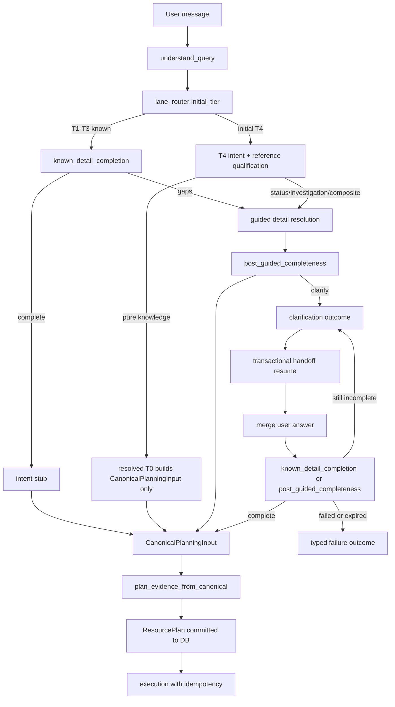

# Guided detail tools — canonical planning architecture (rev 8)

## Architecture objective

One consistent agentic flow — **always on**, no feature flags or legacy fallbacks:

- **T1–T3** — deterministic catalogue match → `processing_lane=known`
- **No T1–T3 match** → initial **T4** `processing_lane=guided`
- **T0** — resolved tier only after T4 qualification (`reference_knowledge` / `knowledge_only`)
- **`knowledge_recall`** — reusable read-only DetailTool
- **Gap-resolution planner** — `GapResolutionResult` only; never creates `ResourcePlan`
- **Final planner** — `plan_evidence_from_canonical` is the **sole** `ResourcePlan` creator/committer
- **Execution** — only from committed `ResourcePlan`; guided hybrid dispatch projects `InvestigationPlan`, never composes plans
- **Persistence** — PostgreSQL for handoffs, planning events, execution idempotency (`0004_canonical_handoffs.sql`)
- **Non-planned outcomes** — clarification, policy block, planning failure via typed `CanonicalPlanningOutcome`; downstream branches on `status`, not on partial `EvidencePlan` dicts

## Completion criteria (all must be true before marking Done)

- [ ] Canonical planning is always active; no flags or shadow paths remain
- [ ] No legacy planning path can execute on live `/chat`
- [ ] Runtime handoffs use PostgreSQL only (no live memory or file fallback)
- [ ] All persisted planning events contain required correlation fields (`decision_id`, `handoff_id`, etc.)
- [ ] Response and terminal request events are complete (`response.validated`, `response.generated`, `request.completed` / `request.failed`)
- [ ] Guided dispatch cannot create or modify `ResourcePlan`
- [ ] Plan and execution idempotency are transactionally enforced
- [ ] Full backend pytest passes (0 failed)
- [ ] Stage 3 governance regression passes
- [ ] Sentinel clarification evaluation passes

## Stop conditions

- All checklist items checked with evidence, **or**
- Same Verify fails twice on one item, **or**
- Decision needed — stop and ask

## Dependency order

Phase 1: `1 → 2 → 3 → 4 → 5 → 6 → 7 → 8 → 9`

Phase 2 (execution order — item numbers unchanged):

`12 → 13 → 14 → 15 → 16 → 17 → 18 → 19 → 20 → 10 → 21 → 22 → 23 → 24 → 25 → 26 → 11 → 27`

**Gate rules:**
- Do not start item 15 until item 14 (sentinel) passes.
- Item 20 uses repository/unit tests first; item 24 validates concurrency with real PostgreSQL.
- Item 11 is an intermediate regression gate (not an early implementation step).

## Target flow



## Tier and lane table (authority)

| `deterministic_match_path` | Initial tier | `processing_lane` (initial) | Intent hop |
|----------------------------|--------------|----------------------------|------------|
| `exact_105_question`, `exact_105_plus_use_case_catalog` | T1 | known | stub only if complete |
| `use_case_catalog` | T2 | known | stub only if complete |
| `near_105_question`, `semantic_105_question`, `fuzzy_alias_catalog` | T3 | known | stub only if complete |
| `out_of_registry`, `query_understanding_weak`, `qu_unavailable`, empty | T4 | guided | full classifier |
| **Resolved T0** (post-T4 only) | T0 | knowledge_short_circuit | classifier → qualification |

## Locked decisions (rev 8)

1. T0 is **resolved tier only** after T4 qualification — never from parser.
2. CVE/MITRE/ATLAS id alone does **not** assign T0; use `ReferenceQueryQualification`.
3. `processing_lane` and `answer_goal` are independent.
4. Single planner-facing contract: `CanonicalPlanningInput`.
5. Gap-resolution planner outputs `GapResolutionResult`; final planner is sole `ResourcePlan` creator.
6. `knowledge_recall` DetailTool is read-only with typed `KnowledgeRecallResult`.
7. **Dual-runtime parity:** imperative pipeline and RP graph are **entry points into the same canonical orchestration service**. They must not contain separate copies of routing, planning, or handoff logic.
8. **T0 knowledge execution:** T0 qualification does **not** execute `knowledge_recall` before the final planner. T0 creates `CanonicalPlanningInput`; the final planner places `knowledge_recall` into the committed `ResourcePlan`. For T4 guided resolution, `knowledge_recall` may run before final planning **only** when resolving a planning gap (not for T0 short-circuit).
9. **No feature flags** for canonical planning — `is_canonical_authoritative()` always true.
10. **No live memory/file handoff fallback** — DB unavailable → `persistence_failed` outcome.
11. **Non-planned outcomes:** downstream pipeline branches on `CanonicalPlanningOutcome.status` — never on a partially constructed `EvidencePlan`. Clarification and failure paths do **not** require `EvidencePlan`.
12. **Telemetry failure policy:**
    - Handoff, `ResourcePlan`, or execution-idempotency persistence failure → **fail closed**
    - Telemetry persistence failure **before side-effecting execution** → **fail closed**
    - Telemetry persistence failure for a read-only response → controlled degraded outcome per policy (document in `canonical_telemetry_coverage.md`)
13. **Migration policy:** If `0004_canonical_handoffs.sql` is already applied in any environment, **do not edit it**. Add `0005_canonical_planning_cutover_constraints.sql` for any missing: unique ResourcePlan commit constraint, event deduplication key, execution-idempotency uniqueness, lease fields/indexes, clarification-resumption indexes.

---

## Phase 1 — Contracts and wiring (items 1–9) — DONE

- [x] **1** — Core contracts
  - **Do:** `canonical_planning_input.py`, `reference_qualification.py`, `gap_resolution.py`, `knowledge_recall.py`; extend `DecisionRecord.payload`
  - **Verify:** `pytest app/tests/test_canonical_planning_architecture.py app/tests/test_decision_record.py -q`
  - **Depends on:** none
  - **Evidence:** 16 passed (contracts + DecisionRecord payload roundtrip)

- [x] **2** — Lane router + intent defaults
  - **Do:** `lane_router.py`, `intent_family_defaults.py`
  - **Verify:** `pytest app/tests/test_canonical_planning_architecture.py -k lane -q`
  - **Depends on:** 1
  - **Evidence:** `test_lane_router_t1_t3_known`, `test_no_match_initial_t4`

- [x] **3** — Present-key projection
  - **Do:** Extend entity projection for bare user/host tokens
  - **Verify:** `pytest app/tests/test_canonical_planning_architecture.py -k present_key -q`
  - **Depends on:** none
  - **Evidence:** `test_present_key_projection_bare_user_host` green

- [x] **4** — Known completeness gate
  - **Do:** `known_detail_completion.py`
  - **Verify:** `pytest app/tests/test_canonical_planning_architecture.py -k known_incomplete -q`
  - **Depends on:** 2, 3
  - **Evidence:** divert + complete-path tests green

- [x] **5** — Reference qualification + T0 resolution
  - **Do:** `reference_qualification.py`; T4 → T0 when knowledge-only scopes
  - **Verify:** `pytest app/tests/test_canonical_planning_architecture.py -k t0 -q`
  - **Depends on:** 1, 2
  - **Evidence:** `test_t0_only_after_qualification`, `test_cve_status_stays_t4`, `test_t4_resolves_to_t0_knowledge_plan`

- [x] **6** — DetailTools: knowledge_recall + select + merge
  - **Do:** `detail_tools/knowledge_recall_tool.py`, `select_detail_tools.py`, `detail_merge.py`
  - **Verify:** `pytest app/tests/test_canonical_handoff_invariants.py -k tool -q`
  - **Depends on:** 1, 5
  - **Evidence:** tool selection + failure tests green

- [x] **7** — Gap-resolution planner
  - **Do:** `guided_detail_resolution.py`, `post_guided_completeness.py`
  - **Verify:** `pytest app/tests/test_canonical_handoff_invariants.py -q`
  - **Depends on:** 4, 6
  - **Evidence:** gap planner + post-guided completeness tests green

- [x] **8** — Canonical handoff builder + final planner adapter
  - **Do:** `canonical_handoff_builder.py`, `plan_evidence_from_canonical.py`; `resource_plan_authority.py` guard
  - **Verify:** `pytest app/tests/test_canonical_planning_architecture.py -k planner -q`
  - **Depends on:** 1, 7
  - **Evidence:** `test_final_planner_consumes_answer_goal`; authority guard in composer

- [x] **9** — Pipeline + RP graph wiring (always-on)
  - **Do:** Canonical nodes unconditional in `pipeline.py`; `guided_hybrid_dispatch.py` / `guided_hybrid_executor.py` execute from committed plan only; flags removed from `config.py`
  - **Verify:** `pytest app/tests/test_dual_runtime_lane_parity.py -q`; `grep -r 'plan_dispatch_fallback' backend/app/chat/pipeline.py` → no live fallback
  - **Depends on:** 8
  - **Evidence:** 3 parity cases; legacy `graph_node_evidence_planning` fallback removed from live path; migration `0004_canonical_handoffs.sql` added

---

## Phase 2 — Always-on cutover (items 10–27)

Maps 1:1 to user spec §1–§14. **Nothing in Phase 2 is implemented yet** (rev 8).

### Root cause — sentinel / clarification (Gate 1 blocker) — spec §1


**Confirmed bugs (not fixed):**
- `canonical_planning_orchestrator.py` ~396–402 inserts partial `evidence_plan` dict on clarification
- `response_validation.py` always requires `resource_plan` — fails clarification paths
- Resume checks `status == "clarification_required"` but store saves `awaiting_clarification`
- `canonical_handoff_repository.py` falls back to `_TEST_STORE` when DB disabled or write fails

**Outcome rules (items 12–13) — branch on `CanonicalPlanningOutcome.status`, not on `EvidencePlan` presence:**

| `status` | `EvidencePlan` | `ResourcePlan` | Required |
|----------|----------------|----------------|----------|
| `planned` | **Required** (valid typed) | **Committed and required** | `canonical_input` |
| `clarification_required` | **Absent** | **Absent** | clarification + unresolved fields + persisted handoff |
| `policy_blocked` | Optional only for non-executing response | **Absent** | policy metadata |
| `resolution_failed` / `planning_failed` / `unsupported` / `execution_failed` / `persistence_failed` | **Absent** | **Absent** | typed `failure` |

Do **not** insert placeholder or structurally invalid `EvidencePlan` values. Do **not** require `EvidencePlan` for clarification — that recreates the sentinel failure.

---

- [ ] **12** — `CanonicalPlanningOutcome` contract — spec §1
  - **Do:** Add `backend/app/chat/contracts/canonical_planning_outcome.py` with statuses: `planned`, `clarification_required`, `resolution_failed`, `planning_failed`, `policy_blocked`, `unsupported`, `execution_failed`, `persistence_failed`. Fields: `canonical_input`, `evidence_plan` (only when `planned` or optional `policy_blocked`), `resource_plan` (only when `planned`), `clarification`, `failure`. Factory helpers per outcome rules table above — **no `EvidencePlan` for clarification or failure statuses**.
  - **Do:** Add `backend/app/tests/test_canonical_planning_outcomes.py` with **one named test per status** (minimum 8): `test_outcome_planned`, `test_outcome_clarification_required`, `test_outcome_resolution_failed`, `test_outcome_planning_failed`, `test_outcome_policy_blocked`, `test_outcome_unsupported`, `test_outcome_execution_failed`, `test_outcome_persistence_failed`.
  - **Verify:** `pytest app/tests/test_canonical_planning_outcomes.py -q` → 8+ passed
  - **Depends on:** none
  - **Evidence:** _(filled at check-off)_

- [ ] **13** — Refactor all canonical exit paths — spec §1
  - **Do:** Audit every orchestrator exit where no executable plan is produced. Set `canonical_planning_outcome` on state; **do not** set `evidence_plan` on clarification or failure paths.
  - **Do:** Fix resume status to `normalized_status() == "awaiting_clarification"`. On clarification answer: transactional resume → merge answer → re-run `known_detail_completion` or `post_guided_completeness` (user answer is **not** automatically sufficient for `CanonicalPlanningInput`).
  - **Do:** Update downstream nodes to branch on `canonical_planning_outcome.status` only — never `EvidencePlan.model_validate` on non-`planned` outcomes.
  - **Verify:** `pytest app/tests/test_canonical_planning_outcomes.py app/tests/test_canonical_architecture_complete.py -q`
  - **Depends on:** 12
  - **Evidence:** _(filled at check-off)_

- [ ] **14** — Gate 1: clarification + sentinel — spec §1, §12
  - **Do:** Run targeted clarification tests + sentinel immediately after items 12–13; do not proceed to item 15 until pass.
  - **Verify:**
    ```bash
    cd backend && PYTHONPATH=../backend:.. python3 -m pytest \
      app/tests/test_canonical_planning_outcomes.py \
      app/tests/test_canonical_architecture_complete.py -k clarification -q
    PYTHONPATH=backend:. python3 scripts/eval_sentinel.py --check
    ```
  - **Depends on:** 13
  - **Stop:** Sentinel fails twice → stop and report
  - **Evidence:** _(filled at check-off)_

- [ ] **15** — Pytest failure inventory — spec §2
  - **Do:** Run full pytest once; capture to `docs/evals/canonical_phase2_failure_inventory.md` with columns: test file, test name, failure category, old assumption, new canonical expectation, code fix or test fix.
  - **Do:** Categorize using **exact** spec labels:
    - **A** — tests assuming canonical planning can be disabled
    - **B** — tests expecting legacy `query_to_intent` or `evidence_planning`
    - **C** — tests expecting live `/chat` to attach `ResourcePlan` through old planner
    - **D** — tests expecting legacy dispatch fallback
    - **E** — clarification `EvidencePlan` contract failures
    - **F** — configuration tests referencing removed flags
    - **G** — genuine regressions unrelated to test assumptions
  - **Do:** Do not patch tests blindly; do not skip/xfail/weaken governance tests; do not add global compatibility shims.
  - **Verify:** Inventory row count matches pytest failure summary
  - **Depends on:** 14
  - **Evidence:** _(filled at check-off)_

- [ ] **16** — Canonical test helper — spec §2
  - **Do:** Add `backend/app/tests/support/canonical_flow.py`: `run_canonical_flow(query, *, handoff_resume=None, session_id=...)` through production flow:
    ```text
    understand_query → canonical orchestration → CanonicalPlanningInput
    → plan_evidence_from_canonical → committed ResourcePlan or typed non-executable outcome
    ```
    Must not bypass runtime contracts.
  - **Verify:** Helper used in ≥3 updated tests; `pytest app/tests/test_canonical_flow_helper.py -q`
  - **Depends on:** 12
  - **Evidence:** _(filled at check-off)_

- [ ] **17** — Eliminate all pytest failures — spec §2
  - **Do:** Fix per inventory order: **F** → **E** → **A/B/C/D** → **G**. Remove `_attach_resource_plan` from production runtime; isolate test composition in `backend/app/tests/support/compose_resource_plan_testutil.py` under explicit `TEST_AUTHORITY` only. Search all callers before removal. Do not make `_attach_resource_plan` silently restore old live behaviour.
  - **Verify:** `cd backend && PYTHONPATH=../backend:.. python3 -m pytest -q` → **0 failed**
  - **Depends on:** 15, 16
  - **Evidence:** _(filled at check-off)_

- [ ] **18** — Remove live memory handoff fallback — spec §4
  - **Do:** Refactor `canonical_handoff_repository.py`: `_TEST_STORE` only via `use_in_memory_store_for_tests()` fixture injection; **never** on live path (including `_disabled()` and write-failure catch). On DB unavailable: `PersistenceError` → `persistence_failed` outcome → `request.failed` telemetry → no in-memory continuation.
  - **Do:** If `0004_canonical_handoffs.sql` already applied, add `backend/app/db/migrations/0005_canonical_planning_cutover_constraints.sql` (do **not** edit `0004`) for missing handoff/commit unique constraints and clarification-resumption indexes.
  - **Do:** Add `backend/app/tests/test_canonical_handoff_persistence_failclosed.py` covering: DB unavailable during clarification persistence; DB unavailable during handoff resumption; DB unavailable during ResourcePlan commit → no execution. (Process restart and second-worker cases validated in item 24.)
  - **Verify:** `pytest app/tests/test_canonical_handoff_persistence_failclosed.py -q`
  - **Depends on:** 12
  - **Evidence:** _(filled at check-off)_

- [ ] **19** — Transactional clarification resumption — spec §5
  - **Do:** On clarification response: `load pending handoff WITH LOCK` → validate session ownership → validate handoff status → validate `handoff_version` → merge answer → create next version → mark prior superseded/resumed → commit transaction → continue from saved stage.
  - **Do:** Repository methods: `load_pending_for_update`, `supersede_version`, `merge_clarification_answer` (`SELECT … FOR UPDATE`, unique `(handoff_id, handoff_version)`). Controls: one answer advances version once; duplicate answers return existing next version; two workers cannot create two versions; completed/failed/expired cannot resume; wrong pending handoff rejected; multiple pending handoffs disambiguated deterministically; material goal change supersedes with linked new handoff.
  - **Do:** Preserve across versions: `original_skill`, `original_use_case_id`, `original_answer_goal`, `initial_tier`, `resolved_tier`, prior tool results, field provenance, conflicts, unresolved fields.
  - **Verify:** `pytest app/tests/test_canonical_handoff_clarification_integration.py -q` (Postgres — item 24)
  - **Depends on:** 18
  - **Evidence:** _(filled at check-off)_

- [ ] **20** — Execution idempotency implementation — spec §3
  - **Do:** Add `backend/app/chat/canonical_execution_idempotency.py` using `canonical_execution_idempotency` table. Add lease/index constraints via `0005` migration if not in `0004`. Integrate into `planner/executor.py` `execute_plan_dispatch` **and every execution path** including guided hybrid.
  - **Do:** Idempotency key = `resource_plan_id` + `handoff_id` + `handoff_version` + `step_id` + **operation identity**. Lifecycle: `pending` → `running` → `completed` | `failed_retryable` | `failed_terminal`.
  - **Do:** Per-step transaction flow: (1) start txn, (2) acquire/create record, (3) if `completed` return stored result, (4) if `running` under valid lease do not execute concurrently, (5) recover stale lease per documented policy, (6) mark `running` before tool invoke, (7) persist result + terminal status atomically. Separate read-only (retryable) vs side-effecting (no replay unless tool contract + stable key supports idempotency).
  - **Do:** Invariant: **a committed ResourcePlan step can produce at most one side effect.**
  - **Do:** Add `backend/app/tests/test_execution_idempotency.py` with **repository/unit tests first** (named tests): duplicate dispatch; concurrent dispatch two workers; worker crash after `running`; replay after completion; retryable read-only failure; side-effecting step timeout; same plan different step IDs; mismatched handoff version.
  - **Verify:** `pytest app/tests/test_execution_idempotency.py -q`
  - **Depends on:** 18
  - **Evidence:** _(filled at check-off)_

- [ ] **10** — Durable telemetry foundation
  - **Do:** `durable_planning_telemetry.py` persists to `canonical_planning_events`; `planning_telemetry.py` delegates; wire interim events until item 21 completes full catalog. Apply telemetry failure policy (locked decision 12).
  - **Verify:** `pytest app/tests/test_canonical_planning_architecture.py -k t4_resolves -q`
  - **Depends on:** 17, 18, 19, 20
  - **Evidence:** _(foundation partial; full catalog = item 21)_

- [ ] **21** — Complete durable telemetry catalog — spec §6
  - **Do:** Wire **all 28 events** from real emitting nodes (not merely helpers):
    ```text
    query_understanding.completed, lane_router.decided, known_completeness.evaluated,
    guided_resolution.started, guided_intent.resolved, tier.resolved,
    detail_tool.selected, detail_tool.started, detail_tool.completed, detail_tool.failed,
    detail_merge.completed, post_guided_completeness.evaluated, clarification.requested,
    handoff.persisted, handoff.resumed, planner_handoff.created, planner_handoff.consumed,
    resource_plan.created, resource_plan.commit_reused,
    execution.started, execution_step.started, execution_step.completed, execution_step.failed,
    execution.completed, response.validated, response.generated,
    request.completed, request.failed
    ```
  - **Do:** Add `docs/architecture/canonical_telemetry_coverage.md`: per event — emitting node, success condition, failure condition, required payload, persistence confirmation.
  - **Do:** Persisted events carry where applicable: `trace_id`, `session_id`, `turn_id`, `decision_id`, `parent_decision_id`, `handoff_id`, `handoff_version`, `resource_plan_id`, `node_name`, `node_version`, `contract_version`, `initial_tier`, `resolved_tier`, `processing_lane`, `answer_goal`, `primary_skill`, `original_skill`, `status`, `duration_ms`, `error_category`. Redact secrets/raw SOC content.
  - **Do:** Terminal consistency: success → exactly one `request.completed`; terminal failure → exactly one `request.failed`; clarification → `clarification.requested` without false `request.completed`. Events survive restart; multi-worker correlation; ordering reconstructable; duplicate events have stable IDs or dedup keys.
  - **Do:** Telemetry failure policy (locked decision 12): fail closed before side-effecting execution when audit record cannot be persisted; log and surface all telemetry write failures — never silently drop.
  - **Verify:** `pytest app/tests/test_canonical_telemetry_coverage.py -q` (one test per canonical functional path)
  - **Depends on:** 10, 13, 20
  - **Evidence:** _(filled at check-off)_

- [ ] **22** — Response validation semantics — spec §7
  - **Do:** Rewrite `response_validation.py` outcome-aware. Before `response.validated`, check: canonical outcome status; `resource_plan_id` when executable; execution terminal state; required step completion; required evidence availability; explicit limitations; tool failures surfaced; `answer_goal` satisfied; citations retained; no claim of unexecuted action; policy restrictions respected.
  - **Do:** Rules: no `response.generated` on assembly failure; no `request.completed` before response generation succeeds; `clarification_required` validates unresolved fields/questions from `CanonicalPlanningOutcome.clarification` (no `EvidencePlan` required); failures identify typed failure without masquerading as success; no action-performed claims without completed execution step.
  - **Do:** Add `backend/app/tests/test_response_validation_canonical.py` negative tests: missing required evidence; failed execution step; unexecuted remediation claim; missing knowledge citation; wrong `answer_goal`; `resource_plan` mismatch; response assembly failure.
  - **Verify:** `pytest app/tests/test_response_validation_canonical.py -q`
  - **Depends on:** 13, 21
  - **Evidence:** _(filled at check-off)_

- [ ] **23** — ResourcePlan authority audit — spec §10
  - **Do:** Search `ResourcePlan(`, `compose_resource_plan`, `compose_guided_resource_plan`, `commit_resource_plan`, `resource_plan =`. Classify each: `approved_final_planner` | `deserialization` | `test_fixture` | `validation` | `execution_read` | `violation`.
  - **Do:** Approved runtime authority only: `plan_evidence_from_canonical` → `resource_plan_authority` → `compose_resource_plan` → `commit_resource_plan`. Guided hybrid, executor, response composer, telemetry must never create/modify committed plan.
  - **Do:** Strengthen `test_resource_plan_authority.py` as static guard against future violations.
  - **Verify:** `pytest app/tests/test_resource_plan_authority.py -q`; classification table in completion report §11
  - **Depends on:** 17
  - **Evidence:** _(filled at check-off)_

- [ ] **24** — Postgres integration tests — spec §11
  - **Do:** Add `backend/app/tests/integration/conftest.py` using project Postgres (`DATABASE_URL`). **Do not mock** transactional behaviour under test.
  - **Do:** Cover: handoff creation; unique handoff version; concurrent version creation; ResourcePlan commit race; execution-idempotency race; clarification resume race; telemetry persistence; process restart simulation; expired handoff; transaction rollback; database unavailable. Verify unique constraints and locking under concurrency.
  - **Do:** Clarification integration (item 19): cross-process restart; cross-worker resume; duplicate answer; concurrent duplicate answer; expired handoff; completed handoff; multiple pending handoffs; material goal change. Process restart and second-worker handoff cases from item 18.
  - **Do:** **Local skip policy:** tests may skip when Postgres is unavailable in an unsupported local environment. **Completion gate:** final CI verification job **must** provision PostgreSQL and pass the complete integration suite **without skips** — plan cannot be marked Done if integration tests were skipped in CI.
  - **Verify:** `pytest app/tests/integration/ -q` (0 skipped in CI completion job)
  - **Depends on:** 18, 19, 20, 21
  - **Evidence:** _(filled at check-off)_

- [ ] **25** — Remove obsolete configuration — spec §8
  - **Do:** Remove `CONTROL_PLANE_ENABLED`, `AI_SOC_CANONICAL_PLANNING_ENABLED`, `AI_SOC_HANDOFF_STORE_BACKEND`, `AI_SOC_HANDOFF_STORE_FILE_DIR` from: `.env`, `.env.example`, `.env.*.example`, `env/profiles/*`, `docker-compose.yml`, K8s manifests (if any), CI configuration, `CLAUDE.md`, architecture docs, plan docs (runtime refs), README files, test fixtures, deployment scripts, startup output, eval harness defaults.
  - **Do:** After cleanup: remove retired-env warnings from `config.py`; remove tests expecting warnings; update `test_coe_rollout_config_sanity.py`. Do **not** rely on `extra="ignore"` as final solution for these four keys.
  - **Do:** If hook blocks `.env.example`, follow repo-approved edit workflow — do not leave stale.
  - **Verify:** `rg 'CONTROL_PLANE_ENABLED|AI_SOC_CANONICAL_PLANNING|HANDOFF_STORE' --glob '!**/migrations/**' --glob '!docs/evals/**'` → only historical notes marked non-runtime; `pytest app/tests/test_coe_rollout_config_sanity.py -q`
  - **Depends on:** 17
  - **Evidence:** _(filled at check-off)_

- [ ] **26** — Remove obsolete live-path compatibility code — spec §9
  - **Do:** Remove: `True` literals pretending to be `control_plane_enabled`; legacy trace fields implying optional canonical mode; test-only live composition branches in production modules; canonical-off route labels; unused `plan_dispatch_fallback` helpers; obsolete comments/dead branches. Update eval harnesses (`soc_clean_answer_eval`, `golden_answer_runner`, `langgraph_dual_parity`, etc.).
  - **Do:** `_attach_resource_plan` must be isolated test utility outside production runtime or removed entirely (search all callers first).
  - **Verify:** `rg 'canonical.off|plan_dispatch_fallback|control_plane_enabled' backend/app/` → no runtime branches; only test fixtures or historical comments
  - **Depends on:** 17, 25
  - **Evidence:** _(filled at check-off)_

- [ ] **11** — Intermediate canonical regression gate
  - **Do:** Re-run canonical architecture + invariant suites and sentinel after pytest migration (items 14–17) and before final cleanup gates. This is a **verification gate**, not an early implementation step.
  - **Verify:** `pytest app/tests/test_canonical_handoff_invariants.py app/tests/test_dual_runtime_lane_parity.py app/tests/test_canonical_planning_architecture.py -q`; `PYTHONPATH=backend:. python3 scripts/eval_sentinel.py --check`
  - **Depends on:** 14, 17
  - **Evidence:** _(filled at check-off)_

- [ ] **27** — Final verification gates + completion report — spec §12, §14
  - **Do:** Run gates in order; capture command output; produce 15-section completion report:
    1. Root cause + fix for clarification/sentinel failure
    2. Breakdown/disposition of all prior pytest failures
    3. Final full pytest result
    4. Final governance regression result
    5. Execution idempotency implementation
    6. Database transaction + locking strategy
    7. Clarification cross-worker/resumption results
    8. Complete telemetry event coverage table
    9. Response validation tests + results
    10. Files + configuration references removed
    11. ResourcePlan authority search results
    12. Postgres integration test results
    13. Dead legacy/compatibility code removed
    14. Final runtime diagram
    15. Any remaining gap
  - **Verify:**
    1. **Gate 1:** item 14 commands (clarification tests + `eval_sentinel.py --check`)
    2. **Gate 2:** `pytest app/tests/test_canonical_* app/tests/test_resource_plan_authority.py app/tests/test_dual_runtime_lane_parity.py -q`
    3. **Gate 3:** `pytest app/tests/integration/ app/tests/test_execution_idempotency.py app/tests/test_canonical_telemetry_coverage.py -q` — **PostgreSQL required; 0 skipped**
    4. **Gate 4:** `cd backend && PYTHONPATH=../backend:.. python3 -m pytest -q` → 0 failed
    5. **Gate 5:** `./scripts/run_stage3_governance_regression.sh` → PASS
    6. **Gate 6:** repo search — no runtime-relevant removed variables or legacy planner/fallback terms
  - **Depends on:** 11, 14–26
  - **Evidence:** _(filled at check-off)_

---

## Prohibited shortcuts — spec §13

Do **not**:

- Reintroduce feature flags or shadow behaviour
- Restore legacy planner fallback
- Add memory fallback for DB failure on live path
- Skip failing E2E tests
- Broadly loosen `EvidencePlan` validation
- Add placeholder `ResourcePlan`s to clarification paths
- Mark failures xfail solely because expectations changed
- Weaken governance sentinel assertions
- Create another compatibility planner
- Claim completion while full pytest or governance regression fails

---

## Execution discipline

```bash
.cursor/hooks/audit-plan-discipline.sh plans/2026-07-24_2310_guided-detail-tools-consumable-handoff.md
# then:
# loop-asap — execute plans/2026-07-24_2310_guided-detail-tools-consumable-handoff.md
```

**Stop conditions (Phase 2):** sentinel fails twice on item 14; full pytest fails twice on item 17 without inventory update; CI completion job runs integration suite without Postgres or with skips.

## Drift log

- 2026-07-24–25: Original plan (parser T0, dual handoffs, answer_mode lane lock).
- 2026-07-25 rev 5: Partial cutover — DB migration, authority guard, always-on `is_canonical_authoritative()`, legacy fallback removed from live pipeline. Drift log claimed governance PASS; **re-audited false** — sentinel + ~211 pytest failures remain.
- 2026-07-25 rev 7: Full alignment with user 14-section cutover spec.
- **2026-07-25 rev 8:** Fixed item 20↔24 dependency cycle; moved item 11 to intermediate gate (depends 14+17); clarification outcomes **without** `EvidencePlan`; corrected resume diagram; T0 knowledge execution rule; telemetry fail-closed policy; mandatory CI Postgres for item 24; positive completion criteria; dual-runtime single orchestration service; `0005` migration policy (do not edit `0004`). **Implementation status: Phase 2 not started.**

## Key files

| Area | Files |
|------|-------|
| Contracts | `backend/app/chat/contracts/canonical_planning_input.py`, `canonical_planning_outcome.py` (item 12) |
| Orchestration | `canonical_planning_orchestrator.py`, `plan_evidence_from_canonical.py`, `pipeline.py` |
| Authority | `backend/app/planner/resource_plan_authority.py`, `composer.py` |
| Handoff DB | `canonical_handoff_repository.py`, `canonical_handoff_store.py`, `canonical_handoff_models.py`, `db/migrations/0004_canonical_handoffs.sql`, `db/migrations/0005_canonical_planning_cutover_constraints.sql` (item 18) |
| Execution | `guided_hybrid_executor.py`, `planner/executor.py`, `canonical_execution_idempotency.py` (item 20) |
| Telemetry | `planning_telemetry.py`, `durable_planning_telemetry.py`, `response_validation.py` |
| Tests | `test_canonical_planning_architecture.py`, `test_canonical_handoff_invariants.py`, `tests/support/canonical_flow.py`, `tests/integration/*` |
