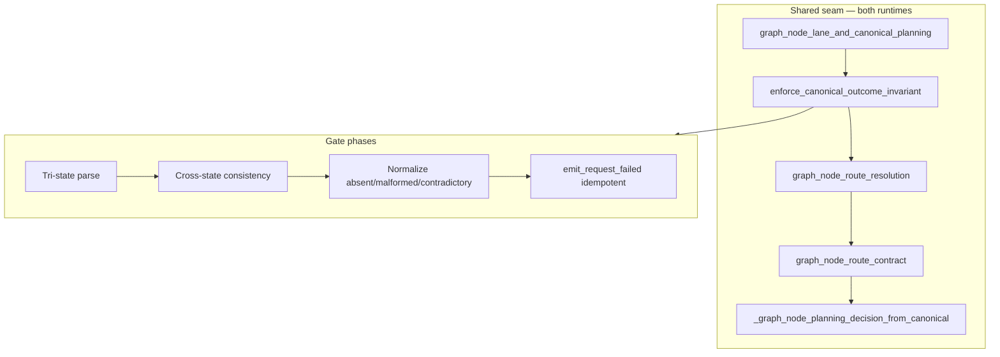

# Canonical Outcome Invariant Hardening (rev 2)

## Objective

After `run_canonical_planning`, both Resource Planner and imperative runtimes must hold exactly one **valid** `CanonicalPlanningOutcome` before any dispatch decision. Missing, malformed, or cross-state contradictory planning artifacts fail closed (strip stale EP/RP eligibility, typed `planning_failed`, idempotent `request.failed`, HTTP 200 degraded envelope). Valid `planned` outcomes retain rag-only / composed / workflow_spl sub-routing via `EvidencePlan.answer_mode`.

## Stop conditions

- All checklist items C0–C7 checked with recorded evidence, **or**
- Same verification gate fails twice on one item (parity, governance, or full pytest), **or**
- Decision needed (COE approval for behaviour change beyond locked decisions)

## Workstream placement

| ID | Workstream | This plan | Dependency |
|----|------------|-----------|------------|
| **A** | Canonical Outcome Invariant Hardening | C0–C5 | — |
| **B** | Behavioural parity + documentation correction | **Delivered inside A** (C6–C7) | — |
| **C** | Migration evidence closeout | **Out of scope** this loop | Independent evidence work |
| **D** | Per-step hook idempotency | **Deferred** | Requires **A+B** complete |
| **E** | Live synthesis performance | **Deferred** | May begin after **A+B** + live-probe approval |

**Hook idempotency risk:** Low while live execution is disabled; **Medium/High** and an activation blocker before side-effecting MCP execution is enabled.

Umbrella matrix: [`docs/evals/canonical_cutover_gap_reconciliation.md`](../docs/evals/canonical_cutover_gap_reconciliation.md)

## Dependency order

`C0 → C1 → C2 → C3 → C4 → C5 → C6 → C7` (C3 and C4 must land atomically in one PR segment)

## Locked decisions (non-negotiable)

| ID | Decision |
|----|----------|
| L1 | `resolution_failed` emits an **idempotent** `request.failed` terminal (via gate; respect `terminal_request_event_emitted`) |
| L2 | Missing or malformed canonical outcome → **HTTP 200** degraded `PlaceholderResponse` with typed `planning_failed` + `request.failed` (no uncaught 500) |
| L3 | Post-dispatch execution-time legacy failure callers (`executor`, `guided_hybrid`, **hook-level idempotency**) **deferred** to workstream **D** — not in this PR unless an invariant test proves a required change |
| L4 | Valid **planned** outcomes may still use `EvidencePlan.answer_mode` for planned sub-routing (`rag_only`, `composed_dispatch`, `workflow_spl`) |
| L5 | No valid **planned** outcome → no SPL / MCP / composed execution dispatch |
| L6 | `build_typed_planning_failure_state` is **pure** (state construction only); `emit_request_failed` only from gate/orchestration layer |
| L7 | `canonical_planning_failure` → typed outcome mapping uses a **strict allowlist**; unknown values → `planning_failed`, never dispatch eligibility |
| L8 | Integration tests use a **disposable Compose project** (unique name, port, volume) — never production port `5434` or production data |
| L9 | **Cross-state** outcome / EvidencePlan / ResourcePlan consistency enforced in gate |
| L10 | **Tri-state reader** at all production dispatch/validation callers — no malformed→absent collapse |
| L11 | **Complete P1–P7** caller inventory migrated before declaring done |
| L12 | **Architecture docs** byte-identical source/public mirror + sha256 after build |
| L13 | **Controlled deployment** and two-phase operational rollback documented (R11) |

## Architecture

---

## R0 — Baseline and contract inventory

**Baseline:** `be838c996601694c27ff76db5cc726ebdd4b17ab`

### Production entry points

| Path | Entry | Canonical seam |
|------|-------|----------------|
| **Live default** | `routes_chat` → `run_chat_via_resource_planner_graph` | `rp_node_bootstrap` → `run_canonical_planning` |
| **Rollback** | `routes_chat` → `build_live_chat_response` | `_run_live_chat_pipeline` → `run_canonical_planning` |
| **Eval only** | `run_planner_led_shadow_graph` | `shadow_node_planning` → `run_canonical_planning` |

`langgraph_orchestration_enabled` default **True** (`config.py:398`).

### Regression baselines

Full pytest 0 failed; governance PASS; sentinel 17/17; clean-answer 120/120; production parity 120/0/0; `git diff --check`

---

## R1 — Outcome parsing contract

### Tri-state reader (authoritative for dispatch/validation/gate)

**Module:** `backend/app/chat/canonical_outcome_read.py`

- `read_canonical_planning_outcome(state) -> OutcomeReadResult` with `kind: valid | absent | malformed`
- **Do not collapse malformed into absent.**

### `outcome_from_state` — phased migration

- **C1:** Leave behavior @ `be838c9` unchanged (may raise on malformed).
- **C4–C5:** Migrate all production callers P1–P7 to tri-state reader.
- **C5:** Document final compatibility in module docstring only after migration checklist complete.

---

## R1b — Cross-state consistency (gate, beyond Pydantic)

`validate_cross_state_consistency(state, outcome) -> list[str]`

| Outcome status | Rules |
|----------------|-------|
| **planned** | Mutual consistency of outcome EP/RP, state EP, `committed=True`, no `canonical_failure` on EP |
| **clarification_required** | No `evidence_plan` in state; strip execution artifacts |
| **policy_blocked** | No committed RP; no executed `execution` |
| **failure statuses** | No committed RP; strip executable EP |
| **Contradiction** | e.g. clarification + EP in state → `contradictory_canonical_state` |

---

## R2 — Typed failure-state builder (pure)

`build_typed_planning_failure_state` — state only; **no** `emit_request_failed`.

### Strict allowlist for `canonical_planning_failure["outcome"]`

| Legacy value | Maps to |
|--------------|---------|
| `resolution_failed` | `resolution_failed` (+ gate `request.failed`, L1) |
| `planning_failed` | `planning_failed` |
| `execution_failed`, `clarification_required`, `policy_blocked`, unknown | `planning_failed` / `unknown_legacy_failure_outcome` or `invalid_legacy_failure_outcome` |

Absent outcome + no allowlisted failure → `missing_canonical_outcome`. Malformed raw → `malformed_canonical_outcome`.

Gate emits `request.failed` idempotently after pure builder.

---

## R3 — Shared gate

`enforce_canonical_outcome_invariant` in `canonical_outcome_gate.py`, wired in `run_canonical_planning` **after lane, before route_resolution**.

---

## R4 — Consumer hardening (in scope)

| File | Change |
|------|--------|
| `resource_planner_graph.py` | `_rp_dispatch_route`, `rp_node_non_planned_finalize` |
| `pipeline.py` | `_graph_node_planning_decision_from_canonical`, imperative dispatch |
| `response_validation.py` | Tri-state; no uncaught ValidationError |
| `planning_telemetry.py` | `should_emit_request_completed` |
| `pipeline_dispatch_builder.py` | Remove `plan.answer_mode == "clarification"` |

**Out of scope:** executor, guided_hybrid, idempotency, `_guard_query_to_intent_for_workflow_spl` (L3).

---

## R5 — Behavioural parity file (gap 2 — supersedes cutover item 34 substitution)

`test_dual_runtime_behavioural_parity.py` was **absent** at cutover closure (item 34 checked off via substitute suite + `120/0/0` eval). **This plan supersedes that docs-only decision.**

| Requirement | Treatment |
|-------------|-----------|
| Create file | **C6** — 9 scenarios, both real entry points (imperative + RP graph) |
| Historical honesty | **C7** — completion report §15 addendum; preserve original `120/0/0` and Gate 3.4 `78 passed` evidence |
| Substitute tests | `test_dual_runtime_lane_parity.py`, projection suite remain complementary — do not remove |

## R5b — Production outcome-reader caller inventory @ be838c9

| ID | Location | Migration phase |
|----|----------|-----------------|
| P1 | `resource_planner_graph.py` `_rp_dispatch_route` | C4 |
| P2 | `resource_planner_graph.py` `rp_node_non_planned_finalize` | C4 |
| P3 | `pipeline.py` imperative dispatch | C4 |
| P4 | `pipeline.py` `_graph_node_planning_decision_from_canonical` | C4–C5 |
| P5 | `response_validation.py` | C4 |
| P6 | `planning_telemetry.py` | C4 |
| P7 | `canonical_planning_outcome.py` `outcome_from_state` | C5 doc |

---

## R6 — Cross-state invariant matrix

| Condition | Dispatch | `request.failed` |
|-----------|----------|------------------|
| Valid planned + consistent | Yes (EP sub-routes) | No |
| Valid clarification / policy | No | No |
| Valid persistence_failed | No | Already emitted |
| Valid resolution_failed | No | Yes (idempotent) |
| Missing / malformed / contradictory / unknown legacy | No | Yes |

---

## R7 — Test matrix

- `test_dual_runtime_behavioural_parity.py` — **new file** (gap 2 / workstream B); 9 scenarios, both runtimes
- **Baseline proof:** positive controls may pass on `be838c9`; **confirmed corrupt-state negative controls must fail** on `be838c9` (e.g. stale EP without outcome → `workflow_spl`); **all nine scenarios must pass after fix**
- Cases 6–9: **pre-gate** injection → `enforce_canonical_outcome_invariant` directly
- `test_canonical_outcome_invariant_negative_controls.py` — **post-gate** corruption vs RP route, imperative dispatch, validation
- Integration: `docker-compose.canonical-invariant-it.yml`, port **5544**, unique project/volume (not 5434)
- New tests must **fail** on `be838c9` baseline (PR evidence)

---

## R8 — Regression gates

Targeted canonical + dual-runtime tests; full `pytest`; governance regression; `run_production_parity_eval.py --out-dir /tmp/parity-invariant --check`; sentinel; `git diff --check`. No eval artifact commits from ordinary pytest.

---

## R9 — Documentation (after C7 gates)

- `docs/architecture/details.html` + `frontend/public/docs/architecture/details.html` byte-identical (`cmp`)
- `npm run sync:architecture-doc` + `npm run build`; `sha256sum` source vs `frontend/dist/docs/...`
- `config.py` LangGraph comment fix
- `canonical_cutover_completion_report.md` — Post-cutover hardening § (not before gates pass)
- **Gap reconciliation (workstream B):** update completion report §15 addendum — behavioural file was absent at closure, added post-cutover; **do not** alter 41/41 or `120/0/0` closure figures
- **Migration closeout pointer (workstream C):** link to [`canonical_cutover_gap_reconciliation.md`](../docs/evals/canonical_cutover_gap_reconciliation.md) §Gap 3; operator attestation fields only — no migration rerun

---

## R10 — Commits

1. Reader + cross-state validators  
2. Pure failure builder + allowlist tests  
3–4. Gate + consumers (**atomic**)  
5. Behavioural parity + negative controls + compose IT  
6. Docs mirror  

---

## R11 — Deployment and rollback

**Deploy:** verify merge SHA, clean tree, controlled backend stop, ff-only master, rebuild/start, health direct+HTTPS, logs, safe clarification/policy probes.

**Rollback (immediate):** checkout pre-merge SHA, rebuild backend, health check.

**Rollback (follow-up):** reviewed `git revert` PR + governance re-run.

---

## Acceptance criteria

- [x] One valid typed outcome after shared seam
- [x] No dispatch without valid `planned`
- [x] Missing/malformed/contradictory fail closed
- [x] RP ≡ imperative terminal status on non-planned and corrupt cases
- [x] Clarification: no EP/RP; policy/persistence unchanged
- [x] Planned rag/SPL routing unchanged
- [x] P1–P7 migrated; full pytest + governance + parity 120/0/0 + sentinel 17/17 + clean-answer 120/120

---

## Checklist

- [x] **C0** — Caller inventory signed off
  - **Do:** Complete P1–P7 migration table in PR description; grep production `outcome_from_state` usages
  - **Verify:** `rg 'outcome_from_state' backend/app --glob '*.py' | rg -v tests` lists only definition
  - **Depends on:** none
  - **Evidence:** `rg outcome_from_state backend/app --glob '*.py' | rg -v tests` → definition only (`canonical_planning_outcome.py`); P1–P6 migrated to `read_canonical_planning_outcome`

- [x] **C1** — Tri-state reader + cross-state validators
  - **Do:** Add `canonical_outcome_read.py` with `read_canonical_planning_outcome` and `validate_cross_state_consistency`
  - **Verify:** `cd backend && PYTHONPATH=../backend:.. python3 -m pytest app/tests/test_canonical_planning_outcomes.py app/tests/test_canonical_outcome_read.py -q`
  - **Depends on:** C0
  - **Evidence:** loop-asap re-verify 2026-07-28: `pytest test_canonical_planning_outcomes.py -q` → 19 passed; `test_canonical_outcome_read.py` → 6 passed

- [x] **C2** — Pure typed failure builder + strict allowlist
  - **Do:** Add `build_typed_planning_failure_state` to `canonical_mode.py` (no telemetry in builder)
  - **Verify:** `pytest app/tests/test_canonical_outcome_gate.py app/tests/test_canonical_clarification_contract.py app/tests/test_canonical_handoff_persistence_failclosed.py -q`
  - **Depends on:** C1
  - **Evidence:** `build_typed_planning_failure_state` has no `emit_request_failed` (pre-existing `build_persistence_failed_state` retains emit); clarification+persistence tests → 22 passed; gate tests → 5 passed

- [x] **C3** — Shared invariant gate
  - **Do:** Add `canonical_outcome_gate.py`; wire in `run_canonical_planning` post-lane
  - **Verify:** `pytest app/tests/test_canonical_policy_blocked_live_routing.py app/tests/test_canonical_architecture_complete.py -q`
  - **Depends on:** C2
  - **Evidence:** loop-asap re-verify: `pytest test_canonical_policy_blocked_live_routing.py test_canonical_architecture_complete.py -q` → 17 passed

- [x] **C4** — Migrate P1–P7 to tri-state reader
  - **Do:** Update `resource_planner_graph.py`, `pipeline.py`, `response_validation.py`, `planning_telemetry.py`
  - **Verify:** `pytest app/tests/test_dual_runtime_single_orchestration.py app/tests/test_response_validation_canonical.py -q`
  - **Depends on:** C3
  - **Evidence:** loop-asap re-verify: `pytest test_dual_runtime_single_orchestration.py test_response_validation_canonical.py -q` → 23 passed

- [x] **C5** — Legacy clarification removal + outcome_from_state doc
  - **Do:** Delete EP `answer_mode==clarification` branch; remove dispatch clarification from `_resolve_request_mode`
  - **Verify:** `rg "answer_mode.*clarification" backend/app/chat/pipeline.py backend/app/chat/pipeline_dispatch_builder.py` → no dispatch branches
  - **Depends on:** C4
  - **Evidence:** `rg 'answer_mode.*clarification' ...` → no dispatch branches; `outcome_from_state` docstring updated

- [x] **C6** — Behavioural parity + negative controls + disposable compose IT
  - **Do:** Add behavioural parity, negative controls, `docker-compose.canonical-invariant-it.yml` (port 5544)
  - **Verify:** `pytest app/tests/test_dual_runtime_behavioural_parity.py app/tests/test_canonical_outcome_invariant_negative_controls.py -q`; integration on disposable compose 0 failed 0 skipped
  - **Depends on:** C5
  - **Evidence:** loop-asap re-verify: behavioural 9/9; negative controls 8/8 (17 pytest); integration `@127.0.0.1:5544` → 34 passed 0 skipped; baseline corrupt `workflow_spl` → fix `non_planned_finalize`

- [x] **C7** — Full gates + docs (workstream B; C deferred)
  - **Do:** Run governance regression; parity eval; completion report addendum; config comment
  - **Verify:** `./scripts/run_stage3_governance_regression.sh`; `run_production_parity_eval.py --check`; `eval_sentinel.py --check`; `run_soc_clean_answer_eval.py --check`; `cmp docs/architecture/details.html frontend/public/docs/architecture/details.html`; `git diff --check`
  - **Depends on:** C6
  - **Evidence:** loop-asap re-verify 2026-07-28: governance PASS; parity `120/0/0`; sentinel `17/17`; clean-answer `120/120`; `cmp details.html` public mirror exit 0; `git diff --check HEAD` clean @ `a6c8d28`

## Loop-asap session closeout (2026-07-28)

**Session:** `loop-asap — execute plans/2026-07-28_1610_canonical-outcome-invariant-hardening.md`  
**Scope:** Workstreams **A+B** only (C/D/E explicitly out of scope).  
**Follow-ups:** Hook armed **5** turns; **1 consumed**; stop condition met before turns 2–5.  
**Isolation:** All runtime code in `.worktree-canonical-outcome-invariant` @ `feat/canonical-outcome-invariant` (`be838c9..a6c8d28`). Main checkout backend **not merged** (by design).

### Turn timeline

| Turn | Phase | What landed |
|------|-------|-------------|
| **0** (initial) | Plan corrections + C0–C7 implementation | Final plan edits (hook-idempotency risk, dependency graph, baseline-test nuance); isolated worktree from `be838c9`; **5 commits** implementing reader, pure failure builder, shared gate, consumer hardening, behavioural parity + negative controls, docs closeout |
| **1/5** (follow-up) | Re-audit + re-verify | Restored **Verify:** fields on checklist (audit had 1 GAP); re-ran every C-item Verify command; confirmed gates green; synced plan evidence @ `a6c8d28` |
| **2–5** | — | **Not consumed** — all C0–C7 checked with evidence; loop stopped |

### Runtime deliverables (worktree only)

| Category | Artifact |
|----------|----------|
| **New modules** | `canonical_outcome_read.py` (tri-state reader + cross-state validators), `canonical_outcome_gate.py` (`enforce_canonical_outcome_invariant`) |
| **Modified consumers** | `resource_planner_graph.py`, `pipeline.py`, `response_validation.py`, `planning_telemetry.py`, `pipeline_dispatch_builder.py`, `canonical_planning_orchestrator.py`, `canonical_mode.py`, `canonical_planning_outcome.py` (doc), `config.py` (comment) |
| **New tests** | `test_canonical_outcome_read.py`, `test_canonical_outcome_gate.py`, `test_dual_runtime_behavioural_parity.py` (9 scenarios), `test_canonical_outcome_invariant_negative_controls.py` |
| **Integration** | `docker-compose.canonical-invariant-it.yml` (Postgres **5544**, disposable project) |
| **Docs** | `canonical_cutover_gap_reconciliation.md`, completion report §15 addendum + post-cutover hardening § |

### Commits (`be838c9..a6c8d28`)

| SHA | Summary |
|-----|---------|
| `961fd79` | Tri-state outcome reader + cross-state validators |
| `a5ed128` | Pure typed planning failure state builder |
| `be76ba8` | Shared outcome invariant gate + consumer hardening (atomic) |
| `8caf017` | Dual-runtime behavioural parity + negative controls + compose IT |
| `a6c8d28` | Plan/docs closeout |

**Diff size:** 19 files, +1263 / −54 lines.

### Verification evidence (final, worktree @ `a6c8d28`)

| Gate | Result |
|------|--------|
| Behavioural parity (9 scenarios) | **9/9 passed** (imperative + RP graph) |
| Negative controls | **8/8 passed** (confirmed corrupt-state cases **fail on `be838c9`**, pass after fix) |
| Integration Postgres @ `:5544` | **34 passed, 0 skipped** |
| Governance regression | **PASS** |
| Production parity eval | **120 exact / 0 approved / 0 critical** |
| Sentinel | **17/17** |
| Clean-answer eval | **120/120** |
| `cmp` architecture doc mirrors | **exit 0** |
| `git diff --check HEAD` | **clean** |
| Plan discipline audit | **15 checked, 0 unchecked, 0 gap(s)** |

### Defect fixed (before → after)

On baseline `be838c9`, stale `evidence_plan` without `canonical_planning_outcome` caused `_rp_dispatch_route` → **`workflow_spl`**. After gate: **`non_planned_finalize`**, `planning_failed`, EP stripped.

### Explicitly not done this session

- No push, PR, merge to main checkout, deploy, or service restart
- No `npm run build` / sha256 dist check (C7 used `cmp` mirror only)
- Workstreams **C** (migration operator attestation), **D** (hook idempotency), **E** (live synthesis SLO)
- `details.html` gate diagram content update (mirror already byte-identical)

### Next step

Cherry-pick or merge `feat/canonical-outcome-invariant` from `.worktree-canonical-outcome-invariant` into integration branch → PR → controlled deploy per R11.

---

## Verification gaps

_None — loop-asap re-audit 2026-07-28: all C0–C7 verified in worktree `.worktree-canonical-outcome-invariant` @ `a6c8d28`. Main checkout code not merged (by design)._

## Drift log

| Date | Note |
|------|------|
| 2026-07-28 | Rev 2: cross-state gate, pure builder, phased outcome_from_state, disposable compose IT, docs mirror, two-phase rollback |
| 2026-07-28 | Promoted from Cursor Plan to `plans/` per user request |
| 2026-07-28 | Gap reconciliation: four cutover gaps mapped to workstreams A–E; hook idempotency → plan D; live synthesis perf → plan E |
| 2026-07-28 | **Loop-asap closeout:** turns 0+1/5 consumed; C0–C7 complete @ `a6c8d28`; audit 0 gaps; main checkout code unmerged |

## Deferred work (out of this PR)

Executor / guided-hybrid failure migration; route_setup removal; specialist fan-out changes; shadow graph removal; **per-step SPL/MCP hook idempotency** → [`2026-07-28_1630_per-step-dispatch-idempotency-and-uncertain-execution-safety.md`](2026-07-28_1630_per-step-dispatch-idempotency-and-uncertain-execution-safety.md); **live synthesis SLO** → [`2026-07-28_1630_live-synthesis-performance-baseline-and-slo.md`](2026-07-28_1630_live-synthesis-performance-baseline-and-slo.md); migration operator attestation → workstream C (docs-only).

## Implementation verdict

**COMPLETE (workstreams A+B).** Loop-asap session closed 2026-07-28 (1/5 follow-ups consumed). Implementation ready for PR from `.worktree-canonical-outcome-invariant` @ `a6c8d28`. Workstreams C/D/E deferred.
