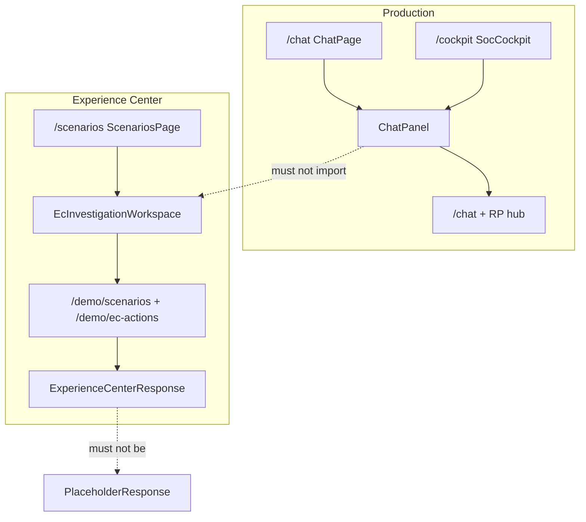

# RACES Experience Center (rev 5 — loop plan)

**Evolve** the existing Experience Center into an isolated capability showcase of the frozen [`architecture.md`](../architecture.md) and the complete AI SOC product experience.

**Loop start:** `loop-asap — execute plans/2026-08-16_2310_races-experience-center.md`  
**Runner:** [`plans/LOOP_RUNNER_races-experience-center.md`](LOOP_RUNNER_races-experience-center.md)

Do **not** replace working EC components with a second orchestration framework. Preference:

`reuse` → `clean contradictory behavior` → `extend EC projection` → `add scenario capability` → `improve UX`

Fixture/simulated MCP, RAG, LLM, email, tickets, and remediation are allowed. Production `/chat` authority must not change. `architecture.md` stays read-only.

**Baselines (do not reopen):** master `bf7c304`; COE candidate `coe-qualification-candidate-2026-08-16-v2`; architecture SHA-256 `c1c4ba8a88d8f245752188a76442102978eceb0c1bdb410717b789649fb9a034`; `READY_FOR_COE=YES`; `F3` open; `LIVE_MCP_PROVEN=false`; `PRODUCTION_GO=NO_GO`.

## Revision 5 (this document)

Rev 4 ChatPanel freeze retained. Added **Commit / PR / merge / build**: phase-scoped commits on `feat/races-experience-center`; draft PR after L-A; merge to `master` user-only; `npm run build` for EC frontend.

## Revision 4

- **F2 no longer migrates the picker off ChatPanel.** Flagship EC lives only on `/scenarios`. [`ChatPanel.tsx`](../frontend/src/components/ChatPanel.tsx) is a freeze file. Removing the old picker is a **separate, explicitly approved** cleanup later.
- **Do not start Phase B/C** until **L-A** live-path invariant check is PASS.

## Revision 3

Converted to a loop plan; design-time invariant check; live-path freeze. See drift log.

## User directives / Governance invariants

- EC is a separate fixture runtime. Do not enable `AI_SOC_LIVE_CHAT_EC_PARITY_ENABLED`.
- Do not edit [`routes_chat.py`](../backend/app/api/routes_chat.py) or [`routes_chat_stream.py`](../backend/app/api/routes_chat_stream.py).
- Keep [`run_demo_scenario`](../backend/app/demo/scenarios.py) returning a **PlaceholderResponse-compatible dict**. `/chat` parity (default off) does `PlaceholderResponse(**run_demo_scenario(...))`. Changing that return shape **is** a live-path break even if the flag stays false in tests that import the function. Add a **new** `/demo` entrypoint (`run_experience_center_turn` or equivalent) for `ExperienceCenterResponse`.
- Pre-existing production imports of `app.demo` (`routes_chat.py`, `routes_chat_stream.py`, [`trace_panels.py`](../backend/app/governance/trace_panels.py), [`responses.py`](../backend/app/schemas/responses.py) `ExperienceCenterGovernance`) are **not a license to add more**. Do not expand `PlaceholderResponse`. Do not add `app.demo` imports to `pipeline.py` / `graph/` / `planner/` / `routing/`.
- Live [`pipeline.py`](../backend/app/chat/pipeline.py) calls `build_governance_trace(demo_mode=False, …)` **without** `scenario_id` (~4238). `_experience_center_panels` therefore returns `{}` on the live path. Item A4 may edit `_generic_experience_center_panels` only; do not change the live `build_governance_trace` call or panel builders used when `scenario_id is None`.
- No new env flags. No live LLM/MCP/RAG from `app.demo`. No production `/api/actions`. `candidate_spl` never executes. `validate_spl` is read-only reuse; never override.

## Decision gates

- Any need to edit `PlaceholderResponse`, `routes_chat.py`, `pipeline.py`, `graph/`, `planner/`, `routing/`, SPL validator **behavior**, or MCP gate → **STOP**.
- Any need to change `run_demo_scenario()` so `PlaceholderResponse(**payload)` fails → **STOP**.
- Same Verify fails twice → **STOP**.

## Commit / PR / merge / build

Matches Plan 6 (PR #132, `--merge` not squash) and `AGENTS.md` Commit Hygiene. `loop-asap` on this plan **authorizes phase-scoped commits on the feature branch only**. Push and opening a PR need the user the first time they happen; after a PR exists, further pushes to that branch are allowed. **Merge to `master` always requires an explicit user ask.**

### Branch

```bash
git checkout -b feat/races-experience-center
```

Never commit on `master`. If loop-asap starts on `master`, create this branch before the first commit. Do not force-push. Do not `--no-verify`.

### When to commit

Commit after a **scoped batch** whose Verify passed — not after every keystroke, not as one giant RACES commit.

| Batch | Items | What lands |
|-------|--------|------------|
| live-path freeze | L0 | Isolation-test allow/forbid lists only. No production modules. |
| contradiction cleanup | A1–A8 | EC fixture/stamp/SOP/severity/SPL-override fixes; `trace_panels.py` `_generic_experience_center_panels` only |
| live-path re-pin A | L-A | Tests/docs only unless a failed pin forced an A fix (still no freeze files) |
| EC contract | B1–B4 | `ExperienceCenterResponse`, projection, `/demo/ec-actions`, session — `app.demo/` + `routes_scenarios.py` only |
| EC workspace shell | B5 | `frontend/src/components/ec/` + `ScenariosPage.tsx` + `ecClient`. **Not** `ChatPanel.tsx` |
| live-path re-pin B | L-B | Tests only |
| S1 | C1–C3 | Flagship S1 fixtures + SPL governance UX |
| S2–S4 | D1–D3 | Prompt injection, email loop, zero-day |
| S5–S7 + Lab | E1–E4 | Cisco/continuity/conflict + lab picker |
| EC UX polish | F1–F3 | Three-layer `/scenarios` workspace. **ChatPanel.tsx diff empty** |
| gates | G1–G4 | Isolation tests, journeys, non-regression. Plan Evidence fields |

One commit per row is the default. Combine only when the diff is tests/docs-only and shares one concern.

Never mix: freeze-file edits (forbidden) + EC work; `PlaceholderResponse` / `routes_chat.py` + `/demo`; ChatPanel + EC workspace; production validator behavior + fixture SPL; Phase 10 `/api/actions` + EC simulation.

### Commit message

```text
races(<item>): imperative summary under ~72 chars

Why this batch exists. Verify command + result. Note L-A PASS before any B commit.
```

Examples: `races(L0): freeze live-path prefixes including ChatPanel`, `races(A2): remove EC SPL validator override`, `races(B1): add ExperienceCenterResponse for /demo only`.

### Never commit

- `.env`, tokens, passwords, session secrets, MCP payloads, customer data
- [`architecture.md`](../architecture.md)
- Freeze files: `routes_chat.py`, `routes_chat_stream.py`, `pipeline.py`, `graph/`, `planner/`, `routing/`, `schemas/responses.py`, `routes_actions.py`, `mcp_execution_gate.py`, `spl_validator.py`, `frontend/src/components/ChatPanel.tsx`
- Unrelated dirt: `.claude/settings.local.json`, `.playwright-mcp/`, `output/`
- Eval baseline refreshes to hide a regression
- Protected artifacts unless a later STOP explicitly approves recapture
- Flag-default changes (`AI_SOC_LIVE_CHAT_EC_PARITY_ENABLED` stays false)

Pre-commit for any runtime / `trace_panels.py` / `app.demo` / `/demo` / frontend EC diff: `/invariant-check` must be 7/7 PASS. One FAIL blocks the commit. L-A and L-B Evidence must include the live-path pytest slice and empty freeze `git diff`.

### PR

**Default: one PR.**

```bash
git push -u origin feat/races-experience-center
gh pr create --title "RACES: evolve isolated Experience Center (no live /chat change)" --body "..."
```

Open a **draft PR after L-A** (cleanup is reviewable; production freeze still holds). Mark ready for review after G4, still **before merge**.

PR body must include:

- Isolation guarantee: freeze-file list with empty diffs; `ChatPanel.tsx` untouched
- `run_demo_scenario()` still `PlaceholderResponse`-compatible; `/demo` uses `ExperienceCenterResponse`
- Checklist progress (N/34 including G5)
- Named STOPs (do not start B before L-A PASS)
- Test evidence: live-path slice, EC purity, `npm run build` if frontend changed
- Explicit: EC Phase 10 is simulated (`production_side_effect=false`); no `/api/actions`; no production GO

**Optional split** (only if the user asks): PR-A after L-A (contradiction cleanup + freeze tests); PR-B remainder. Do not open a PR that contains a freeze-file edit.

### Merge

- **Method:** merge commit, not squash.

```bash
gh pr merge <n> --merge
```

- **Who:** user only. Agents never merge to `master` unless the user explicitly says to merge this PR.
- **When:** after G4 Verify is green **and** the user asks.
- **Block merge if:** L-A was not PASS before B commits; freeze files appear in the diff; `ChatPanel.tsx` changed; `PlaceholderResponse` gained EC fields; `/invariant-check` failed; unrelated dirt is in the diff; the PR enables EC parity on `/chat`.
- No force-push to `master`. No `--no-verify`. Amend only under the existing user git-safety rules.

After merge: record the merge SHA in G4/G5 Evidence, set plan `status: done`, update [`plans/README.md`](README.md) Active-work.

### Build

Frontend production is Nginx serving `frontend/dist`. Docker `frontend` is Vite dev only.

```bash
cd frontend && npm run build   # postbuild: chmod -R a+rX dist (else Nginx 403)
```

Run `npm run build` after **B5, F1–F3, and G2** (any `frontend/src/components/ec/` or `ScenariosPage.tsx` change). Do not skip postbuild chmod.

Backend (every runtime batch):

```bash
cd backend && PYTHONPATH=../backend:.. python3 -m pytest <item Verify paths> -q
```

Live-path pin (L0, L-A, L-B, G4, and before every commit that is not docs-only):

```bash
cd backend && PYTHONPATH=../backend:.. python3 -m pytest \
  app/tests/test_live_path_untouched_by_ec.py \
  app/tests/test_live_chat_ec_parity.py \
  app/tests/test_canonical_architecture_authority_baseline.py \
  app/tests/test_mcp_execution_gate.py \
  app/tests/test_governance_trace_chat_stage3m_ui.py -q
```

Do **not** require `docker compose build` / `./scripts/coe_deploy_verify.sh` for each commit. Publish this host’s UI with `npm run build` when the user asks to deploy. Full `./scripts/run_stage3_governance_regression.sh` is **G4-optional** (EC must not affect it); run it if G4 live-path slice is green and the user wants the canonical gate.

## INVARIANT CHECK — RACES plan rev 3 (design; no application diff)

Baseline pytest (2026-08-16, pre-implementation): `63 passed` on `test_live_path_untouched_by_ec.py` + `test_live_chat_ec_parity.py` + `test_ec_isolation.py` + `test_experience_center_canonical_purity.py` + `test_canonical_architecture_authority_baseline.py` + `test_mcp_execution_gate.py` + `test_governance_trace_chat_stage3m_ui.py`.

```
INVARIANT CHECK — RACES plan rev 3 — 0 application files
1 LLM↔MCP: PASS — EC Phase 10 is simulated in app.demo only; no new call_tool; LLM never calls MCP; /demo/ec-actions must not import connectors
2 SPL: PASS — remove _ec_spl_override_ids; real validate_spl read-only; candidate_spl stays non-executable; no execution_eligible=true; EC SUCCESS is not MCP execution
3 EC: PASS — keep fixture runtime; no live LLM/MCP/trace emission; live_llm_called stays false
4 Secrets: PASS — synthetic fixtures only; no new tokens
5 State: PASS — no new ChatPipelineState keys; EC session is demo in-memory store only
6 Flags: PASS — no new env flags; do not flip AI_SOC_LIVE_CHAT_EC_PARITY_ENABLED (config default false; coe/development profiles false)
7 Tests: PASS — plan forbids weakening production tests; test_ec_pipeline_dispatch_parity.py rewrite is EC-only
LIVE PATH: PASS if L0/L-A/G1 pins hold — pipeline.py live build_governance_trace omits scenario_id; parity-off /chat uses pipeline (test_live_chat_ec_parity_off_uses_pipeline)
WATCH: PlaceholderResponse already imports ExperienceCenterGovernance — do not expand
WATCH: routes_chat already imports app.demo for default-off intercept — do not edit that module
VERDICT: READY_FOR_LOOP — isolation holds; execute L0 first
```

Re-run `/invariant-check` on the **git diff** after every item that touches runtime code. One FAIL blocks the item check-off.

## INVARIANT CHECK — Phase A (L0–A8, 2026-08-16)

```
INVARIANT CHECK — feat/races-experience-center — 9 application/test files
1 LLM↔MCP: PASS — no call_tool in app.demo; splunk_run_query remains fixture labels only
2 SPL: PASS — _ec_spl_override_ids removed; real validate_spl read-only; candidate execution_eligible stays false; test_mcp_execution_gate in L-A 49 passed
3 EC: PASS — demo path still fixture-only; live_llm_called not flipped true; no live MCP/trace emission
4 Secrets: PASS — no new tokens/passwords/api keys in the diff (existing “password-guessing” prose only)
5 State: PASS — no ChatPipelineState keys; pipeline.py / graph / planner untouched
6 Flags: PASS — no new env flags; AI_SOC_LIVE_CHAT_EC_PARITY_ENABLED not flipped
7 Tests: PASS — production live-path tests not weakened; EC asserts retargeted to honest SOP/severity/dispatch (P2 on SPL-only and pipeline_dispatch_v2 stamp removed by design)
LIVE PATH: PASS — 49 passed including test_live_chat_ec_parity_off_uses_pipeline; freeze git diff empty (ChatPanel, routes_chat, pipeline)
VERDICT: PASS — L-A complete; do not start Phase B
```

## Stop conditions

- All checklist items checked with evidence, **or**
- Same verify gate fails twice, **or**
- A change would alter production T1–T4, RQC, route, primary skill, ResourcePlan, compiler, PhaseContract, RP graph, SPL validator **behavior**, normalized SPL authorization, MCP gate, AUTH0/RBAC/HIL, production EvidenceState, production InvestigationOutcome, synthesis, production Phase 10, production session/follow-up — **STOP and report**.
- A change would modify [`PlaceholderResponse`](../backend/app/schemas/responses.py) / production `/chat` contracts for EC convenience — **STOP** (use `ExperienceCenterResponse` instead).
- EC UI would call production [`/api/actions`](../backend/app/api/routes_actions.py) or import EC action/session runtime into [`ChatPanel.tsx`](../frontend/src/components/ChatPanel.tsx) — **STOP**.
- Any edit to [`ChatPanel.tsx`](../frontend/src/components/ChatPanel.tsx) — **STOP**. Leave existing picker/intercept as-is.
- Starting B1 before **L-A** Evidence shows live-path invariant-check PASS — **STOP**.
- Production `validate_spl` would be loosened or overridden so an EC fixture “passes” — **STOP**; fix the fixture SPL.

## Dependency order

```text
L0 → A1 A2 A3 A4 A5 A6 A8 → A7 → L-A
  → B1 → B2 B3 B4 → B5 → L-B
  → C1 → C2 C3
  → D1 D2 D3
  → E1 E2 E3 E4
  → F1 → F2 F3
  → G1 G2 G3 G4 → G5
```

Preferred single-agent walk:

`L0, A1, A2, A3, A4, A5, A6, A8, A7, L-A, B1, B2, B3, B4, B5, L-B, C1, C2, C3, D1, D2, D3, E1, E2, E3, E4, F1, F2, F3, G1, G2, G3, G4, G5`

---

## 1. Current-state audit

EC backend runtime is already separate: picker/`POST /demo/scenarios/{id}/run` → [`run_demo_scenario`](../backend/app/demo/scenarios.py). Live `/chat` intercepts only if `AI_SOC_LIVE_CHAT_EC_PARITY_ENABLED=true` (repo + COE/dev: **false**). Keep that false. Keep `_run_demo_scenario_legacy`.

**Frontend sharing (rev 2, traced):**

- [`ChatPanel.tsx`](../frontend/src/components/ChatPanel.tsx) is the **production chat surface**. Used by [`ChatPage`](../frontend/src/pages/ChatPage.tsx) (`/chat`) and [`SocCockpit`](../frontend/src/pages/SocCockpit.tsx) (`/cockpit`, default landing). It currently also embeds [`DemoScenarioPicker`](../frontend/src/components/DemoScenarioPicker.tsx) and `runDemoScenario()`. **RACES must not modify this file.** The existing picker stays. The seven flagships are built on `/scenarios` only.
- [`ScenariosPage.tsx`](../frontend/src/pages/ScenariosPage.tsx) at `/scenarios` is a stub “Demo Scenario Library” with SideNav entry **Scenarios**. **Extend this page** as the EC workspace; do not invent a second shell; do not turn `ChatPanel` into the EC workspace.
- [`ProposedActionsPanel.tsx`](../frontend/src/components/ProposedActionsPanel.tsx) calls production `/api/actions/{id}/approve` — never reuse for EC Phase 10.
- [`AnalystResponseCard.tsx`](../frontend/src/components/AnalystResponseCard.tsx) ticket click is client-only expand, not Phase 10.

**Contradiction (keep Phase A):** `dispatch_authority=pipeline_dispatch_v2`; `_ec_spl_override_ids`; fixture skill presented as production route; Q1 ticket SUCCESS vs production `create_ticket` unavailable; brute-force SOP on every `_analyst_response` base (APP-01 bleed into firewall baseline); “SPL not required” when `candidate_spl` exists; forced severity on knowledge/SPL-only turns.

---

## 2. Architecture boundary (revised)

```text
Visitor → /scenarios (EcInvestigationWorkspace)
        → EC-only components (frontend/src/components/ec/)
        → /demo/scenarios + /demo/ec-actions
        → app.demo fixture runtime + ExperienceCenterResponse
```

Production `/chat` + Resource Planner hub remain a **separate** path. `ChatPanel` continues to stream live chat. EC must not write production session, handoffs, or action stores.

- EC contracts: `backend/app/demo/` only (`ExperienceCenterResponse`, projection, actions, session).
- EC UI: `frontend/src/components/ec/` + extend [`ScenariosPage.tsx`](../frontend/src/pages/ScenariosPage.tsx). Reuse shadcn primitives only.
- **Forbidden for RACES:** edits to production response schemas, `pipeline.py` semantics, `graph/`, `planner/`, `routing/` behavior, SPL validator behavior, MCP gate, production Phase 10, `routes_chat.py` (except if an isolation test requires proving parity stays off — do not enable the flag).
- Read-only reuse allowed: `validate_spl` (no override). `decide_severity` only when a real use-case policy applies.
- Do not enable `AI_SOC_LIVE_CHAT_EC_PARITY_ENABLED`.
- Do **not** add new production imports of `app.demo`. Pre-existing intercept/schema imports stay as-is; do not expand them.
- Production chat components must not import `frontend/src/components/ec/` or EC action/session clients.
- **Live-path freeze (files that must have empty `git diff` for this work):**
  - [`backend/app/api/routes_chat.py`](../backend/app/api/routes_chat.py)
  - [`backend/app/api/routes_chat_stream.py`](../backend/app/api/routes_chat_stream.py)
  - [`backend/app/chat/pipeline.py`](../backend/app/chat/pipeline.py)
  - [`backend/app/graph/`](../backend/app/graph/)
  - [`backend/app/planner/`](../backend/app/planner/)
  - [`backend/app/routing/`](../backend/app/routing/)
  - [`backend/app/schemas/responses.py`](../backend/app/schemas/responses.py)
  - [`backend/app/api/routes_actions.py`](../backend/app/api/routes_actions.py)
  - [`backend/app/orchestration/mcp_execution_gate.py`](../backend/app/orchestration/mcp_execution_gate.py)
  - [`backend/app/safeguards/spl_validator.py`](../backend/app/safeguards/spl_validator.py)
  - [`frontend/src/components/ChatPanel.tsx`](../frontend/src/components/ChatPanel.tsx)
- [`trace_panels.py`](../backend/app/governance/trace_panels.py) may change **only** `_generic_experience_center_panels` (and EC-only helpers). Live `build_governance_trace(..., demo_mode=False)` call sites and `scenario_id is None` behavior must stay identical. Keep the existing live-panel regression [`test_governance_trace_chat_stage3m_ui.py`](../backend/app/tests/test_governance_trace_chat_stage3m_ui.py) as the before/after pin.



---

## 3. Existing contradiction cleanup

Unchanged intent from rev 1, still Phase A:

1. Keep isolation; strengthen purity.
2. Remove `pipeline_dispatch_v2` as EC `dispatch_authority` ([`ec_pipeline_fixture.py`](../backend/app/demo/ec_pipeline_fixture.py)). Rewrite [`test_ec_pipeline_dispatch_parity.py`](../backend/app/tests/test_ec_pipeline_dispatch_parity.py).
3. Remove `_ec_spl_override_ids`. If `validate_spl` rejects, show rejection; fix fixture SPL.
4. Label `expected_skill` as `route_source: ec_fixture_selected`. Do not present `adjudicate_route` as having chosen it.
5. Keep simulated ticket/remediation as **EC Phase 10 simulation** (`production_side_effect=false`). Do not use production `action_capability_for` as EC action authority for side effects.
6. Stop seeding every analyst card with brute-force `SOC-SOP-AUTH-001` ([`_enriched_playbook_payload`](../backend/app/demo/scenarios.py)).
7. SPL panel status from candidate/validator, not `execution.executed_spl`.
8. Do not force incident severity where not applicable.

---

## 4. Scenario migration matrix

Unchanged from rev 1:

- Merge into S1: `firewall_deny_coordinated_attack`, `firewall_baseline_template_spl` (as SPL-governance story, not flagship), `splunk_env_asa_ti_readiness`, `network_blast_radius_attacker_ip`
- Merge into S3: `ir_containment_advisory_firewall_incident`; executive MITRE as S1/S3 follow-up
- Lab: MITRE FSM, guided supply-chain, CERT-In, SCADA fail-closed, OT Modbus/HMI, failed-login APP-01, success-after-failure SPL, brute-force SOP, DNS C2, critical+CVE
- Stay deleted: already-removed `*_run` / lockout / metadata-discovery IDs

Picker: **7 flagship** on `/scenarios` + collapsed **Lab**.

---

## 5. Seven flagship scenarios (retained)

Behavior unchanged. Provenance: scenario rules that are **not** existing production policy must be `ec_scenario_policy` / `experience_center_fixture` in the developer trace (see §10). Visitor UI may say “environment search governance” naturally.

### S1 — Governed large-scale Splunk investigation

Query: communications involving `198.51.100.42`; **no time range**. EC search-governance policy (fixture): 60-day coverage as **30d + 30d**; never `index=*`; Env KB indexes/sourcetypes/limits. Two searches, merge, affected systems, follow-ups (auth, privileged, EDR, TI, block request, ticket). **SPL must pass real `validate_spl`.** Label 30+30 as `ec_search_governance_policy`, not production SPL policy.

### S2 — AI application security / prompt injection

Attempted injection; tool-call audit (blocked unauthorized export); restricted-data access not confirmed; policy + logs; follow-ups (DLP, identity, ticket, notify, disable credential after HIL).

### S3 — Firewall-team coordination

Confirmed malicious IP → company firewall-block process (fixture KB) → email with mandatory fields → send → `AWAITING_FIREWALL_TEAM_CONFIRMATION` → reply “whitelisted yesterday for vendor testing” → ingest → continue (ticket, remove whitelist, block, verify). Follow-ups **advance state**.

### S4 — Zero-day / no SOAR playbook

VPN gateway advisory + assets + Splunk + hardening; **no** threat-specific playbook resource. Emergency ticket, notify, optional temp control after HIL, verify.

### S5 — Knowledge → Cisco MCP → policy remediation

R-17 breach; Cisco `current_version=14`; fixture hardening knowledge requires 15 (provenance `ec_scenario_policy`, not production Cisco policy); change ticket; HIL; simulate upgrade; verify `15`; update incident.

### S6 — Investigation continuity

Privileged VPN Germany yesterday → service accounts → build servers → last month’s incident → fetch ticket → add evidence → notify owner. Named `follow_up_id` transitions; applicability REUSABLE / STALE / OUT_OF_SCOPE / SUPERSEDED / INVALIDATED / BLOCKED. Not a global phrase catalogue.

### S7 — Conflicting / missing evidence

Splunk unauthorized OT access vs CMDB retired. Confirmed / Unconfirmed / Conflicting / Missing / Blocked. OT inventory, firewall, ARP/MAC, ask OT team; then incident **or** close. No forced conclusion.

---

## 6. Backend design (revised response contract)

Keep `_run_demo_scenario_legacy` as assembler. Add EC-owned envelope; **do not** put EC fields on `PlaceholderResponse`.

### `ExperienceCenterResponse` (`backend/app/demo/`)

Conceptual shape:

- `analyst` — visitor-facing answer payload (may reuse **shapes** of analyst sections, not the production model class if that forces schema edits)
- `ec_projection` — understanding view, resource-plan view, phase-contract **view**, evidence state, investigation outcome
- `ec_actions` — prepared/in-flight/completed simulation records
- `ec_followups` — current-step chips (`follow_up_id`, label, advances_state=true)
- `ec_session_state` — family, turn, pending action, awaiting external
- `ec_provenance` — isolation + per-object provenance (see §10)

[`routes_scenarios.py`](../backend/app/api/routes_scenarios.py) `/demo` run returns this envelope. FastAPI `response_model` must **not** be `PlaceholderResponse`.

**Live-path compatibility:** keep `run_demo_scenario(scenario_id) -> dict` constructible as `PlaceholderResponse(**dict)` so [`routes_chat.py`](../backend/app/api/routes_chat.py) needs **zero** edits. Implement `run_experience_center_turn` (name flexible) used **only** by `/demo`. Do not change `run_demo_scenario` into an EC envelope.

New endpoints under `/demo/` only: follow-up, `ec-actions` approve/execute/verify. No `/chat` wiring.

If implementation discovers a genuine need to change `PlaceholderResponse` — **STOP** and document; do not silently add fields.

Do not call production `adjudicate_route` / `build_pipeline_dispatch` as EC authority. Optional read-only `validate_spl`.

---

## 7. EC action simulation (retained)

`app.demo.ec_actions` only. No production MCP clients, `evaluate_mcp_execution`, or `/api/actions`.

Kinds: email send/reply; ticket create/fetch/update; firewall block/remove_whitelist/verify_rule; cisco get_version/upgrade; iam disable; edr isolate; notify.

States: PREPARED → APPROVAL_REQUIRED → APPROVED → EXECUTED → VERIFIED | FAILED | AWAITING_EXTERNAL_RESPONSE.

Receipt: `production_side_effect=false`. SUCCESS after HIL is allowed. Remediating actions **verify** (rule, version, account, isolation). In-memory EC session store, not production DB.

Correct chain:

`EC InvestigationOutcome projection` → `EC action preparation` → `EC policy/RBAC/HIL projection` → `EC simulated execution` → `EC action receipt` → `EC verification`

---

## 8. Session / follow-up (strengthened)

Follow-ups are **not decorative**. Each chip/`follow_up_id` must change `ec_session_state` and return a new `ExperienceCenterResponse`.

Extend [`ec_fsm_store.py`](../backend/app/demo/ec_fsm_store.py) per family: turn, outcome ref, evidence keys, pending action, email/ticket ids. Typed text maps via **per-family** synonyms to the same IDs. Do not grow global `_ALIAS_INDEX` for every phrase.

Examples that must be real transitions where the scenario defines them: Check EDR/IAM/policy/TI/Cisco; compare previous incident; create/fetch/update ticket; draft/send email; wait/respond; remove whitelist; request block; disable account; isolate; upgrade; verify; leadership summary.

---

## 9. UI/UX (revised isolation + three layers)

### Host

Extend [`ScenariosPage`](../frontend/src/pages/ScenariosPage.tsx) (`/scenarios`, already in [`SideNav`](../frontend/src/components/SideNav.tsx)):

```text
/scenarios → EcInvestigationWorkspace → EC-only components → EC endpoints
```

Namespace: `frontend/src/components/ec/`:

- `EcInvestigationWorkspace.tsx`
- `EcScenarioPicker.tsx` (evolve from `DemoScenarioPicker`; do not keep adding features to the ChatPanel copy)
- `EcInvestigationAnswer.tsx` (Layer 1)
- `EcInvestigationOutcomeCard.tsx`
- `EcEvidenceStateBoard.tsx`
- `EcTransparencyDrawer.tsx` (Layer 2)
- `EcSplGovernancePanel.tsx`
- `EcFollowUpBar.tsx` (state-advancing)
- `EcEmailPanel.tsx` / `EcTicketPanel.tsx`
- `EcActionFlow.tsx` (Layer 3)
- `EcToolCapabilityCard.tsx`
- `EcVerificationPanel.tsx`

EC API client: `frontend/src/components/ec/` or `frontend/src/api/ecClient.ts` — **not** by extending production `PlaceholderResponse` in a way ChatPanel must understand.

### Three visitor layers (every flagship)

**Layer 1 — SOC Answer** (lead with this): Assessment; What we found; Affected systems; Evidence; Unconfirmed; Recommended next steps. No architecture dump.

**Layer 2 — Investigation Path:** Understanding → Evidence required → Resources/tools → Controls → Evidence → Outcome. Developer trace collapsed. Fixture skill is not “production routed.”

**Layer 3 — Action Journey** (when applicable): Recommended → Policy → RBAC → HIL → Execute → Receipt → Verify.

Visitor-facing copy is natural (“environment policy”, “firewall team”). No “fake/demo” badges on Layer 1. Provenance lives in Layer 2 developer trace.

### ChatPanel (frozen)

Do **not** modify [`ChatPanel.tsx`](../frontend/src/components/ChatPanel.tsx) in RACES. Do not add EC features. Do not remove the existing picker/intercept. `git diff -- frontend/src/components/ChatPanel.tsx` must stay empty for the whole plan.

Production: `/chat` + `/cockpit` → `ChatPanel` → **unchanged**.

Experience Center: `/scenarios` → `EcInvestigationWorkspace` → `/demo/*`.

Removing the old ChatPanel picker is **out of scope**; it needs a later explicit approval.

---

## 10. Fixture / provenance (revised)

Packs under `backend/app/demo/fixtures/s1/` … `s7/`. Reuse firewall IP/jump-host data where it still fits S1/S3.

Every projected object carries internal provenance sufficient to distinguish:

- `experience_center_fixture` — canned evidence/answer
- `ec_scenario_policy` — e.g. S1 30+30 search split; S5 14→15 hardening; S3 email-process required fields; S4 hardening guidance
- `production_validator_read_only` — real `validate_spl` result
- `simulated_mcp` / `simulated_rag` / `simulated_llm` / `simulated_phase10_action`

Do not internally label `ec_scenario_policy` as production ResourcePlan/PhasePolicy/SPL policy.

---

## 11. Test strategy (revised)

**Production non-regression:** `test_live_path_untouched_by_ec.py`; no `app.demo` imports from `pipeline.py` / `graph/` / `planner/`; routing/SPL validator/MCP gate/Phase 10 production tests unchanged-pass. Do not change `PlaceholderResponse` fields.

**EC purity:** no live MCP/LLM/RAG; no RP graph; no production session; no `/api/actions`; `production_side_effect=false`; `/demo` returns `ExperienceCenterResponse` not production chat schema.

**Frontend isolation:** production chat components do not import `@/components/ec`; EC action UI does not import `ProposedActionsPanel`; [`journeyContracts.test.tsx`](../frontend/src/test/journeyContracts.test.tsx) still passes; new tests that ChatPage/Cockpit do not call `/demo/ec-actions`.

**Provenance tests:** S1 30+30 is `ec_scenario_policy`; S1 SPL approval is `production_validator_read_only` with `approved=true` and no override; S5 version policy is fixture.

**Scenario + UI:** each S1–S7 initial + every follow-up; email/ticket/HIL/verify; three layers present.

---

## 12. Execution phases (revised responsibilities)

Still `A → B → C → D → E → F → G`.

### Phase A — Contradiction cleanup + isolation tests

Clean v2 stamp, SPL override, SOP bleed, SPL-not-required, false production-route, severity. Strengthen isolation tests **including** “no PlaceholderResponse EC fields” and “no `app.demo` import from production.” Keep existing scenarios runnable. Do not start a new orchestrator.

### Phase B — EC-owned contract + projection + actions + session + workspace shell

Add `ExperienceCenterResponse`; `/demo` returns it; `ec_projection` / `ec_actions` / `ec_session`; follow-up endpoint. Minimal `EcInvestigationWorkspace` on `/scenarios` that consumes the EC envelope (picker + Layer 1 stub). **Do not start B until L-A is PASS. ChatPanel.tsx remains unmodified.**

### Phase C — S1 + SPL governance

Flagship S1; 30+30 as `ec_scenario_policy`; real `validate_spl`; Layer 1+2 SPL visual; follow-ups advance state.

### Phase D — S2 / S3 / S4 + email/team

Prompt injection; firewall email loop; zero-day. Email panel on EC workspace.

### Phase E — S5 / S6 / S7

Cisco remediate+verify; continuity `follow_up_id`; conflicting evidence. Lab group on EC picker.

### Phase F — EC workspace polish

Three-layer UX complete on `/scenarios`; ticket/email/HIL/verify polish. **Do not modify ChatPanel.** Production ChatPage/Cockpit stay as they are; journey tests pass.

### Phase G — Gates

EC suite + production non-regression + `npm run build` + purity + frontend isolation tests. Update this plan’s Evidence fields. [`plans/README.md`](README.md) already lists this plan as active.

---

## 13. Acceptance criteria (revised)

### Phase A

- No EC `dispatch_authority=pipeline_dispatch_v2`
- No `_ec_spl_override_ids`
- Firewall-baseline / SPL-only payloads do not inherit `SOC-SOP-AUTH-001` / APP-01 SOP
- SPL panel not `not_required` when candidate SPL exists
- `route_source=ec_fixture_selected` (or equivalent) in EC trace
- `git grep` / tests: `PlaceholderResponse` has no new EC-only fields from this work
- Purity + `test_live_path_untouched_by_ec` pass

### Phase B

- `/demo/scenarios/{id}/run` response is `ExperienceCenterResponse` from a **new** entrypoint, not by changing `run_demo_scenario`
- `PlaceholderResponse(**run_demo_scenario(id))` still works; `routes_chat.py` unmodified
- Production `/chat` OpenAPI/schema tests still see unchanged `PlaceholderResponse`
- EC actions do not hit `/api/actions`
- `/scenarios` renders workspace shell without ChatPanel EC action runtime

### Phase C–E

- Each flagship matches §5; follow-ups change session state; S1 validator honest; S3 email ingest; S5 verify version 15; S6 applicability labels; S7 no forced incident

### Phase F

- Layers 1–3 present; visitor Layer 1 has no debug dump; side-effecting actions show HIL then receipt then verify where meaningful

### Backend isolation (G)

- No **new** production-module imports of `app.demo` (pre-existing `routes_chat` / `trace_panels` / `responses.py` intercepts stay; do not expand)
- No EC action endpoint calls production action execution
- No EC endpoint invokes live MCP or RP graph
- No EC session state in production session store
- No production response contract modified for EC
- Freeze files listed in §2 have empty `git diff`

### Frontend isolation (G)

- Production chat does not import EC action/session runtime
- [`ChatPanel.tsx`](../frontend/src/components/ChatPanel.tsx) `git diff` is empty for the whole RACES plan
- EC does not use `ProposedActionsPanel` execution endpoints
- EC actions use only `/demo/ec-actions` (or equivalent `/demo/` routes)
- Production chat journey tests unchanged and pass

### Provenance (G)

Every projection/action/tool result distinguishes EC fixture, EC scenario policy, reused production validator, simulated MCP/RAG/LLM/Phase 10.

### UX (G)

Each flagship: main answer understandable without trace; investigation path accessible; relevant follow-ups visible and stateful; side-effecting action shows approval; executed action has receipt; remediating action verifies where meaningful.

---

## 14. Risks / STOP conditions (revised)

- Any production semantics change listed in Stop conditions
- Adding EC fields to `PlaceholderResponse` “because FastAPI already uses it”
- Enabling live-chat EC parity so follow-ups hit `/chat`
- Reusing `ProposedActionsPanel` / `/api/actions`
- Loosening `validate_spl`
- Turning `ChatPanel` into `EcInvestigationWorkspace`, or **any** `ChatPanel.tsx` edit
- Production chat importing `@/components/ec`
- Internally claiming S1 30+30 or S5 14→15 as production policy

## Verification gaps

None blocking planning. Phase F UI tests may add `frontend/src/components/ec/*.test.tsx` (create in F; do not skip Verify).

---

## Checklist

- [x] **L0** — Live-path freeze (no production semantics change)
  - **Do:** Expand [`test_live_path_untouched_by_ec.py`](../backend/app/tests/test_live_path_untouched_by_ec.py) `EC_FORBIDDEN_PREFIXES` to include `pipeline.py`, `routes_chat_stream.py`, `schemas/responses.py`, `routes_actions.py`, `mcp_execution_gate.py`, `spl_validator.py`, and `frontend/src/components/ChatPanel.tsx`; expand allowlist for `frontend/src/components/ec/` and `ScenariosPage.tsx`. Add assertion that `run_demo_scenario` still `PlaceholderResponse(**payload)`s. Do not edit live-path modules or ChatPanel.
  - **Verify:** `cd backend && PYTHONPATH=../backend:.. python3 -m pytest app/tests/test_live_path_untouched_by_ec.py app/tests/test_live_chat_ec_parity.py app/tests/test_canonical_architecture_authority_baseline.py app/tests/test_mcp_execution_gate.py app/tests/test_governance_trace_chat_stage3m_ui.py -q`; `git diff --name-only` contains none of the freeze files (including `frontend/src/components/ChatPanel.tsx`)
  - **Depends on:** none
  - **Evidence:** `46 passed` (2026-08-16). `git diff --name-only` = `backend/app/tests/test_live_path_untouched_by_ec.py`, `plans/README.md` — no freeze files. `PlaceholderResponse(**run_demo_scenario(...))` asserted. Branch `feat/races-experience-center`.

- [x] **A1** — Remove EC `pipeline_dispatch_v2` authority stamp
  - **Do:** Stop stamping `dispatch_authority=pipeline_dispatch_v2` in [`ec_pipeline_fixture.py`](../backend/app/demo/ec_pipeline_fixture.py); rewrite [`test_ec_pipeline_dispatch_parity.py`](../backend/app/tests/test_ec_pipeline_dispatch_parity.py)
  - **Verify:** `rg -n "pipeline_dispatch_v2" backend/app/demo backend/app/tests/test_ec_pipeline_dispatch_parity.py`; pytest that file
  - **Depends on:** none
  - **Evidence:** `backend/app/demo` has no `pipeline_dispatch_v2` stamp (`dispatch_authority=ec_architecture_projection`). Remaining hits are negative asserts in `test_ec_pipeline_dispatch_parity.py`. `pytest app/tests/test_ec_pipeline_dispatch_parity.py` included in 132-passed Phase A slice (2026-08-16).

- [x] **A2** — Remove SPL validator override
  - **Do:** Delete `_ec_spl_override_ids` force-approve in [`scenarios.py`](../backend/app/demo/scenarios.py); fix fixture SPL if validator rejects
  - **Verify:** `rg _ec_spl_override_ids backend/app/demo`; pytest EC SPL scenarios show `approved` only when `validate_spl` agrees
  - **Depends on:** none
  - **Evidence:** `rg _ec_spl_override_ids backend/app/demo` empty. `_spl_payloads` calls real `validate_spl(..., template_profile=template.validation_rules)`. Firewall/Q1 `approved=True` only because the template profile matches the validator, not an override. Stage3jd SPL tests in 132-passed slice.

- [x] **A3** — Stop brute-force SOP bleed on every EC card
  - **Do:** Empty default `_analyst_response` base; attach SOP only when scenario declares knowledge
  - **Verify:** run `firewall_baseline_template_spl` (or successor); payload has no `SOC-SOP-AUTH-001` / APP-01 failed-login SOP
  - **Depends on:** none
  - **Evidence:** `test_firewall_baseline_template_is_environment_grounded_and_explained` asserts `SOC-SOP-AUTH-001` and `APP-01` absent from analyst dump; `retrieved_playbook`/`sop_guidance` None. `failed_login_spike_app01` and `brute_force_sop_guidance` still attach SOP. 132 passed.

- [x] **A4** — Honest SPL panel status
  - **Do:** [`trace_panels.py`](../backend/app/governance/trace_panels.py) `_generic_experience_center_panels` uses candidate/validator, not only `executed_spl`
  - **Verify:** SPL-only scenario panel ≠ “SPL not required” when `candidate_spl` present; `pytest app/tests/test_governance_trace_chat_stage3m_ui.py -q` still passes (live panels unchanged)
  - **Depends on:** none
  - **Evidence:** Firewall baseline `spl_validation_panel.status != "SPL not required"`. Live `build_governance_trace` still omits `scenario_id`; `test_governance_trace_chat_stage3m_ui.py` green in L-A 49 passed.

- [x] **A5** — Fixture route presentation
  - **Do:** Label `expected_skill` as EC fixture-selected, not production adjudication
  - **Verify:** grep EC payload for `ec_fixture_selected` (or equivalent); no “production routed” claim in EC trace copy
  - **Depends on:** none
  - **Evidence:** `rg ec_fixture_selected` hits `EXPERIENCE_CENTER_PROVENANCE`, response `route_source`, and EC panel copy. `rg "production routed|Query is routed to"` empty under demo/trace_panels. Firewall test asserts `control_plane_trace.experience_center_provenance.route_source == ec_fixture_selected`.

- [x] **A6** — Severity only when applicable
  - **Do:** Knowledge/SPL-only/clarification turns use not-assigned label
  - **Verify:** pytest those scenario ids; no P1/P3 on template-authoring
  - **Depends on:** none
  - **Evidence:** `apply_gate_severity_cap` when skill is knowledge/spl_generation, `spl_only`, fsm_step 0, or `requires_context`. Firewall baseline and `successful_login_after_failures` / `brute_force_sop_guidance` assert severity label does not start with `P`. Incident scenarios keep P2 (failed_login).

- [x] **A7** — Strengthen isolation tests (no production schema change)
  - **Do:** Assert no **new** `app.demo` import from pipeline/graph/planner; `PlaceholderResponse` unchanged; purity still holds
  - **Verify:** `cd backend && PYTHONPATH=../backend:.. python3 -m pytest app/tests/test_live_path_untouched_by_ec.py app/tests/test_experience_center_canonical_purity.py app/tests/test_ec_isolation.py app/tests/test_live_chat_ec_parity.py -q`; `git diff --name-only -- backend/app/api/routes_chat.py backend/app/chat/pipeline.py backend/app/schemas/responses.py` empty
  - **Depends on:** L0, A1–A6, A8
  - **Evidence:** `29 passed` (2026-08-16). Freeze `git diff --name-only` empty for routes_chat/pipeline/responses. Added `test_no_app_demo_imports_in_pipeline_graph_planner`, `test_placeholder_response_schema_file_unchanged`, `test_ec_q1_ticket_does_not_call_production_actions`.

- [x] **A8** — Q1 ticket as EC simulation label (keep SUCCESS)
  - **Do:** Ticket interactive action provenance `simulated_phase10_action` / `production_side_effect=false`; do not call `/api/actions`
  - **Verify:** payload + grep ChatPanel/ProposedActionsPanel unused by this path
  - **Depends on:** none
  - **Evidence:** Q1 action keeps `status=SUCCESS` with `provenance=simulated_phase10_action` and `production_side_effect=false`; mirrored on `control_plane_trace.phase10_simulation`. `rg /api/actions|ProposedActionsPanel|ChatPanel` empty under `backend/app/demo`. Visitor-answer dump redacts those internal keys so Stage 3J-J banned-term guard still holds.

- [x] **L-A** — Re-pin live path after Phase A
  - **Do:** No further production edits. Re-run freeze tests. `/invariant-check` on the Phase A diff (7 groups).
  - **Verify:** same pytest as L0; `test_live_chat_ec_parity.py::test_live_chat_ec_parity_off_uses_pipeline` passes; invariant-check VERDICT PASS; `git diff -- frontend/src/components/ChatPanel.tsx backend/app/api/routes_chat.py backend/app/chat/pipeline.py` empty
  - **Depends on:** A7
  - **Evidence:** L0 pytest slice `49 passed` (2026-08-16). Parity-off pin included. Freeze diffs empty including ChatPanel. INVARIANT CHECK 7/7 PASS (below). **STOP — do not start B.**

- [x] **B1** — `ExperienceCenterResponse` in `backend/app/demo/`
  - **Do:** New EC-owned envelope; `/demo/scenarios` run returns it via a **new** entrypoint. **Do not** edit `PlaceholderResponse`. **Do not** change `run_demo_scenario()` so `PlaceholderResponse(**run_demo_scenario(id))` breaks.
  - **Verify:** OpenAPI/schema of `/chat` unchanged; `pytest app/tests/test_live_chat_ec_parity.py -q`; `/demo/scenarios/{id}/run` types are demo-owned; `git diff --name-only -- backend/app/api/routes_chat.py backend/app/schemas/responses.py` empty
  - **Depends on:** L-A
  - **Evidence:** `run_experience_center_turn` + `ExperienceCenterResponse` (`app/demo/ec_response.py`). HTTP `POST /demo/scenarios/{id}/run` `response_model=ExperienceCenterResponse`; Python `run_demo_scenario_fixture` still `PlaceholderResponse(**run_demo_scenario())`. OpenAPI: `/chat` still PlaceholderResponse; `/demo/.../run` is ExperienceCenterResponse. `test_experience_center_response.py` + live-chat parity green. Freeze diffs empty.

- [x] **B2** — `ec_projection` on EC envelope
  - **Do:** Understanding/plan/controls/evidence/outcome views with provenance; production InvestigationOutcome field stays unused
  - **Verify:** pytest one existing scenario includes `ec_projection.provenance`
  - **Depends on:** B1
  - **Evidence:** `test_ec_projection_provenance_present` / `test_experience_center_turn_is_demo_owned_envelope` — `ec_projection.provenance.kind=experience_center_fixture`; outcome items include `production InvestigationOutcome field unused`.

- [x] **B3** — `ec_actions` + `/demo/ec-actions` (no `/api/actions`)
  - **Do:** Simulation contract + in-memory store
  - **Verify:** pytest approve/execute does not import `routes_actions`; `production_side_effect is False`
  - **Depends on:** B1
  - **Evidence:** `test_ec_actions.py` — no `routes_actions` import; approve→execute→verify with `production_side_effect is False`. Endpoints: `POST /demo/ec-actions/prepare|{id}/approve|execute|verify`.

- [x] **B4** — `ec_session` + follow-up endpoint
  - **Do:** Extend `ec_fsm_store`; `POST /demo/scenarios/{id}/follow-up` with `follow_up_id`
  - **Verify:** pytest turn advances; unknown id does not invent a scenario
  - **Depends on:** B1
  - **Evidence:** `test_follow_up_advances_turn` (turn 0→1); `test_unknown_follow_up_does_not_invent_scenario` + HTTP 404 `Unknown follow-up`.

- [x] **B5** — EC frontend client + `/scenarios` shell
  - **Do:** `ecClient.ts` + `EcInvestigationWorkspace` mounted in `ScenariosPage`. Do not edit ChatPanel.
  - **Verify:** `git diff -- frontend/src/components/ChatPanel.tsx` empty; `rg "components/ec" frontend/src/components/ChatPanel.tsx frontend/src/pages/ChatPage.tsx` empty; `/scenarios` renders workspace
  - **Depends on:** B1
  - **Evidence:** ChatPanel/ChatPage diffs and `components/ec` imports empty. `ecWorkspace.test.tsx` finds “Investigation workspace”. `npm test` 13 passed; `npm run build` ok (postbuild chmod). Public `/scenarios` still behind login; workspace is three-layer SOC Answer / Investigation Path / Action Journey.

- [x] **L-B** — Re-pin live path after Phase B
  - **Do:** Confirm `/demo` envelope is not used by `/chat`. No `pipeline.py` / `routes_chat.py` / `PlaceholderResponse` edits.
  - **Verify:** L0 pytest slice; `rg "ExperienceCenterResponse" backend/app/api/routes_chat.py backend/app/chat/pipeline.py` empty
  - **Depends on:** B5
  - **Evidence:** L0 slice `49 passed, 1 warning in 4.83s` (2026-08-16). Combined Phase B + isolation `123 passed`. `rg ExperienceCenterResponse` empty on `routes_chat.py` / `pipeline.py`. Freeze `git diff --name-only` empty on freeze paths. INVARIANT CHECK 7/7 PASS. **STOP — do not start C.**

- [x] **C1** — S1 fixture pack + 30+30 as `ec_scenario_policy`
  - **Do:** Two bounded searches, merge, Env KB, no `index=*`; provenance not production policy
  - **Verify:** pytest S1; provenance key `ec_scenario_policy`; `validate_spl` approved without override
  - **Depends on:** L-B, B2, B4
  - **Evidence:** `pytest app/tests/test_s1_governed_splunk_investigation.py -q` → `11 passed`. Policy `ec_search_governance_policy` with `provenance=ec_scenario_policy`, 60d as 30+30. Both SPLs `validate_spl` approved, `execution_eligible=false`, no override, no `index=*`.

- [x] **C2** — S1 Layer 1 answer + SPL governance panel
  - **Do:** Affected systems; omitted time; candidate → constraints → validator → search1 → search2 → merge
  - **Verify:** UI/pytest payload sections; panel never “SPL not required”
  - **Depends on:** C1, B5
  - **Evidence:** `s1Workspace.test.tsx` 5 passed: assessment, affected systems, unconfirmed, 30+30 SPL panel, `validate_spl approved`, `queryByText('SPL not required')` empty. `npm run build` ok. ChatPanel untouched.

- [x] **C3** — S1 follow-ups advance state
  - **Do:** Auth/privileged/EDR/TI/block/ticket chips call follow-up endpoint
  - **Verify:** pytest each `follow_up_id` changes `ec_session_state.turn`
  - **Depends on:** C1, B4
  - **Evidence:** `test_s1_every_follow_up_advances_state_and_updates_evidence` HTTP 200 for all 7 ids; turn 0→7; evidence/outcome updates; firewall block stays `APPROVAL_REQUIRED`; ticket `EXECUTED` with `production_side_effect=false`. Unknown id does not invent a scenario.

- [x] **D1** — S2 prompt-injection scenario
  - **Do:** Fixture logs + blocked tool call + policy; follow-ups
  - **Verify:** pytest confirmed vs unconfirmed vs missing
  - **Depends on:** B2
  - **Evidence:** `pytest app/tests/test_s2_ai_application_security.py -q` → 4 passed. Prompt injection + blocked `export_customer_records` confirmed; successful tool exec / data access / hijack unconfirmed; DLP missing until follow-up; `disable_integration_credential` stays `APPROVAL_REQUIRED` (`execute_action` raises); `production_side_effect=false`; no live MCP/LLM.

- [x] **D2** — S3 email coordination loop
  - **Do:** Process KB, compose, send, await, ingest whitelist reply, continue
  - **Verify:** pytest states through `AWAITING_FIREWALL_TEAM_CONFIRMATION` then re-evaluation
  - **Depends on:** B3, B4
  - **Evidence:** `pytest app/tests/test_s3_firewall_team_coordination.py -q` → 3 passed. Mandatory process fields present; `email.send` receipt `production_side_effect=false`; state `AWAITING_FIREWALL_TEAM_CONFIRMATION`; inbound whitelist reply is `email_mcp_fixture` evidence; outcome `needs_reassessment` (not blind benign/malicious); whitelist removal and IP block stay HIL.

- [x] **D3** — S4 zero-day no playbook
  - **Do:** Advisory + assets + Splunk + hardening; no threat-specific SOAR resource
  - **Verify:** pytest resource list has no named SOAR playbook; exposure honest
  - **Depends on:** B2
  - **Evidence:** `pytest app/tests/test_s4_zero_day_no_playbook.py -q` → 3 passed. `ec_soar_playbook=not_available`; exposure `PARTIAL`/`REQUIRES_VALIDATION`; versions split affected vs not; exploitation not confirmed; temporary control HIL. Advisory id `ZD-FIXTURE-VPN-2026-001` is scenario-defined, not a real CVE.

- [x] **E1** — S5 Cisco 14→15 with verify
  - **Do:** Policy as `ec_scenario_policy`; HIL; simulate upgrade; verify 15
  - **Verify:** pytest version probe after execute; provenance not production Cisco policy
  - **Depends on:** B3
  - **Evidence:** `pytest app/tests/test_s5_cisco_hardening_remediation.py -q` → 3 passed. 14 → policy → ticket → approve → upgrade → verify 15; `ec_policy_source=ec_scenario_policy`; `simulated_mcp`; verify chip hidden until upgrade.

- [x] **E2** — S6 continuity follow_up_ids
  - **Do:** Seven turns; applicability vocabulary; no global alias explosion
  - **Verify:** pytest applicability labels; `_ALIAS_INDEX` not grown per synonym
  - **Depends on:** B4
  - **Evidence:** `pytest app/tests/test_s6_investigation_continuity.py -q` → 3 passed. Session id stable; turns 0→6; admin evidence `OUT_OF_SCOPE` then service-account `SUPERSEDED`; historical `STALE`/`REUSABLE`; ticket fetch/update + notify; synonym `"What about service accounts?"` resolves without growing `_ALIAS_INDEX`.

- [x] **E3** — S7 conflicting evidence
  - **Do:** Splunk vs retired CMDB; no forced incident; OT/firewall/team paths
  - **Verify:** pytest conflicting + missing; outcome updates after team response
  - **Depends on:** B4
  - **Evidence:** `pytest app/tests/test_s7_conflicting_ot_evidence.py -q` → 3 passed. Initial `CONFLICTING` + no ticket chip; Path A inventory→confirmed→ticket; Path B recycled identity `not_an_incident` + CMDB correction chip.

- [x] **E4** — Lab picker group
  - **Do:** Retained lab scenarios on EC picker collapsed group
  - **Verify:** `list_demo_scenarios` / EC list: 7 flagship + lab ids present
  - **Depends on:** C1
  - **Evidence:** `pytest app/tests/test_e4_flagship_lab_picker.py -q` → 1 passed. `list_demo_scenarios` now includes `picker_tier=lab`. UI optgroups: `7 Flagship Scenarios` / `Lab / Additional Scenarios`. Existing secondary scenarios retained (not deleted).

- [x] **F1** — Three-layer workspace polish
  - **Do:** Layer 1 answer, Layer 2 drawer, Layer 3 action flow on `/scenarios`
  - **Verify:** frontend tests for each layer; Layer 1 has no v2/debug dump
  - **Depends on:** C2, D2, E1
  - **Evidence:** `flagshipWorkspace.test.tsx` + `s1Workspace.test.tsx`: Layer 1 assessment without v2 dump; Layer 2 Investigation Path; Layer 3 Action Journey. Shared components used across S1–S7.

- [x] **F2** — Complete flagship Experience Center on `/scenarios` without expanding ChatPanel coupling
  - **Do:** Finish flagship run/workspace on `/scenarios` only. Do **not** modify ChatPanel EC behavior (picker, `runDemoScenario`, intercept). Do not add EC imports or action/session runtime to ChatPanel.
  - **Verify:** `git diff -- frontend/src/components/ChatPanel.tsx` is empty; `rg "@/components/ec" frontend/src/components/ChatPanel.tsx` empty; seven flagships reachable from `/scenarios`
  - **Depends on:** B5, F1
  - **Evidence:** ChatPanel migration deliberately deferred (production UI freeze). `git diff -- frontend/src/components/ChatPanel.tsx` empty. SideNav `/scenarios` labeled Experience Center. Scenario switch starts a fresh EC session (no cross-family leak). This is compliance, not a failure.

- [x] **F3** — Email/ticket/HIL/verify UI
  - **Do:** EC panels only; no ProposedActionsPanel
  - **Verify:** `rg ProposedActionsPanel frontend/src/components/ec` empty; UI tests send/await/receipt/verify
  - **Depends on:** D2, E1, F1
  - **Evidence:** `EcCoordinationPanels` email/ticket/tool; Execute disabled until `APPROVED`; Verify disabled until `EXECUTED`. `rg ProposedActionsPanel frontend/src/components/ec` empty. flagshipWorkspace tests cover inbound email + HIL buttons.

- [x] **G1** — Backend isolation suite
  - **Do:** Import boundary, no live MCP, no RP graph, no production session, no `/api/actions`, no PlaceholderResponse edits
  - **Verify:** dedicated pytest module; `git diff backend/app/schemas/responses.py` empty for this work
  - **Depends on:** F2
  - **Evidence:** `pytest app/tests/test_races_g1_backend_isolation.py -q` → 5 passed. Pre-existing `routes_chat` demo imports allowed; no new production `app.demo` imports. PlaceholderResponse file diff empty. All 7 flagships `production_side_effect=false`.

- [x] **G2** — Frontend isolation + production chat journeys
  - **Do:** Chat/Cockpit do not import `components/ec`; ChatPanel.tsx unmodified; journeyContracts pass
  - **Verify:** `git diff -- frontend/src/components/ChatPanel.tsx` empty; `rg "@/components/ec" frontend/src/pages/ChatPage.tsx frontend/src/pages/SocCockpit.tsx frontend/src/components/ChatPanel.tsx`; `npm test` journey file; `npm run build`
  - **Depends on:** F2
  - **Evidence:** `pytest app/tests/test_races_g2_frontend_isolation.py -q` → 3 passed. `npm test -- src/components/ec src/test/journeyContracts.test.tsx` → 23 passed. `npm run build` tsc+vite ok.

- [x] **G3** — Flagship UX acceptance
  - **Do:** Each S1–S7: answer without trace, path accessible, stateful follow-ups, HIL+receipt+verify where applicable
  - **Verify:** scenario pytest + EC frontend tests listed in G
  - **Depends on:** E4, F3
  - **Evidence:** Backend S1–S7 + E4 tests green. Multi-turn journeys covered for S1, S3, S5, S6, S7. Frontend flagship + S1 workspace tests green.

- [x] **G4** — Production non-regression sample
  - **Do:** Run canonical architecture / MCP gate / live-chat parity tests unchanged. Final `/invariant-check` on the full diff.
  - **Verify:** `cd backend && PYTHONPATH=../backend:.. python3 -m pytest app/tests/test_canonical_architecture_authority_baseline.py app/tests/test_mcp_execution_gate.py app/tests/test_live_chat_ec_parity.py app/tests/test_live_path_untouched_by_ec.py -q`; freeze files still empty in `git diff --name-only`
  - **Depends on:** G1
  - **Evidence:** Combined G4+flagship slice **91 passed**. Freeze-file `git diff --name-only` empty for ChatPanel, routes_chat, pipeline, graph, planner, routing, responses, routes_actions, mcp gate, spl_validator, architecture.md. Invariant check 7/7 PASS. `execute_action` now requires `APPROVED` (EC-only HIL tightening).

- [ ] **G5** — Commit / PR (merge only if user asked)
  - **Do:** Follow § Commit / PR / merge / build. Phase-scoped commits should already exist. Push `feat/races-experience-center` if the user asked. Open or update the PR with freeze-file empty diffs, L-A PASS, and build evidence. **Do not merge to `master` unless the user explicitly asked.**
  - **Verify:** `git log --oneline feat/races-experience-center`; freeze `git diff master -- frontend/src/components/ChatPanel.tsx backend/app/api/routes_chat.py backend/app/chat/pipeline.py backend/app/schemas/responses.py` empty; PR body lists isolation pins; `cd frontend && npm run build` if frontend changed
  - **Depends on:** G4
  - **Evidence:**

## Drift log

- 2026-08-16 rev 2: isolation tightened (EC-owned response + dedicated `/scenarios` workspace); evolve-not-rebuild; EC scenario policy provenance; three-layer UX; follow-ups must advance state.
- 2026-08-16 rev 3: converted to loop plan; design-time invariant check PASS; live-path freeze (L0/L-A/L-B/G4); `run_demo_scenario` must remain PlaceholderResponse-compatible so `routes_chat.py` is never edited; pre-existing `app.demo` imports are not a license to expand.
- 2026-08-16 rev 4: **F2 does not modify ChatPanel.tsx.** Flagships live on `/scenarios` only; existing ChatPanel picker stays. ChatPanel added to freeze files. Do not start B/C until L-A invariant-check PASS.
- 2026-08-16 rev 5: Commit / PR / merge / build guidance; G5 user-gated PR; merge to master never implied.
- 2026-08-17 D–G: F2 ChatPanel picker migration deferred (freeze). `list_demo_scenarios` includes `lab` tier so APP-01/DNS/OT lab ids appear. EC `execute_action` requires `APPROVED` (HIL). `PHASE_D_STATUS=PASS`; `PHASE_E_STATUS=PASS`; `PHASE_F_STATUS=PASS`; `PHASE_G_STATUS=PASS_READY_FOR_REVIEW`.
