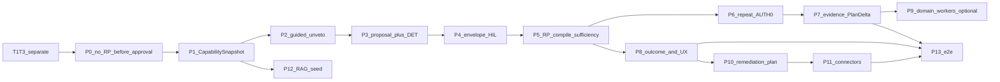
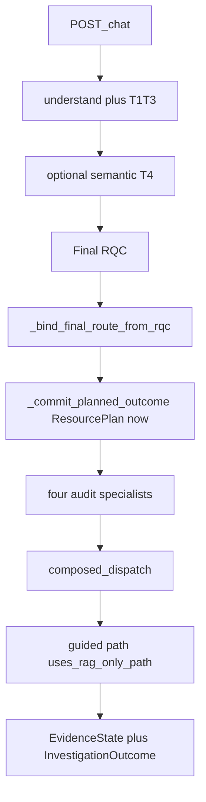

# Agentic investigation — production implementation plan

**Canonical architecture:** [`architecture.md`](../architecture.md) (2026-08-20 investigation target).
**Does not modify:** `architecture.md`, `architecture.plan8-frozen-2026-08-15.md`, the in-flight T1–T3 catalogue/matching patch, or `working.md`.
**Architecture review:** approved by operator mission 2026-08-21 (`AUTO EXECUTE THE APPROVED AGENTIC INVESTIGATION PLAN`). Execution authorized.

## Objective

Production `/chat` implements the approved authority sequence in `architecture.md` for investigation-shaped work, with **behavioral parity after Final RQC** whether meaning came from T1–T3 alone or T1–T3 plus semantic T4. ResourcePlan is compiled only after user approval. `guided_investigation` remains the owner of broad investigations and may compose read capabilities. Writes stay on the remediation path.

## Stop conditions

- Architecture review rejects or revises this plan — **stop; do not implement**.
- All checklist items checked with recorded evidence, **or**
- Same verification gate fails twice on one item, **or**
- Decision needed (tradeoff / ambiguous requirement / COE deferral) — **stop and ask**.

## Equivalent-plan check

No equivalent plan for this exact architecture existed at authoring time:

- [`docs/ai/`](../docs/ai/) contains only [`t4_semantic_prompting_playbook.md`](../docs/ai/t4_semantic_prompting_playbook.md).
- [`working.pre-agentic-architecture-2026-08-20.md`](../working.pre-agentic-architecture-2026-08-20.md) is an archived T4 working note, not an implementation plan.
- Plan 8 [`plans/2026-08-15_0602_canonical-architecture-authority-convergence.md`](2026-08-15_0602_canonical-architecture-authority-convergence.md) targets the frozen Plan 8 architecture, not the 2026-08-20 investigation target.
- MCP AUTH0 [`plans/2026-08-17_1757_mcp-effective-tool-catalog-and-authority.md`](2026-08-17_1757_mcp-effective-tool-catalog-and-authority.md) is a related mechanism (exact-call grants), not this sequence.

This file is the canonical implementation plan. Do not also create `docs/ai/agentic-investigation-production-plan.md` (would be a duplicate).

## T1–T3 workstream boundary

[`plans/2026-08-19_1130_catalogue-matching-coverage-and-margin.md`](2026-08-19_1130_catalogue-matching-coverage-and-margin.md) is a **separate** understanding-layer workstream. Do not incorporate or modify that patch here.

**Identified conflict (do not change T1–T3 files in this workstream):** uncommitted T1–T3 work currently dirties [`backend/app/skills/catalog.json`](../backend/app/skills/catalog.json). Phase P2 must edit the `guided_investigation` row in that file. Land or isolate T1–T3 before P2, or treat the guided row as a merge conflict. Other T1–T3 files (`analyst_response_builder.py`, catalogue matchers, eval sheets) are out of scope.

---

## T1–T4 downstream convergence

T1–T3 and semantic T4 are **understanding mechanisms only**.

They must not create separate quality levels or separate investigation runtimes.

Once a valid `Final ResolvedQueryContract` exists, the downstream production path must converge:

```text
T1–T3 resolves completely
        OR
T1–T3 + semantic T4 resolves remaining meaning
        ↓
FINAL RQC
        ↓
same CapabilitySnapshot
        ↓
same investigation planning rules
        ↓
same user plan approval/edit model
        ↓
same Resource Planner iterative execution
        ↓
same EvidenceState / sufficiency / InvestigationOutcome
        ↓
same remediation flow
```

T1–T3 may deterministically establish useful facts such as:

- known owner
- required evidence category
- known capability requirement
- exact entity/time constraints
- known SPL/search need

These must be preserved as **authoritative inputs** to CapabilitySnapshot and the investigation planner.

They must **not bypass** the common investigation planner/execution architecture.

Known deterministic facts from T1–T3 may reduce reasoning work. They may **not** cause, for investigation-shaped queries:

```text
simpler legacy answer
RAG-only fallback
bypass of investigation plan
bypass of envelope
different evidence sufficiency rules
a second T4-only investigation runtime
```

Example:

```text
T1–T3 confidently determines:
  intent = investigate authentication anomaly
  needs_splunk = true
```

This may reduce LLM planning work (the planner preserves already-known steps and reasons only about unresolved investigation work). It must still enter the same downstream investigation lifecycle: CapabilitySnapshot → InvestigationPlanProposal / DET ValidatedInvestigationPlan → Run/Edit/Cancel → envelope → ResourcePlan → RP hub.

If required tools/capabilities are undefined, unavailable, or insufficiently mapped:

```text
do not fall back to a weaker route-specific answer
```

Instead:

```text
CapabilitySnapshot
→ reasoning about available alternatives / missing capabilities
→ governed plan
→ execute what is available
→ explicitly report remaining evidence gaps / manual path
```

Do not create:

```text
T1–T3 answer engine
vs
T4 agentic answer engine
```

**Target: behavioral parity after Final RQC**, regardless of whether T4 was needed.

Non-investigation catalogue work (for example a pure SOP citation whose Final RQC is `knowledge_recall` with no live-search / multi-step investigation need) may keep the existing one-pass ResourcePlan path. The convergence rule applies to **investigation-shaped** Final RQCs — including those fully resolved by T1–T3.

Acceptance tests for this requirement are listed under P0, P3, and P13, and in §8.

---

## COE host capabilities and extensible MCP onboarding

This plan must not be hard-wired to today's tool set. Adding a server or action tomorrow must not require a new orchestrator, a new planner, or a second `/chat` runtime.

### What exists on this COE host (operator fact, 2026-08-21)

Canonical Splunk status — use this wording everywhere; do not say both “live” and “not live”:

```text
Splunk MCP capability/service exists on the COE host,
but the currently deployed /chat stack is not yet configured to use it live.
Before P6 live acceptance, configure/verify the deployed stack and refresh discovery.
```

At plan-authoring time, `/var/www/ai-soc-assistant/.env` had `MCP_MODE=mock` and an empty `SPLUNK_MCP_BASE_URL`. The Splunk connector is implemented in the repo (`splunk_mcp.py`). That is **not** the same as the deployed `/chat` stack currently using it. Re-check before any P6/P7/P13 live-Splunk step:

```text
grep -E 'MCP_MODE|SPLUNK_MCP_BASE_URL|SPLUNK_MCP_ENABLED' /var/www/ai-soc-assistant/.env
```

Treat `MCP_MODE=mock` or an empty base URL as “deployed stack not live yet.” Configure via the go-live runbook (`docs/coe/COE_GIT_DEPLOY_RUNBOOK.md`, `contracts/splunk_mcp_connection_contract.md`), then refresh discovery. Do not treat Splunk as a fictional/unproven connector, and do not claim the deployed `/chat` stack is already on live Splunk.

- **Allowlisted email transport exists** on this COE (Experience Center SMTP path in [`backend/app/demo/ec_email.py`](../backend/app/demo/ec_email.py)). Remediation/coordination may send email after a production `/chat` adapter (P11). Investigation remains read-only; email is a **write** and belongs on the remediation envelope.
- **Repo-seeded `MCP_GLOBAL_EXECUTION_ENABLED` in [`env/profiles/coe.env.example`](../env/profiles/coe.env.example) is `false`.** Execution and discovery are independent. A configured Splunk endpoint can still have `tools/list` unverified after restart (discovery snapshot is **process-memory only**). CapabilitySnapshot must tell those states apart.

Do not copy Experience Center fixtures, chips, or `simulated_mcp` receipts into production `/chat`. Reuse **contracts and transports**, not demo packs.

### Discovery vs execution (must be checked even when execution is off)

`CapabilitySnapshot` has **exactly two** planning axes. Do not mix capability existence with user-specific or turn-specific execution authority.

```text
capability_need:  required | recommended | optional
availability:     available | unavailable
```

`availability` is deterministic **capability presence/approval for planning**:

```text
registered
+ discovered (last tools/list; DISCOVERY_UNVERIFIED / stale / failed ⇒ unavailable)
+ locally approved / allowlisted
+ valid capability classification (e.g. classify_mcp_tool; globally unsafe/blocked classes are unavailable for planning)
```

Do **not** fold these into `availability`:

```text
RBAC for the current user
policy authorization for this turn
ApprovedInvestigationEnvelope
PhaseContract
HIL
exact-call AUTH0
MCP_GLOBAL_EXECUTION_ENABLED / per-server execution_enabled
```

Those remain later **execution-time gates**. Therefore both of these are valid:

```text
need = required,    availability = available
  → plan may include the tool; this user/turn may still fail RBAC / AUTH0 / HIL / execution-off

need = recommended, availability = unavailable
  → plan shows manual/alternate workflow; do not fake execution
```

No `executable` field on CapabilitySnapshot.

**architecture.md wording (do not edit that file):** `architecture.md` still says a snapshot may include “RBAC-relevant policy posture” and, in one DET bullet, a “role-scoped” view. This plan interprets that as **global capability classification** (unsafe/blocked/write classes are `availability=unavailable` for planning) plus later execution gates. It does **not** encode the current user’s RBAC grant as `availability=unavailable`, and it does **not** produce a different snapshot per analyst role. If architecture review wants per-user RBAC inside the snapshot, that is a decision — it is not this plan’s P1 contract.

`MCP_GLOBAL_EXECUTION_ENABLED=false` does **not** mean "tool does not exist" and does **not** set `availability=unavailable`. The plan still includes a discovered+allowlisted Splunk search tool. The call is blocked later at the execution gate. It must not vanish into a RAG-only answer.

Required checks (P1 + COE ops):

- `POST /api/debug/mcp/discovery/refresh` after backend restart (snapshot is not durable).
- `DISCOVERY_UNVERIFIED` / stale / failed ⇒ `availability=unavailable` (not discovered).
- Allowlisted but missing on server ⇒ unavailable.
- Server-advertised but not allowlisted ⇒ not planner vocabulary (`SERVER_ONLY_NOT_APPROVED` is operator-only).
- Execution-off + discovered + allowlisted Splunk search ⇒ `availability=available`; execution still fails closed until flags/AUTH0/HIL pass.

Existing modules to reuse: [`discovery_snapshot.py`](../backend/app/connectors/mcp/discovery_snapshot.py), [`effective_catalog.py`](../backend/app/connectors/mcp/effective_catalog.py), [`registry.py`](../backend/app/connectors/mcp/registry.py) (`SUPPORTED_MCP_TYPES` today: `splunk`, `generic`, `asset_inventory`, `ticketing`, `knowledge`).

### Adding a tool tomorrow (no orchestration redesign)

Onboarding recipe — same for Agilius, SOAR, firewall, ITSM, Teams, or a new MCP server:

1. Register the server in `MCP_SERVERS` with type (extend `SUPPORTED_MCP_TYPES` only if `generic` is insufficient).
2. Set URL/auth in env; keep secrets out of git.
3. Put approved tool names on `TOOL_ALLOWLIST`.
4. Operator `tools/list` refresh → snapshot ∩ allowlist.
5. CapabilitySnapshot automatically projects new rows (need × availability). Planner/LLM may only name snapshot rows.
6. **Read** tools may enter an approved investigation ResourcePlan (exact-call AUTH0 per material call).
7. **Write** tools never enter investigation PlanDelta; they appear only on a user-approved remediation plan.
8. Classify writes vs reads in local tool policy (`classify_mcp_tool` / action kinds). Discovery does not grant execution. RBAC/AUTH0/HIL/execution flags do not change snapshot `availability`.

Experience Center S4 already names the **kinds** this structure must accept later (do not import `app.demo`):

```text
read  (investigation-eligible when registered + discovered):
  splunk_run_query / saved search
  agilus version/patch catalog query
  cisco_get_version
  ticket_fetch
  knowledge/RAG

write (remediation envelope only, after Approve):
  email_send / email_reply          # LIVE on this COE
  agilus_patch_submit
  firewall_block / firewall_verify
  ticket_create / ticket_update
  cisco_upgrade
  iam_disable / edr_isolate
  soar playbook invoke
```

Until a kind is registered and discovered, snapshot `availability=unavailable` and the plan shows the manual/alternate path. Adding Agilius MCP later is config + allowlist + discovery + (if needed) a small connector class — **not** a new Resource Planner graph.

AUTH0 today is Splunk-shaped ([`splunk_call_authorization.py`](../backend/app/orchestration/splunk_call_authorization.py)). When a second MCP server executes, generalize the **exact-call grant** (server + tool + canonical arguments hash) without a blanket investigation grant.

Production email: extract or share the allowlisted SMTP transport behind a production action adapter. **Do not** `import app.demo.ec_email` from `/chat` or `pipeline.py`. EC remains UX reference.

### Implementation vs COE live acceptance environment

**Environment facts (single physical host, two checkouts):**

```text
host: srv1399719   (single physical host; both checkouts)

/var/www/ai-soc-mcp
  = implementation checkout only
  = no deployed /chat stack running from this checkout
  = do not use it as the live acceptance environment

/var/www/ai-soc-assistant
  = deployed COE runtime
  = live acceptance happens here
```

The actual model / MCP / email services can still be reachable from this same host. The distinction is **not** network reachability. It is that `ai-soc-mcp` has no running application stack, so pytest here is mock/DET, and live `/chat` acceptance is against the deployed stack only.

No second server is required for live investigation testing.

Splunk status for live-acceptance steps: see **What exists on this COE host** above. Do not treat “service exists on host” as “deployed `/chat` is already in live Splunk mode.”

**Stage A — implementation checkout.** All production code changes are authored in
`/var/www/ai-soc-mcp`. Use it for: code changes, unit tests, contract tests, negative/security
tests, static checks, `/invariant-check`, the governance regression suite, git commits. Do not use
this checkout as the live acceptance environment. Do not start a second `/chat` stack here to
prove live T4, Splunk MCP, or SMTP — live acceptance is against `/var/www/ai-soc-assistant`.

**Stage B — deploy the exact tested commit to the COE runtime.** After a phase passes its local
verification gates and is committed here:

```text
tested commit (this worktree)
        → deploy that EXACT commit to /var/www/ai-soc-assistant
```

Do not manually copy selected changed files between checkouts. Do not produce an untraceable
deployed state — the deployed checkout must correspond to a known commit hash. Record as phase
evidence: phase id, commit hash, deployment timestamp, enabled feature flags, service
restart/reload performed (see **Phase evidence template** below).

**Phase execution model** (applies to every phase that requires live acceptance per **Live
acceptance by phase** below; phases whose live-acceptance column says "not required yet" stop
after step 6):

```text
1.  implement Pn in /var/www/ai-soc-mcp
2.  run targeted unit/contract/negative tests (this worktree)
3.  run /invariant-check
4.  run governance/regression gate where the phase requires it
5.  inspect git diff/status (only this phase's files changed)
6.  commit Pn (Commit discipline section)
7.  deploy the EXACT Pn commit to /var/www/ai-soc-assistant (Deployment safety checklist first)
8.  restart/reload only the COE services this phase's flag touches
9.  verify baseline health with the new phase flag OFF
10. run flag-off regression / `/chat` smoke on the deployed stack
11. enable ONLY Pn's new feature flag(s) — never a phase's flags plus a later phase's flags together
12. execute Pn's live phase acceptance test (see Live acceptance by phase)
13. inspect: runtime logs, trace/plan state, EvidenceState where applicable, AUTH0 where
    applicable, connector receipts where applicable
14. PASS → record live evidence (Phase evidence template), continue
15. FAIL → disable the new feature flag, diagnose, roll back the deployment if needed
    (Rollback section), do not continue to the next phase
```

**Flag-first deployment rule.** New phase behavior stays default-`false` in the repository. After
deploying: `new code + flag OFF` must leave the deployed baseline healthy; only then flip the flag
on and run the phase's targeted live acceptance. Never combine a deployment with multiple new
feature flags or multiple phases in one acceptance test — enable phases progressively, one flag at
a time, in dependency order.

**Model / T4 testing.** T4 and reasoning models are already available from services on this same
COE host (`srv1399719`) — the plan must not require a second machine. Before enabling a
reasoning-heavy phase (P3, P7, P10) on the deployed stack, record: model endpoint health, warm
latency, cold latency where measurable, timeout behavior, circuit state. Do not restart a model
service automatically — any serving restart stays a manual/operator action.

**Splunk discovery after deploy/restart.** MCP discovery snapshot is process-memory only. After
every backend restart on the deployed stack: refresh MCP discovery
(`POST /api/debug/mcp/discovery/refresh`) → verify `tools/list` → verify allowlist intersection →
only then run a live MCP acceptance step. A successful deployment does not itself prove discovery
state. Do not report Splunk as unavailable merely because discovery has not yet been refreshed —
represent that state honestly as **discovery unverified until refreshed**, not as "Splunk down."

**Deployment safety.** Before changing `/var/www/ai-soc-assistant`, check: working tree state,
current branch, current commit, uncommitted files, running service status, current relevant
feature flags (`git status`, `git log --oneline -5`, `docker compose ps`, `grep` the relevant flag
keys in `.env`). Do not overwrite unrelated live work. If the deployed checkout contains
uncommitted or unexpected modifications: **STOP, report, do not force `checkout`/`reset`** unless
the user explicitly approves discarding them (per `AGENTS.md` git-safety rules — this plan does not
grant standing authorization to run `git reset --hard` or `git checkout --` on that checkout).
After deployment, verify: the exact expected commit is deployed, service health, `/chat` baseline,
no unrelated services failed.

**Rollback.** Prefer feature-flag OFF for runtime-behavior rollback. If code rollback is required,
deploy the last known-good commit to `/var/www/ai-soc-assistant` — do not make manual reverse edits
directly in the deployed checkout. Record rollback evidence (what was rolled back, to which
commit/flag state, why). Exception: P2's `skills/catalog.json` guided-row correction is a
**permanent** change, not flag-reversible — its rollback is `git revert` of that commit, deployed
the same way as any other commit (see Commit discipline).

**Phase evidence template.** Each executed phase must eventually record both blocks in its
checklist item's **Evidence** line (or a linked note if too long to inline):

```text
LOCAL VERIFICATION
- commit hash
- targeted tests run + result
- /invariant-check result
- regression result where required

COE LIVE VERIFICATION   (only for phases marked "required" in Live acceptance by phase)
- deployed path: /var/www/ai-soc-assistant
- deployed commit hash
- feature flags enabled
- service health after restart
- live acceptance result
- relevant trace / AUTH0 / EvidenceState / action-receipt reference
```

A phase requiring live acceptance is **not** complete merely because its local unit tests passed —
the checklist item stays unchecked until the COE LIVE VERIFICATION block is filled or the item
explicitly records why live acceptance was deferred (with the user's sign-off).

Fail-closed is mandatory on both the worktree and the deployed stack:

```text
LLM missing or timeout  → deterministic InvestigationPlan baseline; no invented tools
T4 missing              → Final RQC from T1–T3 only; same downstream lifecycle
Splunk undiscovered     → snapshot unavailable / manual path; not RAG-only downgrade
execution flag off      → snapshot may still be available; MCP call does not run
RBAC deny               → snapshot may still be available; this turn does not execute
```

Do not iterate prompts against the live model from this implementation checkout (same rule as the T4 playbook). Do not skip mock gates here because the deployed stack has a model — this checkout's Verify command is never satisfied by a live COE result, and a live COE result never substitutes for this checkout's own Verify command.

---

## Live acceptance by phase

Which tests must run **only** in `/var/www/ai-soc-mcp` (this worktree) versus which additionally
require a COE deploy (`/var/www/ai-soc-assistant`), per the Phase execution model above.

**P0–P3.** Primary proof: worktree tests (mocked LLM) + deployed `/chat` baseline and targeted
behavior smoke. Live MCP execution is **not required yet** — these phases do not reach an approved
envelope.

**P4.** Must additionally test against the deployed `/chat`: `ValidatedInvestigationPlan → Run /
Edit / Cancel → ApprovedInvestigationEnvelope`. Verify Cancel and Edit do not execute any tool.

**P5.** Must additionally prove on the deployed stack: `approved envelope → compiler → ResourcePlan
+ PhaseContract → RP hub`. Evidence may stop after one bounded hop if P7 is not yet landed (P5 has
no PlanDelta by design — see P5's `Do`).

**P6.** Must include real COE Splunk MCP proof **after** the deployed stack is configured and
discovery refreshed (canonical Splunk status above). Not a recorded fixture unless configuration
is still mock — if so, say so in Evidence. Required path:

```text
/chat → approved envelope → ResourcePlan → candidate SPL → deterministic validation
      → normalized_spl → AUTH0 → live Splunk MCP → governed evidence
```

A changed query must require another AUTH0 grant.

**P7.** Must prove adaptive investigation against real COE Splunk where practical — no mock-only
acceptance if real Splunk MCP is healthy (mocks remain valid for deterministic edge/negative
tests):

```text
initial evidence → evidence gap → reasoning PlanDeltaProposal → DET validation
      → second bounded Splunk query → NEW AUTH0 → live Splunk MCP → updated evidence
```

**P8.** Must test final user-facing `InvestigationOutcome` from real governed evidence where
practical. Verify `investigation_status != security disposition` and that narration never upgrades
the evidence-bound outcome.

**P10.** May be tested without side effects until P11. Required deployed flow:
`InvestigationOutcome → remediation proposal → Approve/Edit/Cancel`. No connector execution yet.

**P11.** Use real COE connectors that genuinely exist — currently: email. Live email test must: use
an allowlisted test recipient, occur only after an approved remediation plan, record a governed
action receipt, and verify no investigation PlanDelta can send email. Do not claim
Agilius/SOAR/firewall tests until those connectors are actually onboarded.

**P13.** End-to-end COE acceptance must use the deployed runtime. At minimum include: health,
T1/T4 convergence, Run/Edit/Cancel, RP iterative investigation, real Splunk MCP, repeated AUTH0,
EvidenceState, InvestigationOutcome, Experience Center behavioral-parity checks, follow-up
continuity, remediation approval, live email where permitted, flag-off regression.

---

## Dependency order

`P0 → P1 → P2 → P3 → P4 → P5 → P6 → P7 → P8 → (P9 optional) → P10 → P11 → P13`

`P12` (RAG seeding) may run after P1 in parallel with later phases. P8 **Depends on P5** (not P7); it may be implemented in parallel with P6/P7. P13 still requires P7 for adaptive-gap / Experience Center behavioral parity.

T1–T3 catalogue patch is an external predecessor of P2 (catalog.json), not an item in this plan.

**P5 / P7 handoff (hard):** P5 provides the controlled execution/sufficiency loop seam (compile, execute, observe, EvidenceState, deterministic sufficiency; **stop honestly** on gap). P7 adds adaptive reasoning and PlanDelta **into that same seam**. Do not implement a temporary PlanDelta in P5. Do not create a second investigation loop.



---

# 1. Current production audit

Live path: `POST /chat` → Resource Planner graph when `LANGGRAPH_ORCHESTRATION_ENABLED=true`.



**Target vs today:** T1–T3 → optional T4 → Final RQC → final route bind **before** ResourcePlan **exists**. ResourcePlan is still compiled **before** investigation approval. Catalogue-T4 `guided_investigation` is RAG / recommend-only because several vetoes fire together. There is no CapabilitySnapshot, no investigation envelope, no PlanDelta on the RP graph, and no remediation offer. T1–T3 investigation-shaped rows and T4-rescued rows do **not** share an investigation lifecycle today — that is the convergence gap.

### Role classification

Class values: `EXISTS` | `PARTIAL` | `MISSING` | `MISPLACED`.

- **Final RQC ordering — EXISTS.** [`canonical_planning_orchestrator.py`](../backend/app/chat/canonical_planning_orchestrator.py) runs `maybe_enrich_t4_semantic` then clarification/policy then `_bind_final_route_from_rqc` then `plan_evidence_from_canonical`. Clarification still terminates before plan. Pinned by [`test_final_route_precedes_resource_plan.py`](../backend/app/tests/test_final_route_precedes_resource_plan.py).

- **guided_investigation catalog veto — EXISTS (wrong vs target).** [`backend/app/skills/catalog.json`](../backend/app/skills/catalog.json): `allowed_tools: ["governed_rag"]`, `blocked_tools: ["mcp_execution", "remediation", "admin", "write"]`.

- **EvidencePlan SPL/MCP veto — EXISTS (wrong vs target).** [`evidence_planner.py`](../backend/app/chat/evidence_planner.py) family `guided_investigation`: `needs_spl=False`, `needs_mcp=False`, `spl_allowed=False`, `mcp_allowed=False`, `action_mode="recommend_only"`. Hybrid flag adds review-only SPL *posture flags*, not `needs_spl` / `needs_mcp`.

- **ResourcePlan composition — PARTIAL.** Composer exists. Plan 8 C0: catalog `blocked_tools` does **not** currently strip MCP in composer. Live RP guided path: `composed_dispatch` then [`executor.py`](../backend/app/planner/executor.py) `uses_rag_only_path` when `path_type == "guided_investigation"` or `answer_mode` in `{rag_only, guided_investigation}`.

- **InvestigationPlan + validator — PARTIAL.** [`investigation_plan.py`](../backend/app/chat/contracts/investigation_plan.py) + `validate_investigation_plan` in [`guided_investigation_planner.py`](../backend/app/chat/guided_investigation_planner.py). Live guided hybrid uses **deterministic baseline only**. [`propose_investigation_plan_llm`](../backend/app/chat/guided_investigation_plan_llm.py) has **no production caller** (retired from RP dispatch). Schema lacks envelope-era dependencies / conditions / success criteria.

- **CapabilitySnapshot — MISSING.** No need × availability projection.

- **MCP tools/list discovery — PARTIAL.** Process-memory snapshot ∩ allowlist exists ([`effective_catalog.py`](../backend/app/connectors/mcp/effective_catalog.py)). Postgres schema `0007` exists; durable store is **not** implemented. After every backend restart, `mcp_discovery_verified` starts false until `POST /api/debug/mcp/discovery/refresh`. Splunk MCP **service exists on the COE host**; the deployed `/chat` stack is not yet configured to use it live. Discovery must still be refreshed independently of execution flags. Broader multi-server catalog activation (plan `2026-08-17_1757`) is not fully wired into live `pipeline.py` selection.

- **Resource Planner graph / composed_dispatch — EXISTS.** Sole normal hub; currently one-pass.

- **Imperative guided hybrid loop — MISPLACED.** [`pipeline.py::_run_guided_hybrid_dispatch`](../backend/app/chat/pipeline.py) (~5984) + [`evaluate_guided_refinement`](../backend/app/chat/guided_hybrid_refinement.py) (`MAX_GUIDED_INVESTIGATION_ROUNDS=3`). Live RP `composed_dispatch` does **not** run this loop. Hybrid `tool_plan` includes `"no_mcp"`.

- **evidence_loop — PARTIAL.** `MAX_MCP_HOPS` still bounds recipes; inert on live RP composed_dispatch ([`test_retired_resource_planning_surfaces.py`](../backend/app/tests/test_retired_resource_planning_surfaces.py)).

- **guided refinement — PARTIAL / MISPLACED.** Primitive exists; lives on the imperative hybrid path, not the RP hub.

- **EvidenceState — PARTIAL.** [`minimal_evidence_state.py`](../backend/app/evidence/minimal_evidence_state.py) is a finalize projection, not an iterative loop accumulator.

- **InvestigationOutcome — PARTIAL.** [`investigation_outcome.py`](../backend/app/chat/contracts/investigation_outcome.py) `disposition` includes `blocked`, mixing investigation status with security class.

- **AUTH0 — PARTIAL.** Splunk exact-call + `canonical_arguments_hash` exists and is the model to generalize. Guided `/chat` rarely reaches it today because executor forces rag-only. COE Splunk live does not waive per-call grants.

- **HIL / handoff — PARTIAL.** Clarification handoff; SPL `execution_review_action`; action-lane approve/deny. No investigation Run/Edit/Cancel envelope.

- **Action lane — PARTIAL.** `/api/actions/{id}/approve|deny`. `create_ticket` is in [`BLOCKED_EXECUTION_ACTIONS`](../backend/app/actions/capability_policy.py). Mock ITSM only.

- **LLM role registry — PARTIAL.** Instruct vs reasoning families exist in [`registry_settings.py`](../backend/app/llm/registry_settings.py). `guided_investigation_plan_proposer` is **instruct** and retired from live path. Governance rejects reasoning for routing/narration ([`sidecar_governance.py`](../backend/app/llm/sidecar_governance.py)). No live `investigation_planner` / `plan_delta_reasoner` / `remediation_planner` roles.

- **RAG repository / import — EXISTS.** [`KnowledgeRepository`](../backend/app/knowledge/repository.py) draft/publish. Do not build a new ingest pipeline.

- **Retired `llm_plan_bridge` — EXISTS as retired.** Tests and shadow modules only. Do **not** revive as another planning authority.

- **Email — PARTIAL (live on COE, not on production `/chat`).** Allowlisted SMTP is live via EC [`ec_email.py`](../backend/app/demo/ec_email.py). `/api/actions` and `/chat` do not send email. Plan: production remediation adapter sharing transport/allowlist; never import demo into pipeline.

- **Additional MCP (Agilius / SOAR / firewall) — MISSING in production; envisaged in EC.** Registry types do not yet include `agilius`/`soar`. EC S4 simulates Agilus patch catalog + submit (`agilus_submit_patch`). Onboard later via the recipe above; do not copy `app/demo/ec_soar` or S4 fixtures into `/chat`.

- **Four advisory specialists — EXISTS (keep as auditors).** Must not become executors or MCP callers.

---

# 2. Architecture-to-code gap matrix

| Architecture role | Class | What production does | What this plan must change |
|---|---|---|---|
| T1–T3 / T4 understanding | EXISTS | T4 is meaning-only merge into RQC | Keep. Pin T4 ≠ investigation planner |
| Downstream after Final RQC | MISPLACED | Skill/family still selects a weaker one-pass answer (guided = RAG-only) | One investigation lifecycle after Final RQC (convergence) |
| Final owner | EXISTS | `_bind_final_route_from_rqc` before plan commit | Keep |
| CapabilitySnapshot | MISSING | No projection | P1 |
| InvestigationPlanProposal | MISSING on live path | Instruct proposer retired; deterministic baseline only on hybrid | P3 reasoning role |
| ValidatedInvestigationPlan | PARTIAL | Validator exists; not shown for Run/Edit/Cancel | P3–P4 |
| ApprovedInvestigationEnvelope | MISSING | ResourcePlan committed immediately | P0 stop-commit; P4 envelope |
| ResourcePlan after approval | MISPLACED | `_commit_planned_outcome` compiles now | P4 then P5 compiler |
| RP execute/observe/sufficiency seam | MISPLACED | One-pass `composed_dispatch`; hybrid loop is imperative | P5 into RP hub (plumbing only; honest stop on gap). P7 PlanDelta into **that same seam** |
| PlanDelta | MISSING | Cap-bounded hybrid refinement is not envelope-scoped PlanDelta | P7 |
| guided unveto | EXISTS as veto | Catalog (permanent JSON) + EvidencePlan + executor + `no_mcp` (runtime flag) | P2: catalog git-revert; runtime flag |
| EvidenceState loop | PARTIAL | Finalize view only | P5–P7 reuse as accumulator |
| InvestigationOutcome split | PARTIAL | `blocked` is a disposition | P8 |
| AUTH0 per material call | PARTIAL | Splunk-shaped; guided rarely hits it | P6 keep Splunk grants; generalize hash when Agilius/etc. execute |
| Remediation flow | MISSING on `/chat` | Action lane mock ticket; email live only in EC | P10–P11: email first live write; others as onboarded |
| Extra MCP servers | MISSING | `SUPPORTED_MCP_TYPES` has no agilius/soar | P1 snapshot + P11 onboarding recipe; no new graph |
| Domain workers | MISSING | Four specialists are auditors | P9 only if measured need |
| RAG SOP seed | EXISTS mechanism | Content not seeded | P12 import only |

**Guided veto cluster (P2 — two different rollback models):**

**Permanent architecture correction** (`git revert`, not a feature flag):

1. `skills/catalog.json` `guided_investigation` row must stop treating ownership as an MCP/SPL **read** veto (`blocked_tools` must not include `mcp_execution` as a stand-in for "guided means RAG-only"). Writes (`remediation`, `admin`, `write`) stay blocked. Composer Plan 8 C0 already does not veto SPL/MCP from this list.

**Runtime rollout** (flag `AI_SOC_GUIDED_COMPOSABLE_PLANNING_ENABLED`):

2. `evidence_planner.py` forces `needs_spl/mcp=false` and `spl/mcp_allowed=false`.
3. [`plan_evidence_from_canonical.py`](../backend/app/chat/plan_evidence_from_canonical.py) RQC overlay can flip `needs_spl`/`needs_mcp` true after that — then executor still rag-onlys guided (`uses_rag_only_path`). Change EvidencePlan **and** executor together under the flag.
4. `executor.py` `uses_rag_only_path` for `path_type == "guided_investigation"` (live RP schedule veto). Guided on the RP graph usually hits `composed_dispatch`, then this rag-only schedule.
5. `pipeline.py` guided hybrid `tool_plan` includes `"no_mcp"` (imperative rail; hybrid is **not** on the live RP graph).

Do not add a catalog overlay/registry solely so a flag can restore the old JSON. Flag-off restores old **runtime scheduling**; the catalog row stays architecture-correct.

Runtime sites 2–5 must change together under the flag. The catalog row is independent of that flag.

**Do not revive:** `llm_plan_bridge.py`, `plan_promotion_merge.py`, `resource_plan_shadow.py` as live planning authority.

---

# 3. Target authority sequence

Implement this sequence exactly for investigation-shaped Final RQCs:

```text
T1–T3
→ optional semantic T4   # instruct; meaning-only; NOT the investigation planner
→ FINAL RQC
→ final owner
→ CapabilitySnapshot     # need × availability; NOT execution authorization
→ reasoning LLM InvestigationPlanProposal   # advisory; may skip known T1–T3 steps
→ DET validation
→ ValidatedInvestigationPlan
→ user Run / Edit / Cancel
→ ApprovedInvestigationEnvelope   # architecture.md §13.1; immutable version
→ DET compiler
→ ResourcePlan + PhaseContract
→ RP execution hub
```

Do **not** place ResourcePlan before user approval for an investigation.
Do **not** turn semantic T4 into the investigation planner.
Do **not** route broad investigations to `spl_generation` to dodge guided vetoes.
Do **not** send a T1–T3-complete investigation down a weaker one-pass skill answer.

CapabilitySnapshot axes (independent):

```text
capability_need: required | recommended | optional
availability:    available | unavailable
```

`firewall_block` with `need=recommended` and `availability=unavailable` is valid.

`availability` is planning-time presence (registered + discovered + allowlisted + valid classification). It is **not** the current user's RBAC, this turn's AUTH0/HIL, the envelope, PhaseContract, or execution enablement. A row may be `need=required` and `availability=available` and still fail execution authorization for this user/turn.

Do not add an `executable` field.

Actual execution still requires: policy, RBAC, approved envelope, PhaseContract, exact-call authorization, HIL where applicable, execution flags.

---

## Production investigation UX (ChatPanel, not EC)

Backend contracts alone are not enough. Production `/chat` must reach the **same behavioral experience** as the Experience Center **without** copying EC fixtures, chips, or `app.demo` contracts. Use existing ChatPanel / HIL surfaces. Do not create a second frontend or orchestration framework.

Phased ownership: **P4** ships the pre-execution plan + Run/Edit/Cancel. **P5** emits controlled operational progress (no chain-of-thought). **P8** renders InvestigationOutcome, empty-finding copy, and the remediation offer. **P13** gates Experience Center **behavioral** parity.

### Before execution (P4)

Human-readable investigation plan:

```text
what will be checked
why it matters
scope / time range
important resources where useful
```

with:

```text
[Run investigation]
[Edit plan]
[Cancel]
```

### During execution (P5 emit, P8 render)

Meaningful progress, for example:

```text
Checking 30-day activity...
✓ 10.20.1.10 observed
✓ 3 allowed sessions found
→ correlating authentication activity
```

Do **not** expose chain-of-thought or private model reasoning. Progress may show:

```text
step purpose
status
source/tool category
evidence summary
failure/retry state
```

A completed step must not render `Finding: -`. If completed with no matching evidence:

```text
No matching authentication events found
```

(or equivalent evidence-bound wording).

### Investigation conclusion (P8)

Render from `InvestigationOutcome`:

```text
investigation status
security disposition
key supported findings
unconfirmed hypotheses
important missing evidence
limitations
recommended next action
```

Distinguish **supported by evidence** vs **not confirmed**. Narration must not upgrade an inconclusive outcome.

### Remediation transition (P8 offer, P10 flow)

After conclusion:

```text
Create remediation plan?
[Yes]
[Not now]
```

unless remediation was already explicitly or conditionally requested in the Final RQC. Then P10 Approve/Edit/Cancel.

### Follow-up / continuity (P13 tests; reuse P0 session + P4 envelope rules)

Same runtime. No second investigation engine.

Same-scope follow-up (`What about service accounts?` that is still in approved entity class; `Check those allowed sessions more deeply.`) may reuse Final RQC context, approved entities, evidence refs, InvestigationOutcome — subject to applicability/freshness.

Changed scope (`30 days → 60 days`, admin → service accounts, extra hosts, new index/source) requires new Final RQC / revised plan, evidence applicability check, and a **new approval envelope** where required. Do not silently expand an old envelope.

Explanation follow-up (`Why did you call this suspicious?`) answers from InvestigationOutcome + governed evidence references — not hidden reasoning or previous free-form prose.

---

# 4. Phased implementation

All new **runtime** flags default **false**. Flag-off must preserve current production **scheduling/execution** semantics for that seam. The P2 `skills/catalog.json` guided-row correction is **not** a flag; flag-off does not restore old catalog JSON. Do not reuse `ai_soc_t4_semantic_understanding_enabled` for planner/envelope/loop work. Extra reasoning hops inherit F3 serving risk: sequential, timeout, circuit-break, human-only restart.

After every phase, remain disabled: production GO, EC fixtures on `/chat`, `llm_plan_bridge` as authority, a capability DB/service, writes inside investigation PlanDelta, agent→MCP, peer agent mesh. Do not turn off the host Splunk MCP **service** or email transport as a side effect of landing investigation flags. Do not claim the deployed `/chat` stack is already in live Splunk mode.

---

## P0 — Final RQC / owner / planning authority-order correction

**Objective.** Investigation-shaped turns must not compile ResourcePlan before user approval. T1–T3-complete and T4-rescued investigation RQCs enter the **same** downstream stub (later filled by P3–P5). T4 cannot become the investigation planner.

**Why now.** Route-before-plan already exists (`_bind_final_route_from_rqc`). The remaining authority bug is ResourcePlan-before-approval. If P3–P5 land first, they fight `_commit_planned_outcome`. Convergence must be pinned before unveto/planner work or T1–T3 and T4 will keep forking.

**Reuse.** `ResolvedQueryContract`, `_bind_final_route_from_rqc`, clarification handoff, existing one-pass ResourcePlan for **non-investigation** catalogue skills.

**Files.** [`canonical_planning_orchestrator.py`](../backend/app/chat/canonical_planning_orchestrator.py), [`plan_evidence_from_canonical.py`](../backend/app/chat/plan_evidence_from_canonical.py), pins around [`test_final_route_precedes_resource_plan.py`](../backend/app/tests/test_final_route_precedes_resource_plan.py), [`test_final_rqc_precedes_planning.py`](../backend/app/tests/test_final_rqc_precedes_planning.py), new investigation-no-RP and T4-not-planner tests.

**Contracts.** Final RQC unchanged. Investigation-shaped outcome becomes a wait-for-plan / no-resource-plan state rather than `planned_outcome` with `resource_plan`.

**Feature flags.** `AI_SOC_INVESTIGATION_PLAN_BEFORE_RESOURCE_PLAN_ENABLED` (name TBD), default false. Flag-off = today's immediate ResourcePlan commit.

**Tests.** Investigation-shaped RQC has no `resource_plan` until envelope (flag on). Non-investigation `knowledge_recall` still commits ResourcePlan. T4 output cannot contain tool grants, MCP calls, or InvestigationPlanProposal. T1–T3 `needs_splunk=true` investigation does not skip the wait-for-plan path.

**Negative / security.** T4 cannot select tools or grant capabilities. LLM cannot compile ResourcePlan. EC fixtures cannot enter this branch.

**Acceptance.** Flag on: investigation-shaped `/chat` stops after Final RQC + owner with no ResourcePlan and no MCP. Flag off: byte-identical to current commit behavior for that seam.

**Dependencies.** None in this plan. Does not require T1–T3 patch.

**Rollback.** Flag off.

**Must remain disabled.** Planner LLM, envelope HIL, guided unveto, iteration, T4 expansion, remediation writes. Do **not** disable the host Splunk MCP **service** as a side effect of this phase; investigation still must not call MCP until P4–P6, and the deployed `/chat` stack still needs live Splunk configuration before P6 acceptance.

---

## P1 — CapabilitySnapshot projection

**Objective.** Deterministic read-only join of existing registries/discovery into need × availability rows. Planning vocabulary only. Not execution authorization. Not a capability DB. No `executable` field.

**Why now.** Planner (P3) and missing-tool behavior (convergence) need a single vocabulary. Must exist before unveto so "required but unavailable" is representable without a weaker route.

**Reuse.** Skill catalog, resource registry, MCP discovery snapshot ∩ allowlist ([`effective_catalog.py`](../backend/app/connectors/mcp/effective_catalog.py)), capability **classification** (globally unsafe/blocked tool classes), Splunk registry/discovery views (availability is presence, not “deployed stack is live”), email as a registered action kind (not a demo import). Do **not** join current-user RBAC into the snapshot.

**Files.** New module e.g. `backend/app/chat/capability_snapshot.py`; thin wiring from canonical planning after Final RQC; unit tests. Snapshot construction must read discovery views even when `MCP_GLOBAL_EXECUTION_ENABLED=false` (execution-off must not hide a discovered tool).

**Contracts.** Only `capability_need` and `availability`. `availability=available` means registered + discovered + allowlisted + valid classification. Undiscovered, not-allowlisted, or invalid class ⇒ unavailable. Execution-off, RBAC deny, missing envelope, missing AUTH0 are **not** availability. Adding a new MCP server later appears as new rows without schema redesign.

**Feature flags.** `AI_SOC_CAPABILITY_SNAPSHOT_ENABLED`, default false. Flag-off = no snapshot on state (today).

**Tests.** `firewall_block` recommended + unavailable is valid. Required + available does not authorize MCP. Same snapshot for two RBAC roles (availability unchanged; execution tests live elsewhere). T1–T3-known `needs_splunk` projects as required Splunk-search need without granting a call. Discovery-unverified Splunk ⇒ unavailable. Execution-off + verified `tools/list` + allowlist ⇒ **available**. Injected fake Agilius server appears as a snapshot row without planner code changes. Email_send availability follows production adapter **registration/discovery**, not EC fixture presence and not the current user's RBAC.

**Negative / security.** LLM cannot add snapshot rows. Snapshot cannot authorize MCP. RBAC is not encoded as capability absence. `SERVER_ONLY_NOT_APPROVED` is not planner vocabulary.

**Acceptance.** Frozen Final RQC + frozen registries ⇒ deterministic snapshot, identical whether T4 ran. Discovery refresh can change availability. Execution-flag flip does **not** change availability.

**Dependencies.** P0 (same post-RQC attachment point).

**Rollback.** Flag off.

**Must remain disabled.** Using snapshot as AUTH0/RBAC; planner LLM; execution.

---

## P2 — Guided investigation capability unveto + composable planning

**Objective.** `primary_skill = guided_investigation` remains owner. After P5, a ResourcePlan may compose RAG, SPL, Splunk MCP, other **read** MCP, LLM reasoning, repeated capability calls. Writes stay blocked. Do **not** route broad investigations to `spl_generation`.

Split two kinds of change:

1. **Permanent architecture correction** in `skills/catalog.json` (guided row): ownership is not an MCP/SPL read veto. Rollback = `git revert` / phase revert. No runtime flag rewrites the file. No second catalog overlay.
2. **Runtime behavioral activation** for EvidencePlan / executor / dispatch under `AI_SOC_GUIDED_COMPOSABLE_PLANNING_ENABLED`. Flag-off may keep today's rag-only **scheduling** while the catalog row is already correct.

**Why now.** Snapshot exists so unavailable reads become explicit rows instead of a RAG-only downgrade. Runtime unveto without snapshot would skip tools silently.

**Reuse.** Composer, PhaseRegistry/Policy, EvidencePlan enrichment helpers.

**Files.**
- Permanent: `backend/app/skills/catalog.json` guided row only (**T1–T3 conflict**).
- Flag-gated: `evidence_planner.py`, `executor.py` `uses_rag_only_path`, guided hybrid `tool_plan` in `pipeline.py`, tests that assume RAG-only guided. Composer only if a remaining `_skill_permits` path still strips MCP after EvidencePlan booleans are true.

**Contracts.** Catalog: guided may allow read MCP/SPL tools; writes remain blocked. Runtime flag on: EvidencePlan `needs_spl`/`needs_mcp`/`spl_allowed`/`mcp_allowed` may be true for investigation; executor `uses_rag_only_path` must not key off owner==guided. Flag off: old EvidencePlan/executor scheduling.

**Feature flags.** `AI_SOC_GUIDED_COMPOSABLE_PLANNING_ENABLED`, default false — **runtime only**. Does not restore old `catalog.json`.

**Tests.** After catalog correction (even flag off): catalog no longer lists `mcp_execution` as a guided read veto. Flag on: guided owner + required Splunk row does not force `uses_rag_only_path`. Writes remain blocked. Do not assert route == `spl_generation`. Flag off: EvidencePlan/executor still rag-only schedule; catalog row stays corrected.

**Negative / security.** Guided ownership does not itself veto required read capabilities (catalog). Flag off does not magically restore old JSON. Writes cannot enter investigation composition.

**Acceptance.** Catalog correction lands as architecture-correct JSON. Flag on + P0: investigation still does not execute (no envelope) but composed **plan inputs** allow SPL/MCP reads. Missing Splunk appears as unavailable/manual, not a knowledge_recall dump.

**Dependencies.** P1. External: T1–T3 catalog.json isolation/land.

**Rollback.** Catalog: git revert. Runtime: flag off (old scheduling only).

**Must remain disabled.** Envelope, compiler, T4-as-planner. Investigation MCP calls still wait for P4–P6 even though a Splunk MCP **service exists on the host**. The deployed `/chat` stack is not yet configured to use it live.

---

## P3 — InvestigationPlanProposal reasoning role + DET validation

**Objective.** Reasoning-family role emits advisory `InvestigationPlanProposal`. DET validation produces `ValidatedInvestigationPlan` **before** user approval. No ResourcePlan.

**Why now.** User cannot approve a plan that does not exist. Must precede P4. Must consume CapabilitySnapshot and T1–T3-authoritative facts.

**Reuse.** Extend [`InvestigationPlan`](../backend/app/chat/contracts/investigation_plan.py) + `validate_investigation_plan`. LLM role registry. Do **not** revive `llm_plan_bridge` as authority. Do **not** remap T4 (`maybe_enrich_t4_semantic`) into this role.

**Files.** `registry_settings.py` (new `investigation_planner` on reasoning family; do not silently reuse instruct `guided_investigation_plan_proposer`), `guided_investigation_plan_llm.py` or successor, `guided_investigation_planner.py`, orchestrator wait-state, adapter schema, latency/circuit helpers, tests.

**Contracts.** Proposal fields: objective, evidence needs, dependencies, conditions, hypotheses where appropriate, success criteria. Validator binds needs to snapshot rows (both axes). Recommended+unavailable stays as manual/alternate step. T1–T3-known steps are preserved; LLM reasons only about unresolved work.

**Feature flags.** `AI_SOC_INVESTIGATION_PLANNER_ENABLED`, default false. Separate from T4 flags. Timeout/circuit independent of the 2.0s T4 cap.

**Tests.** Proposal is advisory (`llm_proposal_accepted` cannot execute). DET reject → deterministic baseline, not T4 retry. T1–T3-complete vs T4-rescued **same Final RQC** → equivalent ValidatedInvestigationPlan (objective, evidence needs, capability rows) given the same snapshot. Planner failure degrades; does not invent tools.

**Negative / security.** T4 cannot become investigation planner. LLM cannot grant capabilities or invoke MCP. Reasoning hop timeout/fail-closed.

**Acceptance.** Flag on: investigation-shaped `/chat` returns ValidatedInvestigationPlan, no ResourcePlan, no MCP. Worktree proof is mocked LLM + DET. Live latency probe is **COE-only**, after mock gates; not a P3 worktree requirement.

**Dependencies.** P0, P1, P2.

**Rollback.** Flag off → wait-state without LLM proposal (P0).

**Must remain disabled.** Envelope compile, iteration, domain workers, remediation planner.

---

## P4 — Run / Edit / Cancel + ApprovedInvestigationEnvelope

**Objective.** Production support for `[Run investigation] [Edit plan] [Cancel]` using the **single** canonical envelope contract in `architecture.md` §13.1.

**Why now.** Authoritative ResourcePlan must not exist before this approval. P5 cannot compile without an envelope version.

**Reuse.** Canonical handoff persistence, `execution_review_action` patterns. Production ChatPanel — **not** EC chips or `app.demo` contracts.

**Files.** HIL/handoff store, chat API resume actions, frontend ChatPanel (not EC), envelope Pydantic model, tests.

**Contracts.** Envelope fields from §13.1. Analyst-visible plan text: what will be checked, why it matters, scope/time, important resources. Buttons: Run / Edit / Cancel. Edit → DET revalidation. Meaning/entity/time/objective change that stale-ates Final RQC → re-enter clarification; do not compile against the previous RQC. Cancel → no compile, no execute. Follow-up scope expansion (P13) must mint a **new** envelope, not mutate this one.

**Feature flags.** No new P4 flag (user override 2026-08-21). The envelope HIL is reachable only
from the existing `AI_SOC_INVESTIGATION_PLAN_BEFORE_RESOURCE_PLAN_ENABLED` wait-state. Infrastructure
readiness remains registry/config state, not a rollout flag.

**Tests.** User-rejected plan does not execute. Edited plan requires revalidation. T1–T3 and T4 paths present the **same** approval model. Clarification still happens before planning. Plan card is human-readable (not raw JSON-only). No EC fixture payload on this API.

**Negative / security.** Cancelled envelope cannot be compiled. Writes not listable as allowed investigation capabilities. Frontend does not import EC demo contracts.

**Acceptance.** Analyst can Run/Edit/Cancel on a readable plan; only Run mints an immutable envelope version. No ResourcePlan on Edit/Cancel.

**Dependencies.** P3.

**Rollback.** Turn off the existing P0 wait-state flag to restore the pre-plan-before-RP behavior,
or deploy the prior exact commit for P4-only rollback. No additional P4 flag exists.

**Must remain disabled.** Compiler/loop (P5), PlanDelta auto-apply, remediation writes.

---

## P5 — Compiler + RP execution/sufficiency seam

**Objective.** DET compiler: `ApprovedInvestigationEnvelope` → ResourcePlan + PhaseContract. Controlled loop in the Resource Planner graph only: execute → observe → update EvidenceState → deterministic evidence sufficiency. If sufficient, continue toward InvestigationOutcome (P8). If insufficient before P7 exists, STOP honestly with missing evidence. P5 may include scheduling plumbing (dependencies, repeated-step support, timeouts, failure return to hub, budgets). P5 must NOT introduce semantic PlanDelta, gap reasoning, hypothesis adaptation, no-progress fingerprint, or write→remediation recommendations — that is P7 into this same seam.

**Why now.** First moment ResourcePlan is allowed for investigations. Lift execution/observe/sufficiency only; do not pre-build PlanDelta.

**Reuse.** ResourcePlan, PhaseRegistry/Policy/Contract, `composed_dispatch`, hop-budget/timeout ideas from `evidence_loop` / `MAX_MCP_HOPS`. Do not lift `evaluate_guided_refinement` as a PlanDelta stand-in. Do not duplicate a second graph.

**Files.** Compiler module; [`executor.py`](../backend/app/planner/executor.py) schedule; RP graph execute/observe/sufficiency nodes; operational progress events (step purpose/status/source/evidence summary/failure — no chain-of-thought). Retire live `_run_guided_hybrid_dispatch` (rollback-only if required).

**Contracts.** ResourcePlan is the executable schema. One seam. Gap without P7 = incomplete + missing_evidence, not a silent RAG dump and not an implicit extra search. Progress payload is operational state only.

**Feature flags.** `AI_SOC_RP_INVESTIGATION_LOOP_ENABLED`, default false.

**Tests.** Envelope `envelope_version` required (architecture.md §13.1). No live caller of guided hybrid as a second executor when flag on. Failure returns to RP hub (scenario D). T1–T3 and T4 envelopes compile through the same compiler. Gap path emits missing-evidence list and **does not import PlanDelta types**. Progress events contain no chain-of-thought. Completed empty-result steps emit evidence-bound copy, never `Finding: -`.

**Negative / security.** No ResourcePlan without envelope. Candidate SPL cannot execute. Specialists remain auditors. No PlanDelta types in P5. Availability on the snapshot is not re-checked as AUTH0.

**Acceptance.** One investigation hop can run under the hub (AUTH0/HIL). Insufficient evidence → honest stop with missing list, no PlanDelta. Flag off: no investigation ResourcePlan.

**Dependencies.** P4.

**Rollback.** Flag off. Do not re-enable hybrid as a second authority.

**Must remain disabled.** PlanDelta, writes, domain mesh, second loop. Splunk stays callable from this seam once the deployed stack is configured live and envelope+AUTH0 exist (P6).

---

## P6 — Repeated tool execution + exact-call grants

**Objective.** Same tool may be called repeatedly. Every materially different call needs a fresh authorization. Preserve Splunk invariant; generalize only where architecture requires.

**Why now.** Loop (P5) is useless if the second Splunk call reuses a blanket grant or never reaches AUTH0.

**Reuse.** [`splunk_call_authorization.py`](../backend/app/orchestration/splunk_call_authorization.py) (`normalized_spl` + `canonical_arguments_hash`). Splunk pipeline: candidate SPL → mapping/postprocess → validation → `normalized_spl` → exact-call → Splunk MCP **once the deployed stack is configured live**. Same grant shape must accept a future Agilius/SOAR tool name + argument hash without a new executor.

**Files.** AUTH0 + MCP gate; RP loop argument binding; tests from `test_mcp_authority_gap_closure.py` plus a second-call / second-server hash fixture (fake Agilius args allowed — no live Agilius). A later P7 PlanDelta that changes SPL reuses this grant rule; P6 does not implement PlanDelta.

**Contracts.** No blanket investigation MCP authorization. Materially different `normalized_spl` or arguments → new grant. Consumed/expired grant invalid. `llm_granted` stays false. COE Splunk live ≠ skip AUTH0. Availability on the snapshot ≠ grant.

**Feature flags.** Prefer extending existing AUTH0 rather than a new flag; if needed `AI_SOC_INVESTIGATION_EXACT_CALL_ENABLED` default false until P5 is on.

**Tests.** Changed SPL gets a new AUTH0 decision. Same failed grant cannot loop. Candidate SPL cannot execute. Guided path can reach AUTH0 (unlike today). Two servers / two argument payloads → two grants. CapabilitySnapshot `availability=available` ≠ grant. RBAC deny on an available tool is a later gate, not a snapshot rewrite. P6 does **not** implement PlanDelta.

**Negative / security.** LLM cannot mint a grant. Unavailable or undiscovered tool cannot execute. Execution flag off cannot run even if discovery succeeded. Snapshot availability is not AUTH0.

**Acceptance.** Two Splunk calls with different `normalized_spl` require two grants — pytest here; deployed-stack Splunk in P13 **after** configure/verify + discovery refresh. Discovery-unverified server cannot execute.

**Dependencies.** P5.

**Rollback.** Disable loop flag (P5) and AUTH0 stays Splunk-one-shot as today.

**Must remain disabled.** Blanket grants; write tools.

---

## P7 — Evidence reasoning + bounded PlanDelta (into the P5 seam)

**Objective.** Plug adaptive investigation into the **existing P5 seam**. On evidence gap:

```text
evidence gap
→ reasoning
→ PlanDeltaProposal
→ DET validation
→ next bounded read-only step
→ repeat (same RP hub)
```

P7 owns: no-progress fingerprint, gap-driven adaptation, hypothesis/evidence reasoning, scope-expansion handling, write → remediation recommendation (do not continue investigation). LLM reasoning ≠ evidence. No second loop.

**Why now.** P5 can only execute the approved plan and stop honestly. Scenario A (sessions → auth correlation) needs governed PlanDelta.

**Reuse.** P5 execute/observe/sufficiency nodes; SourceEvidence, CanonicalFacts, FinalEvidenceGate, EvidenceState. New reasoning roles: `evidence_reasoner`, `hypothesis_reasoner`, `plan_delta_reasoner`. Sequential hops; backpressure. Do not revive `llm_plan_bridge`.

**Files.** PlanDelta contract; DET validator; reason node **on the RP graph** (not a new executor); fingerprint/no-progress; tests.

**Contracts.** DET: same objective; same approved target/entity scope; same time/index or allowed bounded variation; read-only; capability exists on snapshot (`availability` is presence, not RBAC); RBAC/policy checked at **execution**; within envelope; within budget; new evidence need exists; not duplicate/no-progress. Material scope expansion → HIL / new envelope version. Write proposal → remediation recommendation only.

**Feature flags.** `AI_SOC_PLAN_DELTA_ENABLED`, default false. Flag-off → P5 honest stop on first gap.

**Tests.** PlanDelta cannot silently widen scope. PlanDelta cannot execute writes. Same failed delta does not loop. LLM text is not SourceEvidence. T1 vs T4 same envelope + same evidence → equivalent sufficiency/delta policy. P5-only (flag off) never emits PlanDelta.

**Negative / security.** Duplicate fingerprint stop. Budget/timeout stop. Domain agent cannot invoke MCP. Two investigation loops forbidden (`grep` no second while-loop executor).

**Acceptance.** Scenario A mocked in this checkout. Deployed-stack Splunk in P13 after configure/verify + discovery refresh. Flag off = P5 stop-on-gap.

**Dependencies.** P5, P6.

**Rollback.** Flag off.

**Must remain disabled.** Unbounded ReAct; write-in-delta-with-HIL; a parallel hybrid loop.

---

## P8 — InvestigationOutcome + production presentation

**Objective.** Split `investigation_status` from security `disposition`. Render the analyst-facing investigation conclusion and in-run progress on production ChatPanel from governed contracts — EC **behavioral** parity, not EC fixtures.

**Why now.** P5/P7 produce blocked/incomplete/empty-evidence states. Today's `disposition=blocked` mixes status with security class. Empty steps must not show `Finding: -`. Remediation offer belongs after conclusion.

**Reuse.** [`investigation_outcome.py`](../backend/app/chat/contracts/investigation_outcome.py), EvidenceState, FinalEvidenceGate, P5 progress events. ChatPanel only.

**Files.** Outcome contract + `derive_investigation_outcome`; ChatPanel investigation cards (plan already in P4; progress + conclusion + remediation ask here); tests including scenario B and empty-finding copy.

**Contracts.**

```text
investigation_status: completed | incomplete | blocked | cancelled
disposition:          suspicious | benign | inconclusive
```

Surface: status, disposition, supported findings, unconfirmed hypotheses, missing evidence, limitations, recommended next action. Supported vs not confirmed must stay visually distinct. Narration cannot upgrade inconclusive. Empty completed step: evidence-bound "no matching … found". Remediation: `Create remediation plan? [Yes] [Not now]` unless Final RQC already requested it.

Tool-blocked / incomplete ≠ security classification. Pattern alone (scenario B) ≠ confirmed compromise.

**Feature flags.** `AI_SOC_INVESTIGATION_OUTCOME_V2_ENABLED` default false (or ride the investigation-loop flag). UI follows backend contracts; no separate EC flag.

**Tests.** Status=blocked + disposition=inconclusive. Scenario B. LLM proposal cannot set disposition without evidence refs. No `Finding: -` in rendered completed steps. Progress JSON has no chain-of-thought. Frontend tests do not import `app/demo` / EC agent chips. Remediation ask skipped when RQC already requested contingent action.

**Negative / security.** LLM reasoning cannot become SourceEvidence. EC fixture disposition cannot leak onto live `/chat`.

**Acceptance.** Flag on: outcome payload has both fields; ChatPanel shows conclusion + empty-finding copy + remediation offer. Flag off: today's envelope unchanged.

**Dependencies.** P5 (producer). P7 optional for adaptive-gap copy. Completes before P10.

**Rollback.** Flag off.

**Must remain disabled.** Using outcome as write authorization.

---

## P9 — Domain reasoning workers where genuinely required

**Objective.** Hierarchical bounded domain reasoning only where a single evidence reasoner is measurably insufficient.

**Why now.** Optional. After P7, only if Splunk/RAG/SOAR reasoning overflows one hop. Default is skip.

**Reuse.** Coordinator = investigation reasoner. Workers return structured proposal + evidence refs. DET Resource Planner remains the only tool caller.

**Files.** Role registry + bounded worker interface. **Do not** promote the four audit specialists.

**Contracts.** Coordinator → bounded domain task → structured proposal → coordinator → DET RP → tool. Potential future domains: Splunk, SOAR, Knowledge/RAG, Agilius, Endpoint/IAM. Do not: one agent per tool; agent→MCP; peer-to-peer mesh; another execution graph.

**Feature flags.** `AI_SOC_DOMAIN_REASONING_WORKERS_ENABLED`, default false. Stays off unless a measured decision reopens this item.

**Tests.** Worker cannot call MCP. Worker cannot grant capabilities. Fallback to single reasoner if worker disabled/fails.

**Negative / security.** No specialist I/O. No mesh.

**Acceptance.** Flag off is success for this phase unless review explicitly enables it.

**Dependencies.** P7.

**Rollback.** Flag off.

**Must remain disabled.** By default, this entire phase.

---

## P10 — Remediation plan proposal + approval flow

**Objective.** After InvestigationOutcome: if remediation was not already requested, ask `Create remediation plan? [Yes] [Not now]`. If Final RQC already included a contingent remediation request, do not ask again once the condition is satisfied. Then: reasoning LLM → `RemediationPlanProposal` → DET validation → user Approve / Edit / Cancel → no side effects before approval.

**Why now.** Investigation is read-only. Writes must not enter PlanDelta.

**Reuse.** Action lane approve/deny as a **pattern**, not as silent ticket create. New `remediation_planner` reasoning role.

**Files.** Remediation plan contract; HIL; orchestrator after outcome; tests.

**Contracts.** Same Approve/Edit/Cancel discipline as investigation, separate envelope/version. Synchronize later execution to approved plan version (P11).

**Feature flags.** `AI_SOC_REMEDIATION_PLANNER_ENABLED`, default false.

**Tests.** Remediation cannot execute before approval. Skip redundant ask when RQC already requested contingent action and condition is met. Edit revalidates.

**Negative / security.** Investigation PlanDelta cannot sneak a write. User Cancel → no connector call.

**Acceptance.** Outcome → optional ask → approved remediation plan object; zero side effects.

**Dependencies.** P8.

**Rollback.** Flag off.

**Must remain disabled.** Connector execution (P11).

---

## P11 — Real action connector onboarding + verification

**Objective.** Only registered/available tools execute. Mandatory: execute → verify → post-action monitoring when relevant → update incident/change → final governed result. Idempotency and rollback/compensating action where applicable. Structure stays open so Agilius/SOAR/firewall/ITSM can be added later without a new graph.

**Why now.** Plan without connectors is honest unavailability (P1/P10). This phase wires **already-live COE capabilities** (email; Splunk already used in investigation) and the onboarding recipe for the rest.

**Reuse.** Action capability policy; AUTH0-style exact-call for MCP writes; allowlisted SMTP transport (extract from EC, do not import `app.demo`). Mock ITSM as test double until a real ticketing MCP is registered.

**Files.** Production email adapter under `backend/app/actions/` (or connectors); MCP registry type extension when Agilius lands; **Do not** import `app/demo/ec_soar`, `ec_email`, or S4 packs into `pipeline.py`.

**Contracts.**

- **Now (COE live):** `email_send` after remediation Approve; Splunk search stays investigation AUTH0.
- **When added:** Agilius catalog query (read / investigation); `agilus_patch_submit` (write / remediation); firewall; SOAR; tickets; endpoint/IAM — each via registry + allowlist + discovery + snapshot, then execute→verify.
- Missing connector cannot be reported as successful action. Execution bound to approved remediation-plan version.

**Feature flags.** Per-connector flags. Email production path default-off in repo, enable on COE. Do not require a new flag family per future MCP server if registry+allowlist suffice.

**Tests.** Missing Agilius ≠ success. Email send cannot run from investigation PlanDelta. Email send cannot run before remediation approval. Production `/chat` has no `from app.demo` import. Adding a fake registry server changes snapshot without planner edits.

**Negative / security.** Unavailable tool cannot execute. RBAC/policy fail-closed. EC fixture payload rejected.

**Acceptance.** Live allowlisted email on an approved remediation plan (COE). Splunk investigation path uses live MCP. Agilius remains unavailable/manual until onboarded.

**Dependencies.** P10.

**Rollback.** Per-connector flag off; SMTP allowlist unchanged.

**Must remain disabled.** Unregistered Agilius/SOAR/firewall execution; production GO.

---

## P12 — RAG SOP seeding

**Objective.** Minimum seeding of curated SOP/policy content through **existing** KnowledgeRepository import draft/publish. No new ingestion pipeline.

**Why now.** Independent of execution loop; helps scenarios C/E. After P1 so retrieval still flows SourceEvidence.

**Reuse.** [`KnowledgeRepository`](../backend/app/knowledge/repository.py), SOC-KB retriever, `/soc-kb-ingest` skill contract.

**Files.** Imported documents only (content + publish). Not pipeline code unless a bug blocks import.

**Contracts.** Same retrieval/evidence contract. Candidate initial documents: New External / MCP Endpoint Monitoring SOP; Firewall Blocking SOP; Zero-Day Response SOP; Emergency Change Procedure; Cisco Hardening Policy.

**Feature flags.** None required beyond existing publish/runtime eligibility.

**Tests.** Published entries appear in governed retrieval; unpublished drafts do not. No direct RAG-to-LLM path.

**Negative / security.** Import still admin-gated, size-capped, formula-injection protected.

**Acceptance.** At least the documents review selects are published and retrievable as SourceEvidence.

**Dependencies.** P1 recommended (snapshot may list knowledge capability). No P5 dependency.

**Rollback.** Retire documents via existing `retire_document`.

**Must remain disabled.** New ingest stack; EC corpus copied into production KB without review.

---

## P13 — End-to-end hardening / parity validation

**Objective.** Prove the architecture against scenarios A–E, T1 vs T4 downstream parity, follow-up/continuity, production investigation UX, Experience Center **behavioral** parity (not fixture/UI equality), the §7 negative/security list, and flag-off in-catalogue identity.

**Why now.** Last. Requires P0–P8 and P10 at minimum; P7 is required for adaptive-gap handling and the EC behavioral-parity gate; P9 optional; P11/P12 as available.

**Reuse.** Governance regression script, dual-runtime parity, 105/50 goldens, routing truth set. Do not treat parity or 105 as investigation-correctness. ChatPanel / production `/chat` contracts — not EC journeys, chips, or `app.demo`.

**Files.** New eval harness for investigation scenarios; T1/T4 parity fixture set; follow-up fixtures; UX/progress/conclusion assertions; docs under `docs/evals/` only if review asks to freeze a baseline.

**Contracts.** Runtime-flag-off: in-catalogue 105/50 byte-identical. P2 catalog guided-row correction is **not** restored by flag-off. Flag-on: investigation lifecycle as specified. Production `/chat` must not import EC demo contracts.

**Feature flags.** All investigation **runtime** flags still default false in repo; COE profile may enable a subset for probes. Catalog JSON is not a flag.

**Tests.** See §7 and §8 (keep existing T1/T4 parity). Governance `./scripts/run_stage3_governance_regression.sh`. Targeted pytest for new modules. Dual-runtime parity 120 exact when runtime flags off. Additionally:

Follow-up / continuity (same runtime, no second engine):

```text
"What about service accounts?"
"Check those allowed sessions more deeply."
"Why did you call this suspicious?"
"Extend the search to 60 days."
```

- Same-scope follow-up may reuse Final RQC context, approved entities, evidence refs, InvestigationOutcome, subject to applicability/freshness.
- Changed scope (30 days → 60 days, admin → service accounts, extra hosts, new index/source) → new Final RQC / revised plan → evidence applicability check → **new approval envelope** where required. Must not silently expand an old envelope.
- Explanation follow-up answers from InvestigationOutcome + governed evidence references — not hidden reasoning or previous free-form prose.

UX: readable plan + Run/Edit/Cancel; operational progress without chain-of-thought; completed empty steps never render `Finding: -`; conclusion distinguishes supported vs unconfirmed; narration cannot upgrade inconclusive; remediation offer after conclusion unless already in Final RQC.

### EXPERIENCE CENTER BEHAVIORAL PARITY

Dedicated P13 gate. For investigation-shaped scenarios, production `/chat` must demonstrate:

```text
question
→ understandable investigation plan
→ Run/Edit/Cancel
→ meaningful live progress
→ governed iterative evidence collection
→ adaptive evidence-gap handling
→ evidence-bound conclusion
→ supported vs unconfirmed findings
→ remediation offer
→ remediation plan
→ Approve/Edit/Cancel
→ governed execution where capability exists
→ verification
→ final result
```

Do **not** require same wording, same fixtures, same demo data, or same EC components. The parity target is user behavior + investigation quality + governance.

**Negative / security.** Full list in §7.

**Acceptance.** Architecture review sign-off on measured probes. `EXPERIENCE CENTER BEHAVIORAL PARITY` gate PASS. Production GO remains deferred. F3 serving remains a known risk. Splunk MCP **service exists on the COE host**; the deployed `/chat` stack is not yet configured to use it live. P13 live acceptance: configure/verify that stack, refresh discovery, then at least one governed search (envelope + AUTH0). Do not treat Splunk as an unproven connector, and do not skip configuration. Agilius still unproven until onboarded.

**Dependencies.** P0–P8, P10; P7 required for adaptive-gap and EC parity; P11–P12 as applicable; P9 skipped unless enabled.

**Rollback.** All new **runtime** flags off. Catalog correction remains until git revert.

**Must remain disabled.** Production GO; copying EC journeys into `/chat`.

---

# 5. Feature flag / rollback strategy

| Flag (names TBD at implement) | Default | On means | Rollback |
|---|---|---|---|
| `AI_SOC_INVESTIGATION_PLAN_BEFORE_RESOURCE_PLAN_ENABLED` | false | No RP before approval for investigation-shaped RQC | off = today's RP commit |
| `AI_SOC_CAPABILITY_SNAPSHOT_ENABLED` | false | Snapshot attached after Final RQC | off = absent |
| `AI_SOC_GUIDED_COMPOSABLE_PLANNING_ENABLED` | false | EvidencePlan / executor / dispatch compose SPL/MCP **reads** for guided owner | off = old rag-only **scheduling**; does **not** restore old `catalog.json` |
| `AI_SOC_INVESTIGATION_PLANNER_ENABLED` | false | Reasoning proposal + DET plan | off = no LLM planner |
| P4 envelope HIL (no new flag) | P0-gated | Run/Edit/Cancel envelope on the existing investigation wait-state | P0 off or exact-commit rollback |
| `AI_SOC_RP_INVESTIGATION_LOOP_ENABLED` | false | Compiler + RP hub loop | off = no investigation RP |
| `AI_SOC_PLAN_DELTA_ENABLED` | false | Bounded read-only PlanDelta | off = stop on first gap |
| `AI_SOC_INVESTIGATION_OUTCOME_V2_ENABLED` | false | status ≠ disposition | off = today's outcome |
| `AI_SOC_DOMAIN_REASONING_WORKERS_ENABLED` | false | Optional workers | stays off |
| `AI_SOC_REMEDIATION_PLANNER_ENABLED` | false | Remediation proposal + HIL | off = no writes |

Do **not** reuse T4 flags for any of the above.

COE-specific (already present; this plan does not flip them as a side effect of P0):

- Splunk MCP **service exists on the host**; deployed `/chat` is not yet live-configured (`MCP_MODE=mock` / empty URL at authoring). Before P6 live acceptance: configure/verify registry mode + URL/token, then refresh discovery. This plan does not flip those keys as a side effect of P0.
- `MCP_GLOBAL_EXECUTION_ENABLED` remains the execution switch; discovery refresh is required regardless of its value.
- Allowlisted email transport exists for remediation once a production adapter exists; it is not an investigation tool.

Global invariants that stay off/forbidden unless a later approved plan says otherwise: EC→production fixtures, `llm_plan_bridge` authority, capability service, unbounded ReAct, unregistered Agilius/SOAR/firewall execution.

Serving: `/var/www/ai-soc-mcp` has no running `/chat` stack, so P3/P7 Verify is mocked-provider + fail-closed. Model services may still be reachable on this host. Probe investigation_planner (and later reasoners) on the **deployed** stack (`/var/www/ai-soc-assistant`) **after** mock gates, before leaving planner flags on. Sequential hops only. Circuit-break + human restart. If F3 is still red, keep planner flags false on the deployed stack.

---

# 6. End-to-end acceptance scenarios

### A. New IP

```text
"Check 198.51.100.42 over the last 30 days and determine if it is malicious."
```

Expected:

```text
plan → Run → Splunk search → evidence reveals allowed sessions
→ reasoning proposes authentication correlation
→ DET PlanDelta validation → new Splunk call
→ evidence sufficiency → InvestigationOutcome → remediation offer
```

Same lifecycle if T1–T3 fully resolved the RQC or T4 filled remaining meaning.

### B. SSH failures then success

```text
25 failed SSH logins → one successful login
```

System must not turn the pattern alone into `confirmed compromise`. Reasoning proposes evidence checks; evidence determines final outcome. `investigation_status` may be completed/incomplete; `disposition` stays evidence-bound (`inconclusive` until corroboration).

### C. Zero-day

```text
exposure → vulnerability/config evidence → telemetry → RAG/SOP
→ distinguish: vulnerable | anomalous | compromised
→ remediation plan → approval → patch/change → verification
```

Missing Agilius/patch connector → snapshot unavailable + manual/change procedure, not claimed execution.

### D. Tool failure

```text
planned tool fails → failure returns to RP hub
→ retry / alternative / degraded result / HIL / stop
```

Not a silent RAG-only downgrade. Not a new skill route.

### E. Missing capability

```text
firewall blocking recommended; firewall connector unavailable
```

Show alternate/manual governed workflow. Do not claim execution. Do not reroute to a weaker T1–T3 answer engine.

---

# 7. Security / authority negative tests

The implementation must include tests proving:

- CapabilitySnapshot is not execution authorization (required+available may still fail RBAC / AUTH0 / HIL / execution-off)
- RBAC is not encoded as capability absence (same snapshot for two roles)
- T4 cannot become investigation planner
- LLM cannot grant capabilities
- LLM / domain agent cannot invoke MCP directly
- unavailable tool cannot execute
- `guided_investigation` ownership does not itself veto required **read** capabilities
- static catalog correction is not feature-flag reversible (flag-off does not restore old `catalog.json`)
- user-rejected investigation plan does not execute
- edited plan requires revalidation
- P5 does not emit PlanDelta / gap-reasoning types
- two investigation loops are forbidden
- PlanDelta cannot silently widen scope
- PlanDelta cannot execute writes
- remediation writes cannot occur inside investigation PlanDelta
- iteration respects budget and stop conditions
- same failed delta does not loop indefinitely
- changed SPL gets a new AUTH0 decision
- candidate SPL cannot execute
- LLM reasoning cannot become SourceEvidence
- raw LLM reasoning is not exposed as progress
- completed steps cannot render `Finding: -`
- follow-up cannot silently widen an envelope
- T1 and T4 cannot take different investigation runtimes for investigation-shaped queries
- frontend / production `/chat` cannot call EC demo contracts
- remediation cannot execute before approval
- remediation execution cannot diverge from approved plan version
- missing connector cannot be reported as successful action
- EC fixtures cannot enter production path
- T1–T3 investigation-shaped RQC cannot bypass envelope / RP hub in favor of a weaker route-specific answer
- semantically equivalent queries resolved through T1–T3 versus T4 produce equivalent investigation plans/outcomes given the same capabilities and evidence
- discovery-unverified MCP cannot execute even if the Splunk MCP **service exists** on the COE host
- execution-off cannot run a discovered tool
- adding a registry/allowlist row does not require a new planner
- investigation PlanDelta cannot send email (write)
- production `/chat` cannot import `app.demo` email/SOAR/Agilius fixtures

---

# 8. T1 vs T4 parity tests (convergence)

Add a closed fixture set of investigation-shaped queries with:

- Arm A: T1–T3 resolves completely (`understanding_source` deterministic / catalogue), T4 disabled or no-op merge
- Arm B: T1–T3 leaves remainder, T4 merge produces the **same** Final RQC fields that matter (owner, entities, time, evidence requirements, required capabilities)

Given identical CapabilitySnapshot and identical mocked evidence:

- ValidatedInvestigationPlan comparable on objective, evidence needs, capability rows (need × availability), prohibited writes
- Same approval model (Run/Edit/Cancel required iff investigation-shaped)
- Same compiled ResourcePlan purposes after Run (not a RAG-only vs MCP fork)
- Same InvestigationOutcome `investigation_status` and `disposition` for the same evidence package

Counter-fixture: T1–T3 `needs_splunk=true` investigation must **not** emit today's guided RAG-only answer when Splunk is unavailable; it must emit snapshot gap + manual/alternate steps.

---

# 9. Deferred capabilities

- Production GO
- T4 serving F3 proven
- Durable (Postgres) MCP discovery snapshot — schema `0007` exists, writer not implemented
- Agilius / SOAR / firewall / Teams / endpoint **production MCP** until each is registered, discovered, and allowlisted (structure is ready; connectors are not)
- P9 domain workers until a measured need
- Capability DB/service
- Unbounded ReAct / second execution graph
- Promoting the four audit specialists to executors
- New RAG ingest pipeline
- Copying Experience Center fixtures/journeys into production `/chat`
- Expanding T4 into investigation/PlanDelta/remediation planning
- Reviving `llm_plan_bridge` as authority

**Not deferred on this COE:** Splunk MCP **connector/service exists on the host** (deployed `/chat` live configuration is a P6 precondition, not a missing connector); allowlisted email transport exists (needs production `/chat` adapter in P11).

---

# 10. Recommended first implementation phase

**P0.**

Route-before-plan is already in production. The remaining authority defect is ResourcePlan-before-approval, and the remaining product defect is T1–T3 vs T4 forking after Final RQC. P0 stops investigation ResourcePlan commit and pins one downstream stub for both understanding arms. P1–P5 then fill that stub in order.

Do not start P2 until the T1–T3 `catalog.json` conflict is isolated or landed.

---

## Commit discipline

One commit per phase (`P0`…`P13`), never bundled across phases and never bundled with the separate
`2026-08-19_1130_catalogue-matching-coverage-and-margin.md` patch. A commit for phase `Pn` is only
allowed when, in order:

1. The phase's **Verify** command(s) passed and the output was observed (not assumed).
2. `/invariant-check` ran on the diff and returned no FAIL. A FAIL blocks the commit — fix and
   re-run, do not commit around it.
3. If `Pn` is a phase-boundary phase (P0, P5, P8, P13) or the item text says "regression":
   `./scripts/run_stage3_governance_regression.sh` PASS.
4. `git status` shows only files this phase's **Files** line named (plus the new test file(s) it
   created) — no incidental edits to T1–T3 catalogue-matching files, `architecture.md`, or
   `architecture.plan8-frozen-2026-08-15.md` staged in the same commit.

Commit message: `feat(investigation-Pn): <phase objective, one line>` followed by a body naming the
flag introduced/changed and its default (`false`). Example: `feat(investigation-P1): add
CapabilitySnapshot need x availability projection (AI_SOC_CAPABILITY_SNAPSHOT_ENABLED, default
false)`. Record the resulting commit hash in the item's **Evidence** line.

If a phase touches files across more than one logical change (for example P2 runtime EvidencePlan
+ executor + hybrid `no_mcp`), that is still **one** commit — the phase, not the file, is the
commit boundary. P2's `skills/catalog.json` guided-row correction is a **permanent architecture
correction**; do not describe it as flag-reversible in the commit body. Rollback for that JSON is
`git revert`, not `AI_SOC_GUIDED_COMPOSABLE_PLANNING_ENABLED=false`.

**After committing, if the phase is marked "required" in Live acceptance by phase:** deploy the
exact commit hash to `/var/www/ai-soc-assistant` per **Stage B** / the **Phase execution model**
above (steps 7–15), run the Deployment safety checklist first, and fill the COE LIVE VERIFICATION
block of the **Phase evidence template** before checking the item's box. Phases marked "not
required yet" (P0–P3) only need the LOCAL VERIFICATION block plus the deployed `/chat` baseline
smoke already named in that phase's row.

## Checklist

Execution is **not** authorized until architecture review. Items stay unchecked. Every item's
**Evidence** line uses the **Phase evidence template** (LOCAL VERIFICATION always; COE LIVE
VERIFICATION when Live acceptance by phase marks the phase required).

- [x] **P0** — Investigation-shaped turns do not compile ResourcePlan before approval; T4 cannot plan; T1–T3 investigation RQCs use the same wait-state
  - **Do:** Gate `_commit_planned_outcome` / `plan_evidence_from_canonical` so investigation-shaped Final RQCs persist without `resource_plan`; pin T4 merge cannot emit planner/tool grants; pin T1–T3 `needs_splunk` investigations do not take a weaker one-pass path when the new flag is on
  - **Verify:** `cd backend && PYTHONPATH=../backend:.. python3 -m pytest app/tests/test_final_route_precedes_resource_plan.py app/tests/test_final_rqc_precedes_planning.py app/tests/test_p0_investigation_authority_order.py -q` — create `backend/app/tests/test_p0_investigation_authority_order.py` (new file) holding `test_investigation_no_resource_plan_before_approval`, `test_t4_cannot_become_investigation_planner`, `test_t13_investigation_does_not_bypass_common_lifecycle`
  - **Commit:** one commit per Commit discipline; message `feat(investigation-P0): ...`; phase-boundary → also run governance regression first
  - **Depends on:** architecture review approval of this plan
  - **Evidence:**
    LOCAL VERIFICATION — PASS
    - commit: `f0ad0346` on `feat/agentic-investigation-production` (pushed)
    - pytest authority-order suite → **11 passed**
    - /invariant-check → PASS
    - `./scripts/run_stage3_governance_regression.sh` → **PASS**
    COE LIVE VERIFICATION — PASS (2026-08-21)
    - deployed path: `/var/www/ai-soc-assistant` (detached HEAD)
    - prior HEAD: `c3c8a5bf`; deployed: `f0ad0346` (exact)
    - working tree was clean; non-destructive checkout (branch locked by mcp worktree → `--detach`)
    - flag-off health: `/health` ok; `plan_before_rp=False`; investigation → `planned` + ResourcePlan; knowledge → `planned`
    - flag enabled: `AI_SOC_INVESTIGATION_PLAN_BEFORE_RESOURCE_PLAN_ENABLED=true` only
    - investigation: Final RQC + final_route=`attack_discovery` → `awaiting_investigation_plan`; evidence_plan=None; no ResourcePlan; execution=None; mcp_evidence=None
    - knowledge unchanged: `planned` + ResourcePlan
    - probe: in-container canonical planning spine (same deployed Settings/code as `/chat`; HTTP auth smoke skipped — credential-read gate)

- [x] **P1** — CapabilitySnapshot need × availability projection
  - **Do:** Add deterministic snapshot module joining catalog, registry, MCP discovery ∩ allowlist, and **global** capability classification (including live email kind and Splunk); attach after Final RQC; do **not** join current-user RBAC; no `executable` field; treat discovery-unverified vs execution-off as distinct from "tool does not exist"; keep schema open for new MCP_SERVERS rows
  - **Verify:** `cd backend && PYTHONPATH=../backend:.. python3 -m pytest app/tests/test_capability_snapshot.py -q` — create `backend/app/tests/test_capability_snapshot.py` (new file) covering: recommended+unavailable `firewall_block` is valid; required+available does not authorize MCP; same snapshot for two RBAC roles; snapshot identical for T1–T3 vs T4 given same RQC; discovery-unverified Splunk ≠ available; execution-off + verified allowlisted tool ⇒ available; injected extra MCP server appears without planner code edits; schema has no `executable` field
  - **Commit:** one commit per Commit discipline; message `feat(investigation-P1): ...`
  - **Depends on:** P0
  - **Evidence:**
    LOCAL VERIFICATION — PASS
    - commit: `f225647e`
    - pytest `test_capability_snapshot.py` + state-channel → **22 passed**
    - /invariant-check → PASS (planning vocabulary only; no MCP calls; flag default false)
    - Flag: `AI_SOC_CAPABILITY_SNAPSHOT_ENABLED` default false
    - Module: `backend/app/chat/capability_snapshot.py`; wired after Final RQC in orchestrator
    COE LIVE VERIFICATION — PASS (2026-08-21)
    - deployed: `/var/www/ai-soc-assistant` @ `f225647e` (exact, detached)
    - flag-off: no `capability_snapshot` on state; `/health` ok
    - flags enabled: P0 + P1 only (`AI_SOC_CAPABILITY_SNAPSHOT_ENABLED=true`)
    - investigation: snapshot schema_version=`capability_snapshot_v1`, 11 rows, firewall_block unavailable, no `executable`; still `awaiting_investigation_plan` / no ResourcePlan
    - probe: in-container canonical planning spine on deployed Settings/code

- [x] **P2** — Guided catalog correction + runtime composable planning
  - **Do:** Permanent: edit only the `guided_investigation` row in `skills/catalog.json` so ownership is not an MCP/SPL read veto (writes stay blocked). Runtime: under `AI_SOC_GUIDED_COMPOSABLE_PLANNING_ENABLED`, change EvidencePlan, executor `uses_rag_only_path`, hybrid `no_mcp`; do not route hunts to `spl_generation`; do not add a catalog overlay for rollback
  - **Verify:** `cd backend && PYTHONPATH=../backend:.. python3 -m pytest app/tests/test_p2_guided_unveto_cluster.py -q` — create `backend/app/tests/test_p2_guided_unveto_cluster.py` (new file) covering: catalog no longer lists `mcp_execution` as a guided read veto even when the runtime flag is off; flag on: guided owner + required Splunk row does not force `uses_rag_only_path`; missing Splunk shows unavailable/manual, not a knowledge_recall dump; `remediation`/`admin`/`write` stay blocked; flag off restores old EvidencePlan/executor **scheduling** only (catalog row stays corrected)
  - **Commit:** one commit per Commit discipline; message `feat(investigation-P2): ...`; `git status` must show only the guided row in `skills/catalog.json`, not other T1–T3-owned lines in that file
  - **Depends on:** P1; T1–T3 catalog.json isolation
  - **Evidence:**
    LOCAL VERIFICATION — PASS
    - pytest `test_p2_guided_unveto_cluster.py` → **5 passed**
    - catalog.diff: **1 line** guided row only (`mcp_execution` removed from blocked; read tools allowed; writes remain blocked)
    - Flag: `AI_SOC_GUIDED_COMPOSABLE_PLANNING_ENABLED` default false
    COE LIVE VERIFICATION — PASS (2026-08-21)
    - deployed: `/var/www/ai-soc-assistant` @ `8c6a5619` (exact, detached)
    - flag-off: catalog corrected (no mcp_execution veto); EvidencePlan/executor still rag-only; `/health` ok
    - flags: P0+P1 remain on; `AI_SOC_GUIDED_COMPOSABLE_PLANNING_ENABLED=true` only new enable
    - flag-on: guided needs_spl/mcp/allowed true; uses_rag_only_path false; answer_mode stays guided_investigation; writes recommend_only
    - probe: in-container EvidencePlan + executor predicates on deployed code

- [x] **P3** — Reasoning InvestigationPlanProposal + DET ValidatedInvestigationPlan, no ResourcePlan
  - **Do:** Register `investigation_planner` on reasoning family; extend InvestigationPlan + validator; preserve T1–T3-known steps
  - **Verify:** pytest planner advisory-only; T1 vs T4 same RQC → equivalent validated plan; T4 flags do not enable this role; `grep -n llm_plan_bridge backend/app/chat backend/app/planner/executor.py` shows no new live authority caller
  - **Commit:** one commit per Commit discipline; message `feat(investigation-P3): ...`
  - **Depends on:** P2
  - **Evidence:**
    LOCAL VERIFICATION — PASS
    - commit: `8e7d2ad6`
    - pytest P3 planner/endpoint suite → **18 passed**; broader P3 slice → **113 passed**; exact `test_p3_investigation_planning.py` → **9 passed**
    - `/invariant-check` → PASS (advisory LLM proposal; DET validator authority; no MCP/SPL execution; state channels declared; no new live `llm_plan_bridge` caller)
    - T1–T3 vs T4 equivalent Final RQC → equivalent validated planning semantics; timeout/unavailable model → deterministic baseline; capability requests bind only to CapabilitySnapshot rows
    COE FLAG-OFF VERIFICATION — PASS (2026-08-21)
    - deployed: `/var/www/ai-soc-assistant` @ `8e7d2ad6` (exact, detached); backend `/api/health` ok
    - `AI_SOC_INVESTIGATION_PLANNER_ENABLED` remains false/absent; `/chat` smoke: no proposal, no validated plan, no ResourcePlan, execution skipped, no selected MCP tool
    - `LIVE_REASONING_PROOF = DEFERRED_COE_CONFIGURATION`: effective LLM health exposes green `local_primary` only; no configured `foundation_sec_reasoning` endpoint. This is environment readiness, not implementation failure.

- [x] **P4** — Run/Edit/Cancel + ApprovedInvestigationEnvelope §13.1
  - **Do:** HIL + immutable envelope; ChatPanel human-readable plan (what/why/scope/resources) with Run/Edit/Cancel; Edit revalidates; Cancel does not compile; no EC demo contracts
  - **Verify:** pytest rejected/edited/cancelled paths; same approval model for T1–T3 and T4 arms; plan card is human-readable (not JSON-only); frontend tests do not import `app/demo`
  - **Commit:** one commit per Commit discipline; message `feat(investigation-P4): ...`
  - **Depends on:** P3
  - **Evidence:**
    LOCAL VERIFICATION — PASS
    - commit: `c424ca0c`
    - pytest `test_p4_investigation_envelope.py` → **12 passed**; broader P0/P3/P4 + handoff/session slice → **73 passed, 1 skipped**
    - production frontend `npm run build` → PASS (1765 modules; postbuild readable dist)
    - `/invariant-check` → PASS (DET/version-bound HIL; immutable read-only envelope; dual imperative/LangGraph tests; no MCP/SPL execution; no EC imports; no new flag)
    - Run → immutable envelope version; Edit → DET revalidation; material objective/entity/time edit → replanning; Cancel → terminal no-execution; T1/T4 equivalent plan summary pinned
    COE LIVE VERIFICATION — PASS (2026-08-21)
    - deployed exact commit: `/var/www/ai-soc-assistant` @ `c424ca0c`; backend health and deployed frontend build PASS
    - existing flags P0/P1/P2 remain enabled; P3 planner remains off/deferred; no P4 flag added per user override
    - authenticated `/api/chat` Run: initial readable plan (what=3, scope=7, resources=3) → `approved`, envelope v2, writes/remediation prohibited, no ResourcePlan, execution `skipped`, no MCP tool
    - authenticated `/api/chat` Edit: `edited_revalidated` v2, edited evidence present, no envelope/ResourcePlan/execution
    - authenticated `/api/chat` Cancel: `cancelled` v2, no envelope/ResourcePlan/execution

- [x] **P5** — Compiler + RP execution/sufficiency seam
  - **Do:** Envelope → ResourcePlan + PhaseContract; execute → observe → EvidenceState → deterministic sufficiency on the RP graph; scheduling plumbing (deps/repeats/timeouts/budgets) allowed; **no** PlanDelta/gap reasoning; honest stop on gap; stop live `_run_guided_hybrid_dispatch` as second executor; emit operational progress (no chain-of-thought)
  - **Verify:** pytest compiler requires envelope_version; failure returns to hub; gap path emits missing-evidence list and does not import PlanDelta types; progress has no CoT; empty completed steps never emit `Finding: -`; `grep _run_guided_hybrid_dispatch` live path only rollback
  - **Commit:** one commit per Commit discipline; message `feat(investigation-P5): ...`; phase-boundary → also run governance regression first
  - **Depends on:** P4
  - **Evidence:**
    LOCAL VERIFICATION — PASS
    - implementation: `9852212a`; single-authority correction: `73022de7`; governance baseline maintenance: `809d0e0c`, `ea406329`
    - exact P4/P5 + ResourcePlan authority/I/O inventory suite → **25 passed**; broader RP/compiler slice → **93 passed**; guided compatibility → **6 passed**
    - complete governance backend suite after source fixes → **5,936 passed, 6 skipped, 6 xfailed**; only stale RACES baseline failed. Exact drift was the reviewed P5 RP-graph change; baseline advanced mechanically to `73022de7`; focused RACES/freeze sentinel checks then passed. At user direction, the redundant second ~10-minute full run was replaced by this composite evidence; no assertion/security rule was weakened.
    - `/invariant-check` → PASS (approved immutable envelope required; composition/commit only via `plan_evidence_from_canonical`; candidate SPL remains non-executable; P5 has no PlanDelta/second executor; progress is operational only)
    - existing `AI_SOC_RESOURCE_PLAN_EXECUTION_ENABLED` is the only P5 activation seam; no P5 readiness/phase flag was added
    COE DEPLOYMENT / ENVIRONMENT VERIFICATION — IMPLEMENTATION PASS; RESPONSE COMPLETION DEFERRED (2026-08-21)
    - deployed exact `ea406329` to `/var/www/ai-soc-assistant`; backend rebuild/restart and `/api/health` PASS
    - authenticated initial `/api/chat` → `awaiting_approval`, no ResourcePlan, execution skipped
    - version-bound Run durably produced handoff v2 `plan_committed`, `rp:investigation:*`, compiler `approved_investigation_envelope_v1`, envelope v2 through the canonical authority
    - response exceeded the bounded 90s probe after the commit; deployed log identifies unrelated configured `local_primary` narration timeout. `LIVE_REASONING_PROOF = DEFERRED_COE_CONFIGURATION`; deterministic compiler/RP/PhaseContract/honest-stop behavior remains proven by the deployed exact code plus local gates.

- [x] **P6** — Repeated tools + exact-call grants
  - **Do:** New grant per material MCP/SPL change; no blanket investigation grant; snapshot availability is not a grant
  - **Verify:** pytest two normalized_spl values → two AUTH0 hashes; candidate SPL never executes; `availability=available` ≠ AUTH0; RBAC deny does not rewrite snapshot
  - **Commit:** one commit per Commit discipline; message `feat(investigation-P6): ...`
  - **Depends on:** P5
  - **Evidence:**
    LOCAL VERIFICATION — PASS (repo-vs-plan delta: production seam already present)
    - existing implementation authority: `8891bf89`, `a53be79c`, `2a9d1050`; no duplicate P6 executor or feature flag added
    - targeted AUTH0/MCP/candidate-SPL/CapabilitySnapshot suite → **77 passed**
    - changed `normalized_spl` changes the exact-call fingerprint; changed server/tool/canonical arguments changes the grant; consumed/expired/model-marked grants fail closed; LLM fields cannot enter grant construction
    - available CapabilitySnapshot rows remain vocabulary only (no executable/auth field); RBAC and tool policy remain later independent gates; candidate SPL without approved non-null `normalized_spl` cannot execute
    - `/invariant-check` → PASS (one-use exact-call AUTH0; deterministic tool selection; execution flags/RBAC/HIL preserved; no PlanDelta or write-tool widening)
    ENVIRONMENT VERIFICATION — DEFERRED_COE_CONFIGURATION (2026-08-21)
    - `MCP_MODE=mock` and empty `SPLUNK_MCP_BASE_URL` remain unchanged; per user direction, unreachable MCP from this VPS is not retried or treated as an implementation blocker
    - `LIVE_SPLUNK_PROOF = DEFERRED_COE_CONFIGURATION`; no live MCP claim is made

- [x] **P7** — Evidence reasoning + bounded PlanDelta into the P5 seam
  - **Do:** On P5 gap: reasoning → PlanDeltaProposal → DET → next bounded read-only step on the **same** RP hub; no-progress fingerprint; write → remediation recommendation; LLM ≠ SourceEvidence; no second loop
  - **Verify:** pytest widen/write/duplicate-delta negatives; scenario A mocked; P5-only (flag off) never emits PlanDelta; `grep` no second while-loop executor
  - **Commit:** one commit per Commit discipline; message `feat(investigation-P7): ...`
  - **Depends on:** P6
  - **Evidence:**
    LOCAL VERIFICATION — PASS
    - implementation commit: `917baba5`
    - focused P7/RP/role-registry/P5/AUTH0 suite → **105 passed**; exact P7 scenario/negative suite included mocked sessions → authentication-correlation delta
    - append-only revision references envelope version/prior fingerprint; DET enforces same objective/targets/entities/time/index scope, current evidence gap, available snapshot row, read-only access, envelope policy and hop/tool-call budget
    - widened scope → HIL; write → remediation recommendation; duplicate effective fingerprint → no-progress stop; changed arguments → distinct exact-call grant; accepted delta routes to existing `composed_dispatch` on the RP graph
    - `evidence_reasoner`, `hypothesis_reasoner`, and `plan_delta_reasoner` are configurable reasoning-family roles; proposal is advisory, receives bounded vocabulary, does not add SourceEvidence, and cannot authorize execution
    - `/invariant-check` → PASS (single RP hub; no second while-loop executor; no direct MCP call; exact-call/RBAC/HIL/policy remain downstream; no new flag; P5 flag-off stop preserved)
    COE DEPLOYMENT / ENVIRONMENT VERIFICATION — PASS / DEFERRED (2026-08-21)
    - deployed exact `917baba5`; backend rebuild/restart and `/api/health` PASS
    - existing `AI_SOC_INVESTIGATION_PLANNER_ENABLED` remains false/absent on COE, so P7 does not call an unreachable model and P5 honest stop remains active
    - `LIVE_REASONING_PROOF = DEFERRED_COE_CONFIGURATION`; `LIVE_SPLUNK_ITERATION_PROOF = DEFERRED_COE_CONFIGURATION`; per user direction no unreachable LLM/MCP retries were attempted

- [ ] **P8** — InvestigationOutcome + production presentation
  - **Do:** Split `investigation_status` vs security `disposition`; ChatPanel renders conclusion (supported vs unconfirmed), operational progress, empty-finding copy, and remediation Yes/Not now; no EC fixtures
  - **Verify:** pytest scenario B; blocked status + inconclusive disposition; no `Finding: -`; progress JSON has no chain-of-thought; frontend tests do not import `app/demo`; narration cannot upgrade inconclusive
  - **Commit:** one commit per Commit discipline; message `feat(investigation-P8): ...`; phase-boundary → also run governance regression first
  - **Depends on:** P5
  - **Evidence:** _(filled when done)_

- [ ] **P9** — Domain workers (optional; default skip)
  - **Do:** Only if review records a measured need; otherwise check this item as cancelled with evidence "not required"
  - **Verify:** if skipped, flag absent/false and no worker MCP imports; if built, worker-cannot-call-MCP test
  - **Commit:** one commit per Commit discipline (skip-and-record-cancelled counts as the phase's commit if code changes; a doc-only skip needs no commit)
  - **Depends on:** P7
  - **Evidence:** _(filled when done)_

- [ ] **P10** — Remediation proposal + Approve/Edit/Cancel
  - **Do:** Conditional ask; reasoning proposal; DET; no side effects
  - **Verify:** pytest no execute before approval; skip redundant ask when RQC contingent action already requested
  - **Commit:** one commit per Commit discipline; message `feat(investigation-P10): ...`
  - **Depends on:** P8
  - **Evidence:** _(filled when done)_

- [ ] **P11** — Real connectors + verify/monitor
  - **Do:** Production allowlisted email adapter (no `app.demo` import); keep Splunk on AUTH0; document Agilius/SOAR onboarding recipe; execute→verify for onboarded writes
  - **Verify:** pytest missing Agilius ≠ success; email not from investigation loop; `grep -n "from app.demo" backend/app/chat backend/app/planner` empty of ec_email/ec_soar; COE email send only after remediation approval
  - **Commit:** one commit per Commit discipline; message `feat(investigation-P11): ...`
  - **Depends on:** P10
  - **Evidence:** _(filled when done)_

- [ ] **P12** — SOP seed via existing import
  - **Do:** Draft/publish selected SOPs through KnowledgeRepository
  - **Verify:** retrieval returns SourceEvidence for published docs; drafts excluded
  - **Commit:** one commit per Commit discipline; message `feat(investigation-P12): ...`
  - **Depends on:** P1
  - **Evidence:** _(filled when done)_

- [ ] **P13** — E2E A–E, T1/T4 parity, follow-ups, EC behavioral parity, negatives, flag-off goldens
  - **Do:** Scenario harness + T1/T4 convergence fixtures + follow-up/continuity fixtures + ChatPanel UX assertions + `EXPERIENCE CENTER BEHAVIORAL PARITY` gate (behavior, not fixtures) + governance regression; COE discovery refresh + live Splunk search under envelope/AUTH0
  - **Verify:** `cd backend && PYTHONPATH=../backend:.. python3 -m pytest app/tests/test_p13_investigation_e2e.py -q` (mocked A–E + T1/T4 parity + follow-ups including silent-widen negative + "why suspicious" from InvestigationOutcome + UX/progress/conclusion + EC behavioral-parity checklist + flag-off identity) **in this worktree**; then on COE after deploy: discovery refresh + one AUTH0 Splunk search + (optional) live planner hop. Governance: `./scripts/run_stage3_governance_regression.sh`
  - **Commit:** one commit per Commit discipline; message `feat(investigation-P13): ...`; phase-boundary → also run governance regression first
  - **Depends on:** P0–P8, P10 (P7 required for adaptive-gap / EC parity; P9 skip allowed; P11–P12 as available)
  - **Evidence:** _(filled when done)_

## Verification gaps (flag before coding)

- Exact flag names in `config.py` / `.env.example` are TBD at implement; this plan binds **behavior**, not the final env key spelling.
- T1 vs T4 parity fixtures must be authored from real semantically equivalent pairs; they do not exist yet.
- Splunk MCP **service exists on the COE host**; the deployed `/chat` stack is not yet configured to use it live. P13 live smoke is on `/var/www/ai-soc-assistant` after configure/verify + discovery refresh. Implementation-checkout P13 pytest stays mocked.
- Durable discovery store is unimplemented (schema `0007` only).
- P9 has no Verify that requires implementation unless review opts in.
- `architecture.md` “RBAC-relevant policy posture” / “role-scoped” snapshot wording is **not** edited here; this plan’s P1 contract is two axes only (see CapabilitySnapshot section). Architecture review must accept that interpretation or revise architecture.md in a later approved change.

## Drift log

- 2026-08-21: Canonical location is this `plans/` file (not `docs/ai/agentic-investigation-production-plan.md`) per AGENTS.md and review request.
- 2026-08-21: Added **T1–T4 downstream convergence** — understanding-only; one investigation runtime after Final RQC; T1–T3 facts are inputs not bypasses; no weaker route-specific fallback when tools are missing; T1 vs T4 parity tests required.
- 2026-08-21: Audit note — `_bind_final_route_from_rqc` already precedes ResourcePlan; `architecture.md` "often from provisional family" is slightly stale vs code. Remaining MISPLACED item is RP-before-approval, not route-before-plan.
- 2026-08-21: Re-audit — live RP guided path is `composed_dispatch` → executor rag-only schedule, not graph `rag_only`. Composer C0 does not veto MCP from catalog `blocked_tools`; EvidencePlan + executor + RQC overlay are the contradiction. Discovery snapshot is in-memory only.
- 2026-08-21: COE facts — Splunk MCP **connector/service exists on the host**; deployed `/chat` live use is a later configuration step. Email transport exists (EC SMTP). Execution flag and discovery remain independent. Plan must stay extensible for Agilius/SOAR/firewall via registry+allowlist+discovery, not a new orchestrator. Do not import EC demo modules into production `/chat`.
- 2026-08-21: Deferred list no longer treats Splunk or email as missing connectors. Agilius remains unonboarded.
- 2026-08-21: Review pass — content spot-checked against live code (`skills/catalog.json` guided row, `evidence_planner.py` guided family) and confirmed accurate. Added: `## Commit discipline` (one commit per phase, invariant-check + regression gates before commit) and a **Commit** line on all 14 checklist items; explicit **new test file** names for P0/P1/P2 (previously named individual tests with no file, which would have forced an executing agent to guess where to put them); `loop_runner` now points at `plans/LOOP_RUNNER_agentic-investigation-production.md` (created this pass, frontmatter previously said `none`).
- 2026-08-21: **`/var/www/ai-soc-mcp` is an implementation checkout only** (no `/chat` stack running from it). Verify is mock/DET here. Live production `/chat` tests run after deploy to `/var/www/ai-soc-assistant`. Model/MCP services may still be reachable on the same host. Fail-closed when the model is missing is required on both.
- 2026-08-21: Correction pass (FIX 1–7) — CapabilitySnapshot is need × availability only (RBAC/AUTH0/HIL/envelope/execution are later gates; no `executable` field). P2 splits permanent `catalog.json` correction (`git revert`) from runtime `AI_SOC_GUIDED_COMPOSABLE_PLANNING_ENABLED`. P5 is execution/sufficiency seam with honest stop; P7 owns PlanDelta into that seam. Production ChatPanel UX + follow-up continuity + P13 `EXPERIENCE CENTER BEHAVIORAL PARITY` gate. T1–T4 convergence unchanged.
- 2026-08-21: Wording fix — Splunk MCP **capability/service exists on the COE host**, but the deployed `/chat` stack is **not yet configured to use it live** (`MCP_MODE=mock`, empty `SPLUNK_MCP_BASE_URL` at authoring). Before P6 live acceptance: configure/verify + refresh discovery. `/var/www/ai-soc-mcp` = implementation checkout only (no running stack; not the live-acceptance environment). `/var/www/ai-soc-assistant` = deployed COE runtime (live acceptance). Distinction is stack-running-from-checkout, not network reachability. Removed leftover “Splunk is live” / “Splunk is not live” dual wording.
- 2026-08-21: User continuation override split implementation acceptance from environment proof and explicitly prohibited new readiness/phase flags in this chunk. P4 therefore reuses the existing P0 investigation wait-state as its only activation seam; no `AI_SOC_INVESTIGATION_ENVELOPE_ENABLED` key was introduced. P3 live reasoning and later P6/P7 live Splunk/model proofs may be recorded as `DEFERRED_COE_CONFIGURATION` without blocking implementation.

---

```text
PLAN STATUS: ACTIVE — EXECUTION AUTHORIZED
```
