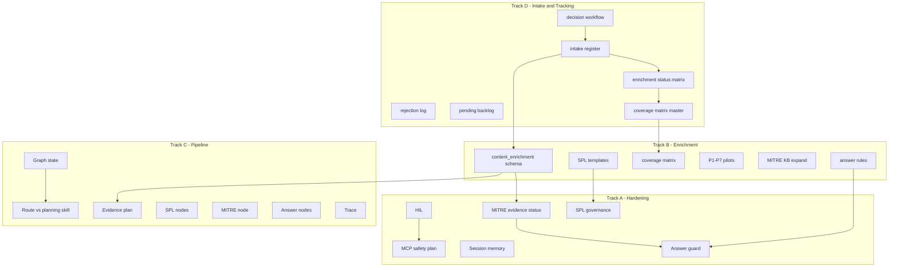
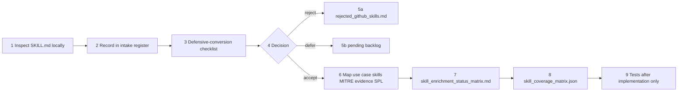

# AI SOC Assistant — Master Plan

**Document:** `plans/AI_SOC_MASTER_PLAN.md` — **single canonical plan** for hardening, skill enrichment, pipeline/LangGraph, and GitHub skill intake tracking.  
**Date:** 2026-06-06  
**Status:** Proposed — planning only; **no code implementation**  
**Canonical for:** Tracks A–D, pilot enrichments P1–P7, execution order, tracking table (§P)

> **Single plan only.** Do not use `plans/2026-06-06_*.md` drafts (removed). All amendments live here.

### Table of contents

| § | Section |
|---|---------|
| — | [Planning acceptance](#planning-acceptance-this-document) |
| A | [Executive recommendation](#a-executive-recommendation) |
| B | [Four-track roadmap](#b-updated-four-track-roadmap) |
| C | [GitHub reference repo](#c-external-github-soc-skill-references-inspected) |
| D | [Architecture constraints](#d-current-architecture-constraints) |
| E | [Track A — Hardening](#e-track-a--existing-system-hardening) |
| F | [Track B — Enrichment](#f-track-b--skill-content-enrichment) |
| G | [Track C — Pipeline / LangGraph](#g-track-c--langgraph--pipeline-node-improvement) |
| H | [Track D — Skill intake & tracking](#h-track-d--skill-intake-review-rejection-and-implementation-tracking) |
| I | [Pilot skills P1–P7](#i-seven-pilot-enriched-soc-skill-records) |
| J | [Dependency map](#j-dependency-map-a--b--c--d) |
| K | [Execution order](#k-recommended-execution-order) |
| L | [First implementation slice](#l-first-implementation-slice-post-planning) |
| M | [Deferred items](#m-deferred-items) |
| N | [Risk register](#n-risk-register) |
| O | [Acceptance criteria](#o-acceptance-criteria) |
| P | [Tracking table](#p-proposed-tracking-table) |
| Q | [Review findings](#q-review-findings--bugs-and-fixes) (amendments applied to body) |

### Tracking files

| File | Track | Status |
|------|-------|--------|
| `docs/skills/github_skill_intake_register.json` | D1 | **Done** (slice 0) |
| `docs/skills/rejected_github_skills.md` | D2 | **Done** (slice 0) |
| `docs/skills/pending_skill_enrichment_backlog.md` | D3 | **Done** (slice 0) |
| `docs/skills/skill_enrichment_status_matrix.md` | D4 | **Done** (slice 0) |
| `docs/skills/README.md` | D6 | **Done** (slice 0) |
| `docs/evals/skill_coverage_matrix.json` | D5 / B9 | Pending (slice 1) |

### External GitHub reference repository (read-only — not installed in runtime)

| Field | Value |
|-------|-------|
| **GitHub URL** | `https://github.com/mukul975/Anthropic-Cybersecurity-Skills` |
| **Local clone path** | `/tmp/ai-soc-references/Anthropic-Cybersecurity-Skills` |
| **Clone command used** | `mkdir -p /tmp/ai-soc-references && cd /tmp/ai-soc-references && git clone https://github.com/mukul975/Anthropic-Cybersecurity-Skills.git` |
| **Pinned commit (inspection)** | `04450304b12645cb2b974ab96d28c0664758a88d` (2026-06-01 — `chore: auto-update index.json`) |
| **Skill count** | 754 directories under `skills/` |
| **Format** | agentskills.io `SKILL.md` per skill; optional `references/`, `scripts/`, `assets/` |
| **Index / coverage** | `index.json`, `ATTACK_COVERAGE.md`, `mappings/`, `mappings/mitre-attack/README.md` |
| **Usage rule** | **Reference and provenance only.** Not copied into repo runtime. Not loaded into LLM prompts. Scripts in repo are **never executed** by AI SOC Assistant. |

> **Note:** `/tmp/ai-soc-references/` is ephemeral on the host. For durable provenance, record `repo_commit` in `docs/skills/github_skill_intake_register.json` per skill. Re-clone when reviewing new skills.

---

## Planning acceptance (this document)

- [x] Four tracks defined (A Hardening, B Enrichment, C Pipeline/LangGraph, **D Skill Intake & Tracking**)
- [x] All 7 mandatory GitHub reference skills included
- [x] Optional lateral-movement enrichment candidates identified
- [x] LangGraph / pipeline node improvement section (Track C)
- [x] Skill intake / rejection / implementation tracking layer (Track D)
- [x] Coverage matrix path and schema proposed (`docs/evals/skill_coverage_matrix.json`)
- [x] Defensive-conversion checklist included
- [x] Dual skill semantics preserved: `live_execution_skill` vs `planning_or_analytic_skill`
- [x] GitHub repo location, clone path, and pinned commit documented
- [x] A2 MITRE vocabulary + compatibility mapping locked (additive, not breaking)
- [x] P3/P6/P7 enrichment-without-new-105-rows policy locked
- [x] Slice 0 (D1/D7 docs) complete — see `docs/skills/`
- [x] No runtime code implementation performed

---

## A. Executive recommendation

Improve the AI SOC Assistant in **four coordinated tracks** without replacing the current architecture:

| Track | Purpose |
|-------|---------|
| **A — Existing System Hardening** | Safer HIL, evidence-based MITRE, SPL governance, session pins, answer guard |
| **B — Skill Content Enrichment** | Richer use-case metadata + RAG + MITRE KB, GitHub as **provenance only** |
| **C — LangGraph / Pipeline Nodes** | Clearer graph state, node split, traceability, additive response fields |
| **D — Skill Intake & Tracking** | Register, accept/reject/defer GitHub skills; link to use cases, MITRE, SPL, tests |

**Non-negotiables:**

- Keep the **4 live execution skills** (`alert_summary`, `spl_generation`, `attack_discovery`, `knowledge_recall`).
- Keep **dual skill semantics**: `legacy_router_intent_hint` → live skill; `proposed_primary_skill` → planning/analytic intent.
- Do **not** load GitHub `SKILL.md` into runtime LLM prompts.
- Do **not** unify skill enums in phase 1.
- SPL remains **template-first + `validate_spl()`**; MCP remains **gated**; real Splunk MCP **deferred**.
- **`spl_generation`** stays a live execution skill for template/candidate SPL workflow only (not LLM-generated SPL). No P1–P7 pilot maps to it by design; pilots use `attack_discovery` / `knowledge_recall` / `alert_summary`.

**Recommended first implementation slice:** see **§L** (canonical order). Summary: D1/D7 → C1/C9 → A1 → B9/D5 → B1/P1–P7 → A2 → pipeline splits → A6 → A5.

---

## B. Updated four-track roadmap



| Phase | Weeks (est.) | Tracks | Deliverable |
|-------|--------------|--------|-------------|
| 0 | 0 | Plan, **D** | This document; intake register schema; first-batch D7 entries |
| 0b | 0–1 | **D1–D4** | `github_skill_intake_register.json`, rejection log, backlog, status matrix (docs) |
| 1 | 1–2 | C1, C9, A1 | Explicit HIL; trace field plan |
| 2 | 2–3 | B9, B1, B4, B5, **D5** | Coverage matrix JSON; enrichment schema; intake ↔ matrix links |
| 3 | 3–5 | P1–P7, A2, B3, **D4** | Seven pilots + MITRE; update implementation status per skill |
| 4 | 5–7 | C2–C5, C4, B6, A3 | Node split; templates active/planned |
| 5 | 7–9 | C8, A6, A5 | Guard + session pins |
| 6 | 10+ | A4 | COE Splunk MCP (if approved) |

---

## C. External GitHub SOC skill references inspected

### Repository details (local inspection snapshot)

```
Host path:     /tmp/ai-soc-references/Anthropic-Cybersecurity-Skills
Remote:        https://github.com/mukul975/Anthropic-Cybersecurity-Skills.git
Commit SHA:    04450304b12645cb2b974ab96d28c0664758a88d
Commit date:   2026-06-01T10:15:47Z
Skills count:  754
```

**Top-level layout:**

| Path | Purpose |
|------|---------|
| `skills/<skill-id>/SKILL.md` | Primary skill document (YAML frontmatter + Markdown) |
| `skills/<skill-id>/references/` | Optional reference docs (do not import wholesale) |
| `skills/<skill-id>/scripts/` | **Do not execute** — offensive/tool scripts may exist |
| `skills/<skill-id>/assets/` | Optional assets |
| `index.json` | Skill index (auto-updated by repo) |
| `ATTACK_COVERAGE.md` | ATT&CK coverage summary |
| `mappings/` | Crosswalks including MITRE mappings |

**Standard skill format:** `skills/<name>/SKILL.md` — frontmatter fields commonly include `name`, `description`, `domain`, `subdomain`, `tags`, `mitre_attack`, `nist_csf`, `version`, `license`.

**Example local path (P1 reference):**

`/tmp/ai-soc-references/Anthropic-Cybersecurity-Skills/skills/detecting-rdp-brute-force-attacks/SKILL.md`

### Mandatory reference skills (7)

| # | Skill | Path | Domain / subdomain | MITRE (frontmatter) | Defensive value for us |
|---|-------|------|-------------------|---------------------|------------------------|
| 1 | `detecting-rdp-brute-force-attacks` | `skills/detecting-rdp-brute-force-attacks/` | cybersecurity / threat-detection | T1021.001, T1110.001, T1110.003, T1078 | Failed-login correlation, threshold evidence, success-after-failure pivot |
| 2 | `triaging-security-alerts-in-splunk` | `skills/triaging-security-alerts-in-splunk/` | cybersecurity / soc-operations | T1078, T1566 | Notable triage, disposition, governed SPL patterns (reference only) |
| 3 | `analyzing-email-headers-for-phishing-investigation` | `skills/analyzing-email-headers-for-phishing-investigation/` | cybersecurity / digital-forensics | T1566.001, T1566.002, T1598.003 | SPF/DKIM/DMARC, header chain — **no forensic script execution** |
| 4 | `hunting-for-anomalous-powershell-execution` | `skills/hunting-for-anomalous-powershell-execution/` | cybersecurity / threat-hunting | T1046, T1057, T1003, … | Event 4104 patterns, encoded commands — map to log fields |
| 5 | `hunting-for-command-and-control-beaconing` | `skills/hunting-for-command-and-control-beaconing/` | cybersecurity / threat-hunting | T1071, … | Frequency/jitter, filter known-good, candidate C2 wording |
| 6 | `triaging-security-incident-with-ir-playbook` | `skills/triaging-security-incident-with-ir-playbook/` | cybersecurity / incident-response | T1486, T1070, T1078 | Severity/escalation **guidance only** — strip curl/TI auto-calls |
| 7 | `analyzing-ransomware-encryption-mechanisms` | `skills/analyzing-ransomware-encryption-mechanisms/` | cybersecurity / malware-analysis | T1486, T1573, T1027 | Impact evidence fields — **no reverse-engineering steps in product** |

### Optional enrichment candidates (lateral movement)

| Skill | Path | Notes |
|-------|------|-------|
| `detecting-lateral-movement-with-splunk` | `skills/detecting-lateral-movement-with-splunk/` | Maps to existing `edr_lateral_movement_candidate` use case |
| `detecting-pass-the-hash-attacks` | `skills/detecting-pass-the-hash-attacks/` | T1550.002 — high sensitivity; evidence-only |
| `hunting-for-dcom-lateral-movement` | `skills/hunting-for-dcom-lateral-movement/` | WMI/DCOM pivots — defensive hunt fields only |
| `detecting-rdp-brute-force-attacks` | (also T1021.001) | Remote services context |

### Defensive-conversion checklist (required for every GitHub-inspired enrichment)

1. Is it defensive SOC investigation guidance?
2. Is it evidence-based?
3. Is it compatible with SPL template governance?
4. Does it avoid offensive execution steps?
5. Does it avoid arbitrary shell/curl/tool execution?
6. Does it avoid unsupported MITRE claims?
7. Does it include limitations / not_claimed language?
8. Does it preserve HIL and validation gates?
9. Does it avoid importing long external markdown into runtime LLM context?
10. Does it separate reference/provenance from runtime authority?

---

## D. Current architecture constraints

> **Path convention:** Runtime code lives under `backend/app/`. Shared harness contracts live at repo root `contracts/`. Cite full paths below.

| Layer | Location | Constraint |
|-------|----------|------------|
| Live skill enum (4) | `contracts/skill_enum.py` | `SKILL_ENUM` — closed set; imported by `backend/app/routing/skills.py` |
| `validate_skill()` | `backend/app/routing/skills.py` | Validates against `SKILL_ENUM` |
| `plan_workflow()` | `backend/app/orchestration/workflow_planner.py` | Workflow skeleton per skill |
| MCP execution (2) | `backend/app/orchestration/mcp_tool_selector.py` | `attack_discovery`, `spl_generation` only — template/candidate SPL path; not LLM-generated SPL (see §Q2.4) |
| Skill catalog (18) | `backend/app/skills/catalog.json` | Governance; `mitre_mapping` collapsed in routing |
| Shadow/planning (~10) | `backend/app/routing/runtime_skill_catalog.py` | Route-plan shadow; mirrors to legacy when control plane on |
| Use cases | `backend/app/use_cases/catalog.json` | Templates, `mitre_registry`, routing patterns |
| 105 questions | `backend/app/coverage/question_runtime_map_v1.json` | `legacy_router_intent_hint` + `proposed_primary_skill` |
| MITRE KB | `backend/app/threat/mitre_attack_subset.json` | 4 techniques today (verify count at implementation) |
| MITRE runtime | `backend/app/threat/mitre_kb.py` (`_status_for`), `mitre_decision.py`, `mitre_evidence_preconditions.py` | Mixed hardcoded + preconditions — A2 removes `_status_for` call site |
| Pipeline | `backend/app/chat/pipeline.py` | Imperative graph nodes; `ChatPipelineState` TypedDict |
| LangGraph | `backend/app/graph/chat_workflow.py` | Wrapper parity; `langgraph_orchestration_enabled=false` default |
| SPL | `backend/app/spl/templates.json`, stub generator, `llm_fallback` (disabled) | Template/stub-first |
| MCP gate | `backend/app/orchestration/mcp_execution_gate.py` | `evaluate_mcp_execution()`; mock success → `no_human_review()` today |
| Memory | `ChatRequest.message` only | Frontend `ChatPanel` holds history client-side |
| Answer | `backend/app/chat/final_answer_validator.py`, `backend/app/answer_guard/` (flag off) | `backend/app/chat/contracts/answer_contract.py` |

**Dual skill semantics (must preserve):**

| Field | Meaning | Authority |
|-------|---------|-----------|
| `legacy_router_intent_hint` / `routed.skill` | **live_execution_skill** | Workflow, SPL, MCP gates |
| `proposed_primary_skill` | **planning_or_analytic_skill** | Evidence plan, enrichment, trace, golden shadow expectations |

---

## E. Track A — Existing System Hardening

### A1 — HIL hardening

**Objective:** Human review explicit across mock and real execution paths.

**Current issue:** `evaluate_mcp_execution()` returns `no_human_review()` after successful mock execution (`backend/app/orchestration/mcp_execution_gate.py`, symbol `no_human_review` — verify line at implementation time).

**Files:** `backend/app/orchestration/mcp_execution_gate.py`, `backend/app/orchestration/human_review.py`, `backend/app/config.py`, `backend/app/schemas/responses.py`, `backend/app/chat/pipeline.py`, `frontend/src/components/.../AnalystResponseCard.tsx`

**Target behavior:**

- Valid SPL ≠ autonomous execution.
- Mock success → explicit `execution_status_label=executed_mock_evidence` **or** `human_review.required=true` outside demo.
- Response shows: evidence source (mock/live/unavailable), execution status, analyst review requirement.

**Proposed config flag:**

```env
AI_SOC_REQUIRE_HIL_FOR_MOCK_EXECUTION=true
```

(Pattern matches existing `AI_SOC_*` / `MCP_*` style in `backend/app/config.py` and `.env.example`.)

**Demo / EC path (§Q2.1):** Experience Center returns canned responses at `backend/app/api/routes_chat.py` (`ai_soc_live_chat_ec_parity_enabled` + `run_demo_scenario`) **before** the live pipeline reaches the MCP gate. Do **not** add `AI_SOC_ALLOW_MOCK_EXECUTION_WITHOUT_HIL_IN_DEMO` unless a live-path demo predicate is defined. Precedence when implemented: `REQUIRE_HIL_FOR_MOCK` applies to any path that reaches `evaluate_mcp_execution()`; EC fixture path is out of scope.

**Tests:**

| Case | Expected |
|------|----------|
| Valid SPL + mock MCP + live path | `human_review.required=true` (or explicit mock-executed label + review) |
| Valid SPL + EC fixture path | No MCP gate invocation; canned response only |
| Invalid SPL | `review_type=spl_revision` |
| Real MCP / not implemented | `admin_action_required` |

---

### A2 — MITRE evidence-status hardening

**Objective:** **Reconcile** — remove the remaining `_status_for()` call site in `backend/app/threat/mitre_kb.py` and route status through `mitre_decision.resolve_mitre_decision` + `mitre_evidence_preconditions` (shipped 2026-06-04). Do **not** invent a parallel status mechanism; extend `TechniquePrecondition` rows for pilot techniques.

**Files:** `backend/app/threat/mitre_kb.py`, `mitre_decision.py`, `mitre_evidence_preconditions.py`, `mitre_attack_subset.json`, `use_cases/catalog.json`, `question_runtime_map_v1.json`

**Authoring rule (§Q1.1/Q1.2):** Catalog/enrichment authors **`technique_id` + `required_evidence` (+ thresholds)** only. Status strings are **emitted at runtime** in the vocabulary below — never stored in `catalog.json`.

**Target status vocabulary (runtime output only):**

| Status | Meaning |
|--------|---------|
| `candidate` | Registry-permitted; insufficient evidence to strengthen |
| `evidence_supported` | Required positive evidence present per preconditions |
| `requires_validation` | Partial signals; analyst review needed |
| `not_claimed` | Evidence precondition failed or technique blocked |
| `ruled_out` | Explicit negative evidence contradicts technique |

**Rules:**

- No “confirmed MITRE” in analyst-facing text without `evidence_supported` + policy allow.
- Success-after-failure: T1110.001 → `evidence_supported` when failure threshold met; T1078 → `candidate` unless account-abuse evidence.
- Status from **structured evidence**, not query text alone.

**Pilot MITRE expansion (not full ATT&CK):**

`T1110`, `T1110.001`, `T1110.003`, `T1078`, `T1059`, `T1059.001`, `T1566`, `T1566.001`, `T1566.002`, `T1071` (+ sub-techniques only when evidence supports), `T1486`, optional `T1490`, `T1021` (lateral pilot)

**Compatibility mapping (locked):** Target statuses (`evidence_supported`, `ruled_out`, `requires_validation`, etc.) are for the improved evidence-status layer. **Do not** blindly replace the current `mitre_decision.py` output schema. Implement A2 as:

| Layer | Behavior |
|-------|----------|
| **Current** | Mostly `candidate` + `not_claimed` lists on `MitreDecision` |
| **Target** | Evidence-precondition-driven status vocabulary (table above) |
| **Transition** | Preserve existing response fields; add richer status **additively** (internal trace / new optional fields) via a compatibility-aware mapping layer |

A2 = reconciliation + additive hardening, **not** a breaking schema replacement.

**Tests:** Per pilot P1–P7 MITRE scenarios in acceptance criteria (section O). Regression: `_status_for` unreferenced after change.

---

### A3 — SPL template governance

**Objective:** Template-first; LLM fallback cannot bypass policy.

**Files:** `spl/templates.json`, `spl/generator.py`, `spl/llm_fallback.py`, `splunk/spl_services.py`, `safeguards/spl_validator.py`, `chat/pipeline.py` (`_candidate_spl_stage`)

**Rules:**

- Each enriched use case declares `allowed_spl_templates` + status (`active`/`planned`/`unavailable`).
- No template → governed limitation message (not silent stub).
- `AI_SOC_LLM_SPL_FALLBACK_ENABLED=false` outside lab.
- Lab fallback: template-family approval + `validate_spl()` + HIL.

**Tests:** Template pass/fail; fallback disabled; fallback SPL cannot execute without approval.

---

### A4 — Splunk MCP execution safety (plan only)

**Objective:** Document COE requirements; defer implementation.

**Files:** `connectors/mcp/splunk_mcp.py`, `mcp_execution_gate.py`, `splunk_result_adapter.py`, `splunk/capabilities.py`

**COE checklist (document only):** server URL, auth, allowed tools (read-only search), timeouts, result caps, audit trail, approval workflow, air-gap policy.

---

### A5 — Lightweight backend session memory

**Objective:** SOC follow-ups without full chat history storage.

**Files:** `backend/app/schemas/requests.py`, `backend/app/api/routes_chat.py`, `backend/app/chat/session_store.py` (**new** — ephemeral pins; do **not** use `backend/app/quality/store.py`, which is the durable answer-quality ledger), `backend/app/chat/pipeline.py`, `frontend/src/api/client.ts`, `frontend/src/components/ChatPanel.tsx`, `frontend/src/lib/chatProgressStream.ts`

**Request additions:** `session_id` (optional), `prior_trace_id` (optional)

**Server session store (structured pins only, TTL ~30 min, max 5 turns):**

- `last_alert_id`, `last_use_case_id`, `last_live_execution_skill`, `last_planning_or_analytic_skill`
- `last_entities`, `last_candidate_spl`, `last_spl_validation`, `last_mitre_decision`, `last_evidence_status`, `timestamp`

**Follow-ups supported:** “map to MITRE”, “refine SPL”, “same alert”, “show evidence”, “severity?”, “analyst summary”

**Safety:** Re-check evidence sufficiency each turn; no MITRE/severity bypass; no SPL/MCP bypass.

**Tests:** MITRE follow-up uses pins; SPL refine re-validates; stale session clarifies.

---

### A6 — Answer guard / final response hardening

**Objective:** Reduce overclaiming in governed summaries.

**Files:** `backend/app/answer_guard/runner.py`, `backend/app/answer_guard/rules.py`, `backend/app/chat/final_answer_validator.py`, `backend/app/chat/contracts/answer_contract.py`, `backend/app/chat/pipeline.py`, `backend/app/config.py`

**Rules:** Enable guard in lab/demo first; separate facts / assumptions / candidate MITRE / evidence_supported MITRE / limitations / HIL / SPL review status.

**Tests:** Block unsupported compromise; block confirmed MITRE without evidence; allow candidate wording with limitations.

---

## F. Track B — Skill Content Enrichment

### B1 — Content enrichment schema

**Recommendation (least disruptive):** Add `content_enrichment` block **inside `use_cases/catalog.json`** for pilot use cases first. Reasons:

- Use cases already own `mitre_registry`, `default_spl_template`, `primary_skill`, RAG collections.
- `skills/catalog.json` stays execution-governance (18 skills); no duplicate authority.
- **Phase 2 optional:** `backend/app/use_cases/enrichment/` sidecar JSON keyed by `use_case_id` if catalog grows too large — loaded by `load_skill_enrichment(use_case_id)` without changing routing.

**Schema:**

```json
{
  "content_enrichment": {
    "domain": "identity-access-management",
    "subdomain": "authentication-security",
    "tags": ["brute-force", "windows-auth", "splunk", "mitre-attack"],
    "github_reference_skills": [
      {
        "repo": "mukul975/Anthropic-Cybersecurity-Skills",
        "path": "skills/detecting-rdp-brute-force-attacks/SKILL.md",
        "usage": "defensive workflow reference only"
      }
    ],
    "planning_or_analytic_skill": "threshold_anomaly",
    "mitre_candidates": [
      {
        "technique_id": "T1110.001",
        "required_evidence": ["failed_login_count", "user", "src", "time_window"]
      }
    ],
    "evidence_requirements": {
      "required": ["user", "src", "host", "fail_count", "time_window"],
      "optional": ["first_failure", "last_failure"],
      "thresholds": {"fail_count_gte": 25}
    },
    "investigation_workflow": [
      {"step": 1, "action": "confirm_scope"},
      {"step": 2, "action": "select_governed_spl_template"},
      {"step": 3, "action": "validate_spl"},
      {"step": 4, "action": "evaluate_mitre_evidence_status"},
      {"step": 5, "action": "decide_severity"},
      {"step": 6, "action": "produce_summary_with_limitations"},
      {"step": 7, "action": "hil_if_execution_or_insufficient_evidence"}
    ],
    "analyst_checklist": [],
    "allowed_spl_templates": [
      {"template_id": "auth_failed_login_spike", "status": "active"}
    ],
    "answer_rules": [],
    "limitations": [],
    "rag_doc_ids": ["SOC-SOP-AUTH-001"]
  }
}
```

Add optional Pydantic model: `UseCaseContentEnrichment` in `backend/app/use_cases/models.py` (implementation phase).

**MITRE in enrichment:** No `not_claimed_defaults`, `status_default`, or free-form status strings. Not-claimed behavior comes from `mitre_evidence_preconditions.py` when required evidence is absent. New pilot techniques → add `TechniquePrecondition` rows, not catalog strings.

---

### B2 — Domain / subdomain taxonomy

| Domain | Subdomains (examples) |
|--------|----------------------|
| `soc-operations` | alert-triage, incident-triage, analyst-workflow |
| `identity-access-management` | authentication-security, account-abuse |
| `endpoint-security` | edr-hunting, suspicious-command-execution |
| `threat-hunting` | beaconing-review, pattern-anomaly |
| `phishing-defense` | email-header-analysis |
| `network-security` | dns-analysis, firewall-correlation |
| `incident-response` | containment-guidance, escalation |
| `ransomware-defense` | impact-assessment |

Map from GitHub `domain`/`subdomain` but use our catalog `category` as secondary label.

---

### B3 — MITRE technique expansion

Expand `mitre_attack_subset.json` for pilot techniques only. Sync `mitre_registry` and `mitre_evidence_preconditions.py` keys.

Do **not** claim full ATT&CK coverage. Document version: `curated-pilot-v1` (separate from GitHub v19.1).

---

### B4 — Evidence requirements

Per enriched skill: required fields, optional fields, thresholds, missing-evidence behavior, allowed conclusions, prohibited conclusions.

See pilot records (section H) for field lists per domain.

---

### B5 — Investigation workflows

Short ordered steps (8 max) in `content_enrichment.investigation_workflow` — no long prose. Long SOP text → RAG (`soc_kb_entries.json`).

---

### B6 — SPL template activation

Per use case: `allowed_spl_templates[]` with `status`: `active` | `planned` | `unavailable`, plus `required_slots`, `validation_policy`, `execution_mode`: `review_only` | `gated_read`.

Current gaps:

- `dns_beaconing_candidate` — `planned`, `spl_text: null`
- `edr_powershell_suspicious_command` — no template
- `edr_lateral_movement_candidate` — no template

---

### B7 — Analyst answer rules

Per use case in `content_enrichment.answer_rules`:

- MITRE candidate vs evidence_supported phrasing
- Limitations and not_claimed defaults
- When to ask for alert context
- When HIL required
- SPL always review-only unless explicit COE + flags

---

### B8 — 105-question compatibility

**Do not overwrite `proposed_primary_skill`.**

Coverage matrix columns:

- `question_id`, `query`, `use_case_id`
- `live_execution_skill` (from `legacy_router_intent_hint`)
- `planning_or_analytic_skill` (from `proposed_primary_skill`)
- `enriched_skill_available`, `mitre_candidates`, `spl_template_status`, `evidence_requirements`, `github_reference_skill_path`, `test_coverage_status`

Golden tests may continue to assert `planning_or_analytic_skill` in shadow fields while live `selected_skill` stays on 4-skill enum.

**New use cases (P3/P6/P7) — locked:** Phishing (`email_phishing_header_review`), IR playbook (`soc_incident_triage`), and ransomware (`endpoint_ransomware_impact_review`) **do not require new 105-question rows immediately**. Ship enrichment by mapping to:

1. Existing 105 questions when a matching row exists
2. Existing catalog use cases when close enough
3. Planned/proposed use case ids when no exact runtime path exists yet

New `question_id` rows and new routable catalog entries may follow later. **Preserve:** 4 live skills, `legacy_router_intent_hint`, `proposed_primary_skill`. Enrichment and Track D status tracking are additive — no runtime routing break.

---

### B9 — Skill coverage matrix (P0)

**Path:** `docs/evals/skill_coverage_matrix.json`

**Generator (implementation phase):** script merging `backend/app/coverage/question_runtime_map_v1.json` + `use_cases/catalog.json` + enrichment status.

**CI:** **Monotonic** on `question_id` set — ≥ 105 rows, **no existing `question_id` dropped**. Corpus = 105-question runtime map (not the separate 46-case answer-quality expectation matrix in `docs/evals/`).

---

## G. Track C — LangGraph / Pipeline Node Improvement

**Current state:**

- Imperative path: `build_live_chat_response()` in `pipeline.py` calls nodes sequentially.
- LangGraph path: `graph/chat_workflow.py` wraps **same functions** when `langgraph_orchestration_enabled=true`.
- `ChatPipelineState` TypedDict (~30 keys) in `pipeline.py`; `graph/state.py` has separate stub `InvestigationState` (unused by chat).

### C1 — Graph state model

**Propose `ChatPipelineState` v2 (additive fields):**

| Field | Purpose |
|-------|---------|
| `session_id` | Session memory key |
| `session_pins` | Structured prior-turn pins |
| `live_execution_skill` | Mirror of `routed.skill` (explicit name) |
| `planning_or_analytic_skill` | From 105 map / enrichment |
| `skill_enrichment` | Loaded `content_enrichment` block |
| `spl_template_status` | active/planned/unavailable |
| `mitre_evidence_status` | Aggregated status map per technique |
| `execution_decision` | Gate outcome before envelope |
| `answer_guard_result` | Guard output |
| `final_answer_validation` | Validator output |
| `node_trace` | List of per-node trace records |

**Rule:** Session pins inform planning only; every gate re-runs.

---

### C2 — Separate routing and enrichment nodes

**Proposed split (implementation refactors existing logic, does not change authority):**

| Node | Function | Responsibility |
|------|----------|----------------|
| `graph_node_route_live_skill` | refactor from `init_routing` tail | Select 1 of 4 live skills via `route_skill()` |
| `graph_node_resolve_planning_skill` | new | Resolve `proposed_primary_skill` from QU / 105 map / use case |
| `graph_node_load_skill_enrichment` | new | Load local `content_enrichment` by `use_case_id`; **never** read GitHub markdown |

Keep `graph_node_init_routing` as orchestrator or deprecate gradually behind flag `PIPELINE_SPLIT_ROUTING_NODES` — defaults **`false`** (monolith path) until LangGraph/imperative parity tests pass, then flip to `true`.

---

### C3 — Evidence planning node

**Formalize `graph_node_build_evidence_plan`** (extends `graph_node_evidence_planning`):

**Inputs:** use_case, planning skill, `content_enrichment`, session pins  
**Outputs:** required/optional/missing evidence, SPL template candidates, RAG doc candidates, MITRE candidates, `hil_required_if_missing`

Uses existing `chat/evidence_planner.py` + enrichment fields.

---

### C4 — SPL planning and validation nodes

| Node | Responsibility |
|------|----------------|
| `graph_node_select_spl_template` | Pick allowed template; return planned/unavailable |
| `graph_node_bind_spl_slots` | Bind alert_id, host, user, time_window (`validate_spl_slot_bindings`) |
| `graph_node_validate_spl` | Mandatory `validate_spl()` |
| `graph_node_prepare_execution_decision` | `evaluate_mcp_execution()` + HIL rules |

Today combined in `graph_node_workflow_spl` + `graph_node_execution`.

---

### C5 — MITRE decision node

**`graph_node_resolve_mitre_evidence_status`** (extract from `graph_node_context_finalize` / `_mitre_outputs_for_finalize`):

**Inputs:** enrichment MITRE candidates, `structured_context`, preconditions, sufficiency  
**Outputs:** per-technique status in vocabulary §A2

---

### C6 — Severity decision node

**`graph_node_decide_severity`** — formalize existing `decide_severity()` call:

**Inputs:** `severity_policy`, metrics, sufficiency — **not** raw MITRE alone  
**Rule:** Insufficient evidence → conservative / review-required severity

---

### C7 — RAG/SOP node

**`graph_node_retrieve_sop_context`** — formalize `graph_node_rag_early`:

**Inputs:** `rag_doc_ids` from enrichment, query intent  
**Outputs:** SOP snippets, escalation guidance, limitations  
**Rule:** RAG = reference prose; skills = workflow metadata; deterministic rules decide execution.

---

### C8 — Synthesis and answer guard nodes

| Node | Existing analogue |
|------|-------------------|
| `graph_node_build_answer_contract` | `build_answer_contract()` in finalize |
| `graph_node_generate_governed_summary` | `run_governed_synthesis_lab` |
| `graph_node_run_answer_guard` | `run_answer_guard_lab` |
| `graph_node_validate_final_answer` | `validate_final_answer()` |
| `graph_node_build_response_envelope` | `PlaceholderResponse` assembly |

---

### C9 — Observability / trace

Each node emits:

```json
{
  "node_name": "graph_node_validate_spl",
  "input_summary": {"template_id": "auth_failed_login_spike"},
  "output_summary": {"approved": true},
  "decision_reason": "deterministic policy pass",
  "guardrail_status": "pass",
  "human_review_required": false
}
```

Append to `control_plane_trace` / new `node_trace` on response.

**Tests:** Unit tests per node with fixture state; LangGraph parity test (`test_langgraph_parity`).

---

### C10 — Backward compatibility

**Keep existing `PlaceholderResponse` fields.** Additive only:

- `selected_live_execution_skill` (alias of `selected_skill` initially)
- `planning_or_analytic_skill`
- `skill_enrichment` (redacted safe subset in API)
- `evidence_plan` (already partial)
- `mitre_evidence_status`
- `spl_template_status`
- `session_context_status`

Frontend: continue using `trace: response` in `ChatPanel.tsx`; surface new fields in technical trace first.

---

## H. Track D — Skill Intake, Review, Rejection, and Implementation Tracking

**Objective:** Structured tracking for every GitHub skill inspected — what was reviewed, accepted, rejected, deferred, implemented, and tested — so enrichment stays governed and auditable.

**Principle:** GitHub repo at `/tmp/ai-soc-references/Anthropic-Cybersecurity-Skills` is **never** runtime authority. Track D files are **documentation and governance only** (no runtime skill loading, no prompt import).

### D1 — GitHub skill intake register

**Primary file (recommended):** `docs/skills/github_skill_intake_register.json`

**Bootstrap alternative:** `docs/skills/github_skill_intake_register.md` if JSON tooling is not ready — migrate to JSON in phase 0b.

**Schema per record:**

```json
{
  "github_skill_id": "detecting-rdp-brute-force-attacks",
  "repo": "mukul975/Anthropic-Cybersecurity-Skills",
  "path": "skills/detecting-rdp-brute-force-attacks/SKILL.md",
  "local_clone_path": "/tmp/ai-soc-references/Anthropic-Cybersecurity-Skills/skills/detecting-rdp-brute-force-attacks/SKILL.md",
  "repo_commit": "04450304b12645cb2b974ab96d28c0664758a88d",
  "domain": "soc-operations",
  "subdomain": "authentication-security",
  "mitre_from_github": ["T1110.001", "T1110.003", "T1078", "T1021.001"],
  "review_status": "accepted_for_enrichment",
  "decision": "accept",
  "decision_reason": "Useful defensive brute-force workflow; offensive parts not imported.",
  "internal_use_cases": ["auth_failed_login_spike", "auth_success_after_failure"],
  "mapped_live_execution_skill": "attack_discovery",
  "mapped_planning_or_analytic_skill": "threshold_anomaly",
  "reuse_type": "workflow_reference",
  "safety_review": {
    "defensive_only": true,
    "offensive_steps_removed": true,
    "no_arbitrary_commands": true,
    "no_runtime_markdown_loading": true,
    "no_direct_tool_execution": true
  },
  "implementation_status": {
    "content_enrichment_added": false,
    "mitre_kb_updated": false,
    "evidence_requirements_added": false,
    "spl_template_bound": false,
    "rag_doc_added": false,
    "answer_rules_added": false,
    "tests_added": false
  },
  "priority": "P0",
  "owner": "TBD",
  "reviewed_date": "2026-06-06",
  "notes": ""
}
```

**`review_status` values:** `not_reviewed` | `review_in_progress` | `accepted_for_enrichment` | `deferred` | `rejected` | `implemented` | `tested`

**`decision` values:** `accept` | `reject` | `defer` | `needs_review`

**`reuse_type` values:** `workflow_reference` | `mitre_reference` | `evidence_reference` | `sop_reference` | `rejected`

---

### D2 — Rejection log

**File:** `docs/skills/rejected_github_skills.md`

Every rejected skill gets a row so it is not re-reviewed without cause.

| GitHub Skill | Path | Decision | Rejection Reason | Safety Concern | Future Revisit? | Notes |
| ------------ | ---- | -------- | ---------------- | -------------- | --------------- | ----- |

**Rejection reason codes:**

| Code | Meaning |
|------|---------|
| `offensive_only` | Primary purpose is attack/offense, not defensive investigation |
| `unsafe_execution_steps` | Requires steps unsafe for governed assistant |
| `arbitrary_shell_or_curl` | Depends on arbitrary shell/curl/API execution at runtime |
| `not_relevant_to_soc_assistant` | Outside SOC analyst assistant scope |
| `duplicate_of_existing_skill` | Redundant with accepted skill or internal use case |
| `too_tool_specific` | Tied to unavailable vendor/tool we do not support |
| `too_token_heavy` | Body too large to curate into bounded enrichment |
| `requires_unavailable_data_source` | Needs telemetry we do not model |
| `no_clear_evidence_model` | Cannot map to evidence fields / preconditions |
| `not_suitable_for_client_demo` | Unsafe or inappropriate for experience center |
| `future_phase` | Valid later; not current pilot scope |

**D8 — Rejection examples (policy):**

```text
Rejected:
- Any skill whose primary purpose is exploit execution, credential theft,
  persistence creation, malware deployment, C2 setup, or evasion.
- Any skill that requires arbitrary shell execution in runtime.
- Any skill that cannot be converted into defensive investigation guidance.
```

**Partial accept:** Skills like `analyzing-ransomware-encryption-mechanisms` may be **accepted for enrichment** with `reuse_type=evidence_reference` while specific body sections (Ghidra RE, decryptor tooling) are logged in rejection notes as `offensive_only` / `unsafe_execution_steps` — not imported.

---

### D3 — Pending skill enrichment backlog

**File:** `docs/skills/pending_skill_enrichment_backlog.md`

| Backlog ID | GitHub Skill / Topic | SOC Domain | Internal Use Case Candidate | MITRE Candidate | Priority | Dependency | Status |
| ---------- | -------------------- | ---------- | --------------------------- | --------------- | -------- | ---------- | ------ |

**Status values:** `not_reviewed` | `review_in_progress` | `accepted_for_enrichment` | `deferred` | `blocked` | `implemented` | `tested` | `rejected`

**Seed backlog entries (optional pilots beyond batch 1):**

| Backlog ID | GitHub Skill | Use Case Candidate | Priority | Status |
|------------|--------------|-------------------|----------|--------|
| BL-001 | `detecting-lateral-movement-with-splunk` | `edr_lateral_movement_candidate` | P2 | `deferred` |
| BL-002 | `detecting-pass-the-hash-attacks` | `edr_lateral_movement_candidate` | P3 | `not_reviewed` |
| BL-003 | `hunting-for-dcom-lateral-movement` | `edr_lateral_movement_candidate` | P3 | `not_reviewed` |

---

### D4 — Implementation status matrix

**File:** `docs/skills/skill_enrichment_status_matrix.md`

Tracks **internal use case** implementation progress (one row per use case; may reference multiple GitHub skills).

| Internal Use Case | GitHub Reference | Live Skill | Planning Skill | MITRE Added | Evidence Added | SPL Template | Workflow Added | Answer Rules | RAG Added | Tests Added | Status |
| ----------------- | ---------------- | ---------- | -------------- | ----------- | -------------- | ------------ | -------------- | ------------ | --------- | ----------- | ------ |

**Status values:** `not_started` | `designed` | `content_added` | `mitre_added` | `spl_bound` | `tests_added` | `accepted` | `blocked`

---

### D5 — Coverage matrix remains master control

**Central file:** `docs/evals/skill_coverage_matrix.json`

Answers: *“Are we improving coverage or just adding content randomly?”*

**Each row connects:**

| Column | Source |
|--------|--------|
| `question_id` | `coverage/question_runtime_map_v1.json` |
| `use_case_id` | `use_cases/catalog.json` |
| `live_execution_skill` | `legacy_router_intent_hint` |
| `planning_or_analytic_skill` | `proposed_primary_skill` |
| `github_reference_skill` | `github_skill_intake_register.json` → `github_skill_id` |
| `github_intake_decision` | Track D `decision` |
| `mitre_candidates` | enrichment + KB |
| `evidence_requirements` | `content_enrichment` |
| `spl_template_status` | `active` / `planned` / `unavailable` |
| `implementation_status` | D4 status |
| `test_status` | pytest / golden / harness |

**Hierarchy:**

```
github_skill_intake_register.json  (what we reviewed about GitHub)
        ↓ maps to
skill_enrichment_status_matrix.md  (use-case implementation progress)
        ↓ rolls up into
skill_coverage_matrix.json         (105-question coverage truth)
```

---

### D6 — Decision workflow for every GitHub skill



1. Inspect GitHub `SKILL.md` at local clone path (never execute `scripts/`).
2. Record in `github_skill_intake_register.json` with `repo_commit`.
3. Apply defensive-conversion checklist (§C).
4. Decide: `accept` | `reject` | `defer` | `needs_review`.
5. If rejected → `rejected_github_skills.md`. If deferred → `pending_skill_enrichment_backlog.md`.
6. If accepted → map to internal use case, live skill, planning skill, MITRE, evidence, SPL status.
7. Update `skill_enrichment_status_matrix.md`.
8. Update `skill_coverage_matrix.json` rows for affected questions.
9. Add tests **only after** enrichment is implemented in Track B.

---

### D7 — First batch tracking (7 mandatory GitHub skills)

**Slice 0 (2026-06-06):** All seven records live in [`docs/skills/github_skill_intake_register.json`](../docs/skills/github_skill_intake_register.json). Summary table below; `implementation_status` flags remain `false` until Track B.

Planning-time status for batch 1:

| GitHub Skill ID | Decision | Review Status | Internal Use Case(s) | Live Skill | Planning Skill | MITRE (curated) | Evidence Model | SPL Template | Safety Notes | Impl. Status |
|-----------------|----------|---------------|----------------------|------------|----------------|-----------------|----------------|--------------|--------------|--------------|
| `detecting-rdp-brute-force-attacks` | **accept** | `accepted_for_enrichment` | `auth_failed_login_spike`, `auth_success_after_failure` | `attack_discovery` | `threshold_anomaly` / `sequence_detection` | T1110, T1110.001, T1110.003, T1078 (candidate) | **designed** in plan §I P1/P2 | `auth_failed_login_spike` active; `auth_success_after_failure` active | Defensive log correlation only; no blocking scripts | `not_started` |
| `triaging-security-alerts-in-splunk` | **accept** | `accepted_for_enrichment` | Cross-cutting: P1, P2, P6 + all Splunk use cases | varies | `alert_triage` (proposed shadow name) | Context-dependent | **designed** — triage/disposition fields | N/A (SOP/workflow) | Splunk UI steps → governed SPL references only | `not_started` |
| `analyzing-email-headers-for-phishing-investigation` | **accept** | `accepted_for_enrichment` | `email_phishing_header_review` (**proposed**) | `attack_discovery` or `knowledge_recall` | `phishing_triage` | T1566, T1566.001, T1566.002 | **designed** §I P3 | `planned` | No forensic script execution; header fields only | `not_started` |
| `hunting-for-anomalous-powershell-execution` | **accept** | `accepted_for_enrichment` | `edr_powershell_suspicious_command` | `attack_discovery` | `suspicious_command_execution` | T1059, T1059.001 | **designed** §I P4 | `planned` | Map to Event 4104 fields; no malware verdict without evidence | `not_started` |
| `hunting-for-command-and-control-beaconing` | **accept** | `accepted_for_enrichment` | `dns_beaconing_candidate` | `attack_discovery` | `beaconing_pattern_review` | T1071 (+ sub if evidenced) | **designed** §I P5 | `planned` | Periodicity alone ≠ C2 confirmed | `not_started` |
| `triaging-security-incident-with-ir-playbook` | **accept** | `accepted_for_enrichment` | `soc_incident_triage` (**proposed**) | `alert_summary` / `knowledge_recall` | `incident_triage_playbook` | Per alert evidence only | **designed** §I P6 | N/A | Strip curl/TI auto-calls; no destructive containment | `not_started` |
| `analyzing-ransomware-encryption-mechanisms` | **accept** (partial) | `accepted_for_enrichment` | `endpoint_ransomware_impact_review` (**proposed**) | `attack_discovery` | `ransomware_impact_review` | T1486; optional T1490/T1489 | **designed** §I P7 | `planned` | **Reject** RE/decryptor sections (`offensive_only`); impact evidence only | `not_started` |

**Reuse type summary:**

| Skill | `reuse_type` |
|-------|----------------|
| detecting-rdp-brute-force-attacks | `workflow_reference` + `evidence_reference` |
| triaging-security-alerts-in-splunk | `sop_reference` + `workflow_reference` |
| analyzing-email-headers-for-phishing-investigation | `evidence_reference` + `workflow_reference` |
| hunting-for-anomalous-powershell-execution | `evidence_reference` + `mitre_reference` |
| hunting-for-command-and-control-beaconing | `evidence_reference` + `workflow_reference` |
| triaging-security-incident-with-ir-playbook | `sop_reference` |
| analyzing-ransomware-encryption-mechanisms | `evidence_reference` (partial; malware-analysis sections rejected) |

---

### How Track D connects to Track B and the 105-question matrix

| Track D artifact | Feeds | Consumed by |
|------------------|-------|-------------|
| `github_skill_intake_register.json` | Provenance + accept/reject decision | `content_enrichment.github_reference_skills[]` in Track B |
| `skill_enrichment_status_matrix.md` | Per use-case build status | PR checklist; pilot P1–P7 |
| `pending_skill_enrichment_backlog.md` | Future candidates | Quarterly enrichment planning |
| `rejected_github_skills.md` | Avoid rework | Security review; onboarding |
| `skill_coverage_matrix.json` | 105-question truth | Golden tests; governance regression; “are we improving coverage?” |

**Track B** implements accepted skills into `use_cases/catalog.json` `content_enrichment` blocks.  
**Track D** never writes to runtime — it records decisions and links GitHub `github_skill_id` → `use_case_id` → `question_id`.  
When a pilot moves to `content_added`, update D4 row, D1 `implementation_status`, and B9 matrix `implementation_status` / `test_status` together.

---

## I. Seven pilot enriched SOC skill records

### P1 — Failed login / brute force

```yaml
use_case_id: auth_failed_login_spike
domain: identity-access-management
subdomain: authentication-security
live_execution_skill: attack_discovery
planning_or_analytic_skill: threshold_anomaly
github_reference_skills:
  - skills/detecting-rdp-brute-force-attacks/SKILL.md
  - skills/triaging-security-alerts-in-splunk/SKILL.md
mitre_candidates:
  - {technique_id: T1110, required_evidence: [failed_login_count, user, src, time_window]}
  - {technique_id: T1110.001, required_evidence: [failed_login_count, user, src, time_window], thresholds: {fail_count_gte: 25}}
  - {technique_id: T1110.003, required_evidence: [failed_login_count, distinct_user_gte]}
  - {technique_id: T1078, required_evidence: [successful_login]}
# runtime status via mitre_evidence_preconditions — not authored here
evidence_required: [user, src, host, fail_count, time_window, first_failure, last_failure]
allowed_spl_templates:
  - {id: auth_failed_login_spike, status: active}
answer_rules:
  - Do not claim account compromise from failures alone
  - Brute force evidence_supported only if threshold met
  - execution_eligible=false; HIL before any execution
limitations:
  - Failed logins alone do not prove Valid Accounts
```

### P2 — Successful login after failures

```yaml
use_case_id: auth_success_after_failure
live_execution_skill: attack_discovery
planning_or_analytic_skill: sequence_detection  # or correlate_sequence if added to shadow catalog
github_reference_skills:
  - skills/detecting-rdp-brute-force-attacks/SKILL.md
  - skills/triaging-security-alerts-in-splunk/SKILL.md
mitre_candidates:
  - {technique_id: T1110.001, required_evidence: [failed_login_count, success_count, user, src]}
  - {technique_id: T1078, required_evidence: [successful_login, post_login_activity]}
evidence_required: [user, src, host, fail_count, success_count, first_failure, last_success]
allowed_spl_templates:
  - {id: auth_success_after_failure, status: active}
answer_rules:
  - State "successful login after failures observed"
  - Do not state "compromised account" without MFA/session/post-login evidence
```

### P3 — Phishing email investigation

```yaml
use_case_id: email_phishing_header_review  # PROPOSED — not in catalog today; map from 105 Q later
live_execution_skill: attack_discovery  # or knowledge_recall if query is SOP-only
planning_or_analytic_skill: phishing_triage  # shadow catalog name TBD
github_reference_skills:
  - skills/analyzing-email-headers-for-phishing-investigation/SKILL.md
mitre_candidates:
  - {technique_id: T1566, required_evidence: [spf_result, dkim_result, dmarc_result, urls_or_domains]}
  - {technique_id: T1566.001, required_evidence: [urls_or_domains, spf_result]}
  - {technique_id: T1566.002, required_evidence: [attachment_hash]}
evidence_required: [sender, return_path, reply_to, spf_result, dkim_result, dmarc_result, urls_or_domains]
allowed_spl_templates:
  - {id: email_phishing_header_review, status: planned}
answer_rules:
  - Distinguish suspicious vs evidence-supported phishing
  - Do not confirm from sender display name alone
limitations:
  - Header analysis alone does not prove user clicked link
```

### P4 — Suspicious PowerShell execution

```yaml
use_case_id: edr_powershell_suspicious_command
live_execution_skill: attack_discovery
planning_or_analytic_skill: suspicious_command_execution
github_reference_skills:
  - skills/hunting-for-anomalous-powershell-execution/SKILL.md
mitre_candidates:
  - {technique_id: T1059, required_evidence: [command_line, event_id]}
  - {technique_id: T1059.001, required_evidence: [command_line, script_block_text, event_id]}
evidence_required: [host, user, command_line, script_block_text, event_id, parent_process, encoded_command_flag]
allowed_spl_templates:
  - {id: edr_powershell_suspicious_command, status: planned}
answer_rules:
  - Do not classify as malware without malware evidence
  - State suspicious execution + required pivots (network, auth)
```

### P5 — C2 beaconing

```yaml
use_case_id: dns_beaconing_candidate
live_execution_skill: attack_discovery
planning_or_analytic_skill: beaconing_pattern_review
github_reference_skills:
  - skills/hunting-for-command-and-control-beaconing/SKILL.md
mitre_candidates:
  - {technique_id: T1071, required_evidence: [network_telemetry, periodicity, dest]}
  - {technique_id: T1071.004, required_evidence: [dns_query_count, domain, periodicity]}
evidence_required: [src, dest, domain, periodicity, jitter, bytes_out, dns_query_count, rare_domain_indicator]
allowed_spl_templates:
  - {id: dns_beaconing_candidate, status: planned}
answer_rules:
  - Do not claim C2 confirmed from periodicity alone
  - Require multiple signals for evidence_supported
```

### P6 — Incident triage / IR playbook

```yaml
use_case_id: soc_incident_triage  # PROPOSED — or extend soc_show_sop for triage variant
live_execution_skill: alert_summary  # or knowledge_recall for playbook-only
planning_or_analytic_skill: incident_triage_playbook
github_reference_skills:
  - skills/triaging-security-incident-with-ir-playbook/SKILL.md
  - skills/triaging-security-alerts-in-splunk/SKILL.md
mitre_candidates: []  # assign per alert evidence only
evidence_required: [alert_type, affected_asset, user, severity_policy_inputs, prior_related_alerts]
allowed_spl_templates: []
answer_rules:
  - SOP/escalation guidance only
  - No destructive containment without HIL
  - No curl/TI auto-execution
```

### P7 — Ransomware / impact review

```yaml
use_case_id: endpoint_ransomware_impact_review  # PROPOSED
live_execution_skill: attack_discovery
planning_or_analytic_skill: ransomware_impact_review
github_reference_skills:
  - skills/analyzing-ransomware-encryption-mechanisms/SKILL.md  # defensive fields only
  - skills/triaging-security-incident-with-ir-playbook/SKILL.md
mitre_candidates:
  - {technique_id: T1486, required_evidence: [file_rename_count, extension_pattern, encryption_behavior]}
  - {technique_id: T1490, required_evidence: [shadow_copy_deletion_indicator]}
  - {technique_id: T1489, required_evidence: [service_stop_event]}
evidence_required: [host, user, file_rename_count, extension_pattern, affected_paths, process_name, shadow_copy_deletion_indicator]
allowed_spl_templates:
  - {id: endpoint_ransomware_impact_review, status: planned}
answer_rules:
  - Do not claim ransomware from file changes alone
  - HIL for containment/remediation guidance
limitations:
  - No reverse-engineering or decryptor steps in assistant output
```

### Optional P8 — Lateral movement (deferred pilot)

```yaml
use_case_id: edr_lateral_movement_candidate  # EXISTS in catalog
planning_or_analytic_skill: lateral_movement_review
github_reference_skills:
  - skills/detecting-lateral-movement-with-splunk/SKILL.md
  - skills/detecting-pass-the-hash-attacks/SKILL.md  # evidence-only, high scrutiny
mitre_candidates:
  - {id: T1021, default: candidate}
```

---

## J. Dependency map (A × B × C × D)

| Item | Depends on |
|------|------------|
| **D1 intake register** | GitHub clone + defensive checklist |
| **D4 status matrix** | D1 accepted skills |
| **D5 / B9 coverage matrix** | D1, D4, `question_runtime_map_v1.json` |
| B1 enrichment schema | D1 accepted skills (provenance paths) |
| A2 MITRE | B3, B4, P1–P7, D7 MITRE mapping |
| A3 SPL | B6, C4 |
| A4 MCP | A1, A3, C4 |
| A5 Memory | C1, B5 workflows |
| A6 Answer guard | B7, C8 |
| B9 Matrix | B1 schema + **D5** intake links |
| C3 Evidence plan | B1, B4, A5 pins, D1 evidence_reference |
| C5 MITRE node | A2, B3 |
| C2 Planning skill | B8 (105 semantics) |
| C4 SPL nodes | A3, B6 |
| P1–P7 pilots | D7 accept decision + B1 schema |
| P3/P6/P7 new use cases | B1 schema + catalog entry + D1 mapping |

---

## K. Recommended execution order

**Canonical sequence: §L.** This section only notes Track D parallelism:

**Track D (docs-only)** runs alongside phases 0–2: D1/D7 → D2–D4 → D5 ↔ B9.

Track C phase 0 (C1/C9) precedes behavior changes so trace fields exist before HIL/MITRE shifts.

---

## L. First implementation slice (post-planning)

| Order | ID | Deliverable |
|-------|-----|-------------|
| 0 | **D1, D7** | `docs/skills/github_skill_intake_register.json` + 7 batch-1 records — **Done** |
| 0b | **D2–D4** | Rejection log, pending backlog, enrichment status matrix — **Done** (docs stubs) |
| **3.1** | **Batch 3.1** | Pilot evidence contracts doc + output verification tests — **Done** |
| **4** | **Batch 4** | Pipeline trace + guarded answer visibility — **Done** |
| 1 | C1, C9 | State field spec + `node_trace` schema in docs — **Done** (Batch 4 runtime) |
| 2 | A1 | HIL for mock MCP + response labels |
| 3 | B9, **D5** | `skill_coverage_matrix.json` (≥105 monotonic `question_id`s) linked to intake register |
| 4 | B1 | Pydantic model + 2 pilot enrichments (P1, P2); update D4 status |
| 5 | A2 | Remove `_status_for()`; expand KB for P1/P2 techniques |
| 6 | C2, C3 | Split planning skill resolution + enrichment load (flag-gated) |
| 7 | B6, A3 | Mark templates planned/active; PowerShell/beacon stubs |
| 8 | P3–P7 | Remaining pilots + proposed use cases; sync D1 impl flags |
| 9 | C4, C5, C8 | SPL + MITRE + answer node split |
| 10 | A6 | Answer guard lab flag |
| 11 | A5 | Session pins MVP |

---

## M. Deferred items

- Full skill enum unification
- Importing 754 GitHub skills
- Loading `SKILL.md` into prompts
- Real Splunk MCP implementation (until COE)
- LLM SPL fallback in production
- LLM → Splunk tool calling
- Full ATT&CK mirror
- Phishing/ransomware use cases in catalog (until P3/P7 schema proven)
- P8 lateral movement enrichment (optional — see D3 backlog BL-001–BL-003)
- `graph/state.py` `InvestigationState` merge (separate investigation graph stub)
- Bulk import of 754 skills into intake register (review incrementally via D6 workflow)

---

## N. Risk register

| ID | Risk | Likelihood | Impact | Mitigation |
|----|------|------------|--------|------------|
| R1 | GitHub offensive content leaks into RAG | Med | Critical | Defensive checklist + human review of enrichments |
| R2 | Dual-skill confusion in UI/tests | High | Med | Explicit field names; matrix documents both |
| R3 | Node split breaks LangGraph parity | Med | High | Parity tests; feature flags per node |
| R4 | Session memory overclaim | Med | High | Pins only; re-validate gates each turn |
| R5 | MITRE `evidence_supported` without thresholds | Med | High | Precondition keys + tests per pilot |
| R6 | New use cases (P3/P6/P7) expand scope | Med | Med | Propose as catalog additions in same PR as enrichment schema |
| R7 | Golden 105 expects shadow skill in `selected_skill` | High | Low | Golden asserts `planning_or_analytic_skill` separately |
| R8 | Lost track of reviewed GitHub skills | High | Med | Track D intake register + rejection log mandatory before accept |
| R9 | Re-reviewing rejected skills repeatedly | Med | Low | `rejected_github_skills.md` + reason codes |
| R10 | `/tmp` clone lost on host rebuild | Med | Low | Pin `repo_commit` in D1; document re-clone procedure in §C |

---

## O. Acceptance criteria

### Planning (this document)

- [x] Four tracks documented (A–D)
- [x] Seven GitHub reference skills included
- [x] Track C LangGraph section complete
- [x] Track D intake / rejection / implementation tracking defined
- [x] GitHub repo URL, local path, commit SHA documented
- [x] Proposed tracking files: D1–D5 paths and schemas
- [x] First-batch D7 table for 7 skills with accept/defer/partial decisions
- [x] Rejection reason codes and examples (D8)
- [x] D6 decision workflow documented
- [x] Coverage matrix path proposed (`docs/evals/skill_coverage_matrix.json`)
- [x] Defensive checklist included
- [x] Dual skill semantics preserved
- [x] No code changes; no runtime skill loading

### Future implementation

- [ ] `./scripts/run_stage3_governance_regression.sh` PASS
- [ ] Mock MCP: HIL or explicit mock label outside demo
- [ ] MITRE statuses use evidence_preconditions only (no `_status_for()`)
- [ ] SPL template-first; LLM fallback off in prod
- [ ] Seven pilots have `content_enrichment` + GitHub provenance paths
- [ ] `github_skill_intake_register.json` has 7 batch-1 entries with `repo_commit`
- [ ] `skill_enrichment_status_matrix.md` reflects pilot implementation progress
- [ ] `skill_coverage_matrix.json` covers 105 rows and links `github_skill_id`
- [ ] LangGraph parity with imperative path when flag on
- [ ] Final answer separates facts, assumptions, MITRE status, SPL status, HIL
- [ ] Session follow-up re-validates; no gate bypass

---

## P. Proposed tracking table

| ID | Track | Work Item | Current State | GitHub Reference | Proposed Change | Files | Priority | Dependency | Tests Required | Status |
| -- | ----- | --------- | ------------- | ---------------- | --------------- | ----- | -------- | ---------- | -------------- | ------ |
| D1 | D | GitHub skill intake register | **Done** (slice 0) | All inspected skills | JSON register with provenance + decision + impl flags | `docs/skills/github_skill_intake_register.json` | P0 | — | JSON schema validation | **Done** |
| D2 | D | Rejection log | **Done** (slice 0) | Rejected skills | Markdown table + reason codes | `docs/skills/rejected_github_skills.md` | P0 | D1 | — | **Done** |
| D3 | D | Pending enrichment backlog | **Done** (slice 0) | Deferred / future skills | Markdown backlog table | `docs/skills/pending_skill_enrichment_backlog.md` | P1 | D1 | — | **Done** |
| D4 | D | Enrichment status matrix | **Done** (slice 0) | Accepted → use cases | Per use-case implementation columns | `docs/skills/skill_enrichment_status_matrix.md` | P0 | D1, D7 | — | **Done** |
| D5 | D | Coverage matrix master link | B9 proposed | 105 questions | Add `github_skill_id`, `github_intake_decision`, `test_status` columns | `docs/evals/skill_coverage_matrix.json` | P0 | D1, B9 | CI row-count | Proposed |
| D6 | D | Intake decision workflow | Informal | N/A | Document 9-step process in plan + README stub | `docs/skills/README.md` (optional) | P0 | D1 | — | Proposed |
| D7 | D | First batch (7 skills) | **Done** (slice 0) | 7 mandatory skills | Populate D1 with accept/partial + mappings | `github_skill_intake_register.json` | P0 | D1 | — | **Done** |
| C1 | C | Graph state model v2 | `ChatPipelineState` partial | N/A | Add session, dual skill, enrichment, node_trace fields | `pipeline.py`, `schemas/responses.py` | P0 | — | Schema unit tests | Proposed |
| C9 | C | Node-level trace | `control_plane_trace` partial | N/A | Per-node input/output/decision in trace | `control_plane_trace.py`, `pipeline.py` | P0 | C1 | Trace snapshot tests | Proposed |
| A1 | A | HIL mock MCP hardening | `no_human_review()` on mock success | `triaging-security-alerts-in-splunk` disposition | Require HIL or mock label; new config flags | `mcp_execution_gate.py`, `config.py`, `pipeline.py` | P0 | — | HIL matrix tests | Proposed |
| B9 | B | Skill coverage matrix | None | `ATTACK_COVERAGE.md` pattern | `docs/evals/skill_coverage_matrix.json` (≥105 monotonic ids) | new JSON + generator script | P0 | — | CI monotonic `question_id` check | Proposed |
| B1 | B | content_enrichment schema | Use cases lack enrichment block | SKILL.md frontmatter | Add block to `use_cases/catalog.json`; Pydantic model | `catalog.json`, `models.py` | P0 | — | Catalog validation test | Proposed |
| B2 | B | Domain taxonomy | `category` only | GitHub domain/subdomain | Normalize domains for pilots | `catalog.json` | P1 | B1 | — | Proposed |
| B3 | B | MITRE KB pilot expand | 4 techniques | 7 reference skills' mitre_attack lists | Add T1059.001, T1566.*, T1071, T1486, etc. | `mitre_attack_subset.json` | P1 | B1 | `test_mitre_decision_runtime.py` | Proposed |
| B4 | B | Evidence requirements | Partial preconditions | Prerequisites sections | Per-use-case required/optional/thresholds | `catalog.json`, `mitre_evidence_preconditions.py` | P0 | B1 | `test_negative_evidence_extractor.py` | Proposed |
| B5 | B | Investigation workflows | Generic blueprints only | Workflow sections | 8-step workflow arrays in enrichment | `catalog.json` | P1 | B1 | Demo scenario tests | Proposed |
| B6 | B | SPL template activation | planned/null templates | Splunk/beacon/PS skills | active/planned/unavailable per template | `spl/templates.json` | P1 | B1 | `test_spl_generation_stage.py` | Proposed |
| B7 | B | Analyst answer rules | Demo fixtures only | Expected Output | answer_rules + limitations per pilot | `catalog.json`, `answer_contract.py` | P1 | B1 | `test_answer_contract.py` | Proposed |
| B8 | B | 105 dual-skill compatibility | Golden misalignment risk | N/A | Matrix columns; don't overwrite proposed_primary_skill | `question_runtime_map_v1.json`, matrix JSON | P1 | B9 | `test_golden_answer_runner.py` | Proposed |
| A2 | A | MITRE evidence status | `_status_for()` hardcoded | Reference skills | 5-status vocabulary; precondition-only | `mitre_kb.py`, `mitre_decision.py` | P0 | B3, B4, P1-P7 | Pilot MITRE tests | Proposed |
| A3 | A | SPL governance | LLM fallback disabled | Splunk triage skill | Template-family + lab-only fallback | `spl_validator.py`, `llm_fallback.py` | P1 | B6, C4 | `test_llm_spl_fallback.py` | Proposed |
| A4 | A | Splunk MCP safety plan | NotImplementedError | N/A | COE checklist doc only | `splunk_mcp.py`, docs | P3 | A1, A3 | — | Deferred |
| A5 | A | Session memory | No backend memory | N/A | session_id + structured pins in `chat/session_store.py` | `requests.py`, `session_store.py`, `pipeline.py`, frontend client | P2 | C1, B5 | Session follow-up tests | Proposed |
| A6 | A | Answer guard lab | Flag off | Limitations sections | Enable in lab; HIL on block | `answer_guard/runner.py`, `config.py` | P1 | B7, C8 | `test_p6_guarded_synthesis_lab.py` | Proposed |
| C2 | C | Split route vs planning | Mixed in init_routing | N/A | `route_live_skill` + `resolve_planning_skill` nodes | `pipeline.py`, `chat_workflow.py` | P1 | B8, C1 | Parity tests | Proposed |
| C3 | C | Evidence plan node | `graph_node_evidence_planning` basic | N/A | Enrichment-aware evidence plan | `evidence_planner.py`, `pipeline.py` | P1 | B1, B4 | `test_control_plane_behavior_matrix.py` | Proposed |
| C4 | C | SPL node split | Combined workflow_spl | N/A | select/bind/validate/execution_decision | `pipeline.py` | P1 | A3, B6 | SPL stage tests | Proposed |
| C5 | C | MITRE evidence node | Inside context_finalize | N/A | `resolve_mitre_evidence_status` node | `mitre_decision.py`, `pipeline.py` | P1 | A2 | MITRE pilot tests | Proposed |
| C6 | C | Severity node formalize | `decide_severity()` inline | N/A | Explicit node; conservative on missing evidence | `severity_policy.py`, `pipeline.py` | P2 | C3 | Severity tests | Proposed |
| C7 | C | RAG/SOP node | `graph_node_rag_early` | IR playbook (SOP only) | `retrieve_sop_context` with rag_doc_ids | `soc_kb_retriever.py` | P1 | B1 | `test_soc_kb_*` | Proposed |
| C8 | C | Answer node split | finalize monolith | N/A | contract → summary → guard → validate → envelope | `pipeline.py`, `analyst_response_builder.py` | P1 | A6, B7 | Final answer validator tests | Proposed |
| C10 | C | Backward compat | PlaceholderResponse stable | N/A | Additive fields only | `responses.py`, `api.ts` | P0 | C1 | Frontend build | Proposed |
| P1 | B | Pilot auth_failed_login_spike | Catalog entry basic | detecting-rdp-brute-force + splunk triage | Full enrichment §I P1; update D4 | `catalog.json`, templates | P0 | B1, B4, D7 | Behavior matrix auth | Proposed |
| P2 | B | Pilot auth_success_after_failure | Catalog entry basic | Same | Full enrichment §I P2; update D4 | `catalog.json` | P0 | P1, D7 | MITRE success-after-failure tests | Proposed |
| P3 | B | Pilot phishing | **No use case yet** | email-headers skill | Propose `email_phishing_header_review` | catalog, templates | P1 | B1 | New routing tests | Proposed |
| P4 | B | Pilot PowerShell | No template | anomalous-powershell skill | Enrichment + planned template | `catalog.json`, templates | P1 | B6 | SPL tests | Proposed |
| P5 | B | Pilot beaconing | Template planned | c2-beaconing skill | Enrichment + planned template | `catalog.json`, templates | P1 | B6 | SPL tests | Proposed |
| P6 | B | Pilot IR triage | Partial via soc_show_sop | ir-playbook skill | Propose `soc_incident_triage` or extend SOP | catalog, RAG | P1 | B1 | Demo + knowledge tests | Proposed |
| P7 | B | Pilot ransomware | **No use case yet** | ransomware-encryption skill | Propose `endpoint_ransomware_impact_review` | catalog, templates | P1 | B1 | MITRE T1486 tests | Proposed |
| P8 | B | Optional lateral movement | `edr_lateral_movement_candidate` exists | detecting-lateral-movement-with-splunk | Optional enrichment | catalog | P3 | P1-P7 | — | Deferred |
| G1 | A+B+C+D | Governance regression | Baseline green | N/A | No regressions after each phase | `scripts/run_stage3_governance_regression.sh` | P0 | All | Full regression | Proposed |

### Proposed Track D tracking files (summary)

| File | Purpose |
|------|---------|
| `docs/skills/github_skill_intake_register.json` | One record per GitHub skill reviewed |
| `docs/skills/rejected_github_skills.md` | Permanent rejection log |
| `docs/skills/pending_skill_enrichment_backlog.md` | Deferred / not-yet-reviewed candidates |
| `docs/skills/skill_enrichment_status_matrix.md` | Internal use-case implementation progress |
| `docs/evals/skill_coverage_matrix.json` | **Master control** — 105 questions ↔ use cases ↔ GitHub refs |

---

## What not to change yet

- Unify all skills into one runtime enum
- Remove the 4 live skills or `legacy_router_intent_hint` / `proposed_primary_skill`
- Import all GitHub skills or load `SKILL.md` into prompts
- Execute scripts from the GitHub reference clone
- Auto-sync intake register from GitHub (manual review via D6 only)
- Enable real Splunk MCP or production LLM SPL fallback
- Allow LLM to call Splunk tools
- Claim confirmed MITRE, account compromise, or execution without evidence/HIL

---

*End of master plan. No application code was modified.*

---

## Q. Review findings — bugs and fixes

> **Added 2026-06-06.** Plan-level review (no application code changed). Load-bearing claims verified against the current tree. Each finding tagged **High / Med / Low**.
>
> **Amendments:** Findings Q1.1–Q2.4 and Q3.1–Q3.5 were applied to the plan body above (§A, §B, §C, §D, §I, §K, mermaid). §Q remains the audit record.

### Q.1 — Critical / load-bearing

**Q1.1 — `not_claimed_defaults` (B1) and §I pilot status strings reintroduce removed hardcoding. [High]** — **Applied §B1, §I.**

- **Evidence:** `backend/app/threat/mitre_evidence_preconditions.py` docstring states it *"Replaces per-use-case 'not claimed' hardcoding (`_DEFAULT_NOT_CLAIMED`, `_not_claimed_for_context`)"* with a data-driven rule covering authentication, DNS/DGA, phishing, malware, network, exfiltration, and lateral movement — i.e. the exact P1–P7 domains. The 2026-06-04 general SOC reasoning plan (CLAUDE.md: **Done**) is what landed this.
- **Bug:** B1's schema field `"not_claimed_defaults": ["T1078"]` and the §I pilot YAML strings (`default: not_claimed_without_spray_pattern`, `default: not_claimed_without_successful_login`, `default: not_claimed_without_dns_tunneling_fields`, etc.) re-encode per-technique not-claimed logic inline in the catalog. This is the same per-use-case hardcoding the preconditions module deleted. Two competing sources of truth → drift, and the inline strings bypass the data-driven negation path.
- **Fix:** Delete `not_claimed_defaults` from the B1 schema. Express each pilot technique as `{technique_id, required_evidence:[...]}` only; "not claimed" is **derived** (absent required evidence → not claimed with the module's stable reason). Where a pilot needs a new technique/reason, add a `TechniquePrecondition` row to `mitre_evidence_preconditions.py`, not a string in `catalog.json`. This makes B3/B4 an **extension of the shipped module**, not a parallel mechanism.

**Q1.2 — MITRE status represented three incompatible ways. [High]** — **Applied §A2, §B1, §I** (runtime-only status vocabulary).

- **Bug:** A2 defines a 5-value controlled vocabulary (`candidate`, `evidence_supported`, `requires_validation`, `not_claimed`, `ruled_out`). B1 uses `{status_default: "candidate", evidence_required: [...]}`. §I pilots invent free-form compound strings (`not_claimed_without_spray_pattern`, `evidence_supported_when: [fail_count_gte_threshold]`). An implementer has no single shape to code against.
- **Fix:** Pick one representation — recommend: status is **never** authored, only the A2 vocabulary is emitted at runtime by `resolve_mitre_decision`; the catalog authors only `technique_id` + `required_evidence` (+ optional `thresholds`). Replace every `default:`/`status_default:`/`evidence_supported_when:` form in §I and B1 with that single shape. Add a catalog-validation test asserting no enrichment row carries a status string outside the A2 enum.

**Q1.3 — `_status_for()` cleanup = reconcile, not rebuild. [High]** — **Applied §A2, §D.**

- **Evidence:** `backend/app/threat/mitre_kb.py:72` still defines `_status_for(use_case_id, technique_id)` and `mitre_kb.py:56` still calls it. So hardcoded status **and** the data-driven precondition module currently coexist (the D-table "Mixed hardcoded + preconditions" note is accurate).
- **Fix:** A2 should explicitly state its job is to **remove the remaining `_status_for()` call site** and route through `mitre_decision.resolve_mitre_decision` / `mitre_evidence_preconditions`, not to author a new vocabulary from scratch (the vocabulary largely exists). Add a regression test that `_status_for` is unreferenced after the change.

**Q1.4 — Mis-attributed file paths; an implementer cannot resolve them. [High]**

- **Evidence:**
  - §D table (original) cited `contracts/skill_enum.py` for `validate_skill()` / `plan_workflow()`. **`contracts/skill_enum.py` exists** at repo root (harness enum), but **`validate_skill`** → `backend/app/routing/skills.py` and **`plan_workflow`** → `backend/app/orchestration/workflow_planner.py`.
  - A6/B7 cited `contracts/answer_contract.py`. Real path: `backend/app/chat/contracts/answer_contract.py`.
  - Many entries dropped the `backend/app/` root (e.g. `mitre_kb.py`, `pipeline.py`, `config.py`).
- **Fix (applied §D):** Split enum vs function locations; normalize paths with `backend/app/` or `frontend/src/` prefix. Sanity check: `test -f <path>` from repo root.

**Q1.5 — A5 must not reuse `quality/store.py`. [High]** — **Applied §A5** (`session_store.py`).

- **Evidence:** `backend/app/quality/store.py` is the answer-quality ledger (`record_chat_turn`, `record_feedback`, `record_review`, `mark_golden_candidate`, CSV export). A5 lists it as a file for the session-pins store.
- **Bug:** Session pins (ephemeral, TTL ~30 min, 5-turn cap) and the durable quality/feedback ledger are different lifecycles and different authority. Co-locating them violates separation of concerns (and the user's own "data layer / business logic apart" principle).
- **Fix:** New module `backend/app/chat/session_store.py` (or `app/session/`) for pins, with its own TTL eviction. Quality ledger stays untouched. A5 file list should drop `quality/store.py`.

### Q.2 — Should-fix

**Q2.1 — A1 demo-relaxation flag has no execution path to relax. [Med]** — **Applied §A1:** dropped `AI_SOC_ALLOW_MOCK_EXECUTION_WITHOUT_HIL_IN_DEMO`; EC path documented as gate-bypass; single `AI_SOC_REQUIRE_HIL_FOR_MOCK_EXECUTION` flag for live path.

- **Evidence:** `backend/app/api/routes_chat.py` EC branch (`ai_soc_live_chat_ec_parity_enabled` + `run_demo_scenario`) returns before `build_live_chat_response` reaches the MCP gate.

**Q2.2 — New use cases vs 105-row CI gate. [Med]** — **Applied §B8/B9:** monotonic `question_id` CI; P3/P6/P7 may enrich without new question rows initially.

**Q2.3 — `C2` flag default self-contradictory. [Med]** — **Applied §C2:** `PIPELINE_SPLIT_ROUTING_NODES` defaults **false**.

**Q2.4 — `spl_generation` not used by pilots. [Med]** — **Applied §A non-negotiables + §D:** intentional; template/candidate SPL path only.

### Q.3 — Minor / hygiene (applied)

- **Q3.1 [Low]** §A links to §L as canonical order; §K defers to §L. **Applied.**
- **Q3.2 [Low]** §K no longer duplicates numbered slice (defers to §L). **Applied.**
- **Q3.3 [Low]** Mermaid: `B7`, `D6` declared in subgraphs. **Applied.**
- **Q3.4 [Low]** Line refs → symbol names + "verify at implementation". **Applied §A1, §D.**
- **Q3.5 [Low]** B9 CI corpus = 105-question runtime map, not 105+46 expectation matrix. **Applied §B9.**

### Q.4 — Verification log (this review)

| Claim checked | Result |
|---------------|--------|
| Mock success returns `no_human_review()` | **Confirmed** — `mcp_execution_gate.py:140` |
| `_status_for()` still live | **Confirmed** — `mitre_kb.py:72` (called at `:56`) |
| Preconditions module replaced not-claimed hardcoding | **Confirmed** — module docstring |
| `contracts/skill_enum.py` exists | **Confirmed** — repo root; but `validate_skill` is in `backend/app/routing/skills.py` |
| `answer_contract.py` path | **Corrected** — `backend/app/chat/contracts/answer_contract.py` |
| `quality/store.py` is the answer-quality ledger | **Confirmed** |
| EC path early-returns before gate | **Confirmed** — `routes_chat.py` EC branch vs `build_live_chat_response` |
| MITRE subset technique count = 4 | **Confirmed** |
| `EXECUTION_ELIGIBLE_SKILLS` = {attack_discovery, spl_generation} | **Confirmed** — `mcp_tool_selector.py:10` |

---

## R. Way forward — execution protocol

> **Added 2026-06-06.** How to move ahead from "docs landed (D1–D4, §Q applied)" to a governed, reviewable, incremental build. **One slice per PR-sized commit.** Every slice ends green on `./scripts/run_stage3_governance_regression.sh` before the next starts. No slice combines a docs change with a runtime-behavior change (per CLAUDE.md scope discipline).

### R.1 — Slice ladder (canonical order; supersedes §L for sequencing)

| Slice | ID | Type | Runtime risk | Gate before merge |
|-------|-----|------|--------------|-------------------|
| **S0** | D1–D4, README | docs | none | files valid; **DONE** |
| **S1a** | B9 | docs/JSON + generator script | none (read-only generator) | matrix covers full 105 corpus; generator deterministic; no backend import |
| **S1b** | C1/C9 | docs (state v2 + node_trace spec) | none | spec only; zero code touched |
| **S2** | A1 | **runtime** (HIL on mock MCP) | **behavior change** | governance regression green; HIL matrix tests pass |
| **S3** | B1 + P1/P2 | runtime (enrichment schema + 2 pilots) | additive | catalog validation test; preconditions-driven (no `not_claimed_defaults`) |
| **S4** | A2 | runtime (MITRE reconcile) | additive | `_status_for` unreferenced; pilot MITRE tests |
| **S5** | C2/C3 | runtime (node split, flag-gated default off) | flagged | LangGraph parity test |
| **S6+** | B6/A3, P3–P7, C4/C5/C8, A6, A5 | runtime | per §L | per-item tests + regression |

**S1a and S1b are independent and docs-only → parallelizable now.** S2 onward is serial (each depends on prior runtime state) and each needs explicit go-ahead since it changes behavior.

### R.2 — Per-slice definition of done

1. Deliverable on disk (file/JSON/test).
2. `./scripts/run_stage3_governance_regression.sh` → PASS (harness 6/6, 0 pytest failures).
3. Frontend build green **if** frontend touched.
4. Review pass (self-review diff + advisor on runtime slices).
5. Scoped commit, co-author trailer, conventional-commit subject.
6. Plan status table + this ladder updated (slice → DONE).

### R.3 — Agent assignment

| Slice | Agent | Boundary |
|-------|-------|----------|
| S1a B9 | general-purpose | Build `docs/evals/skill_coverage_matrix.json` + `scripts/build_skill_coverage_matrix.py`. **Read-only** against backend catalogs; never import runtime; never modify `backend/app`. |
| S1b C1/C9 | general-purpose | Write `docs/architecture/` spec only. Touch **no** `.py`. |
| Runtime slices | implementer (or inline) + validator | One defect class per commit; validator runs regression. |

### R.4 — Guardrails (do not violate while executing)

- No `not_claimed_defaults` / inline status strings — derive from `mitre_evidence_preconditions.py` (§Q1.1).
- B9 generator is read-only; it must not be importable by `/chat` (docs/eval tool only).
- Preserve 4 live skills + dual skill semantics; additive response fields only.
- Real Splunk MCP, production LLM SPL fallback, LLM→MCP: **deferred** (§M).
- Commit docs slices separately from runtime slices.

### R.5 — Immediate next action

Execute **S1a (B9)** and **S1b (C1/C9)** in parallel (docs-only, zero governance risk), review, commit as two scoped commits. Then stop for go-ahead on **S2 (A1)** — first behavior change.

### R.6 — Execution log + findings (2026-06-06)

**S1a (B9) — landed.** `scripts/build_skill_coverage_matrix.py` (offline, read-only, no `app.*` import, `--check` for CI) + `docs/evals/skill_coverage_matrix.json` (exactly **105 rows**, idempotent). Columns carrying real per-row signal today: `live_execution_skill` (attack_discovery ×89 / alert_summary ×8 / knowledge_recall ×8), `planning_or_analytic_skill`, `spl_template_status` (active ×10, unavailable ×95), `query`.

> **🟡 Track D data gap (surfaced S1a, BL-004 partially closed):** there is **no precomputed, offline question→`use_case_id` mapping** in any non-runtime source — the 105 questions and 46 catalog use cases are different corpora (0 exact `example_queries` matches). Question→use_case resolution otherwise happens only at runtime inside the router (`app.*`, forbidden to import). The generator deliberately does **not** reconstruct the router to fake a join.
>
> **BL-004 (landed 2026-06-06):** a mapping layer now exists — `docs/evals/question_use_case_map.json` (hand-curated, evidence-cited) + deterministic auto-derivation (manifest `template_ref` == unique catalog `default_spl_template`). Every matrix row carries `mapping_status` / `mapping_source_file` / `mapping_confidence`. Coverage today: **1 / 105 mapped** (`q0.q062` → `auth_failed_login_spike`, high confidence) — that row populates `use_case_id`, both GitHub refs, intake decision, evidence requirements, and MITRE candidate end-to-end; 104 remain `missing_authoritative_mapping`. Raise coverage by curating `question_use_case_map.json` (one row per defensible offline source) — see backlog BL-004. Independent of mapping, the matrix carries real per-question signal: `mitre_permitted` (76 rows), `live`/`planning` skill (all rows), `spl_template_status` (active ×10).

**S1b (C1/C9) — landed.** `docs/architecture/chat_pipeline_state_v2_and_node_trace.md` (spec only). Reconciliation findings vs the plan's C1/C9 text (all verified against code):

- `ChatPipelineState` has **38 fields**, not "~30" (`pipeline.py:89–127`).
- Node sequence is **9 nodes with an `rag_only` branch**, not linear; LangGraph wrapper mirrors the same 9 functions for parity (`graph/chat_workflow.py`), gated by `langgraph_orchestration_enabled` (default false).
- `answer_guard_result` (C1) **duplicates** the existing `answer_guard` field — drop it.
- `final_answer_validation` already exists as a response field (`responses.py:393`); only its promotion to a state key is new.
- Per-node `node_trace` (C9) is **genuinely new** — current `control_plane_trace` is a single post-hoc assembly in finalize, not per-node emission. Spec recommends nesting `node_trace` under `control_plane_trace` to reuse its existing flag-gate + redaction path.
- `execution_decision` / `mitre_evidence_status` / `live_execution_skill` overlap existing fields — treat as derived/aliases to avoid two-writers-one-fact drift.
