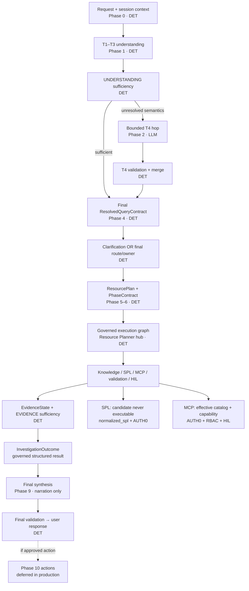

# AI SOC Assistant — Verified Handoff Review

**Reviewed:** 2026-08-18  
**Verifier:** agent audit against live repo at `/var/www/ai-soc-assistant`  
**Verified HEAD:** `66973e1d41e0cf5475e74650bdc095d7f3144e7d` (`master` = `origin/master`)  
**Architecture SHA-256:** `c1c4ba8a88d8f245752188a76442102978eceb0c1bdb410717b789649fb9a034` (matches)

---

## Canonical architecture reference

The frozen system contract lives in **[`architecture.md`](architecture.md)** at the repository root. Do not modify it unless opening an explicit new architecture version.

| Item | Value |
|------|--------|
| Document | [`architecture.md`](architecture.md) |
| Freeze date | 2026-08-15 (Plan 8) |
| Freeze commit | `a8f02e3c98b866bcb12c7d5b3db75b11e823609b` |
| Content SHA-256 | `c1c4ba8a88d8f245752188a76442102978eceb0c1bdb410717b789649fb9a034` |
| Canonical flow | §5 — end-to-end query spine |
| Understanding order | §2.3 — T1–T3 → sufficiency → optional T4 → merge → **final RQC** → route → ResourcePlan |
| Execution authority | §2.3, §13 — **ResourcePlan + PhaseContract** is sole normal authority |
| SPL / MCP | §12 — `candidate_spl` never executable; only `normalized_spl` + exact-call **AUTH0** may reach MCP |
| Trust boundaries | §2.8 — control authority vs untrusted input/evidence vs non-authoritative LLM text |

**Related architecture docs (implementation maps, not substitutes for the freeze):**

| Doc | Purpose |
|-----|---------|
| [`docs/architecture/routing_authority_map.md`](docs/architecture/routing_authority_map.md) | Live `/chat` routing seams and authority table |
| [`docs/architecture/phase_contract_and_schedule.md`](docs/architecture/phase_contract_and_schedule.md) | PhaseContract merge and schedule compiler |
| [`docs/architecture/canonical_telemetry_coverage.md`](docs/architecture/canonical_telemetry_coverage.md) | Planning telemetry catalog |
| [`docs/architecture/details.html`](docs/architecture/details.html) | Interactive query-flow explainer (self-contained HTML) |

### Query flow diagram

Production `/chat` follows the canonical spine in `architecture.md` §5. Simplified view:




**Legend:** `[DET]` = deterministic authority; `[LLM]` = bounded semantic/narration only (no execution authority).

---

## Audit summary — what was corrected

| Area | Submitted handoff | Verified state / correction |
|------|-------------------|----------------------------|
| Working tree | "clean" | **Mostly clean.** One untracked Cursor hook artifact: `.cursor/hooks/.plan-create-requested`. No staged/unstaged source changes. |
| Plan 8 status | Closed 34/34, PR #135 merged | **Correct** (`7221608575432fab21d434e099ec9eab88116511` is ancestor of HEAD). **Repo docs stale:** `plans/README.md`, `CLAUDE.md`, `AGENTS.md`, and Plan 8 frontmatter still say active / pending merge. |
| RACES plan index | Complete 29/29 | **Correct** in plan file. **`plans/README.md` still lists it Active (rev 2)** — stale. |
| MCP effective-catalog plan | Implied closed via PR #144 | **Correct behavior on master.** Plan file `plans/2026-08-17_1757_mcp-effective-tool-catalog-and-authority.md` frontmatter still `status: active` — stale. |
| Qualification tags | v2 → `bf7c304` | **Correct.** Added: v1 tag `coe-qualification-candidate-2026-08-16` → `9b02b27` (PR #141). Annotated tag object `ba90b2a` points to `bf7c304`. |
| Remote branches | "may still exist" | **Confirmed present:** `origin/feat/legacy-ec-experience-convergence` @ `7dce44d`, plus `origin/feat/mcp-effective-tool-catalog`, `origin/feat/races-experience-center`, `origin/feat/races-investigation-execution-ux`. Housekeeping only. |
| T4 focused tests "109 passed" | Point-in-time PR #140 evidence | **Historical snapshot.** Current `app/tests/test_t4_*.py` → **61 passed** (verified 2026-08-18). |
| Cisco restart "110 passed" | PR #141 evidence | **Historical / unverified count.** Current `test_t4_human_restart_authority.py` → **3 passed** (verified 2026-08-18). Invariant still holds. |
| G2 freeze test | Mentioned briefly | **Expanded:** `test_races_freeze_files_unchanged_since_baseline` in `test_live_path_untouched_by_ec.py` **fails** against baseline `bf7c304` because `pipeline.py`, `mcp_execution_gate.py`, and `ChatPanel.tsx` changed (MCP #144 + Workstream B). Expected; do not "fix" Workstream B to satisfy obsolete baseline. |
| G2 layer-1 test | Pre-existing failure | **Confirmed fails** — `EcInvestigationWorkspace.tsx` no longer contains `"Session active"`. |
| `discovery.py` | "may exist" | **Confirmed:** `backend/app/connectors/mcp/discovery.py` exists alongside `discovery_snapshot.py`. |
| RACES plan baselines table | Parallel worktree path | **Stale in plan prose:** references `/var/www/ai-soc-assistant-legacy-ec` and master pin `63f6769`. Worktree removed; current master is `66973e1`. |
| F1 / live isolation tests | 8 passed live, F1 preserved | **Re-verified 2026-08-18:** `test_f1_resource_plan_authority_degradation.py` + `test_live_chat_linear_progress.py` → **16 passed**. |
| COE profile flags | Listed in §10 | **Confirmed** in `env/profiles/coe.env.example`. |
| Executive summary | Code-side stable; qualification remains | **Accurate.** No substantive code claims contradicted. |

**Bottom line:** The handoff substance is **largely accurate**. Corrections are mainly (a) repo index/doc drift, (b) point-in-time test counts vs current counts, (c) working-tree nuance, and (d) fuller freeze-test detail.

---

## 0. How to use this document

This file is the **verified, corrected** successor to the submitted handoff draft. Treat it as authoritative for repo state as of the verified HEAD above. If `master` has moved, re-run the fast orientation commands in §43 before coding.

---

## 1. Executive Summary

The AI SOC Assistant has gone through several architecture-hardening and Experience Center convergence cycles.

The project is now in a **stable code-side state**:

- The canonical architecture is frozen.
- ResourcePlan/PhaseContract authority is established.
- F1 degradation signaling is closed.
- T4 semantic understanding is bounded and frozen.
- Splunk MCP tool discovery, effective catalog, deterministic capability selection, exact-call authorization (AUTH0), RBAC/HIL, and fallback governance are code-side complete.
- The RACES Experience Center `/scenarios` path is shipped.
- The legacy ChatPanel `demoMode` experience has converged with the shared Experience Center execution presentation **without changing production `/chat`**.
- Legacy email actions reuse the same EC email adapter; no second SMTP stack exists.
- The active RACES/legacy plan is complete at **29/29**.
- The repo has been consolidated back to a **single active worktree** on `master`.

The remaining meaningful work is **not** another architecture/code cleanup loop. It is primarily **live qualification**:

- authenticated browser acceptance;
- one real allowlisted email send;
- Cisco/T4 serving qualification in COE;
- real Splunk MCP qualification;
- final human production GO/NO-GO.

**No open engineering plan** is active on master. Next work is operator/COE qualification unless live evidence reveals a reproducible defect.

---

## 2. Current Repository State

### 2.1 Source of truth

| Item | Value |
|------|--------|
| Repository | `/var/www/ai-soc-assistant` |
| Branch | `master` |
| HEAD | `66973e1d41e0cf5475e74650bdc095d7f3144e7d` |
| `origin/master` | `66973e1d41e0cf5475e74650bdc095d7f3144e7d` |
| Working tree | **Mostly clean** — untracked only: `.cursor/hooks/.plan-create-requested` |
| Active worktrees | `/var/www/ai-soc-assistant` only |

Prior temporary worktrees have been removed (F1 worktree after merge; legacy EC worktree after H7-1 landed on master).

### 2.2 Branch/worktree strategy going forward

Use short-lived feature branches off `master` → PR → merge → delete branch. A second worktree only when deliberately parallelizing.

**Remote feature branches still present (optional housekeeping):**

- `origin/feat/legacy-ec-experience-convergence` @ `7dce44d`
- `origin/feat/mcp-effective-tool-catalog`
- `origin/feat/races-experience-center`
- `origin/feat/races-investigation-execution-ux`

These do not affect `master`. Delete only after confirming fully merged.

### 2.3 Repo documentation drift (not code defects)

These files lag merged reality and should not mislead the next agent:

| File | Stale claim | Actual state |
|------|-------------|--------------|
| `plans/README.md` | RACES plan **Active**; Plan 8 **PR pending merge** | RACES **COMPLETE** 29/29; Plan 8 **merged PR #135** 34/34 |
| `CLAUDE.md` / `AGENTS.md` | Plan 8 **active** | Plan 8 **closed** on master |
| `plans/2026-08-15_0602_…md` frontmatter | `complete_pending_user_merge` | Merged; body records 34/34 closure |
| `plans/2026-08-17_1757_mcp-…md` frontmatter | `status: active` | Shipped via **PR #144** |
| `plans/2026-08-17_races-…md` baselines | Parallel worktree + master `63f6769` | Worktree removed; master **`66973e1`** |

---

## 3. Frozen Architecture — Non-Negotiable Invariants

See **[Canonical architecture reference](#canonical-architecture-reference)** above for links, query-flow diagram, and related docs.

**File:** [`architecture.md`](architecture.md)  
**Frozen SHA-256:** `c1c4ba8a88d8f245752188a76442102978eceb0c1bdb410717b789649fb9a034`  
**Freeze commit:** `a8f02e3c98b866bcb12c7d5b3db75b11e823609b`

Do not modify `architecture.md` unless explicitly opening a new architecture version.

### 3.1 Canonical semantic understanding

- **T1–T3:** deterministic; lock only truly known facts/bindings.
- **T4:** bounded semantic inference only — may infer normalized goal, evidence requirements, competing hypotheses, semantic ambiguity, clarification need/reason, semantic confidence/provenance.
- **T4 may not:** execute tools/MCP, grant capabilities, select final route, authorize actions, override locked facts, make RBAC/HIL/policy decisions, or become authority.
- After T4: deterministic validation/merge → final governed plan.

### 3.2 Governed execution authority

Normal path: `understanding → final RQC → ResourcePlan → PhaseContract → governed execution`

**ResourcePlan + PhaseContract** is sole **normal** execution authority. Mandatory PhaseContract lifecycle must not be erased when scheduling fails.

### 3.3 Splunk/SPL authority

- `candidate_spl` is **never** executable.
- Only validated `normalized_spl` may reach MCP authorization.
- **AUTH0** exact-call authorization binds exact execution material + identity/trace/policy.

### 3.4 Evidence / outcome

- `EvidenceState` — minimal derived state, not authority.
- `InvestigationOutcome` — after evidence sufficiency, before synthesis/actions.

### 3.5 Trust boundaries

Separate: deterministic control authority; untrusted user input/evidence; non-authoritative LLM content.

### 3.6 Restart/remediation

- No automatic Cisco restart from backend (operator/human only).
- Production Phase 10/remediation deferred unless architecture version changes.
- EC may showcase remediation/HIL honestly — not production enablement.

### 3.7 Dispatch-v2 / MITRE

- dispatch-v2: rollback/test-only, not normal authority.
- MITRE expansion deferred.

---

## 4. Architecture / Core Implementation History

| Track | Reference | Result |
|-------|-----------|--------|
| Plan 6 | PR #132 | Merged; canonical architecture sequence |
| Plan 7 | — | **25/25** closed |
| Plan 8 | PR #135 @ `7221608575432fab21d434e099ec9eab88116511` | **34/34** closed — do not reopen Plans 6–8 for routine cleanup |

---

## 5. T4 Semantic Understanding

### 5.1 T4 semantic contract

- **PR #139** merged @ `daec9c6649879b19ca8df2a9cbb5f0515e95b475`
- Canonical fields: `normalized_goal`, `evidence_requirements`, `competing_hypotheses`, `semantic_ambiguity`, `clarification_required`, `clarification_reason`, `semantic_confidence`
- `semantic_confidence` is provenance-only — must not overwrite RQC confidence.

### 5.2 T4 unresolved referent correction

- **PR #140** merged @ `ebca24fac06b190bc18fe373b69cc637e722f3d7`
- Implementation commit: `fb5f26aa024dbf285f04eaccfdebb96df40e60ca`
- Unresolved semantic referent → remains unresolved → `CALL_T4`; fail-closed if T4 unavailable.
- Key reason: `t4_unavailable_unresolved_semantic_referent`
- **Status:** `T4_SEMANTIC_DESIGN = FROZEN`; `T4_VPS_PROMPT_TUNING = STOP`
- **Tests:** PR #140 recorded focused **109 passed** (historical). **Current:** `app/tests/test_t4_*.py` → **61 passed** (verified 2026-08-18).

### 5.3 T4 prompt compression

Approximate reduction (recorded at freeze):

```
system:   ~2413 → ~1109 chars
user:     ~2473 → ~1388 chars
combined: ~4888 → ~2499 chars
```

Key separation: semantic uncertainty ≠ evidence uncertainty ≠ investigation uncertainty.

### 5.4 T4 playbook

`docs/ai/t4_semantic_prompting_playbook.md` — read before any T4 prompt/schema work.

---

## 6. F1 — ResourcePlan Persistence Degradation

- **PR #137** @ `bc540b2d7271898b5bf36e1602f37909f27ba278`
- **Status:** `F1 = CLOSED`
- Persistence failure → `dispatch_source=canonical_failure`, `resource_plan_authority=degraded`, `reason=persistence_failed`
- Normal clarification → `canonical_non_planned`
- Test: `backend/app/tests/test_f1_resource_plan_authority_degradation.py`

---

## 7. Cisco/T4 Serving — F3

- **F3 = OPEN**
- **F3 = T4_SEMANTICALLY_VIABLE_BUT_VPS_SERVING_BLOCKER**
- `/v1/models = 200` is liveness only, not inference health.
- Circuit states: CLOSED / OPEN / HALF_OPEN
- No automatic Cisco restart; backend may signal only.
- Previous C3 snapshot: 4/4 within 120s, p50 ~36s, p95 ~39s (VPS — not COE SLO).
- **SLO_DECISION_REQUIRED** — do not copy VPS 120s timeout as COE SLO.

Close F3 in COE with real cold/warm, p50/p95, concurrency, circuit, recovery, and `/chat` path measurements.

---

## 8. Splunk MCP — Initial Foundation

- **PR #138** @ `c54986b5c9b7fbd85baa010f07d9ad1723ce0f4e`
- Streamable HTTP JSON-RPC, initialize, tools/list, registry mode, no silent mock fallback, blocked write/admin/SAIA tools, AUTH0 binding, typed transport errors.
- Harness: `scripts/eval_splunk_mcp_coe_qualification.py`
- `MCP_CONFIG_READY = true`, `MCP_CONTRACT_READY = true`, **`LIVE_MCP_PROVEN = false`** (still false).

---

## 9. COE Production-Readiness Preparation

| Commit | Subject |
|--------|---------|
| `1c6c247` | ops: align COE authority profile |
| `e1b602c` | ops: add executable COE production readiness runbook |
| `fefcc1e` | ops: expose COE investigation diagnostics |
| `a720e2e` | test: make Cisco restart invariant cwd-independent |
| `9b02b27` | **PR #141** merge — COE qualification + operator diagnostics |

Runbook: `docs/coe/COE_PRODUCTION_READINESS_RUNBOOK.md`

Debug surfaces (redacted): `evidence_state`, `investigation_outcome`, `auth0`, `t4_circuit`, MCP discovery/catalog.

**Test note:** PR #141 recorded **110 passed** (historical). Current restart invariant: `test_t4_human_restart_authority.py` → **3 passed**.

---

## 10. COE Single Global MCP Switch

- **PR #142** — implementation `27ad6554acaf48ee0fc0701ec5d29b07a769574c`
- Merged master at qualification v2: `bf7c30468454fb20ceb6eeb1eda621b278523933`

**COE target flags** (`env/profiles/coe.env.example`):

```
AI_SOC_RESOURCE_PLAN_EXECUTION_ENABLED=true
AI_SOC_PIPELINE_DISPATCH_V2_ENABLED=false
AI_SOC_T4_SEMANTIC_UNDERSTANDING_ENABLED=true
AI_SOC_LIVE_CAPABILITY_ENFORCEMENT_ENABLED=false
LANGGRAPH_ORCHESTRATION_ENABLED=true

MCP_MODE=registry
MCP_GLOBAL_EXECUTION_ENABLED=false          # single activation switch → true when ready
MCP_SERVER_SPLUNK_SOC_EXECUTION_ENABLED=true
MCP_SERVER_MOCK_EXECUTION_ENABLED=false
```

`MCP_GLOBAL_EXECUTION_ENABLED=true` does not bypass per-call AUTH0/RBAC/HIL/policy.

---

## 11. Qualification Tags

| Tag | Points to | Notes |
|-----|-----------|-------|
| `coe-qualification-candidate-2026-08-16` | `9b02b27` (PR #141) | v1 |
| `coe-qualification-candidate-2026-08-16-v2` | `bf7c304` (PR #142) | Annotated tag object `ba90b2a` |

**v2 is older than RACES + MCP effective-catalog work.** Current master `66973e1`. Create a **new** qualification tag for the next COE cycle; do not repoint v2.

---

## 12. Independent Architecture Audit (pre-#144)

Recorded outcome:

```
ARCHITECTURE_CONFORMANCE = PASS_WITH_GAPS
CODE_SIDE_COE_READINESS = PASS
READY_FOR_COE = YES
PRODUCTION_GO = NO_GO
```

Subsequent MCP work (**PR #144**) closed effective-catalog/authorization/tool-selection gaps.

---

## 13–16. MCP Authority Gap, Effective Catalog, Current Status

### Closed on master (PR #144 @ `8afcb496d45fecab9583636f6fdcf8b96707f9c0`)

| Item | Status |
|------|--------|
| AUTHORITY_GAP | **closed** (`2a9d105` initial; extended in #144) |
| EFFECTIVE_CATALOG_ENFORCED_IN_CHAT | **yes** (`8408170`) |
| CAPABILITY_RESOLVER_ENFORCED_IN_CHAT | **yes** (`bfd9bdc`) |
| FALLBACK | deterministic, capability-preserving |
| DISCOVERY_STORAGE | **IN_MEMORY** — restart → `DISCOVERY_UNVERIFIED` → block until refresh |
| LIVE_MCP_PROVEN | **false** |
| PRODUCTION_GO | **NO_GO** |

**Production-wired capabilities:** `EVENT_SEARCH` → `splunk_run_query`; `SAVED_SEARCH_EXECUTION` → `splunk_run_saved_search`.

**Not production-wired** (structured planning semantic gap — not a defect): `SERVER_INFO`, `INDEX_DISCOVERY`, `INDEX_METADATA`, `SOURCE_METADATA`, `USER_CONTEXT`, `KNOWLEDGE_OBJECT_DISCOVERY`.

**Refresh:** `POST /api/debug/mcp/discovery/refresh?server_name=<name>`  
**Visibility:** `GET /api/debug/mcp/catalog`, `GET /api/debug/readiness`

**Stop MCP coding unless** live qualification reveals a reproducible defect or a genuine requirement needs a new structured capability.

Historical audit (superseded): `docs/evals/mcp_tool_discovery_selection_audit_2026-08-17.md` (preserved PR #146).

---

## 17. Saved Search Guidance

`splunk_run_saved_search` only for explicit approved saved search or deterministic local policy mapping. No LLM fuzzy-match. AUTH0 binds exact name/app/arguments/identity/trace/bounds/TTL. HIL mandatory. Server discovery untrusted until locally approved.

---

## 18–26. RACES / Experience Center / Legacy Convergence

### Design principles (unchanged)

EC is separate from production authority. Showcase only. Honest labeling. No S8–S10 invention. Production `/chat` frozen.

### Workstream A — shipped

| PR | Merge | Result |
|----|-------|--------|
| #143 | `d4f9210` | RACES EC foundation |
| #145 | `63f6769` | Execution UX, S1–S7, email actions, cockpit |

Docs follow-up: `af93fb3` marks EC plan done.

### Workstream B — closed

| Item | Commit | Status |
|------|--------|--------|
| H7-1 shared presentation | `7dce44d` | DONE |
| H7-2 selective coordination | `7c37580` | DONE |
| H7-3 EC email transport reuse | `b296a78` | DONE |
| H9-B acceptance | `66973e1` | DONE code-side |

**Plan:** `plans/2026-08-17_races-investigation-execution-ux.md` — **COMPLETE 29/29** (not 30).

### Priority legacy scenarios (coordination + HIL)

1. `firewall_deny_coordinated_attack` — simulated coordination (not email)
2. `ir_containment_advisory_firewall_incident` — simulated coordination (not email)
3. `cert_in_ot_reporting_obligation` — **EC email** → `SOC_LEAD`
4. `guided_investigation_supply_chain` — **EC email** → `APPSEC_TEAM`

### Email path (single stack)

`legacyDemoEmail` → EC action API → `backend/app/demo/ec_email.py` → allowlist + Fake transport or real SMTP. Missing config → `REAL_EMAIL_CONFIGURATION_REQUIRED` / `configuration_required`. **`smtplib` only in `ec_email.py`.**

### H7-1 proof (re-verified)

- `demoMode=true` → `ExperienceExecutionProgressPanel`
- `demoMode=false` → unchanged live presentation
- TLS/bearer dishonest copy removed
- `test_live_chat_linear_progress.py` → **8 passed**

---

## 27. Known Pre-Existing Test Issues

### 27.1 G2 layer-1 workspace copy

**Fails:** `test_g2_layer1_workspace_does_not_interpolate_internal_ids`  
**Cause:** `EcInvestigationWorkspace.tsx` no longer contains `"Session active"`. Pre-existing; not introduced by H7-1/H7-2/H7-3.

### 27.2 RACES freeze baseline test

**Fails:** `test_races_freeze_files_unchanged_since_baseline` in `test_live_path_untouched_by_ec.py`  
**Baseline:** `bf7c304` (qualification v2)  
**Offenders vs baseline:** `backend/app/chat/pipeline.py`, `backend/app/orchestration/mcp_execution_gate.py`, `frontend/src/components/ChatPanel.tsx`  
**Cause:** MCP #144 + Workstream B intentionally touched freeze-listed files. Historical baseline mismatch — **not** a current regression to "fix" by reverting convergence work.

---

## 28. Operator-Only Items Remaining

| Item | Status |
|------|--------|
| Browser acceptance | `OPERATOR_REQUIRED` — sign-in gate; walk S1–S7 + four priority legacy scenarios |
| Real email proof | `CONFIGURATION_REQUIRED` — set `AI_SOC_EC_EMAIL_*`, one allowlisted send; then `REAL_EMAIL_PROVEN=true` |

Do not weaken auth or use CI for real SMTP.

---

## 29. Recent Master Commit Chain

```
66973e1  legacy-ec: complete convergence acceptance
b296a78  legacy-ec: reuse EC email transport
7c37580  legacy-ec: add selective coordination actions
7dce44d  legacy-ec: adopt shared execution presentation
63f6769  Merge PR #145 (RACES execution UX)
f3a44ef  Merge PR #146 (MCP audit docs)
8afcb49  Merge PR #144 (MCP effective catalog)
d4f9210  Merge PR #143 (RACES foundation)
bc540b2  Merge PR #137 (F1)
7221608  Merge PR #135 (Plan 8)
bf7c304  Merge PR #142 (COE single MCP switch)
9b02b27  Merge PR #141 (COE readiness)
```

---

## 30. PR / Commit Timeline — Reference Index

| Track | Reference | Key result |
|-------|-----------|------------|
| Architecture freeze | `a8f02e3` | `architecture.md` frozen |
| Plan 6 | PR #132 | canonical architecture |
| Plan 8 | PR #135 / `7221608` | Plan 8 closed 34/34 |
| F1 | PR #137 / `bc540b2` | persistence degradation fixed |
| Initial MCP | PR #138 / `c54986b` | config/contract readiness |
| T4 contract | PR #139 / `daec9c` | bounded T4 schema |
| T4 referents | PR #140 / `ebca24f` | unresolved referent → T4/fail-closed |
| COE readiness | PR #141 / `9b02b27` | runbook/diagnostics |
| COE one-switch | PR #142 / `bf7c304` | global MCP kill switch |
| RACES foundation | PR #143 / `d4f9210` | EC foundation |
| MCP effective catalog | PR #144 / `8afcb49` | catalog + capability + AUTH0 |
| RACES execution UX | PR #145 / `63f6769` | Workstream A shipped |
| MCP audit docs | PR #146 / `f3a44ef` | historical audit preserved |
| Legacy H7-1 | `7dce44d` | shared execution presentation |
| Legacy H7-2 | `7c37580` | selective coordination/HIL |
| Legacy H7-3 | `b296a78` | reuse EC email transport |
| Legacy H9-B | `66973e1` | final code-side acceptance |

---

## 31. Code Index — High-Value Files

| Area | Path(s) |
|------|---------|
| Frozen architecture | `architecture.md` |
| Production `/chat` | `backend/app/chat/pipeline.py`, `canonical_mode.py`, `response_contract_bridge.py` |
| ResourcePlan | `backend/app/planner/resource_plan.py`, `mcp_specialist.py` |
| MCP gate/selection/AUTH0 | `backend/app/orchestration/mcp_execution_gate.py`, `mcp_tool_selector.py`, `splunk_call_authorization.py` |
| MCP connector/catalog | `backend/app/connectors/mcp/splunk_mcp.py`, `registry.py`, `effective_catalog.py`, `discovery_snapshot.py`, `discovery.py` |
| EC email (single SMTP) | `backend/app/demo/ec_email.py` |
| Scenario API | `backend/app/api/routes_scenarios.py` |
| EC frontend | `frontend/src/components/experience-center/ExperienceExecutionProgressPanel.tsx`, `frontend/src/lib/experienceCenterExecution.ts`, `frontend/src/api/ecClient.ts` |
| Legacy convergence | `frontend/src/components/ChatPanel.tsx`, `ChatBubble.tsx`, `frontend/src/lib/investigationProgressToExperience.ts`, `legacyDemoCoordination.ts`, `legacyDemoEmail.ts` |
| Closed plan | `plans/2026-08-17_races-investigation-execution-ux.md` |

---

## 32. Test Index

| Area | Key tests |
|------|-----------|
| F1 | `test_f1_resource_plan_authority_degradation.py` |
| MCP | `test_mcp_authority_gap_closure.py`, `test_mcp_effective_catalog_production_enforcement.py`, `test_pipeline_mcp_capability_wiring.py`, `test_splunk_call_authorization.py`, `test_coe_single_live_switch.py`, `test_splunk_mcp_coe_qualification.py` |
| Live isolation | `test_live_chat_linear_progress.py` (8 passed) |
| RACES isolation | `test_races_g2_frontend_isolation.py`, `test_races_chatpanel_scenario_list_isolation.py`, `test_live_path_untouched_by_ec.py` |
| EC email | `test_ec_email_transport.py`, `test_legacy_demo_email_transport.py` |
| Frontend legacy | `ChatBubble.progress.test.tsx`, `ExperienceExecutionProgressPanel.test.tsx`, `legacyDemoCoordination.test.tsx`, `legacyDemoEmail.test.ts` |
| T4 (current) | `test_t4_*.py` → **61 passed** |

---

## 33. Architecture / Safety Regression Commands

```bash
cd /var/www/ai-soc-assistant
git fetch origin
git status --short
git rev-parse HEAD origin/master
sha256sum architecture.md
# Expected: c1c4ba8a88d8f245752188a76442102978eceb0c1bdb410717b789649fb9a034
```

Governance gate: `./scripts/run_stage3_governance_regression.sh`

---

## 34–37. Scenario Rules, UX Decisions, Email Contract, Production Freeze

(Unchanged from submitted handoff — verified accurate.)

- S1–S7 only for Workstream A; no S8–S10.
- Four priority legacy scenarios only for coordination injection.
- Two email scenarios: `cert_in_ot_reporting_obligation`, `guided_investigation_supply_chain`.
- Skip = animation only; cannot bypass mandatory HIL.
- `demoMode=true` → EC presentation; `demoMode=false` → live unchanged.
- H7-3 did **not** change `backend/app/chat/pipeline.py`.

---

## 38. Closed vs Open

### CLOSED (do not reopen without real defect)

Plans 6–8, F1, T4 design, T4 VPS prompt tuning, MCP authority gap, effective catalog, capability resolver, RACES Workstream A, Legacy Workstream B, H7-1/2/3, H9-B code-side, RACES/legacy engineering plan.

### OPEN (live/operator evidence required)

F3 COE T4 serving, `LIVE_MCP_PROVEN`, real Splunk MCP qualification, COE performance/concurrency/recovery, browser acceptance, real allowlisted email, `PRODUCTION_GO`.

---

## 39. Production GO State

```
PRODUCTION_GO = NO_GO
```

Not an indictment of code quality — required live evidence and human approval pending.

---

## 40. Recommended Next Phase — COE / Live Qualification

1. Baseline from `66973e1` — create **new** qualification tag.
2. Configure COE: Cisco endpoint, explicit T4 timeout, Splunk MCP endpoint/token/TLS, optional EC SMTP.
3. T4/F3: real inference, cold/warm, p50/p95, concurrency, circuit, recovery, `/chat`.
4. Splunk MCP: initialize, tools/list, discovery refresh, effective catalog proof, governed queries, AUTH0/RBAC/HIL, failure drills.
5. Operator UX: browser walk + optional real email.
6. Human GO/NO-GO.

**Do not** create another RACES cleanup plan.

---

## 41–42. Rules for Next Agent / Git Workflow

1. Read this `review.md` first; verify HEAD and architecture hash.
2. Do not reopen closed RACES/MCP/T4/F1 engineering without reproducible defect evidence.
3. Do not treat v2 qual tag as current master.
4. No automatic Cisco restart; no production remediation; no keyword MCP routing.
5. New capability → structured ResourcePlan semantic first.
6. Standard git: `master` → `feat/<scope>` → PR → merge → delete branch.

---

## 43. Fast Repo Orientation (verified 2026-08-18)

```bash
cd /var/www/ai-soc-assistant
git fetch origin && git branch --show-current && git status --short
git rev-parse HEAD && git rev-parse origin/master
git worktree list && sha256sum architecture.md
```

**Expected:**

```
branch = master
HEAD = origin/master = 66973e1d41e0cf5475e74650bdc095d7f3144e7d
working tree = clean except possible untracked .cursor/hooks/*
architecture SHA = c1c4ba8a88d8f245752188a76442102978eceb0c1bdb410717b789649fb9a034
```

---

## 44. Fast Code Search Index

```bash
rg -n "semantic_ambiguity|semantic_confidence|normalized_goal" backend docs
rg -n "t4_unavailable_unresolved_semantic_referent" backend
rg -n "ResourcePlan|PhaseContract|resource_plan_authority" backend/app
rg -n "EVENT_SEARCH|SAVED_SEARCH_EXECUTION|PLANNING_SEMANTIC_GAP" backend/app
rg -n "DISCOVERY_UNVERIFIED|APPROVED_AND_PRESENT|SCHEMA_MISMATCH" backend/app
rg -n "AUTH0|exact_call|call_grant" backend/app
rg -n "REAL_EMAIL_CONFIGURATION_REQUIRED|AI_SOC_EC_EMAIL_|smtplib" backend frontend .env.example env
rg -n "LegacyDemoCoordinationAction|demo_coordination|waiting_for_analyst" frontend/src
```

---

## 45–47. Do Not Confuse / Final Snapshot

| Confusion | Truth |
|-----------|-------|
| RACES closed ≠ Production GO | EC demo complete; GO needs live evidence |
| MCP code ready ≠ LIVE_MCP_PROVEN | Governance complete; no E2E Splunk proof yet |
| T4 frozen ≠ F3 closed | Semantics done; serving is operational |
| H9-B code-side ≠ browser/email done | Operator tasks remain |
| Phase 10 demo ≠ production remediation | Deferred |
| In-memory discovery ≠ persistent | Restart blocks until refresh — intentional |

### Final snapshot

```
REPO=/var/www/ai-soc-assistant  MASTER=66973e1  ARCHITECTURE=frozen (hash verified)
F1=closed  T4_DESIGN=frozen  MCP_CODE_SIDE=closed  RACES_A=shipped  LEGACY_B=closed
PLAN=complete 29/29  F3=open  LIVE_MCP_PROVEN=false  PRODUCTION_GO=NO_GO
NEXT=COE/live qualification (operator evidence)
```

---

## 48. Bootstrap for next chat

```
Use review.md as authoritative handoff. Verify HEAD + architecture hash first.
Do not reopen closed RACES/MCP/T4/F1 engineering unless live evidence shows a real defect.
Next phase: COE/live qualification — T4 serving, real Splunk MCP, browser/email proof, human GO/NO-GO.
```
